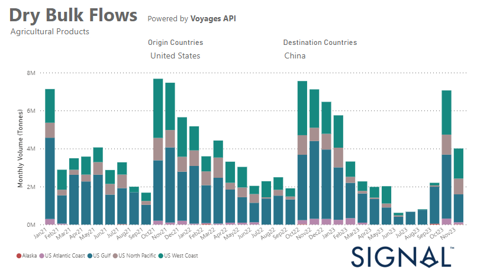

# Weekly Dry Market Monitor - Week 50, 2023

*Published on 13 December 2023*

## A Significant Decrease in the U.s. Grain Exports to China Following the Spike in October

> **Figure 1: Data Source: The Signal Ocean Platform Data**  
> *Data Source: The Signal Ocean Platform Data*  
> **Interactive Data & Source:** [Signal Ocean Platform](https://www.thesignalgroup.com/weekly-market-monitor/dry-week-50-2023) | [Local Asset](file:///C:/Users/Dell/Github/Shipping/corpus/07-signal/images/657980ac6f8d3db95b8ba83b_grain us.png)

In the second week of December, the mood on the dry bulk market was mixed. Prices for Capesize vessels between Brazil and North China were down after the surprising upturn at the beginning of the month. In the smaller ship segments, however, the mood was optimistic, pointing to possible improvements in performance.

In particular, the number of ballast shipments in the smaller vessel segments increased, although this trend remained below the annual average for Capesize and Panamax vessels. In the grain segment, there was a significant decline in the monthly volume of shipments from the United States to China in November, although there was a record increase in October. Grain exports from the US to China fell by 45% in November, both compared to October and compared to shipments recorded in November last year.

For the latest updates and insights, make sure to visit the [Signal Ocean Newsroom](https://www.thesignalgroup.com/newsroom) website page. Click [here to request a demo](https://www.thesignalgroup.com/request-demo?utm\_source=oceanhome&utm\_medium=website&utm\_campaign=demo).

For subscription to our FREE weekly market trends email, please contact us: research@thesignalgroup.com
