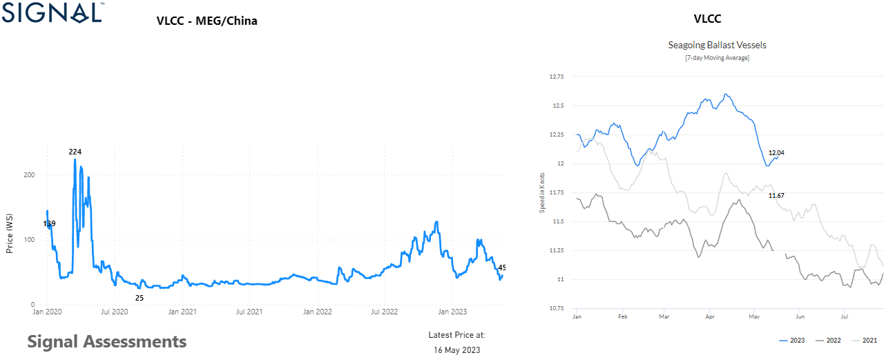

# Weekly Tanker Market Monitor, Week 20, 2023

*Published on 19 May 2023*

## The Freight Rates for the Middle East Gulf to China Have Decreased in May

> **Figure 1: Data Source: The Signal Ocean Platform- Supply / Demand Ton Charts Https://app.signalocean.com/tanker/dynamic/market-Prices-Tankers**  
> *Data Source: The Signal Ocean Platform- Supply / Demand Ton Charts https://app.signalocean.com/tanker/dynamic/market-prices-tankers*  
> **Interactive Data & Source:** [Signal Ocean Platform](https://www.thesignalgroup.com/weekly-market-monitor/tanker-week-20-2023) | [Local Asset](file:///C:/Users/Dell/Github/Shipping/corpus/07-signal/images/646770689b6bc7cf9c36c874_chart of the week tankers logo.png)

The sustained decline in Very Large Crude Carrier (VLCC) freight rates from the Middle East Gulf (MEG) to China continues, despite expectations of increased Chinese oil demand this year, as projected by the latest estimates from the International Energy Agency (IEA). The sustained decrease in rates throughout May reflects the prevailing market conditions and suggests a notable shift in the supply and demand dynamics in this particular trade route.The left chart above illustrates this downward trend, with freight rates (WS rates) currently at their lowest level since the start of the year. Consequently, this has led to a reduction in high seagoing ballast speeds, as depicted in the right chart above, compared to the earlier recorded levels earlier this year.

In the oil market, when examining the supply and demand fundamentals, there is a significant development on the horizon. According to the International Energy Agency (IEA), it is anticipated that demand will surpass supply starting this quarter, marking the first occurrence since early 2022. This projected shift towards a deficit is expected to deepen throughout the year, with the deficit estimated to reach nearly 2 million barrels per day by year-end. This indicates a potential tightening of the oil market and underscores the potential impact on prices and market dynamics.

For the latest updates and insights, make sure to visit the [Signal Ocean Newsroom](https://www.thesignalgroup.com/newsroom) website page. Click [here to request a demo](https://www.thesignalgroup.com/request-demo?utm\_source=oceanhome&utm\_medium=website&utm\_campaign=demo).

For subscription to our FREE weekly market trends email, please contact us: research@thesignalgroup.com

-Republishing is allowed with an active link to the source
