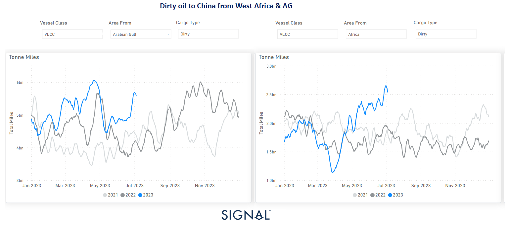

# Weekly Tanker Market Monitor: Week 27, 2023

*Published on 07 July 2023*

## VLCC Tonne-Miles From AG and West Africa to China Exhibiting Noticeable Rise Since May

> **Figure 1: Data Source: The Signal Ocean Platform**  
> *Data Source: The Signal Ocean Platform*  
> **Interactive Data & Source:** [Signal Ocean Platform](https://www.thesignalgroup.com/weekly-market-monitor/tanker-week-27-2023) | [Local Asset](file:///C:/Users/Dell/Github/Shipping/corpus/07-signal/images/64a7d97aced6f79dab5e98c6_chart of the week tanker dirty.png)

The first week of July ended with rates in the crude oil freight market coming under pressure, while weaker sentiment in clean tanker freight rates continued. Interestingly, Chinese oil demand is driving up tonne-mile volumes for VLCC routes between the Arabian Gulf (AG) and West Africa despite signs of a downward correction. VLCC tonne-miles from Wafr and AG to China have increased significantly in July since early May.

As for the long-term outlook for oil demand, according to the June report from OPEC, the organization forecasts robust growth in global oil demand in 2023. The report cited an estimated growth rate of 2.35 million barrels per day (bpd), a 2.4% year-over-year increase. This surge in demand represents a significant recovery from the lull following the coronavirus pandemic, which had a dampening effect on global oil consumption.

For the latest updates and insights, make sure to visit the [Signal Ocean Newsroom](https://www.thesignalgroup.com/newsroom) website page. Click [here to request a demo](https://www.thesignalgroup.com/request-demo?utm\_source=oceanhome&utm\_medium=website&utm\_campaign=demo).

For subscription to our FREE weekly market trends email, please contact us: research@thesignalgroup.com

-Republishing is allowed with an active link to the source
