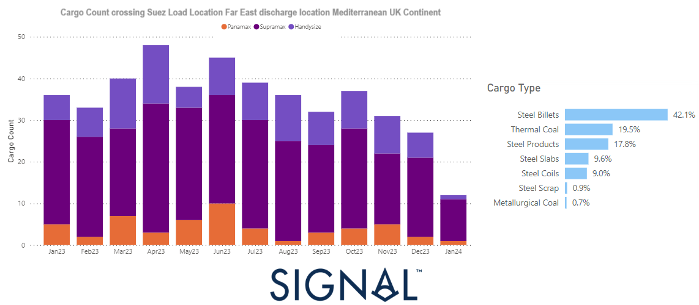

# Weekly Dry Market Monitor - Week 06, 2024

*Published on 07 February 2024*

## A Significant Drop in the Number of Steel and Energy Cargoes Crossing Suez From the Far East to Mediterranean

> **Figure 1: 65c3534264234debef9be375 Chart of the Week**  
> **Interactive Data & Source:** [Signal Ocean Platform](https://www.thesignalgroup.com/weekly-market-monitor/dry-week-06-2024) | [Local Asset](file:///C:/Users/Dell/Github/Shipping/corpus/07-signal/images/65c3534264234debef9be375_chart of the week.png)

The second week of February began with a rebound in the Baltic Capesize Index, surpassing the 2,000 points mark, one of the highest points seen in the last two weeks. Meanwhile, smaller vessel size categories continued to trend downward. It remains to be seen whether there will be sustained firmness in the market just a few days before the start of the Chinese New Year. Notably, despite the high numbers of ballast ships for Capesize and Panamax vessels in Southeast Africa, demand growth is showing a decreasing pace.

Additionally, the Red Sea crisis has started to influence the flow of grain shipments from the Black Sea, potentially impacting earnings for Panamax and Supramax vessels if grain diversions via the Cape of Good Hope continue at a rapid pace. In the cargo types of steel and energy, as depicted in the image above, the count of cargo vessels crossing the Suez Canal from the Far East (loading location) to the Mediterranean (discharge location) experienced a notable 67% decrease in January compared to the monthly level observed a year ago.

For the latest updates and insights, make sure to visit the [Signal Ocean Newsroom](https://www.thesignalgroup.com/newsroom) website page. Click [here to request a demo](https://www.thesignalgroup.com/request-demo?utm\_source=oceanhome&utm\_medium=website&utm\_campaign=demo).

For subscription to our FREE weekly market trends email, please contact us: research@thesignalgroup.com

-Republishing is allowed with an active link to the source
