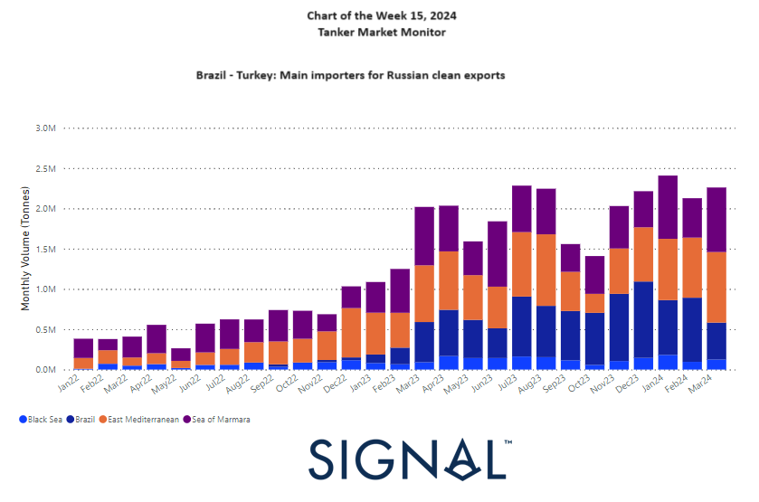

# Weekly Tanker Market Monitor: Week 15, 2024

*Published on 12 April 2024*

## From 2023 Onwards, Brazil and Turkey Emerged as Primary Importers of Russian Clean Exports

> **Figure 1: Data Source: The Signal Ocean Platform**  
> *Data Source: The Signal Ocean Platform*  
> **Interactive Data & Source:** [Signal Ocean Platform](https://www.thesignalgroup.com/weekly-market-monitor/tanker-week-15-2024) | [Local Asset](file:///C:/Users/Dell/Github/Shipping/corpus/07-signal/images/69c271142b29a96047f788c8_66192da43cd7727008df029b_tanker%20chart.png)

In the second week of April, the crude oil freight market maintained a relatively stable sentiment in the VLCC Ras Tanura segment, while indications of an upward trend emerged in the Aframax Mediterranean, accompanied by a decrease in vessel supply. April appears poised to challenge the sentiment in the VLCC freight market, as there are signals of increased vessel activity for Ras Tanura, despite the tonne-day demand growth slowing down, with the last peak observed almost seven weeks ago.

In the clean segment, it's noteworthy to observe the growth of Russian clean oil exports to Brazil and Turkey, which have emerged as the primary destinations since last year. Meanwhile, US crude oil prices have intriguingly displayed signs of pulling back to $85/bbl, with market concerns about inflation pushing back expectations for Fed rate cuts to later in the year. At present, worries about inflation seem to have overshadowed concerns about a potential Iranian strike on Israel.

## Faq Section

### Frequently Asked Questions

### What Is Driving Current Tanker Market Sentiment?

Market sentiment is being shaped by a mix of vessel supply dynamics, regional demand shifts, and macroeconomic factors such as oil prices and inflation expectations. Activity levels in key routes like Ras Tanura and the Mediterranean are influencing short term freight direction.

### What Trends Are Visible in the VLCC Market?

The VLCC Ras Tanura segment has remained relatively stable, though there are early signals of increased vessel activity. At the same time, tonne day demand growth has slowed, which could limit upward momentum in freight rates.

### Why Is the Aframax Mediterranean Market Strengthening?

The Aframax Mediterranean segment is showing upward movement due to a tightening of vessel supply. Reduced availability of ships in the region is supporting firmer freight levels.

### What Is Happening in the Clean Tanker Segment?

Russian clean oil exports have increasingly shifted towards Brazil and Turkey since 2023. These countries have become key importers, reflecting changes in global trade flows following sanctions and geopolitical realignments.

### Why Are Brazil and Turkey Important for Russian Clean Exports?

Both countries have positioned themselves as major buyers of Russian refined products, helping to absorb volumes redirected away from traditional European markets.

### How Are Oil Prices Influencing Tanker Markets?

Oil prices affect trading activity, arbitrage opportunities, and overall demand for shipping. Recent signs of US crude prices softening around $85 per barrel are tied to inflation concerns and shifting expectations around interest rate cuts.

### How Do Macroeconomic Factors Impact Freight Markets?

Inflation, interest rates, and global economic outlook influence oil demand and trading behaviour. When inflation concerns rise, they can dampen expectations for demand growth and affect freight market sentiment.

### Are Geopolitical Tensions Still Affecting the Market?

Geopolitical risks remain present but are not always the dominant driver. In this case, inflation concerns have temporarily outweighed fears of escalation in the Middle East.

### How Can Traders Monitor These Market Changes?

Market participants track vessel movements, freight rates, and cargo flows using platforms such as Signal Ocean, alongside broader macro and geopolitical indicators.

For the latest updates and insights, make sure to visit the [Signal Ocean Newsroom](https://www.thesignalgroup.com/newsroom) website page. Click [here to request a demo](https://www.thesignalgroup.com/request-demo?utm\_source=oceanhome&utm\_medium=website&utm\_campaign=demo).

For subscription to our FREE weekly market trends email, please contact us: research@thesignalgroup.com

-Republishing is allowed with an active link to the source
