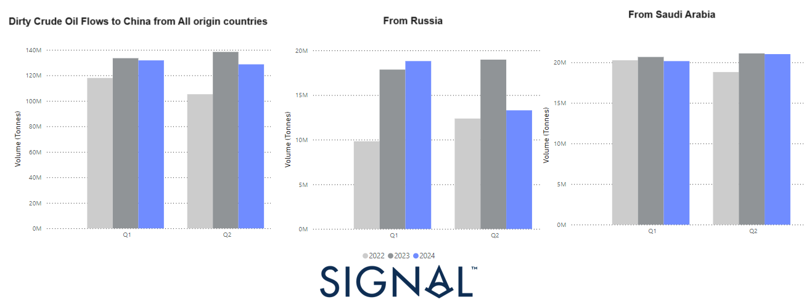

# Weekly Tanker Market Monitor: Week 24, 2024

*Published on 14 June 2024*

## This Week's Chart Highlights the Declining Trend in the Quarterly Volume of Dirty Oil Flows to China for the Second Quarter of This Year, Primarily Driven by a Slowdown in Russian Oil Exports Compared to Last Year's Record Pace. in Contrast, Saudi Arabia Has Maintained a Strong Pace, with Quarterly Volumes Not Falling Below Last Year's Levels. in Earlymarch, We Noted a Strengthening Momentum in Market Rates for the VLCC-AG China Route, Which Did Not Last. However, This Trend May Firm Up as the Quarterly Volume of Dirty Oil Shipments From Saudi Arabia Stabilises.

> **Figure 1: 666c045013b7abb0c962e1d7 Tanker Chart**  
> **Interactive Data & Source:** [Signal Ocean Platform](https://www.thesignalgroup.com/weekly-market-monitor/tanker-week-24-2024) | [Local Asset](file:///C:/Users/Dell/Github/Shipping/corpus/07-signal/images/666c045013b7abb0c962e1d7_tanker chart.png)

The third week of May saw an upward trend in market prices for the Aframax Mediterranean market, while sentiment in the VLCC MEG-China route showed a gradual In the first half of May, there was a weakening trend in dirty freight rates for the VLCC AG-China market, along with a significant downward revision on the Aframax Med route. On the demand side, the growth in dirty and clean tonne days has yet to show an increasing pace. Consequently, the supply of vessels will play a critical role in maintaining the robust environment for dirty and clean freight rates in the coming days.

On the macroeconomic front, [Russia](https://oilprice.com/Latest-Energy-News/World-News/Russia-Vows-to-Meet-OPEC-Target-after-Exceeding-Oil-Output-Quota-in-May.html) is expected to meet its oil production quota in June after exceeding its target output under the OPEC+ deal in May, the Russian Energy Ministry announced on Thursday. According to the ministry, Russia slightly surpassed its OPEC+ quota in May, based on data from independent sources monitoring the agreement. The ministry added that "the issue with overproduction will be resolved in June, when the target will be achieved." The excess production volumes since April will be fully compensated for in the future, with the overproduction offset during the compensation period until the end of September 2025. The ministry also reiterated that "Russia remains fully committed to the fundamental principles of the OPEC+ deal."

For the latest updates and insights, make sure to visit the [Signal Ocean Newsroom](https://www.thesignalgroup.com/newsroom) website page. Click [here to request a demo](https://www.thesignalgroup.com/request-demo?utm\_source=oceanhome&utm\_medium=website&utm\_campaign=demo).

For subscription to our FREE weekly market trends email, please contact us: research@thesignalgroup.com

-Republishing is allowed with an active link to the source
