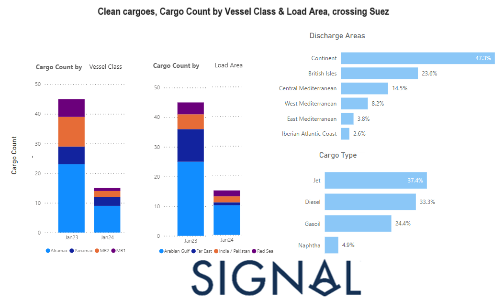

# Weekly Tanker Market Monitor: Week 5, 2024

*Published on 02 February 2024*

## A Significant Downward Revision Compared to the Monthly Volumes From the Previous Year

> **Figure 1: 65bcf76d3074797e8db03433 Chart of the Week 5**  
> **Interactive Data & Source:** [Signal Ocean Platform](https://www.thesignalgroup.com/weekly-market-monitor/tanker-week-5-2024) | [Local Asset](file:///C:/Users/Dell/Github/Shipping/corpus/07-signal/images/65bcf76d3074797e8db03433_chart of the week 5.png)

The conclusion of January presents an intriguing perspective on freight rates for LR2 clean product tankers, with recent rate spikes expected to persist into February due to heightened concerns in the Red Sea, influencing cargo deviations. A thorough analysis of clean cargoes originating from loading zones such as the Arabian Gulf, Pakistan/Western Coast of India, Far East, and the Red Sea, destined for the Mediterranean-UK continent, reveals a noteworthy decline in shipment volumes via the Suez Canal in January 2024. The visual representation above vividly portrays the reduction in shipments across various vessel classes and loading areas, underlining a significant contrast to the corresponding period in the previous year.

For the latest updates and insights, make sure to visit the [Signal Ocean Newsroom](https://www.thesignalgroup.com/newsroom) website page. Click [here to request a demo](https://www.thesignalgroup.com/request-demo?utm\_source=oceanhome&utm\_medium=website&utm\_campaign=demo).

For subscription to our FREE weekly market trends email, please contact us: research@thesignalgroup.com

-Republishing is allowed with an active link to the source
