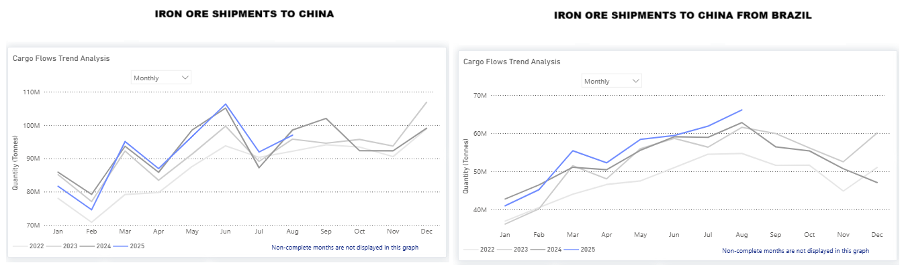

# Weekly Dry Market Monitor: Week 37, 2025

*Published on 11 September 2025*

## Chart of the Week: Iron Ore Shipments to China Are Gaining Stronger Momentum

> **Figure 1: Https://app.signalocean.com/dry/dynamic/drybulkflows**  
> *https://app.signalocean.com/dry/dynamic/drybulkflows*  
> **Interactive Data & Source:** [Signal Ocean Platform](https://www.thesignalgroup.com/weekly-market-monitor/dry-week-37-2025) | [Local Asset](file:///C:/Users/Dell/Github/Shipping/corpus/07-signal/images/68c29211b936da8c43399c59_dd61243a.png)

Iron ore shipments to China surprisingly strengthened in August, seemingly driven by the drop in iron ore prices and preparations from Chinese mills for a traditional summer pickup. **Brazilian exports**, in particular, stood out: shipments increased by **7% month-over-month**, exceeding **August 2024 levels by roughly 3 million tons**, marking the highest monthly total for 2025 as shown in the chart. The recent upward trend in iron ore imports has already started to be reflected in the growth of Capesize iron ore days, while whether Chinese iron ore imports will sustain excess levels of 100 Mt will be highly dependent on prices and port inventories.

For the latest updates and insights, make sure to visit the [Signal Ocean Newsroom](https://www.thesignalgroup.com/newsroom) page & subscribe to weekly reports. Click [here to request a demo](https://www.thesignalgroup.com/request-demo?utm\_source=oceanhome&utm\_medium=website&utm\_campaign=demo). Click here to see the[previous dry bulk weekly](https://www.thesignalgroup.com/weekly-market-monitor/tanker-week-33-2025) report.

For subscription to our FREE weekly market trends email, please contact us: research@thesignalgroup.com

-Republishing is allowed with an active link to the source
