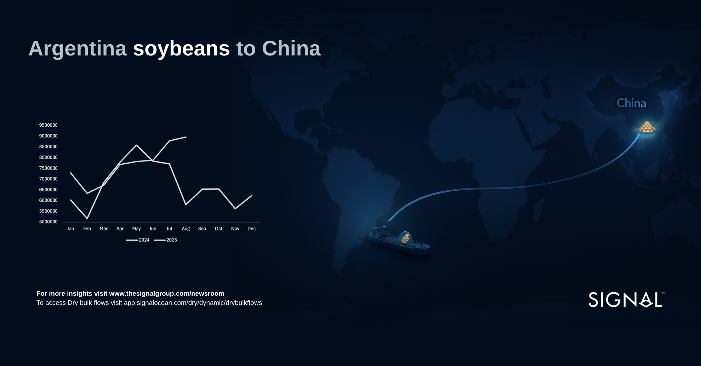
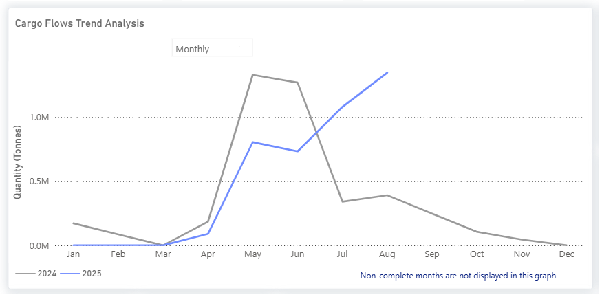
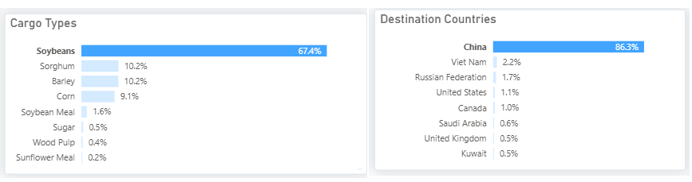
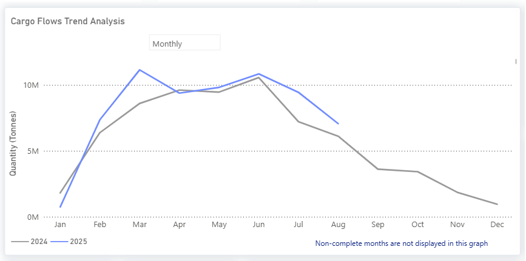

# Weekly Dry Market Monitor: Week 39, 2025

*Published on 25 September 2025*

## Chart of the Week: Argentina Soybeans to China

> **Figure 1: Chart of the Week: Argentina Soybeans to China‍**  
> **Interactive Data & Source:** [Signal Ocean Platform](https://www.thesignalgroup.com/weekly-market-monitor/dry-week-39-2025) | [Local Asset](file:///C:/Users/Dell/Github/Shipping/corpus/07-signal/images/68d55fc8019f07afb24c3045_Screenshot 2025-09-25 at 16.28.50.png)

> **Figure 2: Https://app.signalocean.com/dry/dynamic/drybulkflows**  
> *https://app.signalocean.com/dry/dynamic/drybulkflows*  
> **Interactive Data & Source:** [Signal Ocean Platform](https://www.thesignalgroup.com/weekly-market-monitor/dry-week-39-2025) | [Local Asset](file:///C:/Users/Dell/Github/Shipping/corpus/07-signal/images/68d5605d04a6f5cdeb96b8f3_a648283f.png)

**Soybean** flows from Argentina to China in 2025 tell a striking turnaround story. Early in the year, shipments (blue line) lagged 2024 levels (grey line), but from April onward, they overtook them and stayed strong through Q3. The April harvest ignited momentum, and the mid-year slump that weighed on 2024 was largely avoided. Soybeans now account for 67% of Argentina’s agricultural dry bulk exports, with China absorbing 86% of that volume.

> **Figure 3: Chart of the Week: Argentina Soybeans to China‍**  
> **Interactive Data & Source:** [Signal Ocean Platform](https://www.thesignalgroup.com/weekly-market-monitor/dry-week-39-2025) | [Local Asset](file:///C:/Users/Dell/Github/Shipping/corpus/07-signal/images/68d5605d04a6f5cdeb96b8f0_e4145724.png)

China’s demand is on track for record import volumes as it builds reserves ahead of Q4. That surge is underpinned by the revival of the domestic livestock sector, which supports robust soymeal consumption.

Strategically, China has withdrawn from U.S. sourcing at the onset of harvest. New American **soybean** sales in September were minimal, according to trade watchers. Instead, the latest trade news indicates Chinese crushers secured as many as 20 Argentine cargoes (roughly 1.3 million tonnes) in late September. This uptick aligns with reports that Buenos Aires has temporarily suspended export taxes, thereby sharpening the price competitiveness of Argentine beans and encouraging farmers to sell.

Meanwhile, **Brazil**, the dominant global supplier, experienced a seasonal dip in exports in August, falling below its June peak of 10 million tons, creating space for Argentine beans to capture more market share. After the severe drought in 2023, Argentina’s 2025 harvest rebound seems to have been crucial, serving as a swing supplier, stepping in with additional volumes during Brazil’s seasonal slowdown and reduced U.S. flows, to help meet China’s increasing demand.

> **Figure 4: Chart of the Week: Argentina Soybeans to China‍**  
> **Interactive Data & Source:** [Signal Ocean Platform](https://www.thesignalgroup.com/weekly-market-monitor/dry-week-39-2025) | [Local Asset](file:///C:/Users/Dell/Github/Shipping/corpus/07-signal/images/68d5605e04a6f5cdeb96b8f6_892f3bc6.png)

For the latest updates and insights, make sure to visit the [Signal Ocean Newsroom](https://www.thesignalgroup.com/newsroom) page & [subscribe to weekly reports](http://www.thesignalgroup.com/subscribe). Click [here to request a demo](https://www.thesignalgroup.com/request-demo?utm\_source=oceanhome&utm\_medium=website&utm\_campaign=demo). Click here to see the[previous dry bulk weekly](https://www.thesignalgroup.com/weekly-market-monitor/dry-week-38-2025) report.

For subscription to our FREE weekly market trends email, please contact us: research@thesignalgroup.com

-Republishing is allowed with an active link to the source
