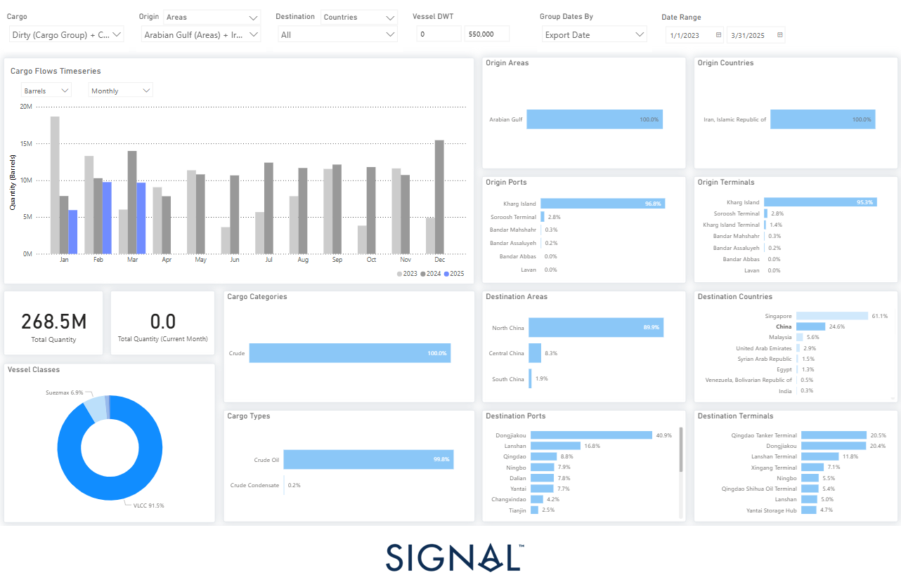

# Weekly Tanker Market Monitor: Week 17, 2025

*Published on 24 April 2025*

> **Figure 1: ‍**  
> **Interactive Data & Source:** [Signal Ocean Platform](https://www.thesignalgroup.com/weekly-market-monitor/tanker-week-17-2025) | [Local Asset](file:///C:/Users/Dell/Github/Shipping/corpus/07-signal/images/680a6134424e515212c48ab0_AD_4nXdSnOE4w4RT2hThXNFA4JjoHjLTQrEHHDLa24yUFbSz0XzKV_xfY8RE62Z3jYvyVV3e9SHzH84f0Kky5J00Bk1jXQ17AZwnPC5fnvcZ77zfGMiFIpokYmYPLxC8Vhx_yFyoSEcZWw.png)

## Despite Persistent International Sanctions, Iran Managed to Sustain Significant Crude Oil Exports Between January 2023 and March 2025, Totaling Approximately 268.5 Million Barrels. This Continued Export Activity—entirely Sourced From Iranian Production—demonstrates Tehran’s Resilience and Strategic Adaptability in Circumventing Global Pressure.

A striking feature of Iran’s export strategy is its overwhelming reliance on **Kharg Island**, which accounted for **96.6%** of all shipments and **95.3%** of terminal usage during this period. These figures highlight the island’s pivotal role in Iran’s oil logistics infrastructure and its strategic value in sustaining flows amid sanctions.

To maximize efficiency and reduce operational risk, Iran leaned heavily on **Very Large Crude Carriers (VLCCs)**, which carried over **91%** of total export volume. This approach not only enabled the country to move large volumes per voyage but also likely minimized exposure to maritime interdiction. Additionally, **99.8%** of the cargo consisted of crude oil, underscoring Iran’s reliance on its primary hydrocarbon asset.

On the demand side, Iran’s exports were heavily concentrated in **Asia**, where geopolitical alignment and logistical flexibility have facilitated continued trade. **Singapore** led all destinations with **60%** of import volumes, followed by **China (25%)** and **Malaysia (6%)**. Ports such as **Dongjiakou** and **Lanshan** in China—known hubs for blending and storage—played a crucial role in the discreet rebranding of Iranian crude before it re-entered global markets under different identities.

These trade patterns are deeply reflective of shifting geopolitical realities. Iran’s ability to sustain oil exports in defiance of sanctions underscores the **limits of Western enforcement**, particularly in the maritime domain. Its strategic eastward pivot—especially toward China—mirrors broader **geoeconomic realignments** tied to Beijing’s energy security needs and its **Belt and Road Initiative**. This alignment has granted Iran sustained access to major energy markets despite sustained efforts to economically isolate it.

However, **recent data from March 2025** signals potential cracks in this model. Monthly exports fell to **9.7 million barrels**, down **0.82%** from February and a sharp **31% year-over-year drop** compared to March 2024. This downturn coincides with the U.S. announcement of **renewed, tighter sanctions**, specifically targeting Chinese-bound flows. These new measures reportedly focus on **maritime insurers, ship registries, and logistics networks** involved in Iranian oil transshipments—key enablers of Iran’s evasive strategies.

*In essence, while Iran has proven remarkably resourceful in maintaining oil exports under pressure—leveraging maritime tactics and regional partnerships—the renewed sanctions appear to be exerting real pressure. If enforcement efforts intensify and* ***China’s tolerance wanes under diplomatic pressure****, March's decline could mark the beginning of a more constrained phase for Iranian crude.*

For the latest updates and insights, make sure to visit the [Signal Ocean Newsroom](https://www.thesignalgroup.com/newsroom) website page. Click [here to request a demo](https://www.thesignalgroup.com/request-demo?utm\_source=oceanhome&utm\_medium=website&utm\_campaign=demo). Read [last week's tanker monitor here.](https://www.thesignalgroup.com/weekly-market-monitor/tanker-week-15-2025)

For subscription to our FREE weekly market trends email, [please click here](https://www.thesignalgroup.com/subscribe), or contact us at: research@thesignalgroup.com

-Republishing is allowed with an active link to the source
