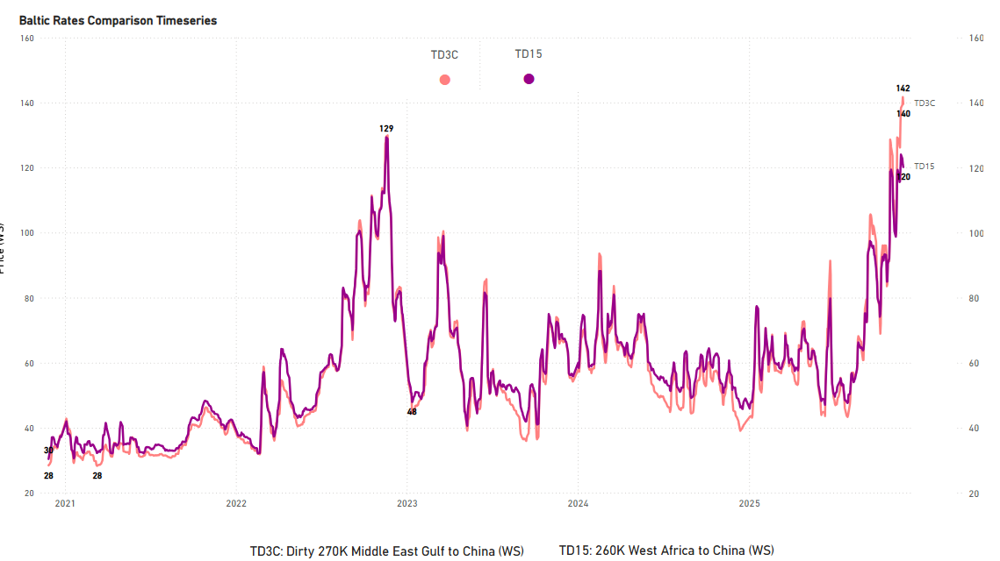
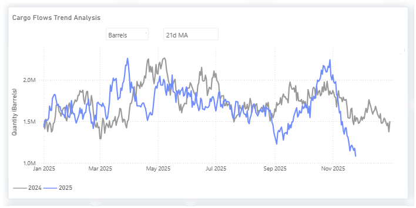
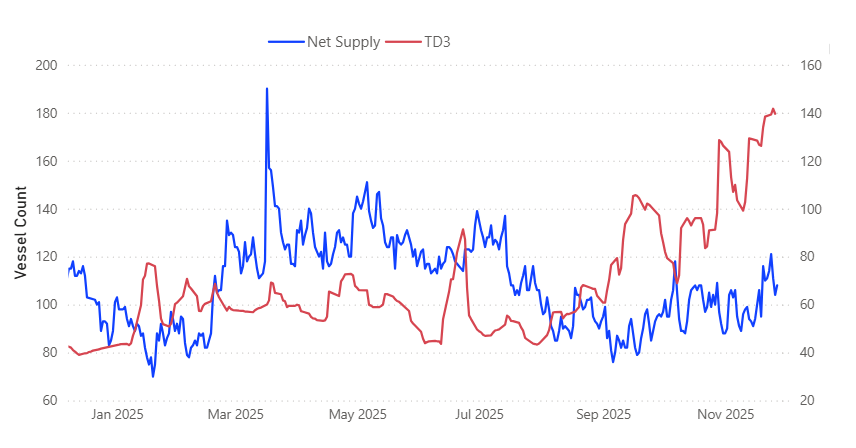
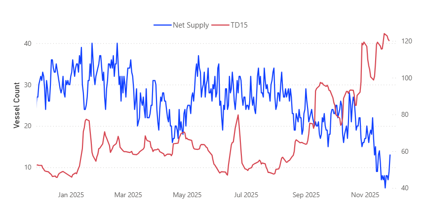
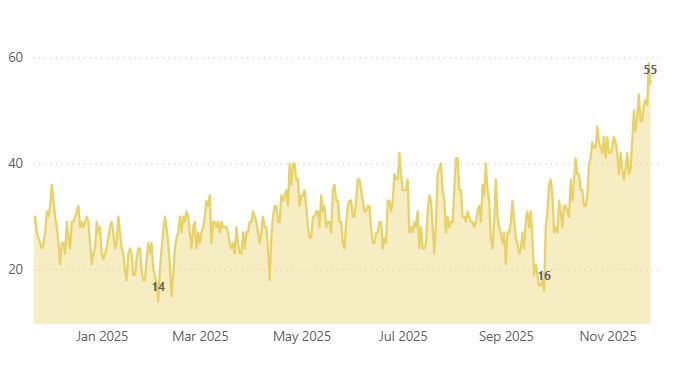

# Weekly Tanker Market Monitor: Week 48, 2025

*Published on 27 November 2025*

## Tanker Market Monitor|tracking Vlccfreightmomentum and the Latest Russianflowshifts

- TD3C and TD15 stay at multi-year seasonal highs as the rally continues to push on
- AG/WAFR net supply remains tight, with early signs of a renewed upward push
- Nov 21-sanctioned Russian flows remain a critical market watchpoint

**TD3C**: 52-Week **High** **142 | TD15**: 52-Week **High 124**

> **Figure 1: 6928951635317d479e5ec0df 6b81c28b**  
> **Interactive Data & Source:** [Signal Ocean Platform](https://www.thesignalgroup.com/weekly-market-monitor/weekly-tanker-market-monitor-week-48-2025) | [Local Asset](file:///C:/Users/Dell/Github/Shipping/corpus/07-signal/images/6928951635317d479e5ec0df_6b81c28b.png)

This week’s analysis focuses on VLCC performance and the evolving Russian crude flows. Building on our [October](https://www.thesignalgroup.com/newsroom/from-summer-to-autumn-2025-dirty-tanker-market-review) and [November](https://www.thesignalgroup.com/newsroom/structural-market-shifts-not-just-barrels-powering-the-dirty-rally) Special Editions, we have already outlined the main drivers behind the recent market surge. In the November edition, we emphasised how structural inefficiencies are increasingly shaping market behaviour, reflected in elevated tonne-days despite relatively softer tonne-mile growth.

In this follow-up, we examine how freight prices and vessel supply interact to influence short-term market direction, with a particular focus on net supply dynamics from the Arabian Gulf (AG) and West Africa.

## Spotlight of the Week

## Russian Dirtyoil Flows| India

- Trend Reversal: Late November shows a noticeable easing, with the 21-day MA around 30% below end-October.

> **Figure 2: Russian Dirty Oil Flows | India**  
> **Interactive Data & Source:** [Signal Ocean Platform](https://www.thesignalgroup.com/weekly-market-monitor/weekly-tanker-market-monitor-week-48-2025) | [Local Asset](file:///C:/Users/Dell/Github/Shipping/corpus/07-signal/images/6928951635317d479e5ec0d9_ef3f6d99.png)

India has not completely halted purchases of Russian crude. November arrivals are on track to reach a multi-month high as refiners front-loaded purchases ahead of the U.S. sanctions deadline. However, the TSOP 21-day moving average of Russian flows has already declined from its late-October peak and is now trending lower following the U.S. measures on Rosneft and Lukoil, announced in late October and effective from [21 November](https://www.cbsnews.com/news/sanctions-choked-russia-oil-industry-a-key-source-of-kremlin-funds/). Together with the sanctions wind-down, this points to a sharp drop in arrivals from December onward. Although Indian refiners can still buy Russian crude from non-sanctioned intermediaries, several developments indicate that inflows are likely to continue falling, rather than stabilising or rebounding:

- Following the U.S. sanctions announcement, [Reliance Industries](https://oilprice.com/Latest-Energy-News/World-News/Indias-Reliance-Industries-Officially-Shuts-the-Door-on-Russian-Crude-Ahead-of.html) accelerated its exit from Russian crude at its export-oriented SEZ refinery at Jamnagar. The last Russian cargo was loaded on 12 November, and any barrels arriving after 20 November are being diverted to the Domestic Tariff Area rather than entering the export stream. This effectively ends the use of Russian feedstock in the SEZ ahead of the 21 November wind-down deadline.
- Russian-linked shipments face a higher compliance burden in insurance and banking. This raises the operational risk profile for all importers, not just Reliance, and contributes to expectations that Russian inflows will ease from December onward.
- [Indian Oil Corporation](https://www.indiandefensenews.in/2025/10/indian-oil-resumes-russian-crude.html) (IOC) has successfully procured approximately five December-arrival Russian crude cargoes from suppliers not subject to sanctions. While this confirms that Russian crude flows continue, the secured volume, around 3.5 million barrels of ESPO-grade, is small compared to IOC's previous intake before sanctions. IOC's policy is to buy Russian crude *only* if the associated sellers and shipping lines are not sanctioned. This emphasizes that the continuity of future inflows is wholly dependent on finding compliant, non-designated counterparties, rather than being driven solely by underlying demand or pricing.

## Netsupplyvs Baltic Rates

## AG | Last 12m Avg: 107 Vessels

- In the AG, even as supply increased from ~76 in early September to over 100, rates remained elevated. TD3 was already near WS 98 in mid-September and continues to display firmness into late November.

> **Figure 3: AG | Last 12m Avg: 107 Vessels**  
> **Interactive Data & Source:** [Signal Ocean Platform](https://www.thesignalgroup.com/weekly-market-monitor/weekly-tanker-market-monitor-week-48-2025) | [Local Asset](file:///C:/Users/Dell/Github/Shipping/corpus/07-signal/images/6928951635317d479e5ec0d3_dc1139df.png)

## Wafr | Last 12m Avg: 13 Vessels

- In WAF, TD15 has surged as net supply dropped to multi-month lows, with rates holding firm around WS 120 even as availability began to pick up in late November.

> **Figure 4: Wafr | Last 12m Avg: 13 Vessels**  
> **Interactive Data & Source:** [Signal Ocean Platform](https://www.thesignalgroup.com/weekly-market-monitor/weekly-tanker-market-monitor-week-48-2025) | [Local Asset](file:///C:/Users/Dell/Github/Shipping/corpus/07-signal/images/6928951635317d479e5ec0d6_d33b70cf.png)

## Vlcccongestion| Discharge China +11% WoW

- Discharge congestion in China has climbed sharply from early-autumn lows to the highest levels of the year, tightening effective tonnage supply and adding to the firmer sentiment on long-haul crude routes.

> **Figure 5: VLCC Congestion | Discharge China +11% WoW**  
> **Interactive Data & Source:** [Signal Ocean Platform](https://www.thesignalgroup.com/weekly-market-monitor/weekly-tanker-market-monitor-week-48-2025) | [Local Asset](file:///C:/Users/Dell/Github/Shipping/corpus/07-signal/images/6928951635317d479e5ec0dc_e1517424.png)

## Macro Elements

- Oil price projections | [JPMorgan](https://finance.yahoo.com/news/jp-morgan-says-oil-prices-150000026.html?fr=sycsrp\_catchall) recently warned that a structural oversupply in the oil market could cause prices to fall sharply by 2027. In their base-case scenario, Brent crude is projected to be around $57 per barrel in 2027. However, under their downside scenario, if oversupply persists and producers fail to cut output, Brent prices could fall into the $30s per barrel by the end of 2027.
- Some [Indian](https://oilprice.com/Latest-Energy-News/World-News/Indian-Banks-Eye-Return-to-Russian-Oil-Trade.html) banks are cautiously exploring financing of Russian-origin oil trades, provided the Russian counterparties and shipping/insurance lines are not under U.S. or EU sanctions. This reflects a narrow path to re-enter Russian crude supply without violating sanction regimes.[https://oilprice.com/Latest-Energy-News/World-News/Indian-Banks-Eye-Return-to-Russian-Oil-Trade.html?utm\_source=chatgpt.com](https://oilprice.com/Latest-Energy-News/World-News/Indian-Banks-Eye-Return-to-Russian-Oil-Trade.html?utm\_source=chatgpt.com)The proposed mechanism involves complex compliance: payments routed through alternative currencies (e.g., UAE dirham, Chinese yuan) and rigorous vetting of counterparties to ensure no sanctioned entity is involved.

For the latest updates and insights, make sure to visit the [Signal Ocean Newsroom](https://www.thesignalgroup.com/newsroom) website page. Click [here to request a demo](https://www.thesignalgroup.com/request-demo?utm\_source=oceanhome&utm\_medium=website&utm\_campaign=demo). Read [last week's tanker monitor here.](https://www.thesignalgroup.com/weekly-market-monitor/tanker-week-37-2025)

For subscription to our FREE weekly market trends email, [please click here](https://www.thesignalgroup.com/subscribe), or contact us at: research@thesignalgroup.com

- Republishing is allowed with an active link to the source
