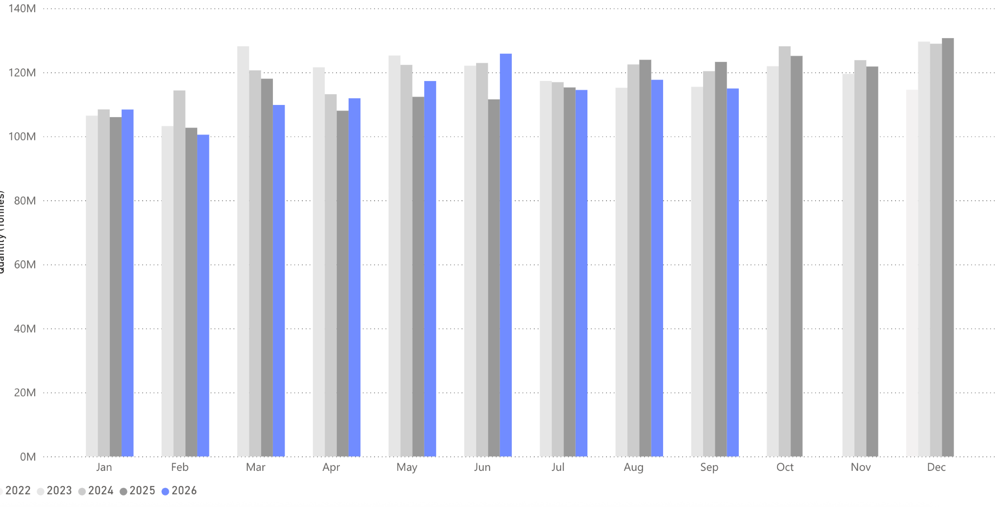
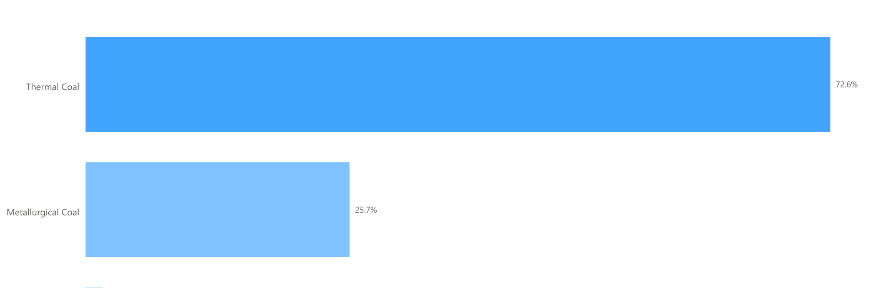
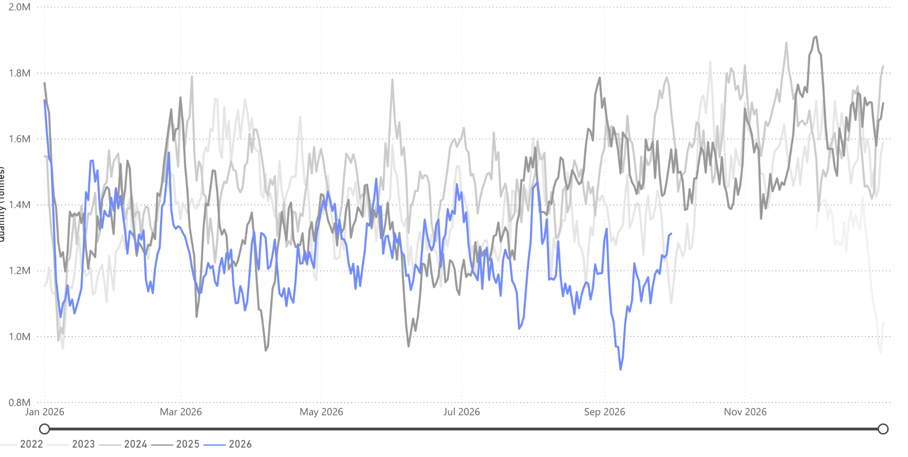

# Commodity Radar | Spotlight: Coal

*Published on 08 October 2026*

## Commodity Radar | Spotlight: Coal

## Thermal Weakness Drags Global Coal Flows Lower

Global seaborne coal flows fell 6.7% year on year in September 2026 to 115 Mt. Thermal coal drove the decline, and a rise in met coal flows was not enough to offset it. Behind the headline, regional demand diverged sharply. India and China cut arrivals as domestic production and renewable output grew, while Japan increased imports as elevated LNG prices pushed utilities back towards coal. This report examines what drove September's weakness, how trade patterns are shifting across the main importers, and why October points to a firmer restocking phase.

- Global seaborne coal flows fell sharply by over 6.7% in September 2026.
- Driven by a 12.7% decline in seaborne thermal coal flows.
- Global seaborne met coal flows jumped 13.5% in September 2026.
- Coal arrivals into India during September 2026 fell by 13.9%
- Coal arrivals into Japan during September 2026 jumped by 12.9%

> **Figure 1: Source: Total Coal Flows From Signal Ocean Https://app.signalocean.com/dry/dynamic/drybulkflows**  
> *Source: Total coal flows from Signal Ocean https://app.signalocean.com/dry/dynamic/drybulkflows*  
> **Interactive Data & Source:** [Signal Ocean Platform](https://www.thesignalgroup.com/weekly-market-monitor/thermal-weakness-drags-global-coal-flows-lower) | [Local Asset](file:///C:/Users/Dell/Github/Shipping/corpus/07-signal/images/6ac74ab96ec3f46c27333a91_eb141e7f.png)

Global seaborne coal flows were 115 Mt in September 2026, down 6.7% y/y, driven by a large 14% decline in seaborne thermal coal flows. This contrasts with a 13.5% rise in seaborne met coal flows, but because 72.8% of all coal flows in September were thermal coal, the met coal increase could not offset the overall decline.

Coal arrivals into India and China fell sharply, by 14.6% and 8.0%, respectively. These drops were driven by both countries increasing domestic coal production, and both seeing improved energy production through ‘green energy’ initiatives.

The opposite was true of Japan, which saw coal arrivals increase by 12.9%. The rising imports are a result of a switch to coal for power generation as LNG prices remain severely elevated. Japan relies heavily on the Arabian Gulf for its energy commodities, but the shift to coal has enabled a much more insulated energy supply chain.

> **Figure 2: Source: Met Coal Flows vs Thermal Coal Flows in September 2026 From Signal Ocean Https://app.signalocean.com/dry/dynamic/drybulkflows**  
> *Source: Met coal flows vs thermal coal flows in September 2026 from Signal Ocean https://app.signalocean.com/dry/dynamic/drybulkflows*  
> **Interactive Data & Source:** [Signal Ocean Platform](https://www.thesignalgroup.com/weekly-market-monitor/thermal-weakness-drags-global-coal-flows-lower) | [Local Asset](file:///C:/Users/Dell/Github/Shipping/corpus/07-signal/images/6ac74ab96ec3f46c27333a94_95aba7b0.png)

Looking ahead, Signal Ocean is already tracking strong coal loadings due to arrive in October, particularly into India. A drier end to the monsoon season has sharply cut hydroelectric output, forcing utilities to burn more coal. October is therefore expected to mark the start of a strong restocking period. However, because renewable generation has grown, stockpiles are likely to be rebuilt to lower levels than in previous years.

In China, domestic coal prices have risen for 11 straight weeks, so buyers are turning to cheaper seaborne coal. Indonesian supply is struggling to meet demand, and Australian cargoes look best placed to fill the gap. Mongolian coal, which arrives overland rather than by sea, has also risen notably in 2026.

> **Figure 3: Source: Indonesia Coal Flows From Signal Oceanhttps://app.signalocean.com/dry/dynamic/drybulkflows**  
> *Source: Indonesia coal flows from Signal Oceanhttps://app.signalocean.com/dry/dynamic/drybulkflows*  
> **Interactive Data & Source:** [Signal Ocean Platform](https://www.thesignalgroup.com/weekly-market-monitor/thermal-weakness-drags-global-coal-flows-lower) | [Local Asset](file:///C:/Users/Dell/Github/Shipping/corpus/07-signal/images/6ac74ab96ec3f46c27333a97_3545632f.png)

## September Is a Dip, Not the Start of a Trend

September's 6.8% fall in global seaborne coal flows, to 115 Mt, was a thermal story. Met coal rose 13.5%, but thermal made up 72.8% of volumes and set the direction. India and China pulled back as domestic output and renewable generation grew, while Japan bought more coal as elevated LNG prices pushed its power sector towards coal. The picture now looks set to turn. A dry end to the monsoon has cut Indian hydropower, and loadings due in October already point to stronger arrivals. In China, domestic prices have risen for 11 straight weeks, which favours cheaper seaborne cargoes, with Australia best placed to cover Indonesia's shortfall. Mongolian volumes will keep competing for market share, but overland. Expect October to mark the start of a firmer restocking phase, though stockpiles will likely be rebuilt to lower levels than in previous years.
