# Weekly Dry Market Monitor: Week 18, 2026

*Published on 29 April 2026*

## Spotlight | Ballasters vs Baltic Rates

- Capesize Vs Panamax

April ends with firm sentiment in both Capesize and Panamax segments. On the C3 route, freight levels are supported by ballaster counts trending below the 12-month average. In Panamax, low ballaster availability across the P1/P2/P7 routes signals an undersupplied market, underpinning current rate strength.

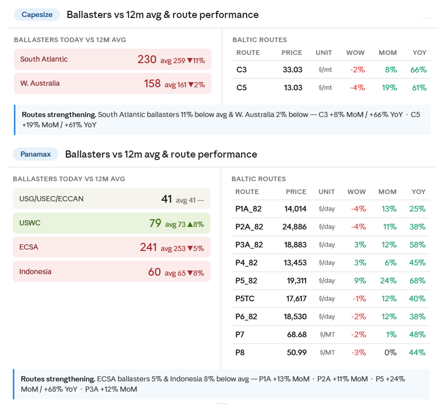

> **Figure 1: Source: Signal Ocean Platform | Cape - Panamax Insights Data (Last Update: April 28, 2026)**  
> *Source: Signal Ocean Platform | Cape - Panamax Insights Data (last update: April 28, 2026)*  
> **Interactive Data & Source:** [Signal Ocean Platform](https://www.thesignalgroup.com/weekly-market-monitor/weekly-dry-market-monitor-week-18-2026) | [Local Asset](file:///C:/Users/Dell/Github/Shipping/corpus/07-signal/images/69f211216a6c5db147716614_1fa4e61b.png)

## Freight Market Overview

The Baltic Dry Index is approaching 2,700 points, with gains recorded across all sub-indices: Capesize leading at +117.4% YoY, followed by Supramax +58.2%, Handysize +41.8%, and Panamax +40.9%.

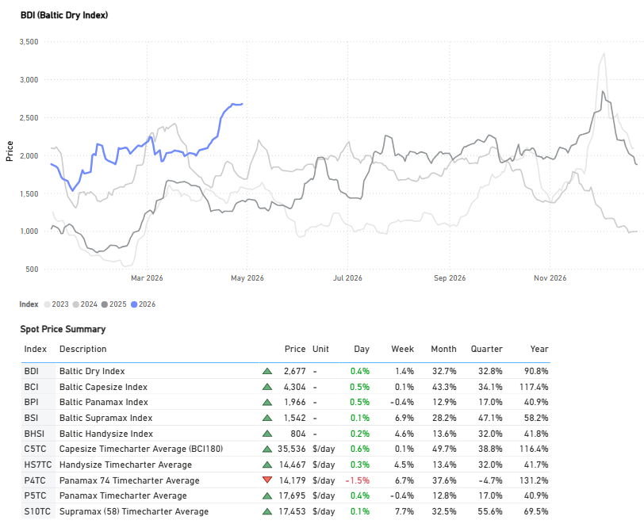

> **Figure 2: Source: Signal Ocean Platform | Market Prices Data (Last Update: April 28, 2026)**  
> *Source: Signal Ocean Platform | Market Prices Data (last update: April 28, 2026)*  
> **Interactive Data & Source:** [Signal Ocean Platform](https://www.thesignalgroup.com/weekly-market-monitor/weekly-dry-market-monitor-week-18-2026) | [Local Asset](file:///C:/Users/Dell/Github/Shipping/corpus/07-signal/images/69f211216a6c5db14771662a_2bf53669.png)

## Freight Atlantic

**Capesize C3 / Panamax P7 Firmer**

> **Figure 3: Freight Atlantic**  
> **Interactive Data & Source:** [Signal Ocean Platform](https://www.thesignalgroup.com/weekly-market-monitor/weekly-dry-market-monitor-week-18-2026) | [Local Asset](file:///C:/Users/Dell/Github/Shipping/corpus/07-signal/images/69d8ce3c853714ba25d6bbd4_214d880f.png)

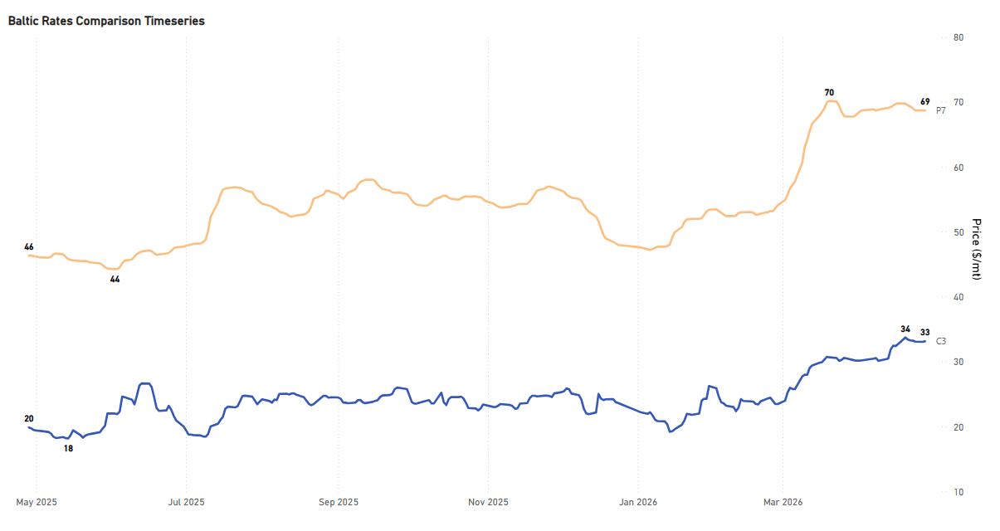

> **Figure 4: Freight Atlantic**  
> **Interactive Data & Source:** [Signal Ocean Platform](https://www.thesignalgroup.com/weekly-market-monitor/weekly-dry-market-monitor-week-18-2026) | [Local Asset](file:///C:/Users/Dell/Github/Shipping/corpus/07-signal/images/69f211216a6c5db147716627_9ab5a918.png)

- **C3** | Tubarao to Qingdao | 33.12 $/MT | Day: +0.09 | Week: -0.28 | Year: +13.27
- **P7** | US Gulf to Qingdao grain | 68.69 $/MT | Day: +0.01 | Week: -0.78 | Year: +22.37

**Supramax S4A / Handysize HS4\_38  Firmer**

> **Figure 5: Freight Atlantic**  
> **Interactive Data & Source:** [Signal Ocean Platform](https://www.thesignalgroup.com/weekly-market-monitor/weekly-dry-market-monitor-week-18-2026) | [Local Asset](file:///C:/Users/Dell/Github/Shipping/corpus/07-signal/images/69d8ce3c853714ba25d6bbc5_b0957e79.png)

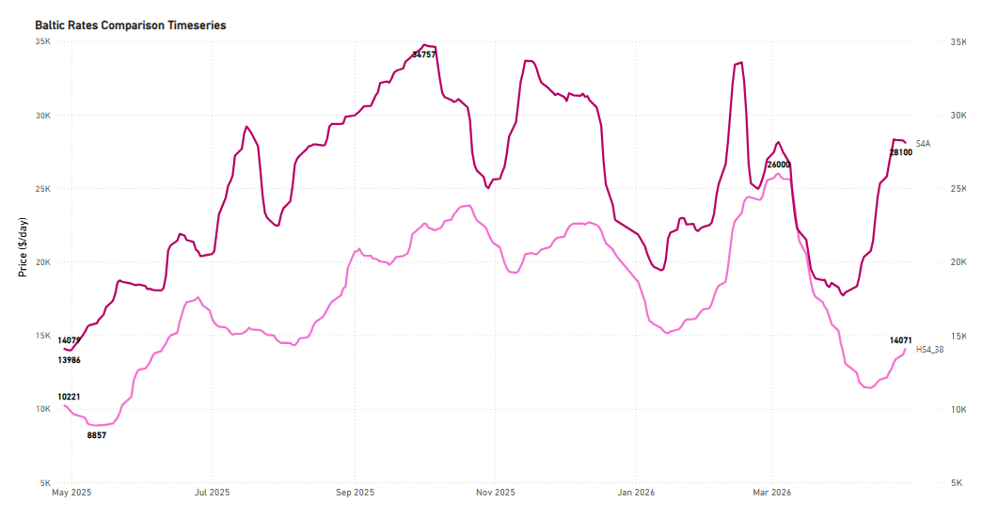

> **Figure 6: Freight Atlantic**  
> **Interactive Data & Source:** [Signal Ocean Platform](https://www.thesignalgroup.com/weekly-market-monitor/weekly-dry-market-monitor-week-18-2026) | [Local Asset](file:///C:/Users/Dell/Github/Shipping/corpus/07-signal/images/69f211216a6c5db147716620_de875536.png)

- **S4A** | US Gulf trip to Skaw-Passero | 28,100 $/day | Day: -143 | Week: +1,379 | Year: +14,021
- **HS4\_38** | US Gulf trip via US Gulf or North Coast South America | 14,071 $/day | Day: +392 | Week: +1,600 | Year: +3,850

## Freight Pacific

**Capesize | C5 Firmer**

**C5** West Australia–Qingdao

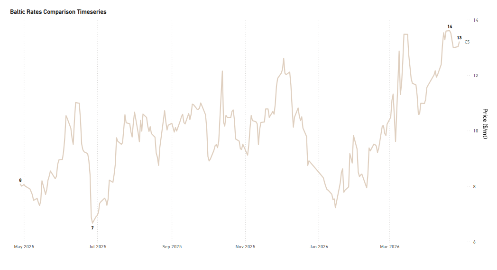

> **Figure 7: Freight Pacific**  
> **Interactive Data & Source:** [Signal Ocean Platform](https://www.thesignalgroup.com/weekly-market-monitor/weekly-dry-market-monitor-week-18-2026) | [Local Asset](file:///C:/Users/Dell/Github/Shipping/corpus/07-signal/images/69f211216a6c5db14771661a_90009a22.png)

- **C5** | West Australia to Qingdao | 13.20 $/MT | Day: +0.17 | Week: -0.32 | Year: +5.13

**Panamax P5\_82 / Supramax S10 Firmer**

> **Figure 8: Freight Pacific**  
> **Interactive Data & Source:** [Signal Ocean Platform](https://www.thesignalgroup.com/weekly-market-monitor/weekly-dry-market-monitor-week-18-2026) | [Local Asset](file:///C:/Users/Dell/Github/Shipping/corpus/07-signal/images/69d8ce3c853714ba25d6bbbf_960a2a36.png)

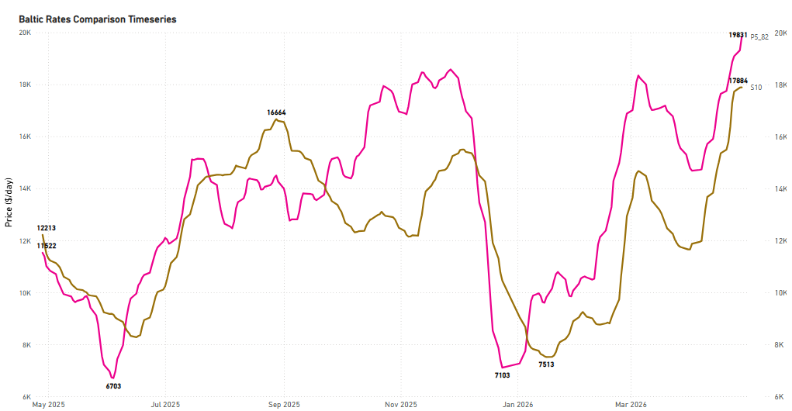

> **Figure 9: Freight Pacific**  
> **Interactive Data & Source:** [Signal Ocean Platform](https://www.thesignalgroup.com/weekly-market-monitor/weekly-dry-market-monitor-week-18-2026) | [Local Asset](file:///C:/Users/Dell/Github/Shipping/corpus/07-signal/images/69f211216a6c5db147716624_0ea26c99.png)

- **P5\_82** | South China, Indonesian round voyage | 20,244 $/day | Day: +413 | Week: +1,772 | Year: +8,863
- **S10** | South China trip via Indonesia to South China | 17,668 $/day | Day: -216 | Week: +1,305 | Year: +5,832

## Ballasters Overview

We take a closer look at the basins of ballast count increases per vessel size segment.

**Capesize:** [Ballasters](https://app.signalocean.com/dry/dynamic/capes\_insights\_downloadable) are rising in the Indian Ocean/SA to more than 160 (+8% WoW), while in Australasia the count has sustained at 200.

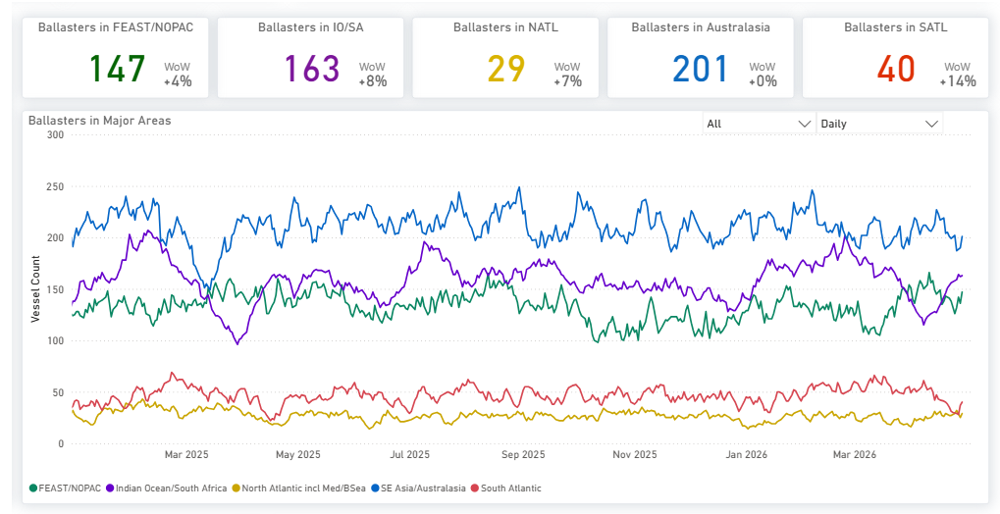

> **Figure 10: Ballasters Overview**  
> **Interactive Data & Source:** [Signal Ocean Platform](https://www.thesignalgroup.com/weekly-market-monitor/weekly-dry-market-monitor-week-18-2026) | [Local Asset](file:///C:/Users/Dell/Github/Shipping/corpus/07-signal/images/69f211216a6c5db14771661d_a5378321.png)

**Panamax:** [Atlantic](https://app.signalocean.com/dry/dynamic/panamax\_insights) basins are surging. NATL up +38% WoW and SATL up +32% WoW, while FEAST/NOPAC basin shows modest growth.

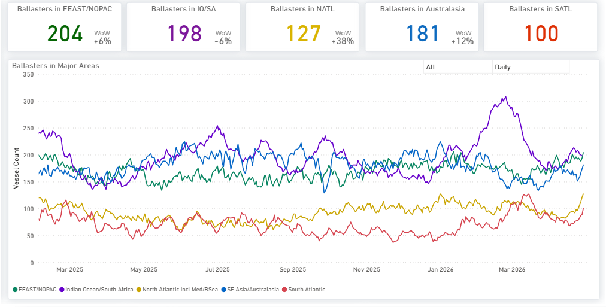

> **Figure 11: Ballasters Overview**  
> **Interactive Data & Source:** [Signal Ocean Platform](https://www.thesignalgroup.com/weekly-market-monitor/weekly-dry-market-monitor-week-18-2026) | [Local Asset](file:///C:/Users/Dell/Github/Shipping/corpus/07-signal/images/69f211216a6c5db147716617_03b0f562.png)

**Supramax:** The [North Atlantic](https://app.signalocean.com/dry/dynamic/supramax\_insights) basin is surging with the count up +40% WoW and FEAST/NOPAC up +20% WoW.

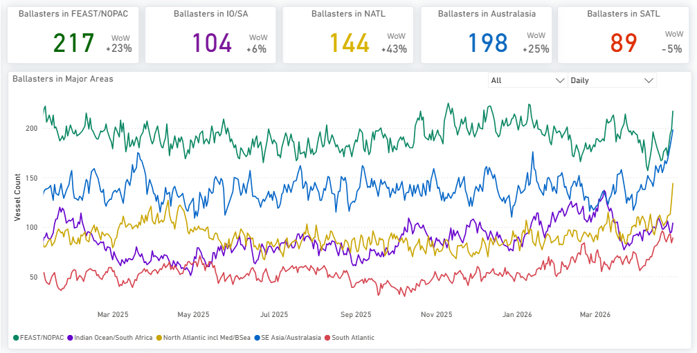

> **Figure 12: Ballasters Overview**  
> **Interactive Data & Source:** [Signal Ocean Platform](https://www.thesignalgroup.com/weekly-market-monitor/weekly-dry-market-monitor-week-18-2026) | [Local Asset](file:///C:/Users/Dell/Github/Shipping/corpus/07-signal/images/69f211216a6c5db14771662f_272c8f77.png)

**Handysize:** [Ballasters](https://app.signalocean.com/dry/dynamic/handy\_insights\_downloadable) are surging in the Atlantic and Pacific, with NATL and SATL leading at +31% and +33% WoW. The Indian Ocean is growing at a more measured pace of +9%.

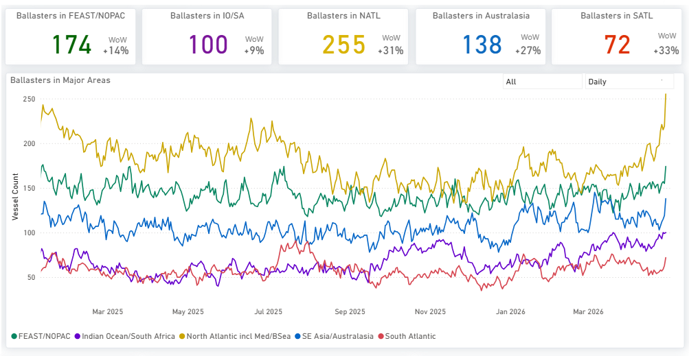

> **Figure 13: Ballasters Overview**  
> **Interactive Data & Source:** [Signal Ocean Platform](https://www.thesignalgroup.com/weekly-market-monitor/weekly-dry-market-monitor-week-18-2026) | [Local Asset](file:///C:/Users/Dell/Github/Shipping/corpus/07-signal/images/69f211216a6c5db147716632_6fbf73c8.png)

## Demand|tonne Miles- 7d Ma- Index View

**Capesize ↓ 0.9%** WoW **| Panamax ↓ 1.5%** WoW **| Supramax ↓0.3%** WoW

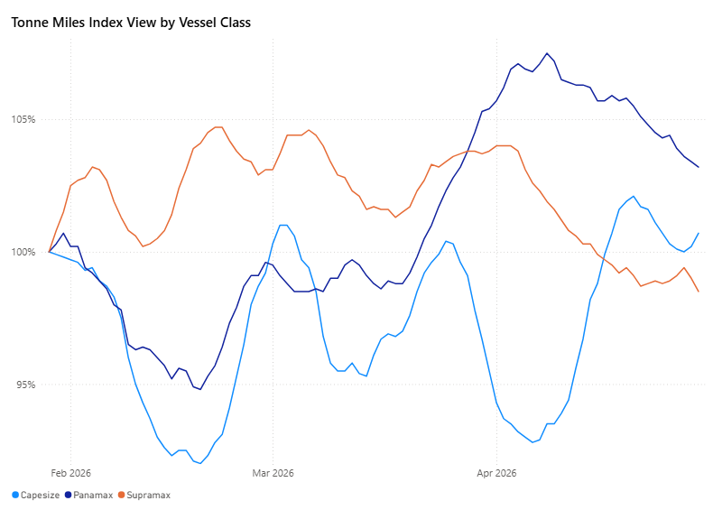

> **Figure 14: Demand| Tonne Miles - 7d Ma- Index View**  
> **Interactive Data & Source:** [Signal Ocean Platform](https://www.thesignalgroup.com/weekly-market-monitor/weekly-dry-market-monitor-week-18-2026) | [Local Asset](file:///C:/Users/Dell/Github/Shipping/corpus/07-signal/images/69f211216a6c5db147716635_5af28e2b.png)

By the end of April, Supramax and Panamax are losing momentum, while Capesize is showing a renewed upward trend. Despite the recent softening, both Capesize and Panamax indices remain above the 100% threshold, indicating still-elevated demand levels, whereas Supramax continues to lag below.

For the latest updates and insights, make sure to visit the [Signal Ocean Newsroom](https://www.thesignalgroup.com/newsroom) page & [subscribe to weekly reports](http://www.thesignalgroup.com/subscribe). Click [here to request a demo](https://www.thesignalgroup.com/request-demo?utm\_source=oceanhome&utm\_medium=website&utm\_campaign=demo). Click here to see the[previous dry bulk weekly](https://www.thesignalgroup.com/weekly-market-monitor/weekly-dry-market-monitor-week-11-2026) report.

For subscription to our FREE weekly market trends email, please contact us: research@thesignalgroup.com

-Republishing is allowed with an active link to the source
