# Weekly Dry Market Monitor: Week 40, 2026

*Published on 07 October 2026*

## Spotlight of the Week

## Coal in Focus — China’s 2027–28 US Coal Commitment

**A second commodity joins the US–China trade programme.** On 25 September the White House announced that China would import at least 10 million tonnes of US coal in each of 2027 and 2028, and on 28 September China’s Ministry of Commerce included coal in its reciprocal tariff-reduction framework, with implementation to follow both countries’ domestic legal procedures. The commitment covers US supply overall. It does not allocate the volume by loading coast, coal grade or vessel size, so the quantity cannot yet be assigned to Atlantic shipping demand. This follows the soybean spotlight carried in Week 38; the soybean undertaking was itself reaffirmed in September at its existing minimum of 25 million tonnes a year for 2026–28 rather than raised, and soybeans were left out of the tariff-relief lists.

**Recorded sailings have already recovered from a very low base.** Signal loading data show **918,364 tonnes** of coal shipped from the US Gulf to China in January–September 2026, against 51,726 tonnes a year earlier. August and September alone accounted for 695,375 tonnes, close to 76% of the 2026 total, placing the improvement firmly in the late-summer loading programme. The recovery nonetheless remains below the 2024 level: China took 4.6% of US Gulf coal exports to all destinations this year against 9.8% in 2024, and the China-bound tonnage is some 47% below 2024. These are recorded cargoes covering 2026, while the commitment covers 2027 and 2028; the loading data do not establish a causal link to the future commitment.

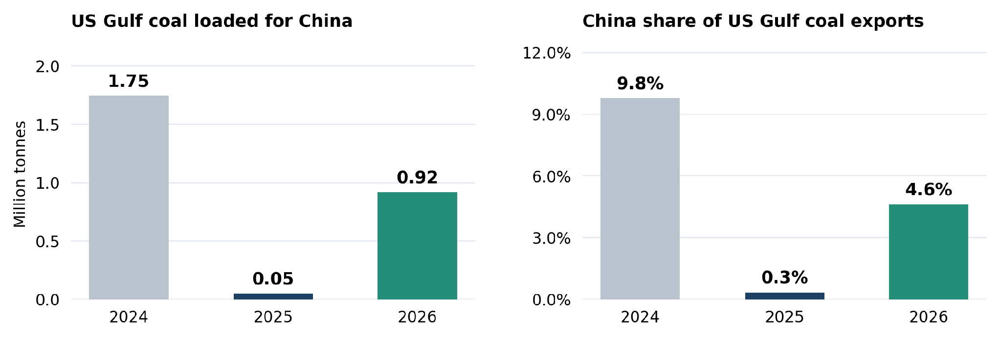

> **Figure 1: Coal in Focus — China’s 2027–28 US Coal Commitment**  
> **Interactive Data & Source:** [Signal Ocean Platform](https://www.thesignalgroup.com/weekly-market-monitor/weekly-dry-market-monitor-week-40-2026) | [Local Asset](file:///C:/Users/Dell/Github/Shipping/corpus/07-signal/images/6ac601493f048e68dd4f81a4_cb0c9fd5.png)

*Figure 1: January–September US Gulf coal exports to China and China’s share of all-destination US Gulf coal exports. The 2026 recovery remains below 2024 in both volume and destination share (Source: Signal).*

**What would have to happen for this to reach freight.** Any Atlantic employment effect is conditional on the loading coast. Only the share of the programme loading at US Gulf or East Coast terminals would add cargo to Atlantic loading programmes; volumes loading on the Pacific coast would produce a different employment pattern. Where Atlantic stems displace shorter Pacific coal voyages they would raise tonne-mile demand per tonne carried, but a US cargo sold to China instead of an existing customer changes the route without necessarily adding global volume.

## Freight Market Overview | BDI & Segment Metrics

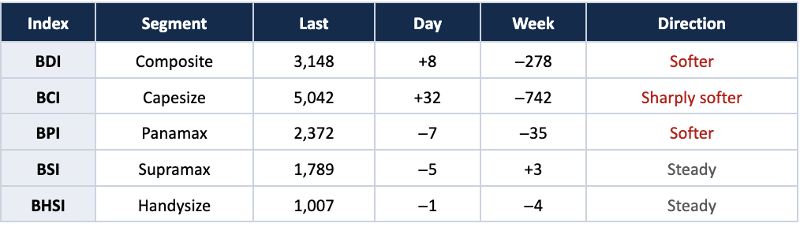

> **Figure 2: Freight Market Overview | BDI & Segment Metrics**  
> **Interactive Data & Source:** [Signal Ocean Platform](https://www.thesignalgroup.com/weekly-market-monitor/weekly-dry-market-monitor-week-40-2026) | [Local Asset](file:///C:/Users/Dell/Github/Shipping/corpus/07-signal/images/6ac6006f8588599db95ae20f_Screenshot 2026-10-07 at 09.17.52.png)

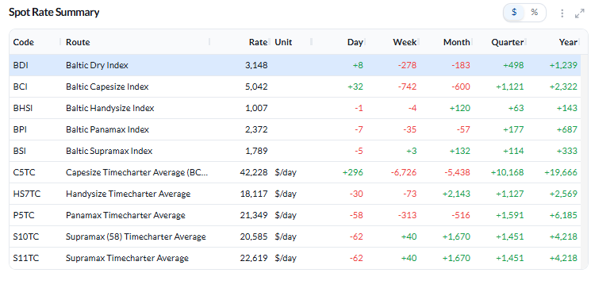

> **Figure 2: Baltic Dry Index — Spot Rate Summary Across Segments as of 2 Oct 2026**  
> *Figure 2: Baltic Dry Index — spot rate summary across segments as of 2 Oct 2026. The BDI closed the week at 3,148 points, against a 52-week high of 3,628, a low of 1,532 and an average of 2,498 (Source: Signal).*  
> **Interactive Data & Source:** [Signal Ocean Platform](https://www.thesignalgroup.com/weekly-market-monitor/weekly-dry-market-monitor-week-40-2026) | [Local Asset](file:///C:/Users/Dell/Github/Shipping/corpus/07-signal/images/6ac601493f048e68dd4f819e_8c501120.png)

**The composite gave back the previous week’s gain.** The BDI eased to 3,148 points (+8 daily, −278 week-on-week) from 3,426 on 25 September, a sequence the Baltic Exchange’s own weekly report records identically. **Capesize** drove the fall: the BCI dropped 742 points to 5,042, with C5TC(180) down $6,726 to $42,228/day and C5TC(182) at $45,731/day. **Panamax** eased more modestly, the BPI 35 points lower at 2,372 and P5TC down $313 to $21,349/day. **Supramax** and **Handysize** were effectively unchanged — the BSI three points higher at 1,789 and the BHSI four points lower at 1,007 — and both sit within a few points of their 52-week highs of 1,797 and 1,013.

**Capesize weakness was broad.** Every Capesize route finished lower. C14\_182 (China–Brazil or West Africa round) fell $8,880 to $41,814/day, C10\_182 (China–Japan transpacific round) $7,017 to $38,846/day and C16\_182 (Far East–Atlantic backhaul) $6,044 to $16,789/day, with C3 (Tubarao–Qingdao) down $4.75 to $37.65/mt and C5 (West Australia–Qingdao) down $1.20 to $14.43/mt. The Baltic Exchange describes the same week as one in which the Capesize market surrendered the previous week’s gains with tonnage availability building particularly in the East. Signal’s ballaster distribution is consistent: 235 Capesize ballasters in Australasia and 194 in the Indian Ocean/South Africa against 20 in the North Atlantic.

**The Atlantic divided by vessel size.** For **Panamax**, the Baltic Exchange reports improving demand from the US Gulf and a tightening October position list in East Coast South America, and Signal’s forward balance for the P1/P2/P7 group shows total supply running below expected demand across the entire twenty-day window. Every Panamax route still finished the week lower. For the **geared sizes** the Gulf moved the other way: S1C (US Gulf to China–South Japan) fell $937 to $31,794/day, S4A (US Gulf to Skaw-Passero) $606 to $32,038/day and HS4\_38 (US Gulf trip) $807 to $24,107/day — matching the Baltic Exchange’s account of a North American Supramax market softening for fronthauls and a Handysize US Gulf easing through the week.

**Continent departures and the geared routes carried the gains.** Handysize strength was concentrated in Continent, HS2\_38 (Skaw-Passero to Boston–Galveston) up $500 to $14,514/day and HS1\_38 (Skaw-Passero to Rio de Janeiro) up $357 to $10,607/day, the areas the Baltic Exchange also identifies as the strongest of the week. In Supramax the gains were split between the Atlantic — S9 (West Africa via East Coast South America to Skaw-Passero) up $503 to $23,981/day and S4B (Skaw-Passero to US Gulf) up $210 to $15,519/day — and the Pacific and Indian Ocean, S2 up $300 to $21,444/day and S15 up $268 to $19,929/day.

Panamax Pacific routes eased, P3A\_82 down $766 and P5\_82 down $225, a pattern the Baltic Exchange attributes in part to Golden Week and the Coaltrans conference.

## Ballasters — By Region

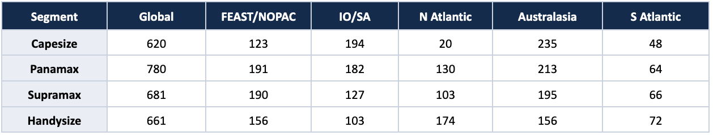

> **Figure 4: Global Ballaster Fleet and Regional Counts as of 2 October 2026**  
> *Global ballaster fleet and regional counts as of 2 October 2026. Counts are point-in-time and regional figures sum to the global total (Source: Signal).*  
> **Interactive Data & Source:** [Signal Ocean Platform](https://www.thesignalgroup.com/weekly-market-monitor/weekly-dry-market-monitor-week-40-2026) | [Local Asset](file:///C:/Users/Dell/Github/Shipping/corpus/07-signal/images/6ac60098074378f84a290342_Screenshot 2026-10-07 at 09.18.01.png)

The largest single regional concentration of the week was 235 Capesize ballasters in Australasia, followed by 213 Panamax in the same region. Panamax carried the largest global count at 780 and Capesize the smallest at 620, with Capesize open tonnage heavily weighted to the Pacific. Within Handysize, the North Atlantic including the Mediterranean and Black Sea held that segment’s largest pool at 174 vessels.

## Capesize | Analysis

**Freight.** The BCI fell 742 points to 5,042 (+32 on the day). C5TC(180), the 180,000 dwt timecharter average, lost $6,726 to $42,228/day, the largest weekly decline of the four segments; C5TC(182), the 182,000 dwt benchmark that became the market standard in January 2026, closed at $45,731/day. Losses were spread across the basket, with the China–Brazil/West Africa round (C14\_182, −$8,880 to $41,814/day) and the China–Japan transpacific round (C10\_182, −$7,017 to $38,846/day) leading. The Cont-Med trip to China–Japan (C9\_182) remained the highest-paid route in the basket at $87,400/day; the transatlantic round (C8\_182) was the highest-paying round-voyage route at $57,719/day despite a $5,219 fall. The index finished 1,121 points above its level a quarter ago and 2,322 points above a year ago, against a 52-week high of 6,427 and a low of 2,175.

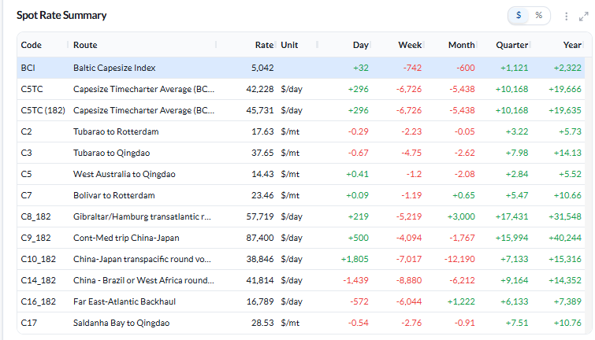

> **Figure 3: Baltic Capesize Index (BCI) — Spot Rate Summary as of 2 Oct 2026**  
> *Figure 3: Baltic Capesize Index (BCI) — spot rate summary as of 2 Oct 2026 (Source: Signal).*  
> **Interactive Data & Source:** [Signal Ocean Platform](https://www.thesignalgroup.com/weekly-market-monitor/weekly-dry-market-monitor-week-40-2026) | [Local Asset](file:///C:/Users/Dell/Github/Shipping/corpus/07-signal/images/6ac601493f048e68dd4f81a1_3dae5bf1.png)

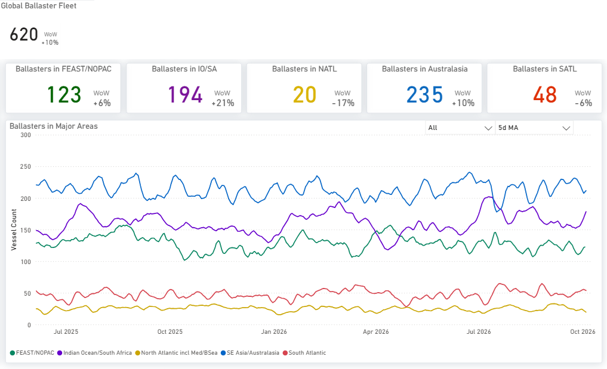

> **Figure 6: Capesize | Analysis**  
> **Interactive Data & Source:** [Signal Ocean Platform](https://www.thesignalgroup.com/weekly-market-monitor/weekly-dry-market-monitor-week-40-2026) | [Local Asset](file:///C:/Users/Dell/Github/Shipping/corpus/07-signal/images/6ac601493f048e68dd4f81a7_38fc3a55.png)

*Figure 4: Capesize — Global ballaster fleet and regional positioning as of 2 Oct 2026 (Source: Signal).*

**Ballaster positioning.** The global Capesize ballaster count stood at 620 on 2 October. Open tonnage was concentrated in the East, with 235 vessels in Australasia and 194 in the Indian Ocean/South Africa, against 123 in FEAST/NOPAC, 48 in the South Atlantic and 20 in the North Atlantic. The North Atlantic pool was the smallest regional count recorded in any segment this week.

On the forward balance the two supply measures diverge: for C3, total supply runs below expected demand for roughly the first thirty days before crossing above it, while supply excluding laden vessels finishes lower still. For C5, total supply tracks demand through the first fortnight and crosses above it at about day fourteen, whereas supply excluding laden vessels flattens from about day eleven and ends well below demand.

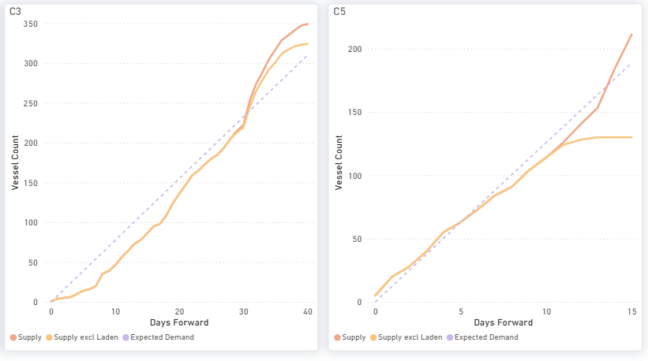

> **Figure 7: Capesize | Analysis**  
> **Interactive Data & Source:** [Signal Ocean Platform](https://www.thesignalgroup.com/weekly-market-monitor/weekly-dry-market-monitor-week-40-2026) | [Local Asset](file:///C:/Users/Dell/Github/Shipping/corpus/07-signal/images/6ac601493f048e68dd4f819b_96b660f6.png)

*Figure 5: Capesize — C3 & C5 forward balance: cumulative Supply, Supply excluding laden vessels and Expected Demand over days forward (Source: Signal).*

**Supply/demand — market-position indicator.** The demand-to-supply series compares four-week-average year-on-year growth in tonne-mile demand with growth in available tonnage, so a reading above 1.00 means demand is growing faster than tonnage rather than that cargo physically exceeds ships. For the week ending 1 October the provisional Capesize ratio stands at **1.01**. Over four weeks West African bauxite rose 23% to 12.98 Mt and West African iron ore 47% to 5.92 Mt, while East Coast South American cargo fell 2.99 Mt; the pooled Capesize/VLOC North Atlantic loading-to-open-DWT ratio increased from 0.91 to 1.08. Western Australian ore fines were 7.4% lower in the latest week.

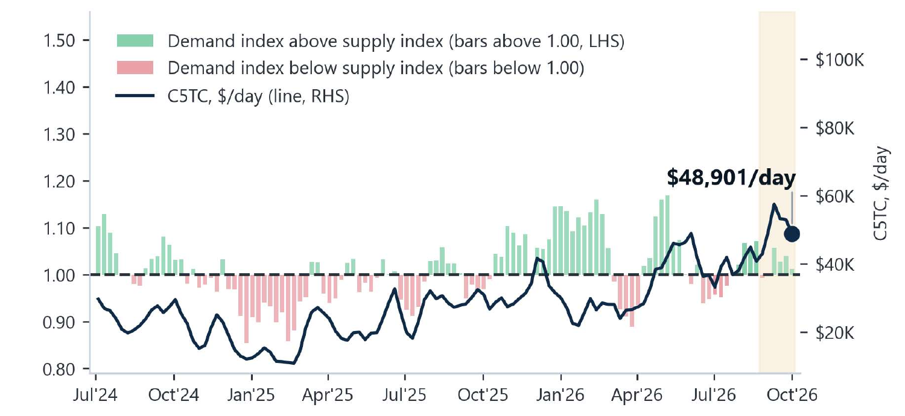

> **Figure 8: Capesize | Analysis**  
> **Interactive Data & Source:** [Signal Ocean Platform](https://www.thesignalgroup.com/weekly-market-monitor/weekly-dry-market-monitor-week-40-2026) | [Local Asset](file:///C:/Users/Dell/Github/Shipping/corpus/07-signal/images/6ac601493f048e68dd4f81aa_997983a8.png)

*Figure 6: Capesize — demand-to-supply ratio (LHS bars, four-week-average year-on-year growth; above 1.00 = tonne-mile demand growing faster than available tonnage) against the C5TC weekly average (RHS line). Available tonnage excludes VLOC tonnage on long-term contract. Shaded band = latest six provisional weeks. The annotated $48,901/day is the settled weekly average for the week ending 1 October 2026 as supplied in the research input; it is not the 2 October closing assessment quoted above, and the underlying series is not reproduced in this report (Source: Signal; Baltic Exchange).*

## Panamax | Analysis

**Freight.** The BPI eased 35 points to 2,372 and the P5TC average fell $313 to $21,349/day. Every route in the basket finished lower. P3A\_82 (Hong Kong–South Korea transpacific) fell $766 to $20,597/day, P2A\_82 (Skaw–Gibraltar trip to Taiwan–Japan) $271 to $30,622/day and P6\_82 (Singapore round via Atlantic) $268 to $21,407/day. P5\_82 (South China/Indonesian round) eased $225 to $19,081/day, P4\_82 $73 to $13,106/day and P1A\_82 (Skaw–Gibraltar transatlantic round) just $27 to $21,618/day. The grain routes softened marginally, P7 (US Gulf–Qingdao) down $0.16 to $76.88/mt and P8 (Santos–Qingdao) down $0.28 to $56.94/mt. The index remains 177 points above its level a quarter ago, against a 52-week high of 2,521 and a low of 1,266.

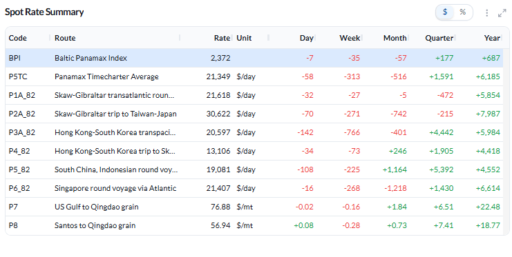

> **Figure 9: Panamax | Analysis**  
> **Interactive Data & Source:** [Signal Ocean Platform](https://www.thesignalgroup.com/weekly-market-monitor/weekly-dry-market-monitor-week-40-2026) | [Local Asset](file:///C:/Users/Dell/Github/Shipping/corpus/07-signal/images/6ac601493f048e68dd4f81ad_8d4ac158.png)

*Figure 7: Baltic Panamax Index (BPI) — spot rate summary as of 2 Oct 2026 (Source: Signal).*

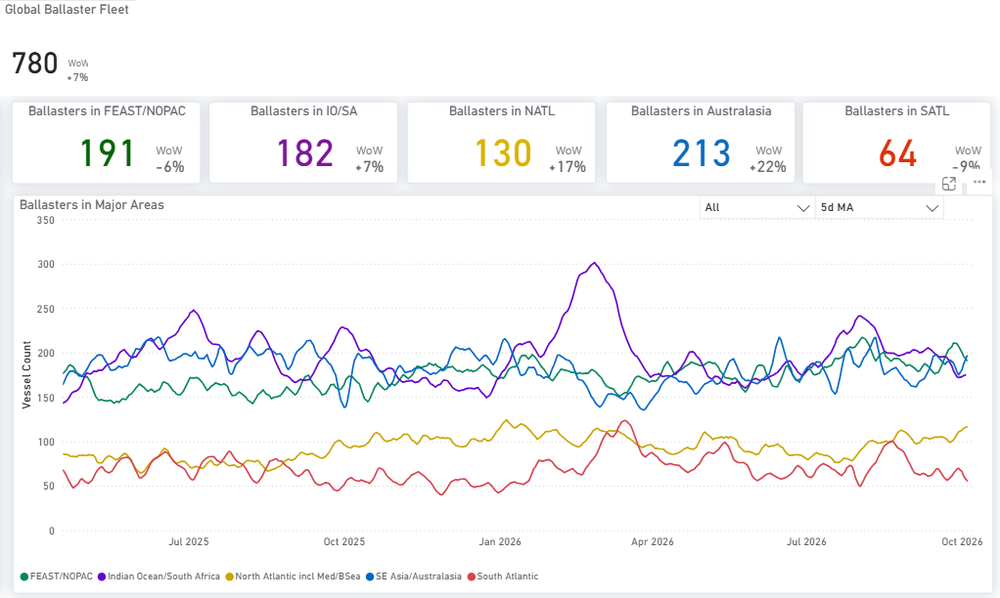

> **Figure 10: Panamax | Analysis**  
> **Interactive Data & Source:** [Signal Ocean Platform](https://www.thesignalgroup.com/weekly-market-monitor/weekly-dry-market-monitor-week-40-2026) | [Local Asset](file:///C:/Users/Dell/Github/Shipping/corpus/07-signal/images/6ac601493f048e68dd4f81b0_b4a227ac.png)

*Figure 8: Panamax — Global ballaster fleet and regional positioning as of 2 Oct 2026 (Source: Signal).*

**Ballaster positioning.** The global Panamax ballaster count stood at 780 on 2 October, the largest of the four segments. Australasia held 213 vessels and FEAST/NOPAC 191, with 182 in the Indian Ocean/South Africa, 130 in the North Atlantic and 64 in the South Atlantic. The North Atlantic pool of 130 sits alongside the firmer US Gulf cargo picture described below.

On the forward balance, total supply finishes below expected demand on all four panels. The P1/P2/P7 group runs below demand across the whole twenty-day window; P3 runs above demand until about days fourteen to fifteen and below thereafter; P5 falls increasingly short from about day four and P6 from about day five. Supply excluding laden vessels sits lower again on each panel. The latest reading remains provisional.

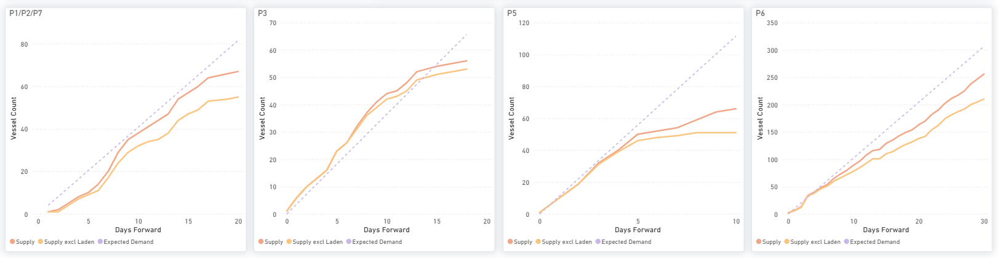

> **Figure 11: Panamax | Analysis**  
> **Interactive Data & Source:** [Signal Ocean Platform](https://www.thesignalgroup.com/weekly-market-monitor/weekly-dry-market-monitor-week-40-2026) | [Local Asset](file:///C:/Users/Dell/Github/Shipping/corpus/07-signal/images/6ac601493f048e68dd4f81b3_0687159c.png)

*Figure 9: Panamax — P1/P2/P7, P3, P5 & P6 forward balance: cumulative Supply, Supply excluding laden vessels and Expected Demand over days forward (Source: Signal).*

**Supply/demand — market-position indicator.** For the week ending 1 October the provisional Panamax ratio stands at **0.96**. US Gulf grain recorded the clearest Atlantic cargo increase, rising from 0.22 Mt to 2.00 Mt over four weeks across 28 voyages, up from three, of which 1.20 Mt was assigned to China. East Coast South American grain fell 1.20 Mt over the same four weeks and the North Atlantic loading-to-open-DWT ratio eased from 0.47 to 0.41..

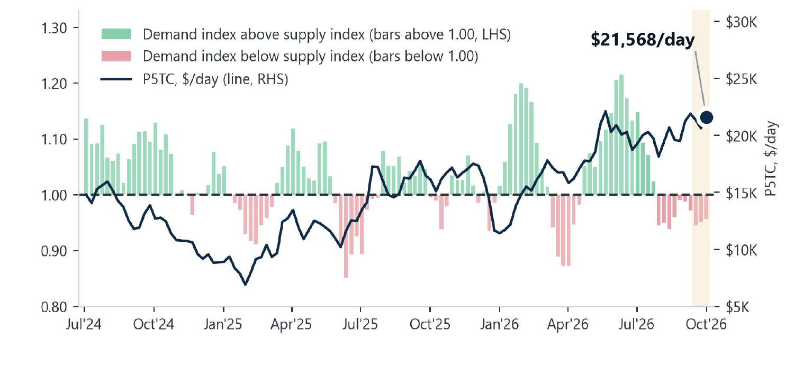

> **Figure 12: Panamax | Analysis**  
> **Interactive Data & Source:** [Signal Ocean Platform](https://www.thesignalgroup.com/weekly-market-monitor/weekly-dry-market-monitor-week-40-2026) | [Local Asset](file:///C:/Users/Dell/Github/Shipping/corpus/07-signal/images/6ac601493f048e68dd4f81b6_a6bc94ac.png)

*Figure 10: Panamax — demand-to-supply ratio (LHS bars, four-week-average year-on-year growth) against the P5TC weekly average (RHS line). Shaded band = latest three provisional weeks. The annotated $21,568/day is the settled weekly average for the week ending 1 October 2026 as supplied in the research input; it is not the 2 October closing assessment quoted above (Source: Signal; Baltic Exchange).*

## Supramax | Analysis

**Freight.** The BSI was all but unchanged, three points higher at 1,789 and eight points below its 52-week high of 1,797. The S11TC average rose $40 to $22,619/day and the Asia index S3TC\_63 gained $159 to $21,213/day. The gains came from both basins. In the Atlantic, S9 (West Africa trip via East Coast South America to Skaw-Passero) rose $503 to $23,981/day, S4B (Skaw-Passero to US Gulf) $210 to $15,519/day and S5 (West Africa via East Coast South America) $59 to $28,100/day.

In the Pacific and Indian Ocean, S2 (North China, one Australian or Pacific round) rose $300 to $21,444/day, S15 (Indian Ocean trip via South Africa) $268 to $19,929/day, S8 $121 to $25,550/day and S3 $91 to $21,083/day. The US Gulf routes moved against that: S1C (US Gulf to China–South Japan) fell $937 to $31,794/day and S4A (US Gulf to Skaw-Passero) $606 to $32,038/day, while S1B (Canakkale via Mediterranean) lost $536 to $25,786/day. S4A nonetheless remains the highest-paid route in the basket.

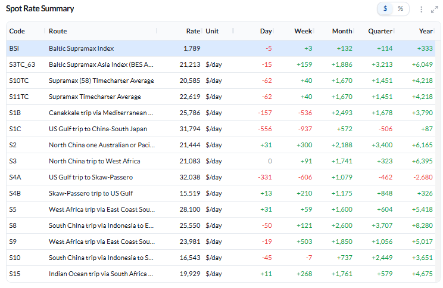

> **Figure 13: Supramax | Analysis**  
> **Interactive Data & Source:** [Signal Ocean Platform](https://www.thesignalgroup.com/weekly-market-monitor/weekly-dry-market-monitor-week-40-2026) | [Local Asset](file:///C:/Users/Dell/Github/Shipping/corpus/07-signal/images/6ac601493f048e68dd4f81b9_5f39e43c.png)

*Figure 11: Baltic Supramax Index (BSI) — spot rate summary as of 2 Oct 2026 (Source: Signal).*

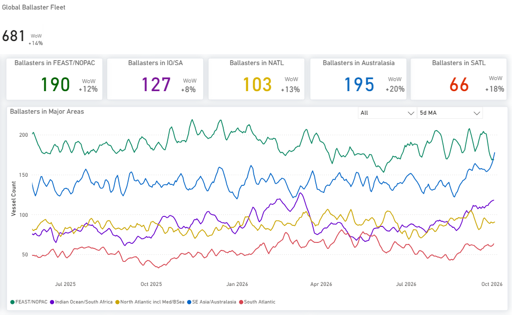

> **Figure 14: Supramax | Analysis**  
> **Interactive Data & Source:** [Signal Ocean Platform](https://www.thesignalgroup.com/weekly-market-monitor/weekly-dry-market-monitor-week-40-2026) | [Local Asset](file:///C:/Users/Dell/Github/Shipping/corpus/07-signal/images/6ac601493f048e68dd4f81c2_7e02854f.png)

*Figure 12: Supramax — Global ballaster fleet and regional positioning as of 2 Oct 2026 (Source: Signal).*

**Ballaster positioning.** The global Supramax ballaster count stood at 681 on 2 October. Australasia held 195 vessels and FEAST/NOPAC 190, with 127 in the Indian Ocean/South Africa, 103 in the North Atlantic and 66 in the South Atlantic. Separately, recorded open vessel counts in the Pacific fell from 603 to 588 over the week.

On the forward balance, total supply ends above expected demand on all four panels, the clearest cover of any segment this week, although on S5 total supply dips below demand briefly between roughly days two and five before rising above it. Supply excluding laden West African tonnage sits materially lower on the S5 panel and does not clear demand until about day nine.

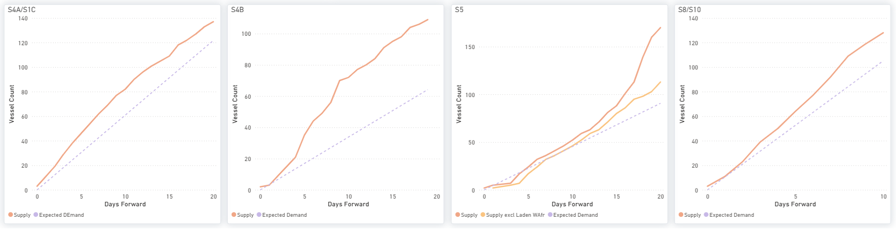

> **Figure 15: Supramax | Analysis**  
> **Interactive Data & Source:** [Signal Ocean Platform](https://www.thesignalgroup.com/weekly-market-monitor/weekly-dry-market-monitor-week-40-2026) | [Local Asset](file:///C:/Users/Dell/Github/Shipping/corpus/07-signal/images/6ac601493f048e68dd4f81bc_f51a587e.png)

*Figure 13: Supramax — S4A/S1C, S4B, S5 & S8/S10 forward balance: cumulative Supply, Supply excluding laden vessels and Expected Demand over days forward (Source: Signal).*

**Supply/demand — market-position indicator.** For the week ending 1 October the provisional Supramax ratio remains at **0.83**, the lowest of the four segments. Over four weeks Southeast Asian thermal coal rose 13% to 14.79 Mt and Far East steels 11% to 10.82 Mt, while the Pacific loading-to-open-DWT ratio edged up from 0.93 to 0.94. Gulf grain fell 16% in the latest week and Far East steels were also lower.

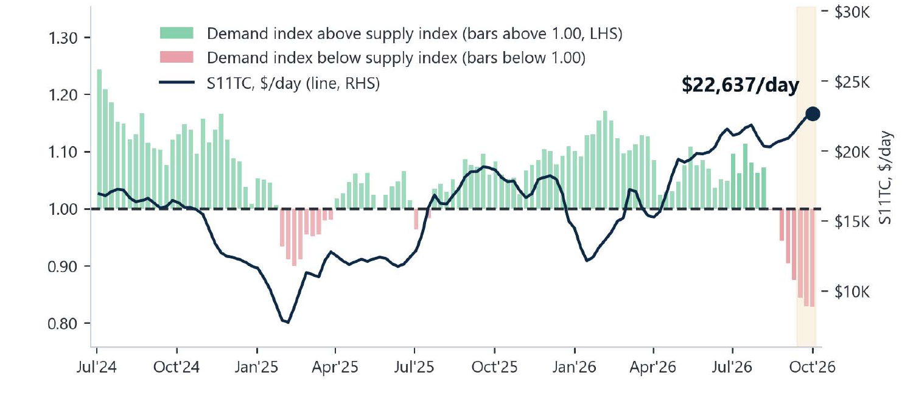

> **Figure 16: Supramax | Analysis**  
> **Interactive Data & Source:** [Signal Ocean Platform](https://www.thesignalgroup.com/weekly-market-monitor/weekly-dry-market-monitor-week-40-2026) | [Local Asset](file:///C:/Users/Dell/Github/Shipping/corpus/07-signal/images/6ac601493f048e68dd4f81c5_711a4a83.png)

*Figure 14: Supramax — demand-to-supply ratio (LHS bars, four-week-average year-on-year growth) against the S11TC weekly average (RHS line). Shaded band = latest three provisional weeks. The annotated $22,637/day is the settled weekly average for the week ending 1 October 2026 as supplied in the research input; it is not the 2 October closing assessment quoted above (Source: Signal; Baltic Exchange).*

## Handysize | Analysis

**Freight.** The BHSI slipped four points to 1,007, six points below its 52-week high of 1,013, and the HS7TC average eased $73 to $18,117/day. The split within the basket was clear. Continent departure routes firmed, HS2\_38 (Skaw-Passero to Boston–Galveston) rising $500 to $14,514/day and HS1\_38 (Skaw-Passero to Rio de Janeiro) $357 to $10,607/day, while HS7\_38 (North China–South Korea–Japan) added $119 to $18,169/day.

The Atlantic trips weakened, HS4\_38 (US Gulf trip via US Gulf or North Coast South America) falling $807 to $24,107/day and HS3\_38 (Rio de Janeiro–Recalada to Skaw) $84 to $25,594/day, with HS5\_38 (South East Asia to Singapore–Japan) down $363 to $17,531/day. The index stands 120 points above its level a month ago.

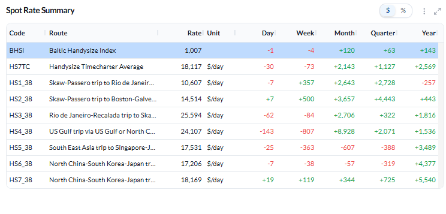

> **Figure 17: Handysize | Analysis**  
> **Interactive Data & Source:** [Signal Ocean Platform](https://www.thesignalgroup.com/weekly-market-monitor/weekly-dry-market-monitor-week-40-2026) | [Local Asset](file:///C:/Users/Dell/Github/Shipping/corpus/07-signal/images/6ac601493f048e68dd4f81bf_bf875b90.png)

*Figure 15: Baltic Handysize Index (BHSI) — spot rate summary as of 2 Oct 2026 (Source: Signal).*

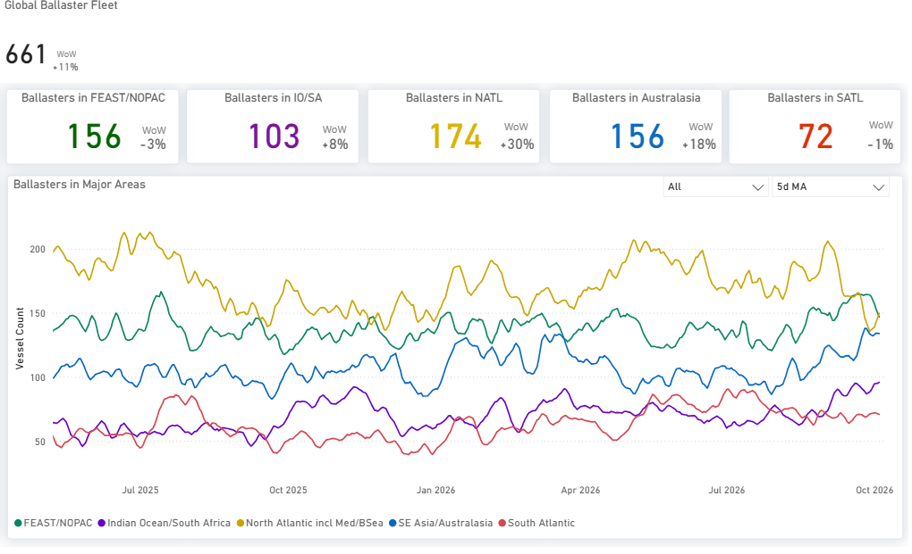

> **Figure 18: Handysize | Analysis**  
> **Interactive Data & Source:** [Signal Ocean Platform](https://www.thesignalgroup.com/weekly-market-monitor/weekly-dry-market-monitor-week-40-2026) | [Local Asset](file:///C:/Users/Dell/Github/Shipping/corpus/07-signal/images/6ac601493f048e68dd4f81cb_5ff86f7c.png)

*Figure 16: Handysize — Global ballaster fleet and regional positioning as of 2 Oct 2026 (Source: Signal).*

**Ballaster positioning.** The global Handysize ballaster count stood at 661 on 2 October. The North Atlantic including the Mediterranean and Black Sea held 174 vessels, the largest regional pool within the Handysize segment, with 156 in each of FEAST/NOPAC and Australasia, 103 in the Indian Ocean/South Africa and 72 in the South Atlantic. That concentration sits in the region where the week’s route gains were recorded. Across all four segments the largest single regional pool was 235 Capesize ballasters in Australasia.

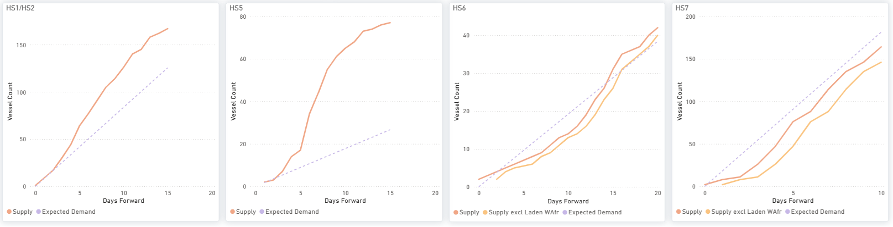

> **Figure 19: Handysize | Analysis**  
> **Interactive Data & Source:** [Signal Ocean Platform](https://www.thesignalgroup.com/weekly-market-monitor/weekly-dry-market-monitor-week-40-2026) | [Local Asset](file:///C:/Users/Dell/Github/Shipping/corpus/07-signal/images/6ac601493f048e68dd4f81c8_d7b5cbec.png)

*Figure 17: Handysize — HS1/HS2, HS5, HS6 & HS7 forward balance: cumulative Supply, Supply excluding laden vessels and Expected Demand over days forward (Source: Signal).*

**Supply/demand — market-position indicator.** For the week ending 1 October the provisional Handysize ratio stands at **0.91**. US Gulf grain rose 26% to 1.22 Mt over four weeks across 37 voyages against 29 previously, while total Gulf cargo was only 1.7% higher; European cargo activity was broadly flat and Baltic fertilizers fell 46%. The North Atlantic loading-to-open-DWT ratio eased from 0.76 to 0.73.

On the forward balance, total supply sits comfortably above expected demand on the HS1/HS2 and HS5 panels. On HS6 total supply runs below demand from about day two to day fourteen and then crosses above, finishing above demand at the end of the window. HS7 is the one  where total supply remains below demand throughout. Supply excluding laden is lower again on the HS6 and HS7 routes.

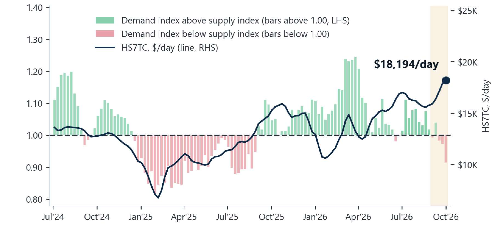

> **Figure 20: Handysize | Analysis**  
> **Interactive Data & Source:** [Signal Ocean Platform](https://www.thesignalgroup.com/weekly-market-monitor/weekly-dry-market-monitor-week-40-2026) | [Local Asset](file:///C:/Users/Dell/Github/Shipping/corpus/07-signal/images/6ac601493f048e68dd4f81ce_bf83dc41.png)

*Figure 18: Handysize — demand-to-supply ratio (LHS bars, four-week-average year-on-year growth) against the HS7TC weekly average (RHS line). Shaded band = latest five provisional weeks. The annotated $18,194/day is the settled weekly average for the week ending 1 October 2026 as supplied in the research input; it is not the 2 October closing assessment quoted above (Source: Signal; Baltic Exchange).*

## Overall Market Trend | Conclusions

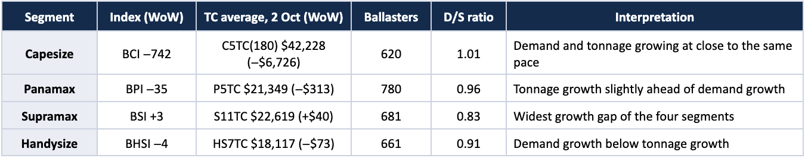

> **Figure 21: Overall Market Trend | Conclusions**  
> **Interactive Data & Source:** [Signal Ocean Platform](https://www.thesignalgroup.com/weekly-market-monitor/weekly-dry-market-monitor-week-40-2026) | [Local Asset](file:///C:/Users/Dell/Github/Shipping/corpus/07-signal/images/6ac60110a5edd3c4dcbcce20_Screenshot 2026-10-07 at 09.18.22.png)

*Table 1: Index levels and timecharter averages are the published closing assessments of 2 October 2026; ballaster counts are point-in-time on the same date. Demand-to-supply ratios are the weekly series for the week ending 1 October 2026 and are provisional. The weekly timecharter averages underlying that series are not reproduced here, as they cover a different period from the 2 October closing assessments (Source: Signal; Baltic Exchange).*

**Weekly comparison:** The week reversed the pattern of the previous fortnight. Capesize, which had led the market higher, gave back the whole of the prior week’s gain: the BCI fell 742 points to 5,042 and C5TC(180) $6,726 to $42,228/day, against a BDI down 278 points to 3,148. Panamax eased more gently, the BPI 35 points lower at 2,372 with every route in the basket down. The geared sizes held: the BSI rose three points to 1,789 and the BHSI fell four to 1,007, both within single digits of their 52-week highs. Open tonnage rose across all four segments to 780 Panamax, 681 Supramax, 661 Handysize and 620 Capesize vessels. Against the quarter-ago column every index remains higher, the BCI by 1,121 points, the BPI by 177, the BSI by 114 and the BHSI by 63.

**Key takeaway:** The week’s trade story and the week’s freight story are running on different clocks. China’s coal commitment is a 2027–28 undertaking, while the loading data behind this week’s spotlight record cargoes already shipped in 2026; the US Gulf coal trade has recovered from a very low 2025 base but still sits roughly half its 2024 level by both volume and destination share, and any Atlantic employment effect depends on how much of the programme loads on that coast.
