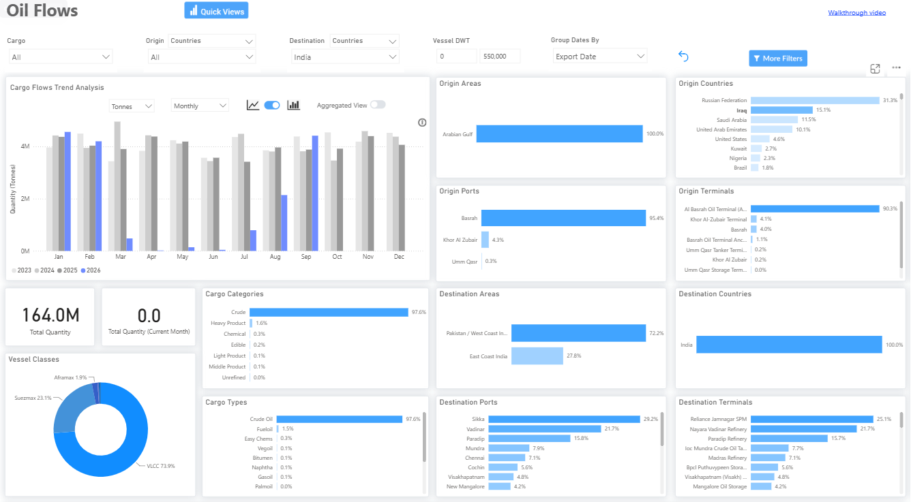
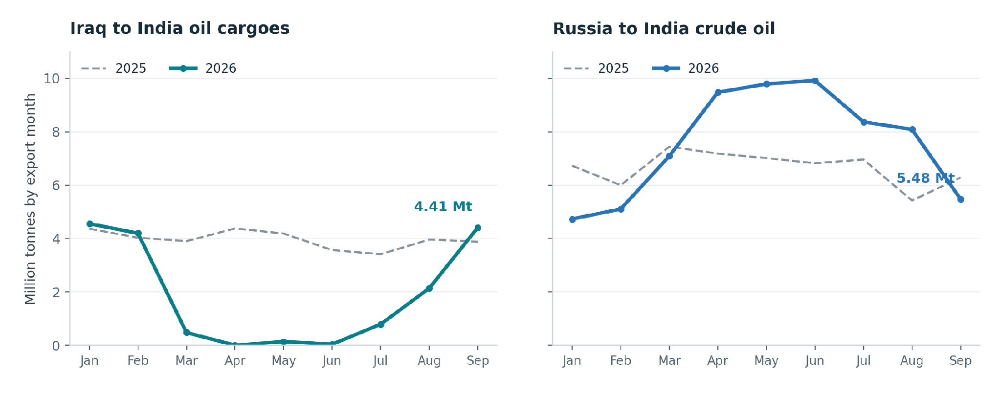
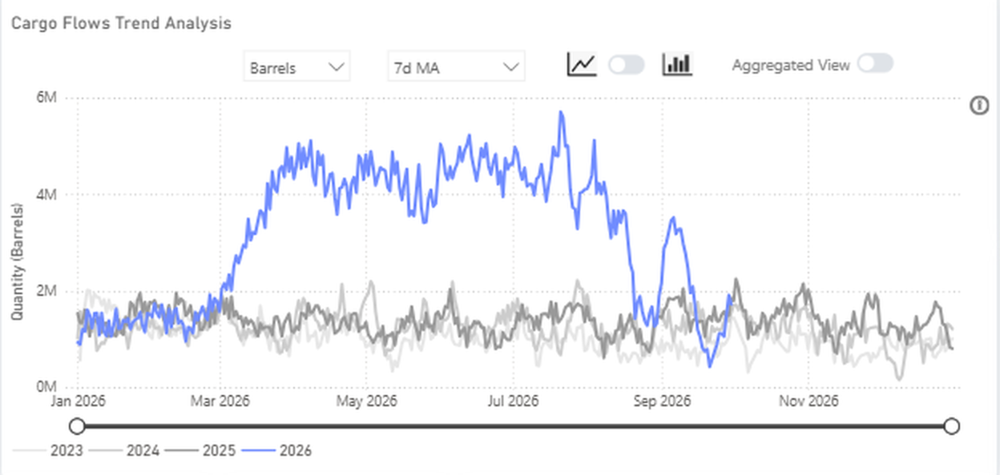
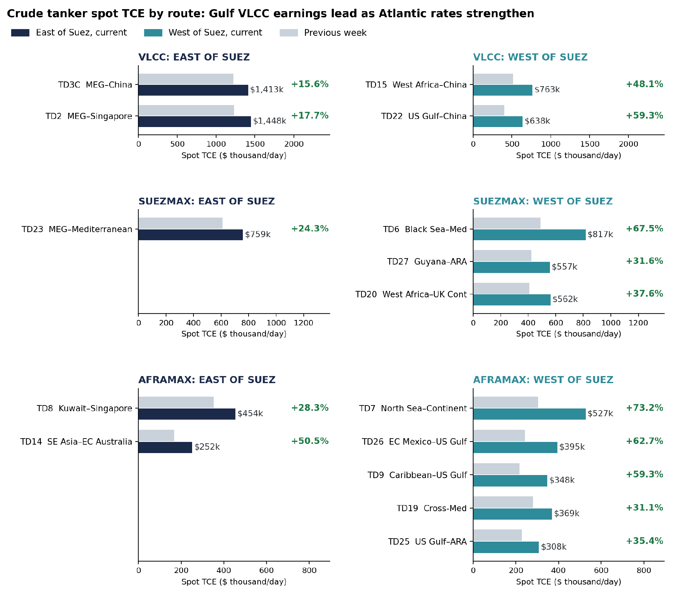
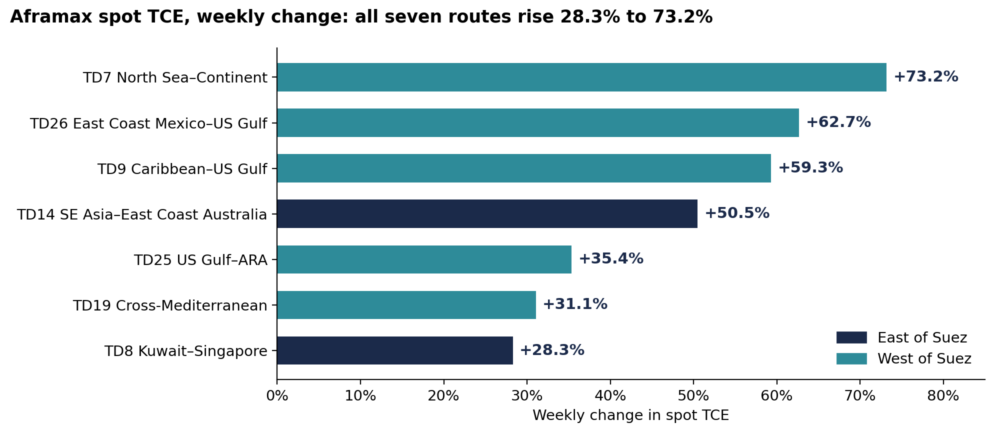
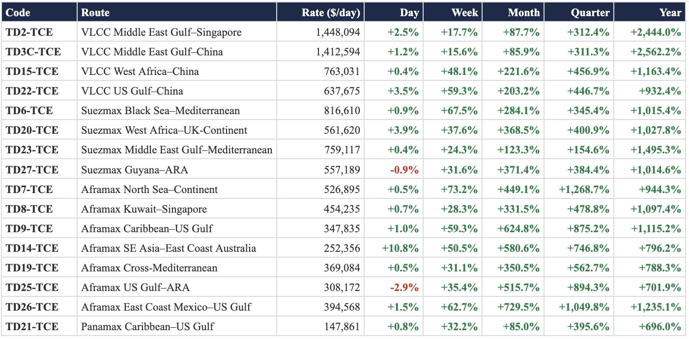
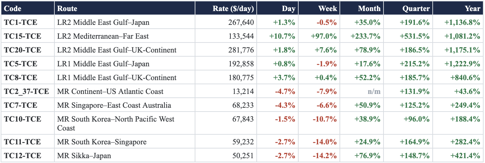
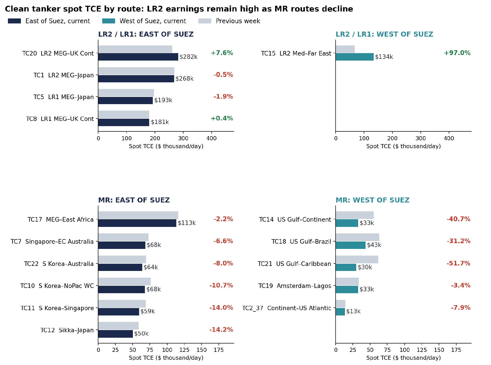
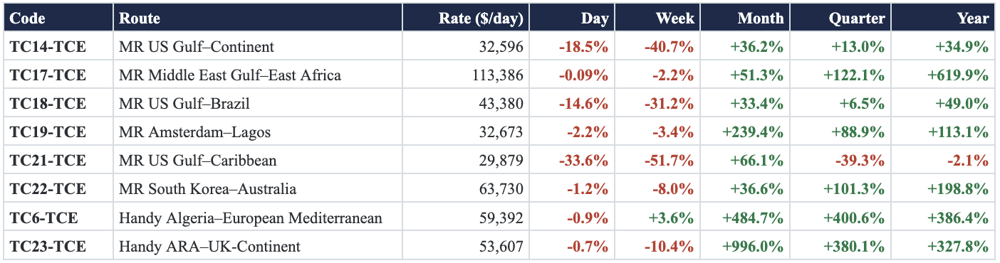
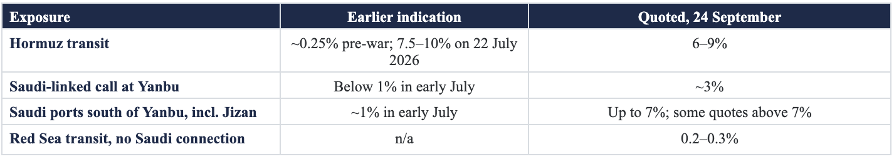

# Weekly Tanker Market Monitor: Week 40 2026

*Published on 07 September 2026*

## Spotlight of the Week - India and the Widening Tanker Freight Squeeze

This week’s Tanker Market Monitor tracks India’s return to Iraqi supply as Gulf oil movements recover amid persistent shipping risk. Yanbu is rebuilding its role as an export outlet, but insurance costs and the onward Red Sea voyage remain important constraints. At the same time, freight strength is spreading through Suezmax and Aframax markets in both the East and West.

> **Figure 1: Spotlight of the Week - India and the Widening Tanker Freight Squeeze**  
> **Interactive Data & Source:** [Signal Ocean Platform](https://www.thesignalgroup.com/weekly-market-monitor/weekly-tanker-market-monitor-week-40-2026) | [Local Asset](file:///C:/Users/Dell/Github/Shipping/corpus/07-signal/images/6ac8d9f4e0cc34638a61cb1f_e1527448.png)

**Dashboard view.** *Signal Oil Flows, Iraq to India by export date: monthly volumes 2023–2026, vessel classes, discharge ports and terminals (selection January 2022–September 2026).*

Iraqi oil shipments to India **more than doubled in September to 4.41 million tonnes**, up 106.3% month on month and 13.7% year on year, according to Signal flow data. Russian crude shipments to India **fell** **32.3%** **to** **5.48** **million** **tonnes**, down 12.9% year on year. In the freight market, the latest weekly assessment shows **all seven Aframax routes in the basket up 28–73%**, while Atlantic Suezmax earnings rose 32–38%.

> **Figure 2: Spotlight of the Week - India and the Widening Tanker Freight Squeeze**  
> **Interactive Data & Source:** [Signal Ocean Platform](https://www.thesignalgroup.com/weekly-market-monitor/weekly-tanker-market-monitor-week-40-2026) | [Local Asset](file:///C:/Users/Dell/Github/Shipping/corpus/07-signal/images/6ac8d9f4e0cc34638a61cb28_d2f77941.png)

**Chart 1.** *Monthly shipments to India by export date, January–September, 2025 vs 2026. Iraq covers all oil cargoes; Russia covers crude oil.*

*Source: Signal; flow data through 30 September 2026.*

**MARKET SIGNAL:  Iraqi barrels returned to India in September above their January–February pace, while Russian crude loadings for India eased. Gulf VLCC routes still carry the highest earnings in the crude basket, while the largest weekly gains are West of Suez and across the Aframax routes.**

## India Takes on More Freight Responsibility

Iraqi shipments to India almost stopped between March and July, falling to 5,000 tonnes in April and 42,000 tonnes in June. The September total of 4.41 million tonnes is just above the January–February average of 4.38 million tonnes. Russian crude shipments to India ran between 7.1 and 9.9 million tonnes a month from March to August before easing to 5.48 million tonnes in September.

Indian Oil, Reliance, Bharat Petroleum and HPCL-Mittal Energy have bought Iraqi crude on **free-on-board terms** and are hiring tankers for Persian Gulf cargoes. Until recently, Indian refiners had avoided arranging their own tanker voyages through Hormuz and relied on Gulf producers and international energy companies to deliver the crude, paying a premium for that service. Under FOB purchases, refiners arrange the vessel and onward transport, bringing tanker availability and voyage costs directly into procurement. Signal’s flow records show that Iraq–India cargoes have moved mainly on VLCCs, while Russia–India crude has moved mainly on Aframaxes and Suezmaxes.

## Yanbu Recovers But Onward Transit Remains Exposed

Crude loadings at Yanbu stopped after Saudi Aramco shut the East–West pipeline on 11 September following drone attacks that Saudi officials blamed on Iraqi militias. The pipeline restarted on 22 September, with loadings resuming in the following days. Aramco then issued its October loading schedule to customers. On 6 October, Energy Minister Prince Abdulaziz bin Salman said pipeline flows had reached **5.8 million b/d**, against a capacity of 7 million b/d. These figures measure pipeline throughput, not seaborne exports. Monthly averages of Signal’s seven-day moving average of Yanbu seaborne exports ranged from **4.19 to 4.65 million b/d during April–July**, compared with 1.2–1.5 million b/d in the same months of 2025. In September, the seven-day average fell from 3.52 million b/d on 6 September to **0.43 million b/d on 21 September**. It recovered to 1.72 million b/d by 30 September, but remained **51.1% below the 6 September level**, showing how far loadings still had to recover at month-end.

> **Figure 3: Yanbu Recovers But Onward Transit Remains Exposed**  
> **Interactive Data & Source:** [Signal Ocean Platform](https://www.thesignalgroup.com/weekly-market-monitor/weekly-tanker-market-monitor-week-40-2026) | [Local Asset](file:///C:/Users/Dell/Github/Shipping/corpus/07-signal/images/6ac8d9f4e0cc34638a61cb2b_82b8da94.png)

**Chart 2.** *Yanbu oil exports to all destinations, seven-day moving average of daily exports, barrels/day, 2023–2026.*

*Source: Signal; export data through 30 September 2026. The series measures seaborne exports, not pipeline throughput.*

On 1 October, a projectile struck inside Yanbu port, causing a fire and a temporary suspension of loading with the reporting tanker before operations resumed. Southbound cargoes from Yanbu to India and Asia still pass Bab el-Mandeb, where UKMTO reported multiple explosions close to a tanker 60 nautical miles south of Al Mukha on 4 October.

## Opec+ and Gulf Supply

OPEC+’s decision to **keep November production targets at September levels** puts the focus on how much supply producers can restore within existing allowances. The seven participating countries, Saudi Arabia, Russia, Iraq, Kuwait, Kazakhstan, Algeria and Oman, agreed on 4 October to maintain those targets and reaffirmed their commitment to compliance. Their next monthly review on **1 November** will provide another opportunity to assess the recovery, with infrastructure repairs and export access remaining central to the supply outlook.

The August figures show the scale of the recovery still required. Combined production reached approximately **25 million b/d**, increasing **630,000 b/d from July**, but remained about **5 million b/d below February’s pre-war level**. The monthly improvement therefore restored only part of the lost supply. Separately, approximately **2 million b/d of group-wide production cuts** remain in place under the wider framework extending through 31 December 2026. **Unchanged targets still leave room for actual output to increase where production remains below its allowance**, making the pace of operational recovery important to the volumes reaching the market.

The Joint Ministerial Monitoring Committee’s 4 October assessment reinforces this operational focus. Its warning that damaged energy facilities require substantial time and expenditure to restore points to a recovery that could remain uneven, while continued threats to maritime routes leave export programmes exposed to interruption. For the tanker market, **our assessment is that sustained loading programmes and reliable transit conditions will determine how the production recovery translates into vessel employment**. The committee reviewed July and August production data and retained the authority to convene additional meetings or request a full ministerial meeting, preserving flexibility should supply conditions change.

## Freight: Gulf VLCC Earnings Lead as Atlantic Rates Strengthen

**VLCC:** Gulf VLCC routes carry the highest earnings in the crude basket. **MEG–Singapore (TD2) stands at $1,448,094/day**, up 17.7% week on week, and MEG–China (TD3C) at $1,412,594/day, up 15.6%. The strongest VLCC gains are West of Suez: **US Gulf–China (TD22) rose 59.3% to $637,675/day** and West Africa–China (TD15) 48.1% to $763,031/day. In the Suezmax market, **Black Sea–Mediterranean (TD6) rose 67.5% to $816,610/day**, above MEG–Mediterranean (TD23) at $759,117/day, up 24.3%. Atlantic Suezmax earnings also firmed: West Africa–UK Continent (TD20) rose 37.6% to $561,620/day and Guyana–ARA (TD27) 31.6% to $557,189/day.

> **Figure 4: Freight: Gulf VLCC Earnings Lead as Atlantic Rates Strengthen**  
> **Interactive Data & Source:** [Signal Ocean Platform](https://www.thesignalgroup.com/weekly-market-monitor/weekly-tanker-market-monitor-week-40-2026) | [Local Asset](file:///C:/Users/Dell/Github/Shipping/corpus/07-signal/images/6ac8d9f4e0cc34638a61cb22_9dc0a8e7.png)

**Chart 3.** *Crude tanker spot TCE by route and vessel class, East vs West of Suez, current vs previous week ($/day).*

*Freight/TCE: Signal, latest weekly spot assessment (CSV export of 9 October 2026).*

Aframax earnings rose across all seven routes in the basket, with weekly gains ranging from 28.3% to 73.2%. **North Sea–Continent (TD7) led at $526,895/day, up 73.2%**, followed by East Coast Mexico–US Gulf (TD26), up 62.7% to $394,568/day, and Caribbean–US Gulf (TD9), up 59.3% to $347,835/day. Strength also extended East of Suez: SE Asia–East Coast Australia (TD14) rose 50.5% to $252,356/day, while Kuwait–Singapore (TD8) gained 28.3% to $454,235/day. Charterers are splitting suitable cargoes into smaller parcels as larger ships become harder to secure. Signal data show the US Gulf Aframax list falling from 53 to 34 vessels between 28 September and 2 October, a decline of 35.8%.

> **Figure 5: Freight: Gulf VLCC Earnings Lead as Atlantic Rates Strengthen**  
> **Interactive Data & Source:** [Signal Ocean Platform](https://www.thesignalgroup.com/weekly-market-monitor/weekly-tanker-market-monitor-week-40-2026) | [Local Asset](file:///C:/Users/Dell/Github/Shipping/corpus/07-signal/images/6ac8d9f4e0cc34638a61cb2e_617edb9b.png)

**Chart 4.** *Aframax spot TCE, weekly change by route; navy marks the eastern routes, teal the western routes.*

*Freight/TCE: Signal, latest weekly spot assessment (CSV export of 9 October 2026).*

## Spot Rate Summary: Dirty TCE, VLCC, Suezmax, Aframax and Panamax

> **Figure 6: Spot Rate Summary: Dirty TCE, VLCC, Suezmax, Aframax and Panamax**  
> **Interactive Data & Source:** [Signal Ocean Platform](https://www.thesignalgroup.com/weekly-market-monitor/weekly-tanker-market-monitor-week-40-2026) | [Local Asset](file:///C:/Users/Dell/Github/Shipping/corpus/07-signal/images/6ac8d8ca7f1d3e344fef3795_Screenshot 2026-10-09 at 13.04.31.png)

> **Figure 7: Spot Rate Summary: Dirty TCE, VLCC, Suezmax, Aframax and Panamax**  
> **Interactive Data & Source:** [Signal Ocean Platform](https://www.thesignalgroup.com/weekly-market-monitor/weekly-tanker-market-monitor-week-40-2026) | [Local Asset](file:///C:/Users/Dell/Github/Shipping/corpus/07-signal/images/6ac8d8d837139c876c127e28_Screenshot 2026-10-09 at 13.04.43.png)

*Freight/TCE: Signal, latest weekly spot assessment (CSV export of 9 October 2026), $/day. All changes are percentages. n/m means the prior-period TCE is non-positive, so a percentage comparison is not meaningful.*

The clean market shows a widening divergence between LR2 and MR earnings. East of Suez, **MEG–UK Continent (TC20) rose 7.6% to $281,776/day**, while MEG–Japan (TC1) remained elevated at $267,640/day despite a 0.5% weekly decline. **Mediterranean–Far East (TC15) recorded the strongest LR2 gain, rising 97.0% to $133,544/day.** LR1 performance was mixed, with MEG–Japan down 1.9% and MEG–UK Continent up 0.4%.

**All 11 MR routes in the basket declined week on week.** The sharpest falls were in the US Gulf: **US Gulf–Caribbean (TC21) dropped 51.7% to $29,879/day**, US Gulf–Continent (TC14) fell 40.7% to $32,596/day, and US Gulf–Brazil (TC18) declined 31.2% to $43,380/day. These declines qualify the wider tanker outlook: crude-market strength is not being matched across smaller clean tankers. LR2 switching from clean into dirty trading has already added capacity to the Aframax market.

> **Figure 8: Spot Rate Summary: Dirty TCE, VLCC, Suezmax, Aframax and Panamax**  
> **Interactive Data & Source:** [Signal Ocean Platform](https://www.thesignalgroup.com/weekly-market-monitor/weekly-tanker-market-monitor-week-40-2026) | [Local Asset](file:///C:/Users/Dell/Github/Shipping/corpus/07-signal/images/6ac8d9f4e0cc34638a61cb25_b789b09c.png)

**Chart 5.** *Clean tanker spot TCE by route, LR2/LR1 and MR, East vs West of Suez, current vs previous week ($/day).*

*Freight/TCE: Signal, latest weekly spot assessment (CSV export of 9 October 2026). Labels show the current rate and the weekly change.*

## Spot Rate Summary: Clean TCE, Lr2, Lr1, Mr and Handy

> **Figure 9: Spot Rate Summary: Clean TCE, Lr2, Lr1, Mr and Handy**  
> **Interactive Data & Source:** [Signal Ocean Platform](https://www.thesignalgroup.com/weekly-market-monitor/weekly-tanker-market-monitor-week-40-2026) | [Local Asset](file:///C:/Users/Dell/Github/Shipping/corpus/07-signal/images/6ac8d8ff7f1d3e344fef4f77_Screenshot 2026-10-09 at 13.04.56.png)

*Freight/TCE: Signal, latest weekly spot assessment (CSV export of 9 October 2026), $/day. All changes are percentages. n/m means the prior-period TCE is non-positive, so a percentage comparison is not meaningful.*

**Hormuz Freight Watch: Security Sources Report Highest Weekly Attack Count**

**UPDATED POSITION:  Maritime security sources recorded at least 12 attacks on oil, LNG and LPG tankers around the Strait of Hormuz between 28 September and 5 October, the highest for any week since the war began on 28 February. Separately, IMO data show nine incidents for the same week; the previous IMO high was eight, in the week of 13 July.**

Incident chronology covers reports through 7 October 2026.

**1 October:** The Kuwait-flagged VLCC *Kazimah III* was struck by a projectile while transiting Hormuz, following the reported attack on the KOTC VLCC *Al Funtas* on 28 September. A separate projectile struck inside Yanbu port, briefly halting loading.

**4 October:** The newly delivered Aframax/LR2 *Lipsi* was disabled and left drifting after a projectile struck its engine room in Hormuz; the crew was reported safe.

**5 October:** UKMTO reported that an inbound tanker 11 nautical miles north of Khasab turned back after being hailed by the IRGC and told to turn back or be targeted.

**6 October:** India’s Ministry of External Affairs said 12 crew were injured when the Panama-flagged tanker *On Peace* was struck by a projectile while transiting Hormuz.

**7 October:** UKMTO reported that a tanker had been struck by multiple projectiles about 51 nautical miles north of Madinat ash Shamal, Qatar, and reported casualties. Maritime security reporting identified the vessel as the oil/chemical tanker *Acers*.

## Reported War-Risk Quotations, 24 September 2026

Quoted war-risk premiums for **Saudi-linked tankers calling at Yanbu were around 3% of vessel value**, from below 1% in early July, after London’s marine insurance market designated the southern Red Sea as high risk following Houthi attacks near Bab el-Mandeb. **Hormuz transits were quoted at 6–9%**. For Saudi ports further south, including Jizan, quotes could reach 7%, and McGill and Partners reported some quotations above 7% for calls south of Yanbu. Tankers crossing the Red Sea without a Saudi connection typically paid 0.2–0.3%.

## Exposure

> **Figure 10: Exposure**  
> **Interactive Data & Source:** [Signal Ocean Platform](https://www.thesignalgroup.com/weekly-market-monitor/weekly-tanker-market-monitor-week-40-2026) | [Local Asset](file:///C:/Users/Dell/Github/Shipping/corpus/07-signal/images/6ac8d9113c97f013df25cb13_Screenshot 2026-10-09 at 13.05.05.png)

*Quoted war-risk premiums as a percentage of vessel value. Sources: Quotations reported 24 September 2026;*

Reported war-risk cover typically applied to seven-day periods, with quotations reviewed every 24 hours. On a vessel valued at $100 million, the quoted percentages would imply approximately **$3 million for a Saudi-linked Yanbu call and $6–9 million for a Hormuz transit** for the quoted cover period. Actual terms and agreed premiums vary by vessel and voyage. Sources reported in September that the US military had provided some aerial support to ships transiting Hormuz, while in the Red Sea the EU’s Operation ASPIDES provides maritime protection, with its mandate extended to 28 February 2027. The Saudi cabinet has appointed Saudi Re to lead the country’s marine war-risk insurance pool.

## Takeaway

The recovery in Iraqi shipments to India is restoring cargo demand, while refiners’ move to charter tankers for FOB purchases makes securing ships and managing voyage costs a more direct part of procurement. Saudi Arabia’s pipeline recovery also supports cargo availability, although interrupted Yanbu loadings and elevated war-risk quotations underline the continuing uncertainty around export schedules. Together, these developments suggest that recovering volumes can sustain vessel demand before operating conditions improve sufficiently to ease freight costs.

Freight strength is also becoming more geographically widespread. Gulf VLCC routes retain the highest earnings, but the sharper gains in western VLCC and Atlantic Suezmax/Aframax markets suggest that support for crude tanker rates extends beyond the Gulf. Our firm near-term view applies most clearly to crude tankers, while all MR routes in the basket weakened week on week. Recovering loading programmes could add demand while delays and restricted vessel participation continue to constrain effective supply. A sustained rebuilding of prompt vessel lists, supported by shorter waiting and transfer times and more owners accepting affected voyages, would provide clearer evidence that this pressure is easing.
