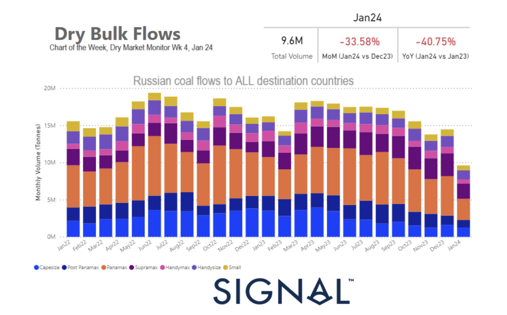

# Weekly Dry Market Monitor - Week 04, 2024

*Published on 26 January 2024*

## Significant Decrease in the Monthly Volume of Russian Coal Flows to China with the Start of January

> **Figure 1: 65b391c26a557f1a295a8567 Screenshot 2024 01 26 at 10.50.27**  
> **Interactive Data & Source:** [Signal Ocean Platform](https://www.thesignalgroup.com/weekly-market-monitor/dry-week-04-2024) | [Local Asset](file:///C:/Users/Dell/Github/Shipping/corpus/07-signal/images/65b391c26a557f1a295a8567_Screenshot 2024-01-26 at 10.50.27.png)

The dry freight market in the third week of January continued to exhibit a persistent weakening trend in the Capesize segment. Concurrently, there was a notable surge in the number of ballasters in the Southeast Africa region as we approach the month's end. Analysing the demand side and the growth in tonne days reveals a pronounced downward trajectory across all vessel size categories. This, coupled with the rising count of ballasters, is expected to exert further pressure on the freight market.

Examining the significant vessel size segments, an intriguing observation (as depicted in the attached image) is the declining trend initiated in January of the current year regarding the volume of Russian coal shipments to China. This stands in contrast to the peaks witnessed in January of both 2022 and 2023. While the exact percentage of decrease is yet to be determined by month-end, it appears that Russia is ceding ground to its Asian coal customers, with China increasingly turning to Australian coal as an alternative.

For the latest updates and insights, make sure to visit the [Signal Ocean Newsroom](https://www.thesignalgroup.com/newsroom) website page. Click [here to request a demo](https://www.thesignalgroup.com/request-demo?utm\_source=oceanhome&utm\_medium=website&utm\_campaign=demo).

For subscription to our FREE weekly market trends email, please contact us: research@thesignalgroup.com

- Republishing is allowed with an active link to the source
