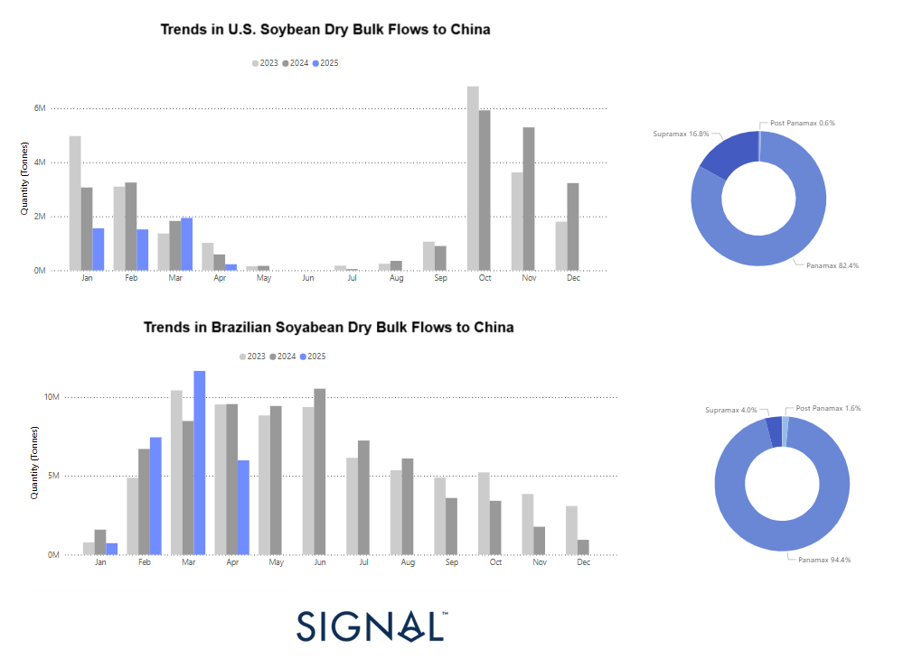

# Weekly Dry Market Monitor: Week 16, 2025

*Published on 16 April 2025*

## This Week’s Highlight Focuses on the Shifting Trends in Soybean Dry Bulk Flows From Brazil and the U.s. to China, Following the Latest Round of Tariffs Imposed Amid Escalating Trade Tensions. We Had Already Anticipated These Changes in Agricultural Trade Dynamics Innovember 2024, Following the Outcome of the U.s. Elections.

> **Figure 1: Https://app.signalocean.com/dry/dynamic/drybulkflows-Downloadable**  
> *https://app.signalocean.com/dry/dynamic/drybulkflows-downloadable*  
> **Interactive Data & Source:** [Signal Ocean Platform](https://www.thesignalgroup.com/weekly-market-monitor/dry-week-16-2025) | [Local Asset](file:///C:/Users/Dell/Github/Shipping/corpus/07-signal/images/67ff74218dd3c0d5f0d00e4c_AD_4nXe5TDIyH-IPcC_H6L8MbhNs9ptXba8swnMUC6yZGDn-WlRKxLlQb3m4Lh3p95vMA2qoWKvPh5sZOlazzQd5LNB2RvLBnTJ_S9WYgMihe5rPTA8W7PckE1XY7A5H1Yes0krnLSgd.png)

## Shift in Global Soybean Trade Flows

Voyage data from the Signal Ocean Platform reveals a clear structural shift in the global soybean trade, underscoring China’s increasing reliance on Brazilian imports. In recent years, Brazil has steadily emerged as China’s primary soybean supplier—a trend closely tied to broader macroeconomic dynamics, notably the ongoing trade tensions between the United States and China. Brazil’s competitive edge stems from record harvests, favorable pricing, and a lack of trade barriers, positioning it as a more dependable and cost-effective source for meeting China's growing soybean demand.

## U.s. Soybean Exports: Declining Share and Strategic Setback

U.S. soybean exports to China have traditionally adhered to a clear seasonal pattern, with peak shipments occurring in the first and last quarters of each year. However, this trend is showing signs of disruption. In March 2025, export volumes plummeted to approximately 2 million tonnes—significantly lower than during the same periods in 2023 and 2024. This decline highlights the enduring consequences of the U.S.-China trade war. As tariffs and geopolitical tensions continued, Chinese importers increasingly turned to alternative suppliers, especially Brazil. The outcome has been a persistent decrease in U.S. market share, leaving American farmers and agribusinesses struggling with diminished demand, decreasing prices, and increasing financial pressure.

## Brazil’s Export Surge: A Geoeconomic Windfall

In sharp contrast, Brazilian soybean exports to China have surged in 2025, with volumes in March and April exceeding 10 million tonnes—well above levels recorded in previous years. This growth reflects Brazil’s alignment with China’s seasonal demand and highlights its capacity to step in as U.S. exports falter. Sustained high export volumes into mid-year further reinforce Brazil’s emergence as a reliable and dominant supplier. More than just a trade shift, this trend signals deeper economic integration between China and Brazil, solidifying Brazil’s strategic role in global agricultural supply chains and reshaping the dynamics of the soybean market.

For the latest updates and insights, make sure to visit the [Signal Ocean Newsroom](https://www.thesignalgroup.com/newsroom) page & subscribe to weekly reports. Click [here to request a demo](https://www.thesignalgroup.com/request-demo?utm\_source=oceanhome&utm\_medium=website&utm\_campaign=demo). Check out our [previous week's report here](https://www.thesignalgroup.com/weekly-market-monitor/dry-week-15-2025).

For subscription to our FREE weekly market trends email, please contact us: research@thesignalgroup.com

-Republishing is allowed with an active link to the source
