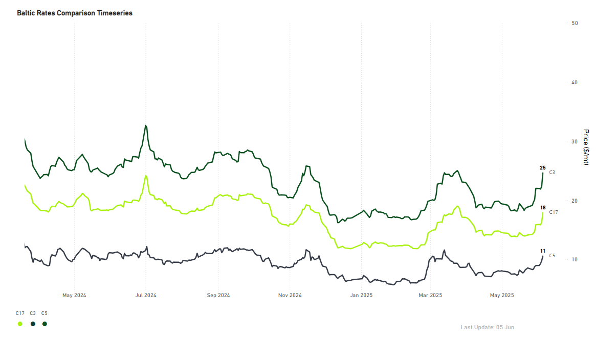
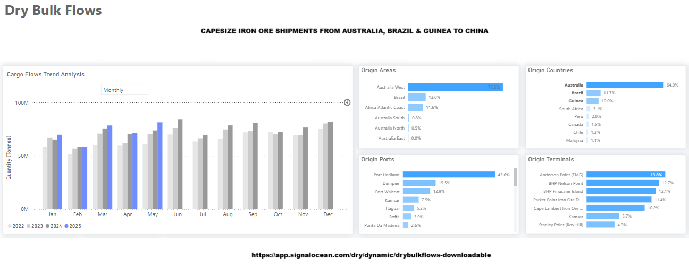
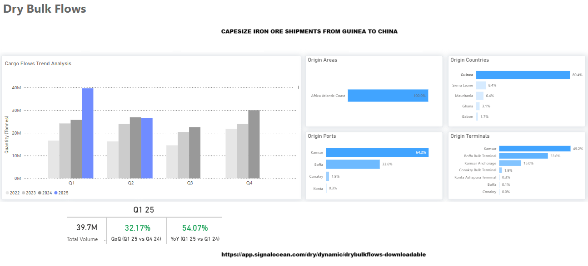
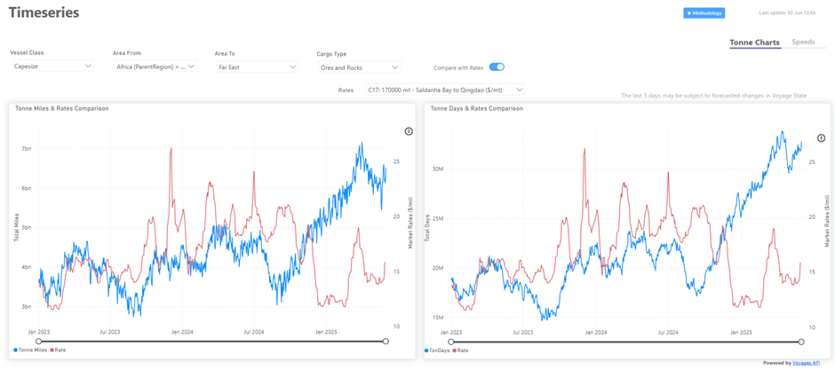

# Weekly Dry Market Monitor: Week 23, 2025

*Published on 05 June 2025*

> **Figure 1: Heading**  
> **Interactive Data & Source:** [Signal Ocean Platform](https://www.thesignalgroup.com/weekly-market-monitor/dry-week-23-2025) | [Local Asset](file:///C:/Users/Dell/Github/Shipping/corpus/07-signal/images/6842e83ba0c22fe83c737847_AD_4nXc1ZRCp8OW81JiYrXqKmNDnjWf-tiXP3znqPi_vRajcfk_VZUU3WmQdVfgVLvEGXPq5GCk3Mb9-f5Vi3Xph-GB-oDEytbqRYmr7vTAcD_y0a7e_cKTIEr2Xgiyiux2OH04jaVUT6g.png)

This week's Market Monitor highlights Capesize freight market trends across the C3, C5, and C17 routes, as the Baltic Dry Index (BDI) gains momentum, driven primarily by the strong performance of the Capesize segment. A key indicator of current market sentiment appears to be the slight tightening in the ballaster count in both the North and South Atlantic, coupled with steady Chinese iron ore demand. Meanwhile, iron ore supply from Guinea is expected to rise, alongside continuing shipments from Australia and Brazil.

## Iron Ore Demand Trends | Focus on China

Amid indications of a dip in iron ore flows to China, May concluded with a total volume of Capesize iron ore shipments from Australia, Brazil, and Guinea of approximately $82 million (mt), an increase of 14% compared to the previous month. February appears to be the month with the lowest volume, at around $59 million (mt), which is 30% lower than the end of May. In contrast, the end of May exceeded the volumes recorded at the end of March, which were about $78.5 million (mt).

> **Figure 2: Iron Ore Demand Trends | Focus on China**  
> **Interactive Data & Source:** [Signal Ocean Platform](https://www.thesignalgroup.com/weekly-market-monitor/dry-week-23-2025) | [Local Asset](file:///C:/Users/Dell/Github/Shipping/corpus/07-signal/images/6842e83ba0c22fe83c737850_AD_4nXcW0_ubUoMUMjcgvSLOpex_mhFXWYGMcaodN-j2lswrVlGIVwz-fS562Pqm4rsOy8bVsqI19Z79NaMzrrIn6bkMC8mtn72zHHtXPUdLLsGlTe6JeoxhW50XRguGUsMzgPCk_Q550Q.png)

Meanwhile,[iron ore traders](https://www.reuters.com/world/china/iron-ore-pessimism-subsides-despite-looming-simandou-supply-2025-05-30/?utm\_source=chatgpt.com) are said to have recently revised up their bearish-case pricing scenarios to between $80 and $85 per ton versus $75 or lower at the start of the year. Market expectations underline that medium-term demand for iron ore should remain firm because China's young fleet of blast furnaces will require iron ore for at least another decade, said analysts at the flagship Singapore International Ferrous Week Conference at the end of May.

## Upcoming Iron Ore Supply: The Simandou Project Remains a Long-Term Downside Risk for Prices

The Simandou iron ore project in Guinea, one of the world's largest undeveloped high-grade iron ore reserves, is expected to begin shipments in November 2025. When fully operational, the mine could supply up to 120 million metric tons annually. However, elevated operational risks persist due to political instability and unresolved disputes with the Guinean government.

> **Figure 3: 6842e83ba0c22fe83c73784a Ad 4nxeqizhodorytrkbrjqnagw8mqpmojdjw3n7r1 Gtdztnlbqlyajn3wbrxs2at Lak4ofbtej8g41pcpnpx32j4avsyupqus4potz7yyszrnyvbbeqnx27ywe Uswtg77q6r7rhu0q**  
> **Interactive Data & Source:** [Signal Ocean Platform](https://www.thesignalgroup.com/weekly-market-monitor/dry-week-23-2025) | [Local Asset](file:///C:/Users/Dell/Github/Shipping/corpus/07-signal/images/6842e83ba0c22fe83c73784a_AD_4nXeqiZHOdoryTrKBrjqnagw8mqpMojdJw3n7R1-GtDZTnLbqlyAjN3WBrxS2AT_LaK4ofBTEj8G41PcPNPx32J4AVsYupqus4POTz7YySzRNYVbbEQnx27Ywe-USWtG77Q6r7RHU0Q.png)

## Ton-Mile Demand From Africa to the Far East

> **Figure 4: Ton-Mile Demand From Africa to the Far East**  
> **Interactive Data & Source:** [Signal Ocean Platform](https://www.thesignalgroup.com/weekly-market-monitor/dry-week-23-2025) | [Local Asset](file:///C:/Users/Dell/Github/Shipping/corpus/07-signal/images/6842e83ba0c22fe83c73784d_AD_4nXfYBdzETf0hsM7ONV7BD-8BrnP-kuz7_MO1Q5Br9vgpGplvNtoLe_5Cvaqmr0v6qBMzf3JNRb0BuLY_PMQQMc0ttGlgzs7J3MYb3jGc1WBjEQdxH8Skrp0p3PUqJMMq-i_eaBdoBg.png)

Increasing ton-mile demand is evident on the Africa-Far East route, fueled by steady iron ore shipments from Africa's Atlantic Coast to China. This development may bolster earnings on the C17 route and strengthen positive market sentiment in the Pacific.

For the latest updates and insights, make sure to visit the [Signal Ocean Newsroom](https://www.thesignalgroup.com/newsroom) page & subscribe to weekly reports. Click [here to request a demo](https://www.thesignalgroup.com/request-demo?utm\_source=oceanhome&utm\_medium=website&utm\_campaign=demo). Check out our [previous week's report here](https://www.thesignalgroup.com/weekly-market-monitor/dry-week-20-2025).

For subscription to our FREE weekly market trends email, please contact us: research@thesignalgroup.com

-Republishing is allowed with an active link to the source
