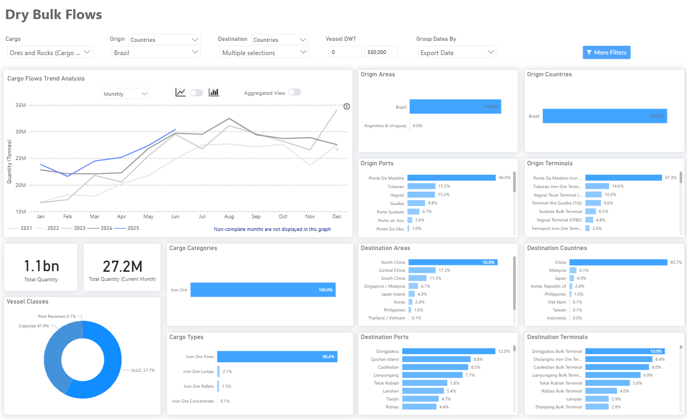

# Weekly Dry Market Monitor: Week 30, 2025

*Published on 23 July 2025*

## Spotlight on Brazilian Iron Ore Shipments to the Far East

> **Figure 1: Https://app.signalocean.com/dry/dynamic/drybulkflows-Downloadable**  
> *https://app.signalocean.com/dry/dynamic/drybulkflows-downloadable*  
> **Interactive Data & Source:** [Signal Ocean Platform](https://www.thesignalgroup.com/weekly-market-monitor/dry-week-30-2025) | [Local Asset](file:///C:/Users/Dell/Github/Shipping/corpus/07-signal/images/68814dfb3fd04ab6cf8759d6_AD_4nXdORY9toxublWDigKliwwR7W8QpG4wmxlnJfkfrXmdFNaFIAglSySteQb_X0fu7hy4s37kLIQnJ1qKHtnvZdUstLd1irro6x1Tf7vQz0qxGh_GqKozhZQ2ocx_xmF9P1Euovg4G3Q.png)

This week’s ***Chart Monitor*** highlights a continued upward trend in Brazilian iron ore shipments. Since the end of Q1, each month's closing volume has exceeded levels seen in previous years. The first quarter of 2025 closed with approximately 70 million tons shipped, followed by over 80 million tons in Q2. These figures are notably higher than the lows recorded in 2021—around 50 million tons in Q1 and 67 million tons in Q2.

Looking ahead, recent news from Vale’s Q2 production report adds to the bullish sentiment. The Brazilian miner reported 83.6 million metric tons of iron ore output in Q2, a 3.7% year-on-year increase. The growth was largely attributed to a new second-quarter production record at the S11D mine in northern Brazil, Vale’s largest operation, and a strong performance at the Brucutu mine in the southeast. With production ramping up and iron ore flows increasing, we are likely to see continued upward pressure on the C3 route in the coming weeks, as tightening vessel supply and rising cargo volumes converge to support a firmer freight market.

For the latest updates and insights, make sure to visit the [Signal Ocean Newsroom](https://www.thesignalgroup.com/newsroom) page & subscribe to weekly reports. Click [here to request a demo](https://www.thesignalgroup.com/request-demo?utm\_source=oceanhome&utm\_medium=website&utm\_campaign=demo). Click here to see the[previous dry bulk weekly](https://www.thesignalgroup.com/weekly-market-monitor/tanker-week-28-2025) report.

For subscription to our FREE weekly market trends email, please contact us: research@thesignalgroup.com

-Republishing is allowed with an active link to the source
