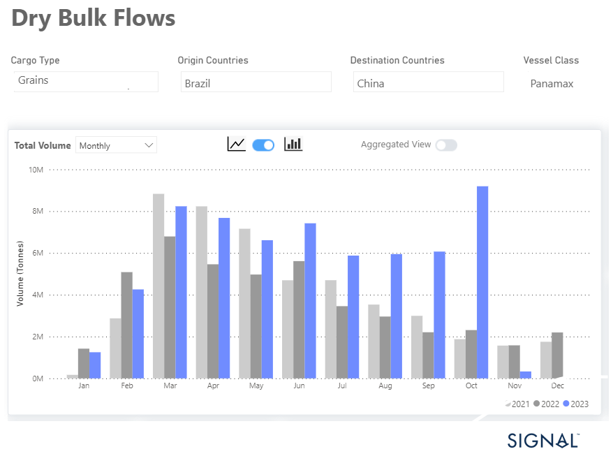

# Weekly Dry Market Monitor - Week 43, 2023

*Published on 25 October 2023*

## Monthly Tonnes of Grain From Brazil to China with Panamax Vessel Class Surpassed Volumes of the Previous Years

> **Figure 1: Data Source: The Signal Ocean Platform Data**  
> *Data Source: The Signal Ocean Platform Data*  
> **Interactive Data & Source:** [Signal Ocean Platform](https://www.thesignalgroup.com/weekly-market-monitor/dry-week-43-2023) | [Local Asset](file:///C:/Users/Dell/Github/Shipping/corpus/07-signal/images/6538d426ab579fe78d14b3c3_dry bulk grain.png)

The last week of October witnessed a downward trend in the Capesize freight market momentum, while the smaller vessel segments experienced a relatively flat momentum. Meanwhile, the grain flows from Brazil to China with the Panamax vessel class recorded a significant surge in October that supported a firmer momentum for Panamax vessel freight rates (as envisaged in the image above).

Amid the weaker picture of the Capesize vessel freight rates, there is a positive side on the Chinese economy. In the July-September period, the globe's second-largest economic powerhouse recorded a growth rate of 4.9%, surpassing the approximately 4.5% predicted by analysts, as per official data. However, this rate falls significantly short of the 6.3% annual growth seen in the previous quarter.

The Chinese authorities have taken a series of measures to bolster their economy, including increased investments in infrastructure like ports, reductions in interest rates, and the relaxation of restrictions on home purchases. Nevertheless, economists argue that more comprehensive reforms are essential to tackle underlying, persistent issues that are impeding sustainable growth.

For the latest updates and insights, make sure to visit the [Signal Ocean Newsroom](https://www.thesignalgroup.com/newsroom) website page. Click [here to request a demo](https://www.thesignalgroup.com/request-demo?utm\_source=oceanhome&utm\_medium=website&utm\_campaign=demo).

For subscription to our FREE weekly market trends email, please contact us: research@thesignalgroup.com

-Republishing is allowed with an active link to the source
