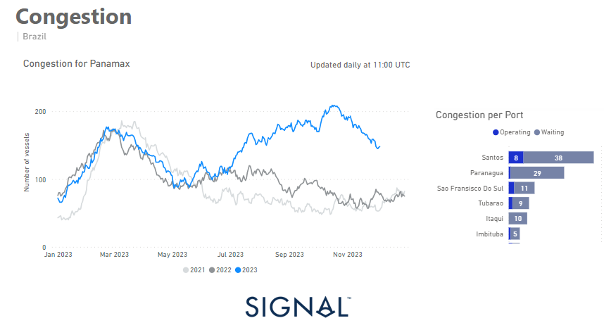

# Weekly Dry Market Monitor - Week 49, 2023

*Published on 07 December 2023*

## Downward Revision of the Number of Panamax Ships Congested in Brazilian Ports

> **Figure 1: Data Source: The Signal Ocean Platform Data**  
> *Data Source: The Signal Ocean Platform Data*  
> **Interactive Data & Source:** [Signal Ocean Platform](https://www.thesignalgroup.com/weekly-market-monitor/dry-week-49-2023) | [Local Asset](file:///C:/Users/Dell/Github/Shipping/corpus/07-signal/images/6571c3ba7eee19f083451b19_brazilian panama congestion.png)

In the first week of December, both the Capesize and Panamax freight markets experienced a remarkable upswing, reaching their highest levels of the past year. The larger vessel categories experienced an unexpected turnaround in sentiment and recorded a remarkable upswing. However, the smaller vessel categories are still struggling to develop stronger momentum, although there are signs of growth in the supramax sector. Interestingly, the number of congested Panamax vessels in Brazilian ports was revised downwards, marking the first decline since the end of the first half of 2023. This was a crucial factor contributing to the rise in Panamax freight rates. Despite the recent rate recovery, demand in tonne-miles have not increased accordingly, raising the question of whether December will signal an upward cycle in freight rates, especially given concerns about the impact of China's economic recovery on the market.

In addition, Moody's downgraded China's credit rating in December, citing the costs associated with bailing out local governments and state-owned enterprises, as well as efforts to contain the housing crisis. This move makes the economic landscape even more complex and has the potential to impact global markets.

For the latest updates and insights, make sure to visit the [Signal Ocean Newsroom](https://www.thesignalgroup.com/newsroom) website page. Click [here to request a demo](https://www.thesignalgroup.com/request-demo?utm\_source=oceanhome&utm\_medium=website&utm\_campaign=demo).

For subscription to our FREE weekly market trends email, please contact us: research@thesignalgroup.com

-Republishing is allowed with an active link to the source
