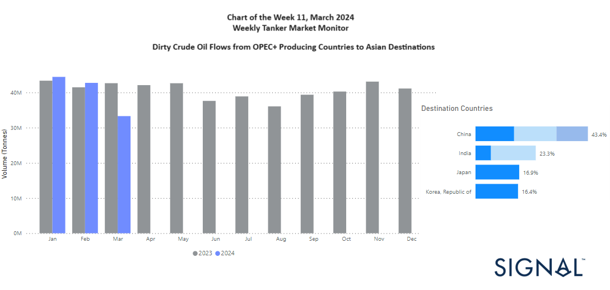

# Weekly Tanker Market Monitor: Week 11, 2024

*Published on 15 March 2024*

## The Announcements of Opec Oil Productions in January and February Appeared to Have Little Impact on the Volume of Dirty Shipments to Asian Destinations.

> **Figure 1: Data Source: The Signal Ocean Platform**  
> *Data Source: The Signal Ocean Platform*  
> **Interactive Data & Source:** [Signal Ocean Platform](https://www.thesignalgroup.com/weekly-market-monitor/tanker-week-11-2024) | [Local Asset](file:///C:/Users/Dell/Github/Shipping/corpus/07-signal/images/65f425fe653c89d7955420e8_tanker.png)

In the second week of March, the VLCC MEG-China market rates continued to soften, while the number of vessels in Ras Tanura showed an increase despite the significant downward trend observed earlier in the month. Within the crude tanker segment, the Aframax segment continues to demonstrate improvement in the cross Mediterranean route, with growth in tonne days outpacing other crude tanker vessel categories.

Regarding the flow of crude oil to Asian destinations, it's noteworthy that January and February saw no significant decrease in monthly shipment volumes compared to the previous year's figures. Moreover, there's a slight uptick fueling expectations for a consistent volume of monthly oil shipments from OPEC+ oil-producing countries. However, the latest monthly report from the IEA warns of a potential shift in the oil market from surplus to supply deficit throughout 2024 if OPEC+ extends its production cuts until the end of the year.

For the latest updates and insights, make sure to visit the [Signal Ocean Newsroom](https://www.thesignalgroup.com/newsroom) website page. Click [here to request a demo](https://www.thesignalgroup.com/request-demo?utm\_source=oceanhome&utm\_medium=website&utm\_campaign=demo).

For subscription to our FREE weekly market trends email, please contact us: research@thesignalgroup.com

-Republishing is allowed with an active link to the source
