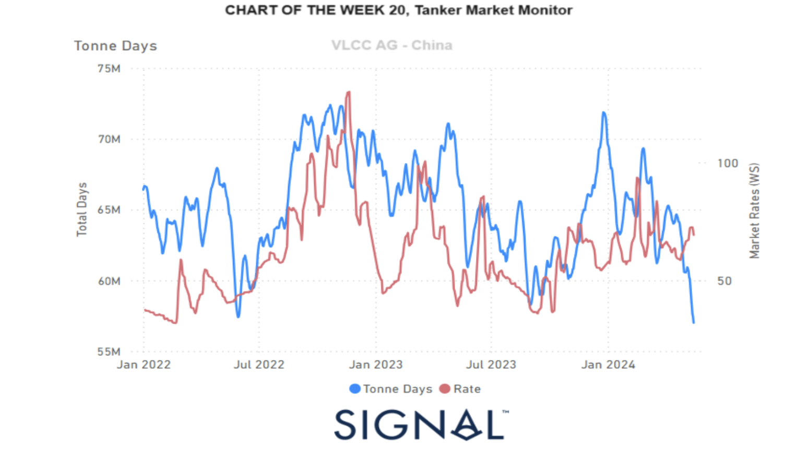

# Weekly Tanker Market Monitor: Week 20, 2024

*Published on 17 May 2024*

## This Week's Chart Highlights the Trend in VLCC (Very Large Crude Carrier) Tonne-Days Growth, Which Has Been Decreasing Consistently Since Ourlast Review in Week 17, Just Before the End of April.

> **Figure 1: 6647396c558f9905522d380f Screenshot 2024 05 17 at 11.55.44**  
> **Interactive Data & Source:** [Signal Ocean Platform](https://www.thesignalgroup.com/weekly-market-monitor/tanker-week-20-2024) | [Local Asset](file:///C:/Users/Dell/Github/Shipping/corpus/07-signal/images/6647396c558f9905522d380f_Screenshot 2024-05-17 at 11.55.44.png)

In the second week of April, the crude oil freight market maintained a relatively stable sentiment in the VLCC Ras Tanura segment, while indications of an upward trend At the end of the second week of May, the demand growth for dirty tonne-days continues to challenge the solid improvement in market prices, particularly on the VLCC MEG-China route. However, a positive factor is the pace of [Chinese crude oil imports](https://www.reuters.com/markets/commodities/china-april-crude-oil-imports-rise-545-previous-year-2024-05-09/), which rose significantly in April, increasing by 5.5% compared to the previous year. This increase is partly due to refiners ramping up imports in anticipation of a fully recovered Labor Day holiday travel season.

According to data from the General Administration of Customs, China imported 44.72 million metric tons of crude oil in April, equivalent to about 10.88 million barrels per day (bpd). This marks a 5.45% rise from the relatively low 10.4 million bpd imported in April 2023. The boost in crude oil imports is a promising sign, indicating robust demand and potential support for market prices despite the ongoing challenges in the dirty tonne-day growth. Overall, while the VLCC MEG-China route faces pressure from declining tonne-day growth, the uptick in Chinese crude imports provides a hopeful outlook for future market stability and price improvements.

For more information on this week's freight supply and demand trends, see the analysis sections below. You can also log in to our [Newsroom page](https://www.thesignalgroup.com/newsroom) under Insights & News to stay updated with the latest reports.

**-Republishing is allowed with an active link to the source**
