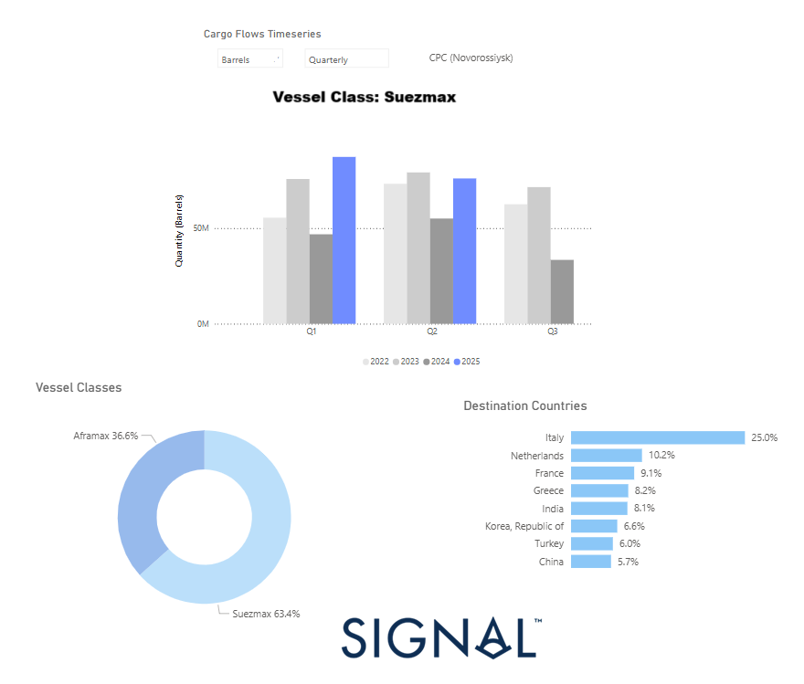

# Weekly Tanker Market Monitor: Week 20, 2025

*Published on 16 May 2025*

> **Figure 1: Https://app.signalocean.com/tanker/dynamic/oilflows**  
> *https://app.signalocean.com/tanker/dynamic/oilflows*  
> **Interactive Data & Source:** [Signal Ocean Platform](https://www.thesignalgroup.com/weekly-market-monitor/tanker-week-20-2025) | [Local Asset](file:///C:/Users/Dell/Github/Shipping/corpus/07-signal/images/68270a3f3ef6a0318c59ac63_AD_4nXcZV6xWnm7PGXpgCSPH1eRv1I7BasrBRJP4Damo9KqqNCzchx-PeubcEAa7qSkHfWJjXNkNy2EKd4vi5514JWBibsI47AY-XxR3rDc165t64Dsj5EKkmA-frIekEKJ05q0kKhV6bQ.png)

## Shift in Cpc Crude Exports Towards Suezmax Utilization

The 2025 outlook for crude oil exports from the CPC terminal at Novorossiysk indicates a decisive structural shift toward Suezmax utilization, with a marked decline in Aframax deployment. Data visualizations from Signal Ocean reveal that **Q1 2025 recorded the highest quarterly volume of Suezmax loadings** across the past four years, significantly surpassing figures for 2022 through 2024.

This evolving vessel preference appears driven by both **logistical efficiency and shifting trade dynamics**. The increase in Kazakhstani crude production, notably from Chevron’s Tengiz expansion project, has boosted throughput on the CPC pipeline. Larger Suezmax vessels offer a **clear advantage in transporting bulk volumes**, reducing per-barrel freight costs and optimizing port calls, especially as terminal infrastructure adapts to accommodate these larger tankers more regularly.

Another significant driver is the **growing importance of long-haul destinations**, especially in Asia. While Italy remains the top recipient (25%), countries such as **India (8.1%) and China (5.7%)** now represent a non-negligible share of CPC crude flows. These markets are more economically served by Suezmax vessels, which can undertake longer voyages with fewer transshipments and better fuel efficiency per ton-mile.

Notably, **Suezmaxes now account for 63.4% of total CPC cargoes**, up from previous years, while Aframax usage has fallen to 36.6%. The growing share of Suezmaxes suggests a strategic reallocation of tanker capacity, supported by destination shifts and changes in commercial preferences. European destinations—Italy, the Netherlands, and France—remain key markets, but the **increasing share of Asian destinations underlines a broader eastward reorientation** of CPC crude exports. Meanwhile, concerns over possible blending of CPC crude with Russian barrels, while not directly impacting vessel choice, highlight broader regional logistical and geopolitical considerations.

Although market sources hint at a possible **temporary uptick in Aframax activity in June 2025**, potentially tied to inventory draws or regional port constraints, the overarching trend favors Suezmax dominance. This shift also reflects a broader pattern of fleet optimization amid geopolitical complexity, with continued scrutiny over the composition and routing of CPC crude, particularly regarding concerns of Russian blending, adding another layer of strategic consideration.

In summary, the CPC terminal’s evolving export dynamics underscore the **growing alignment of shipping strategy with global demand shifts**, where Suezmax tankers are positioned as the preferred vector for scalable, cost-efficient crude flows from the Black Sea to increasingly distant markets.

For the latest updates and insights, make sure to visit the [Signal Ocean Newsroom](https://www.thesignalgroup.com/newsroom) website page. Click [here to request a demo](https://www.thesignalgroup.com/request-demo?utm\_source=oceanhome&utm\_medium=website&utm\_campaign=demo). Read [last week's tanker monitor here.](https://www.thesignalgroup.com/weekly-market-monitor/tanker-week-19-2025)

For subscription to our FREE weekly market trends email, [please click here](https://www.thesignalgroup.com/subscribe), or contact us at: research@thesignalgroup.com

-Republishing is allowed with an active link to the source
