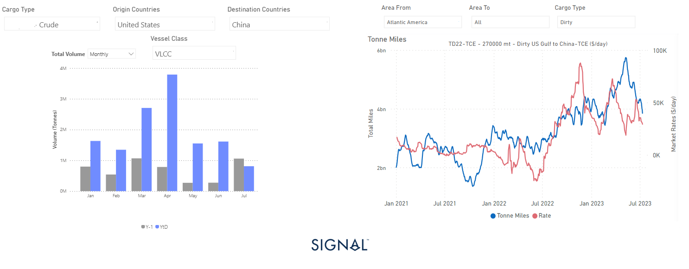

# Weekly Tanker Market Monitor: Week 28, 2023

*Published on 13 July 2023*

## Decline in U.s. Crude Oil Exports to China From May Puts Downward Pressure on VLCC Tonne-Mile Growth

> **Figure 1: Data Source: The Signal Ocean Platform**  
> *Data Source: The Signal Ocean Platform*  
> **Interactive Data & Source:** [Signal Ocean Platform](https://www.thesignalgroup.com/weekly-market-monitor/tanker-week-28-2023) | [Local Asset](file:///C:/Users/Dell/Github/Shipping/corpus/07-signal/images/64b018fe80726168bd513424_chart of the week tankers.png)

The second week of July has witnessed a sustained decline in crude tanker freight rates, which is further compounded by the challenges posed by the summer season on the market. Particularly, Chinese oil demand from the United States has significantly dropped compared to the levels seen a year ago. Analyzing the chart provided, it becomes evident that both May and June marked the lowest monthly volume of U.S. crude oil shipments to China via Very Large Crude Carriers (VLCC) tankers since early last year.

This recent trend of VLCC shipments carrying U.S. crude oil from the U.S. Gulf (USG) region has consequently resulted in a downward trajectory in the growth of dirty VLCC USG tonne-miles destined for China. This decline is notable, especially after reaching its peak in VLCC US tonne-miles just before the end of May.

For the latest updates and insights, make sure to visit the [Signal Ocean Newsroom](https://www.thesignalgroup.com/newsroom) website page. Click [here to request a demo](https://www.thesignalgroup.com/request-demo?utm\_source=oceanhome&utm\_medium=website&utm\_campaign=demo).

For subscription to our FREE weekly market trends email, please contact us: research@thesignalgroup.com

-Republishing is allowed with an active link to the source
