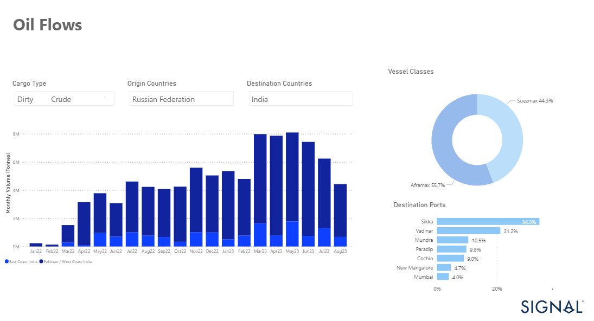

# Weekly Tanker Market Monitor: Week 36, 2023

*Published on 07 September 2023*

## Russian Crude Oil Exports to India in August at Lowest Level Since Beginning of the Year

> **Figure 1: 64f9d67ab2f8e6cb01801a9b Russia India**  
> **Interactive Data & Source:** [Signal Ocean Platform](https://www.thesignalgroup.com/weekly-market-monitor/tanker-week-36-2023) | [Local Asset](file:///C:/Users/Dell/Github/Shipping/corpus/07-signal/images/64f9d67ab2f8e6cb01801a9b_russia india.png)

The first week of September brings a downward movement in crude oil freight rates and a continued downward trend in VLCC tonne days demand growth. MEG -Rates for China have now fallen to their lowest levels since the beginning of this year, but there is still guarded optimism for a rebound in the third quarter of the year.

It is interesting to see that the dependence of the Indian economy on Russian crude oil imports has been shown to be decreasing. At the end of the summer season, Russian crude oil exports to India reached their lowest level in August, a significant drop from earlier in the year (see chart above).

Concerns about the Chinese economic outlook and Asian oil demand are pushing oil prices down. Oil prices saw a decline on Thursday, as concerns about seasonal demand slowdown during winter and the uncertain economic outlook for China took precedence over the anticipated impact of extended production cuts in Saudi Arabia and Russia.

According to a Reuters report, at 0645 GMT, Brent crude futures declined by 36 cents to settle at $90.24 per barrel, signaling the conclusion of a nine-session winning streak. Concurrently, U.S. West Texas Intermediate crude (WTI) futures slipped by 37 cents, resting at $87.17 per barrel, ending a streak of seven consecutive sessions of gains.

For the latest updates and insights, make sure to visit the [Signal Ocean Newsroom](https://www.thesignalgroup.com/newsroom) website page. Click [here to request a demo](https://www.thesignalgroup.com/request-demo?utm\_source=oceanhome&utm\_medium=website&utm\_campaign=demo).

For subscription to our FREE weekly market trends email, please contact us: research@thesignalgroup.com

-Republishing is allowed with an active link to the source
