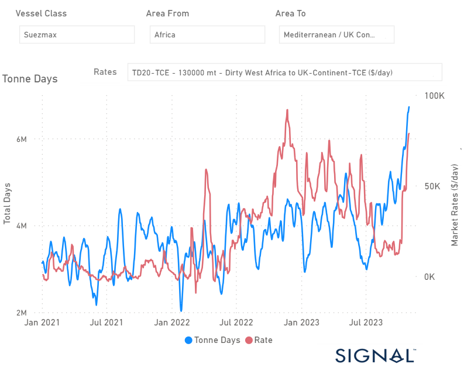

# Weekly Tanker Market Monitor: Week 44, 2023

*Published on 02 November 2023*

## Remarkable Rise of Rates and Tonne Days Growth with the Onset of Middle East Geopolitical Crisis

> **Figure 1: 6543a60cb91b60e2cac2c967 Suez**  
> **Interactive Data & Source:** [Signal Ocean Platform](https://www.thesignalgroup.com/weekly-market-monitor/tanker-week-44-2023) | [Local Asset](file:///C:/Users/Dell/Github/Shipping/corpus/07-signal/images/6543a60cb91b60e2cac2c967_suez.png)

The crude freight market gained momentum in early November due to the ongoing crisis in the Middle East. The VLCC segment has seen significant activity, but the Suezmax and Aframax segments have experienced even more growth compared to their levels at the end of September.

The Suezmax segment, where shipments usually run from West Africa to the Continent, has recorded one of the most substantial growth spikes of 2021. Moreover, freight rates have also increased noticeably, leading to speculation about whether this surge will match the magnitude of the previous peak observed before the end of November 2022. It's worth noting that during the previous period, tonne day growth was slower than the current brisk momentum in the market.

In the meantime, it's worth noting that oil prices have received a boost following the Federal Reserve's decision to maintain its benchmark interest rate at the 5.25%-5.50% range during its recent Wednesday meeting. This development has had a positive impact on the market, with Brent crude futures registering a 1.5% increase, reaching $86 per barrel by 0944 GMT. Similarly, U.S. West Texas Intermediate crude futures have seen a 1.7% rise, reaching $82 per barrel.

For the latest updates and insights, make sure to visit the [Signal Ocean Newsroom](https://www.thesignalgroup.com/newsroom) website page. Click [here to request a demo](https://www.thesignalgroup.com/request-demo?utm\_source=oceanhome&utm\_medium=website&utm\_campaign=demo).

For subscription to our FREE weekly market trends email, please contact us: research@thesignalgroup.com

-Republishing is allowed with an active link to the source
