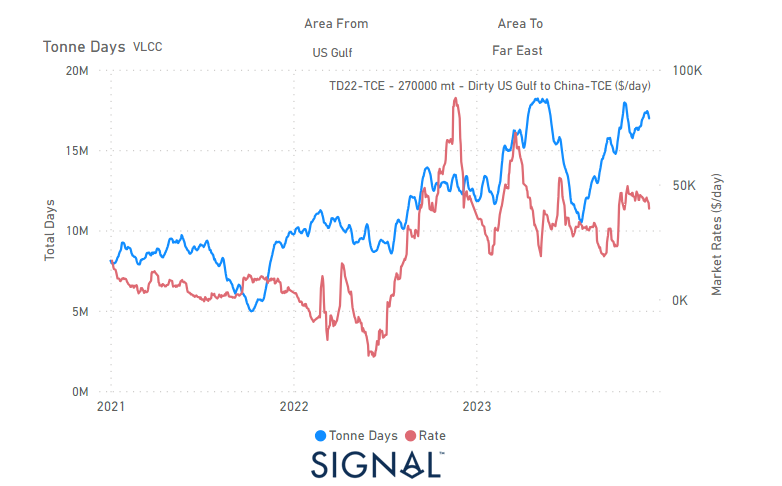

# Weekly Tanker Market Monitor: Week 50, 2023

*Published on 15 December 2023*

## Increase in the Tonne Days for VLCC-US Dirty Shipments From the Usg to the Far East at the End of the Year

> **Figure 1: 657c1c0b80e998fd38706447 Dirty VLCC**  
> **Interactive Data & Source:** [Signal Ocean Platform](https://www.thesignalgroup.com/weekly-market-monitor/tanker-week-50-2023) | [Local Asset](file:///C:/Users/Dell/Github/Shipping/corpus/07-signal/images/657c1c0b80e998fd38706447_dirty vlcc.png)

In the second week of December, the outlook for the crude oil freight market is subdued despite earlier expectations of stronger momentum. In the clean segment, however, there are encouraging signs that sentiment is brightening, particularly on the LR2 MEG-Japan route.

Amidst global geopolitical challenges related to Russian crude trade and the ongoing conflict between Israeland Hamas, it's notable that US crude exports have peaked in 2023. There has been a significant increase in VLCC tonne-days from the US to the Far East, particularly towards the end of the last quarter.

This increase in VLCC tonnage days from the US to the Far East appears to be having a positive impact on the recovery in sentiment for dirty freight rates for VLCCs. There is potential for further improvement as the USG market strengthens its position in crude oil exports to Asia.

For the latest updates and insights, make sure to visit the [Signal Ocean Newsroom](https://www.thesignalgroup.com/newsroom) website page. Click [here to request a demo](https://www.thesignalgroup.com/request-demo?utm\_source=oceanhome&utm\_medium=website&utm\_campaign=demo).

For subscription to our FREE weekly market trends email, please contact us: research@thesignalgroup.com

-Republishing is allowed with an active link to the source
