# Weekly Dry Market Monitor: Week 07, 2026

*Published on 12 February 2026*

## Chart of the Week|capesizedaily Volume Loaded

## South Atlantic / West Australia

![Capesize Insights: Available Hereall Data and Commentary Reflect Market Conditions as of [Wednesday, 11 February 2026], Unless Otherwise Stated.](../images/698da72a923fc4dec2ddd75b_59b29861.png)

> **Figure 1: Capesize Insights: Available Hereall Data and Commentary Reflect Market Conditions as of [Wednesday, 11 February 2026], Unless Otherwise Stated.**  
> *Capesize Insights: available hereAll data and commentary reflect market conditions as of [Wednesday, 11 February 2026], unless otherwise stated.*  
> **Interactive Data & Source:** [Signal Ocean Platform](https://www.thesignalgroup.com/weekly-market-monitor/weekly-dry-market-monitor-week-07-2026) | [Local Asset](file:///C:/Users/Dell/Github/Shipping/corpus/07-signal/images/698da72a923fc4dec2ddd75b_59b29861.png)

The Capesize market in the Pacific opened the week under pressure due to the effects of Cyclone Mitchell on West Australian Pilbara ports and a temporary slowdown in miner activity. Although port operations quickly resumed and activity levels picked up, overall sentiment remained subdued.

The **BCI** (182k) 5TC declined by approximately USD 5,000 over the week, from around USD 31,000 to below USD 26,000. This drop coincided with a moderation in daily loaded volumes from both the South Atlantic and Western Australia during the first ten days of February. The decline was more pronounced in Western Australia, where volumes have trended steadily lower since early January, falling nearly 20% to below 2 million tonnes.

Looking ahead to Lunar New Year, supply-side pressure remains particularly evident in the South/North Atlantic, Australasia, and the Indian Ocean/South Africa, affecting mainly the larger vessel segments. Conversely, the South Atlantic showed comparative support for the Supramax and Handysize segments, driven primarily by momentum in the USG freight market.

## Freight Market Overview

The Baltic Dry Index (BDI) has dipped below 1,900 points, sustaining the decline seen in early February. This is a notable drop from the peak near 2,500 points recorded in early December. However, as highlighted in our recent Market Insights report ("[BDI VS BCI Ahead of the Lunar New Year](https://www.thesignalgroup.com/newsroom/market-insights-bdi-vs-bci-ahead-of-the-lunar-new-year)"), the dry bulk freight market is currently exhibiting a stronger performance than has typically been observed in periods preceding the Chinese New Year. (BDI Index Value +130% YoY).

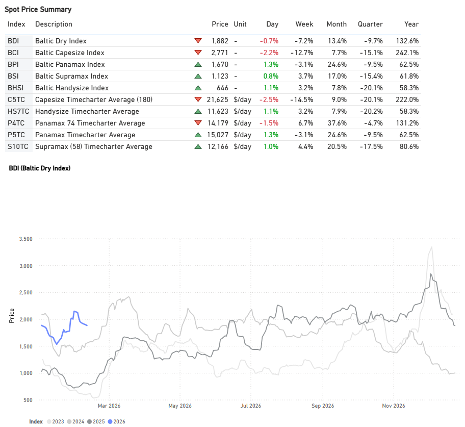

> **Figure 2: Freight Market Overview**  
> **Interactive Data & Source:** [Signal Ocean Platform](https://www.thesignalgroup.com/weekly-market-monitor/weekly-dry-market-monitor-week-07-2026) | [Local Asset](file:///C:/Users/Dell/Github/Shipping/corpus/07-signal/images/698da72a923fc4dec2ddd75e_832ad9fc.png)

## Freight Atlantic

## Capesize | Weaker

## C3tubarao–qingdao /c17saldanha Bay–qingdao

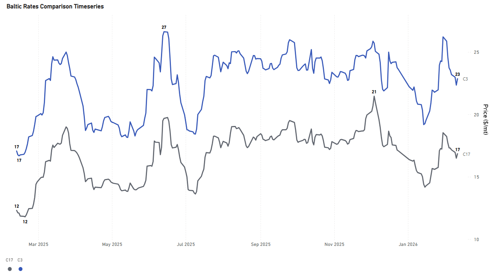

> **Figure 3: C3 Tubarao–qingdao / C17 Saldanha Bay–qingdao**  
> **Interactive Data & Source:** [Signal Ocean Platform](https://www.thesignalgroup.com/weekly-market-monitor/weekly-dry-market-monitor-week-07-2026) | [Local Asset](file:///C:/Users/Dell/Github/Shipping/corpus/07-signal/images/698da72a923fc4dec2ddd767_d7699761.png)

- Capesize rates have softened to $23/ton after a strong late-January rally, although sentiment remains 34% stronger year-on-year. This downward trend is also evident on the Saldanha Bay-Qingdao route, where rates have dropped to $17/ton. Despite weakening momentum, current levels remain above the mid-January low of $14/ton.

## Panamax | Firmer

## P7usg–qingdao Grain ($/mt) /p8santos–qingdao ($/mt)

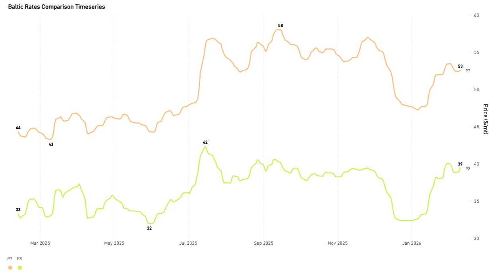

> **Figure 4: ‍**  
> **Interactive Data & Source:** [Signal Ocean Platform](https://www.thesignalgroup.com/weekly-market-monitor/weekly-dry-market-monitor-week-07-2026) | [Local Asset](file:///C:/Users/Dell/Github/Shipping/corpus/07-signal/images/698da72a923fc4dec2ddd773_c094beea.png)

- Rates for the USG-Qingdao and Santos-Qingdao routes remain firm, with both seeing an annual increase of approximately 17%. The USG-Qingdao rate, in particular, continues to hover around a $50/ton premium, a level sustained since early February. Meanwhile, the Santos-Qingdao rate is still nearing $40/ton.

## Supramax | Firmer

## S4aus Gulf Trip to Skaw-Passero

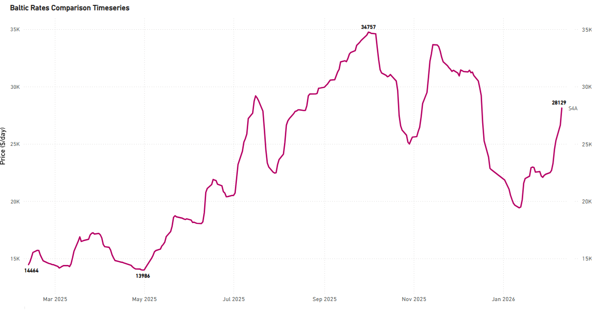

> **Figure 5: S4A US Gulf Trip to Skaw-Passero**  
> **Interactive Data & Source:** [Signal Ocean Platform](https://www.thesignalgroup.com/weekly-market-monitor/weekly-dry-market-monitor-week-07-2026) | [Local Asset](file:///C:/Users/Dell/Github/Shipping/corpus/07-signal/images/698da72a923fc4dec2ddd77c_cd41faf4.png)

- The USG-to-Skaw-Passero route showed exceptional firmness at approximately $28k/day, a 24% week-over-week (WoW) increase. This rate is notably about $8k/d higher than the levels seen at the start of the year.

## Handysize | Firmer

## Hs438 -US Gulf Trip Via US Gulf or North Coast of South America to Skaw-Passero

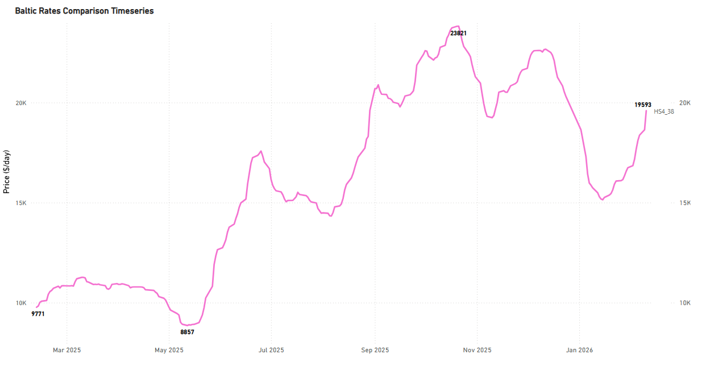

> **Figure 6: 698da72a923fc4dec2ddd770 A712c557**  
> **Interactive Data & Source:** [Signal Ocean Platform](https://www.thesignalgroup.com/weekly-market-monitor/weekly-dry-market-monitor-week-07-2026) | [Local Asset](file:///C:/Users/Dell/Github/Shipping/corpus/07-signal/images/698da72a923fc4dec2ddd770_a712c557.png)

- USG trip to Skaw-Passero recorded levels of around $20k/d, an increase of $4k/d in a month and +$9k/d YoY, with the increase continuous since mid-January.

## Freight Pacific

## Capesize | C5 Weaker

## C5west Australia–qingdao

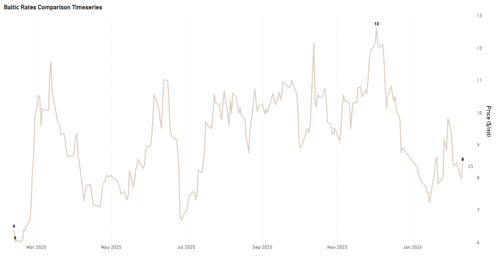

> **Figure 7: C5 West Australia–qingdao**  
> **Interactive Data & Source:** [Signal Ocean Platform](https://www.thesignalgroup.com/weekly-market-monitor/weekly-dry-market-monitor-week-07-2026) | [Local Asset](file:///C:/Users/Dell/Github/Shipping/corpus/07-signal/images/698da72a923fc4dec2ddd76a_da1801b0.png)

- The West Australia-Qingdao rates experienced a decline, falling below $9/ton and reaching a mid-$8/ton level midway through the week. This drop follows a peak observed at the close of the previous week. Current daily loading volumes from West Africa suggest that this downward pressure may persist through the remainder of February.

## Panamax | Firmer

## P3a82- Hk-S Korea Incl Taiwan, One Pacific Rv

## P582- South China, One Indonesian Round Voyage

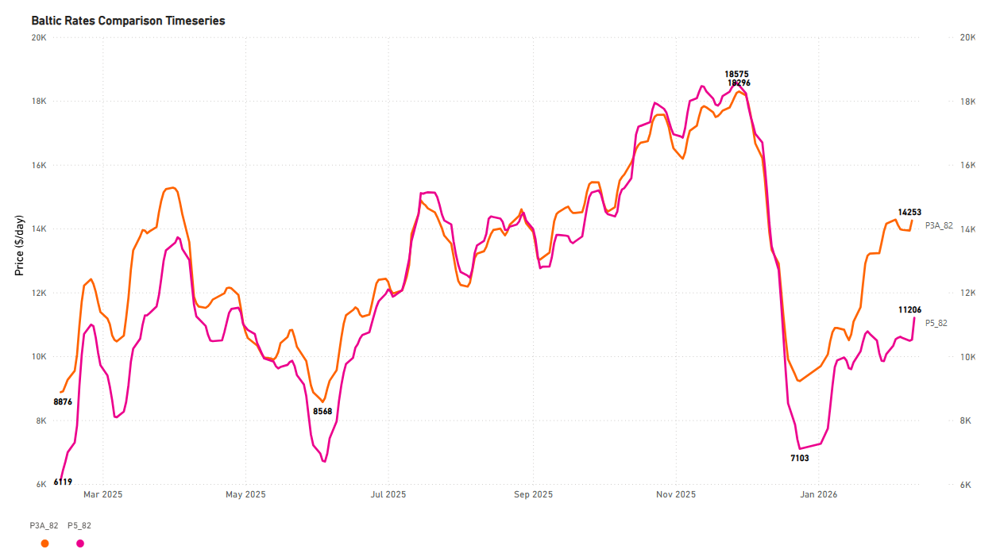

> **Figure 8: P582 - South China, One Indonesian Round Voyage**  
> **Interactive Data & Source:** [Signal Ocean Platform](https://www.thesignalgroup.com/weekly-market-monitor/weekly-dry-market-monitor-week-07-2026) | [Local Asset](file:///C:/Users/Dell/Github/Shipping/corpus/07-signal/images/698da72a923fc4dec2ddd779_abdb1b68.png)

- The Panamax Pacific market holds the exceptional gains of the previous week, with rates on the P3A\_82 route still exceeding $14k/day, representing a year-on-year increase of $5.5k/day.

## Supramax | Weaker

## S2north China One Australian or Pacific Round Voyage

## S10south China Trip Via Indonesia to South China

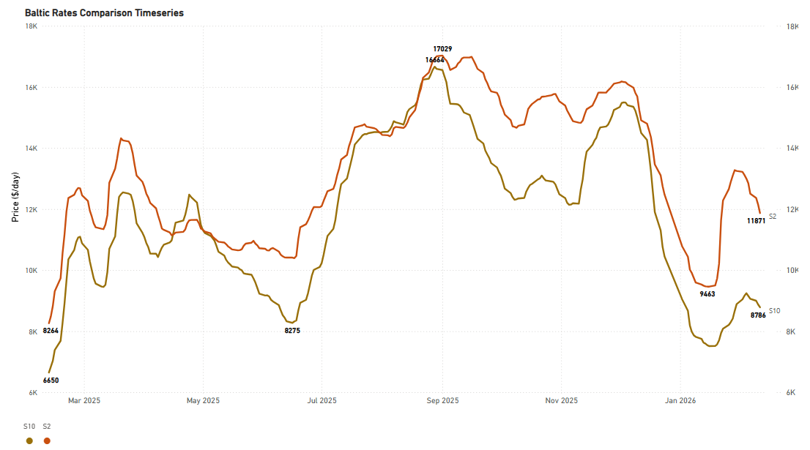

> **Figure 9: S10 South China Trip Via Indonesia to South China**  
> **Interactive Data & Source:** [Signal Ocean Platform](https://www.thesignalgroup.com/weekly-market-monitor/weekly-dry-market-monitor-week-07-2026) | [Local Asset](file:///C:/Users/Dell/Github/Shipping/corpus/07-signal/images/698da72a923fc4dec2ddd776_37b5b3dd.png)

- The Supramax Pacific market reversed the upward trend seen the previous week. Levels are now around $11.8k/d on the S2 route, marking a 9% weekly decrease but a +40% YoY increase.

## Handysize | Weaker

## Hs538- South East Asia Trip to Singapore-Japan

## Hs638- North China-South Korea-Japan Trip to North China-South Korea-Japan

## Hs738- North China-South Korea-Japan Trip to Southeast Asia

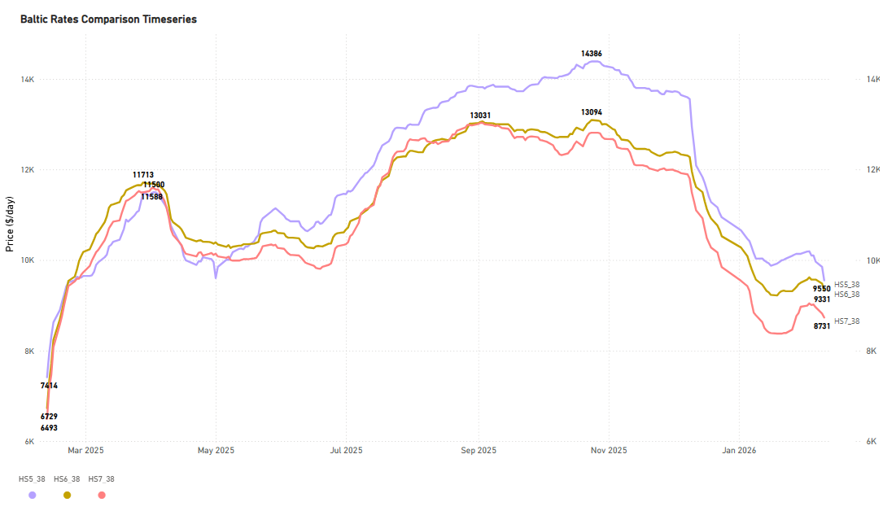

> **Figure 10: ‍**  
> **Interactive Data & Source:** [Signal Ocean Platform](https://www.thesignalgroup.com/weekly-market-monitor/weekly-dry-market-monitor-week-07-2026) | [Local Asset](file:///C:/Users/Dell/Github/Shipping/corpus/07-signal/images/698da72a923fc4dec2ddd76d_2fc857b4.png)

- The Handysize Pacific freight market is currently showing losses, with the HS5\_38 route dropping significantly. This route is now valued at approximately $9.5k/day, falling from its last week’s mid-week high of over $10k. Despite the recent dip, the current rate remains a substantial 34% increase over the same period last year.

## Ballasters Overview

## Capesize | 5d Ma Increasing

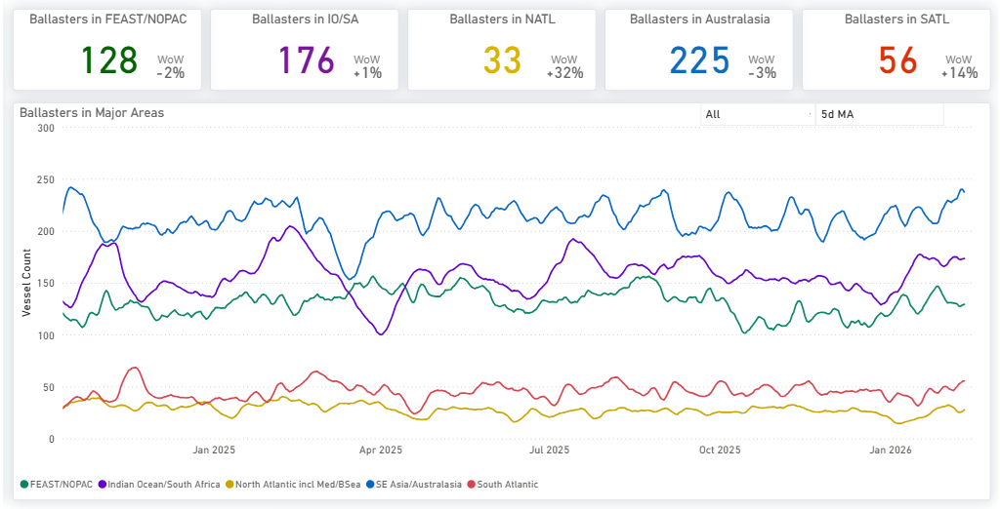

> **Figure 11: Capesize | 5d Ma Increasing**  
> **Interactive Data & Source:** [Signal Ocean Platform](https://www.thesignalgroup.com/weekly-market-monitor/weekly-dry-market-monitor-week-07-2026) | [Local Asset](file:///C:/Users/Dell/Github/Shipping/corpus/07-signal/images/698da72a923fc4dec2ddd761_8f7e7f7d.png)

- Supply pressure continues to build across both basins. The 5-day moving average is up approximately 15% WoW in the South Atlantic, while the increase is even more pronounced in the North Atlantic, where ballaster vessel counts are up 32% WoW. In the Pacific, the vessel count of ballasters remains accelerated, with only a marginal softening visible in Australasia of 3% and 1% in the Indian Ocean.

## Panamax | 5d Ma Increasing

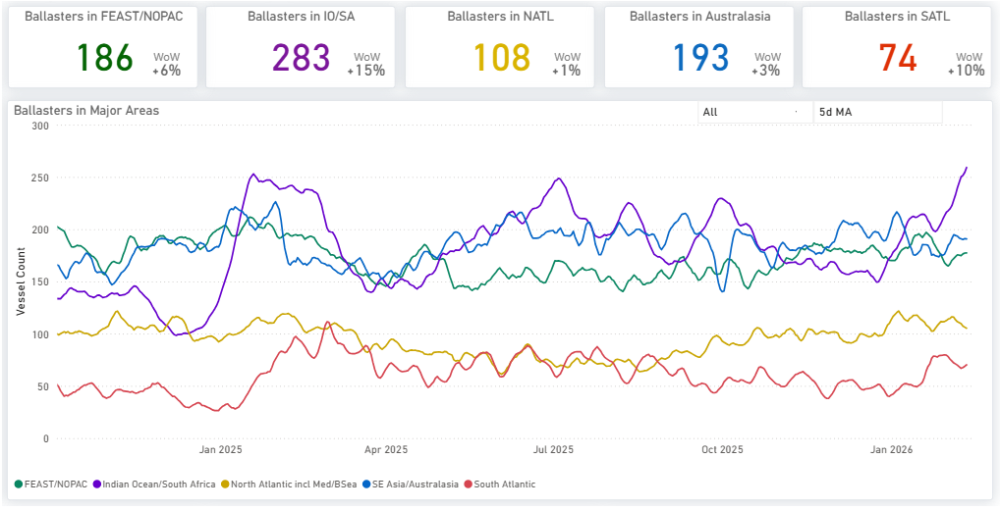

> **Figure 12: Panamax | 5d Ma Increasing**  
> **Interactive Data & Source:** [Signal Ocean Platform](https://www.thesignalgroup.com/weekly-market-monitor/weekly-dry-market-monitor-week-07-2026) | [Local Asset](file:///C:/Users/Dell/Github/Shipping/corpus/07-signal/images/698da72a923fc4dec2ddd764_1228025b.png)

- The Indian Ocean is experiencing significantly increased supply pressure, with the current vessel count surpassing 280. This represents a 15% increase week-on-week, continuing the upward trend observed over the last two weeks. In the South Atlantic, the number of ballasters has also increased, surpassing 70 vessels (+10% week-on-week). Meanwhile, the North Atlantic is showing a slight correction, with figures falling below 110 vessels, although supply remains elevated overall.

## Supramax| 5d Ma Increasing

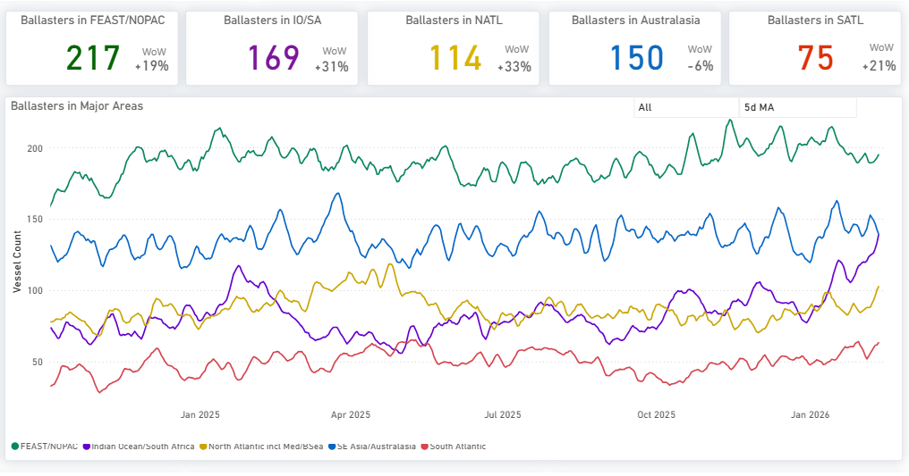

> **Figure 13: Supramax| 5d Ma Increasing**  
> **Interactive Data & Source:** [Signal Ocean Platform](https://www.thesignalgroup.com/weekly-market-monitor/weekly-dry-market-monitor-week-07-2026) | [Local Asset](file:///C:/Users/Dell/Github/Shipping/corpus/07-signal/images/698da72a923fc4dec2ddd780_09a2f125.png)

- Supramax supply is experiencing significant pressure in the North Atlantic and Indian Ocean, with the number of ballasting vessels increasing by approximately 30% week over week in both regions. In Australasia, although some softening is visible, the correction remains marginal relative to the sharp decline since January, with the 5-day moving average near 150.

## Handysize| 5d Ma Increasing

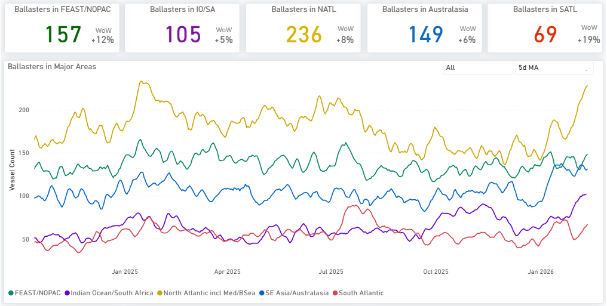

> **Figure 14: Handysize| 5d Ma Increasing**  
> **Interactive Data & Source:** [Signal Ocean Platform](https://www.thesignalgroup.com/weekly-market-monitor/weekly-dry-market-monitor-week-07-2026) | [Local Asset](file:///C:/Users/Dell/Github/Shipping/corpus/07-signal/images/698da72a923fc4dec2ddd783_ff57e372.png)

- Handysize vessels are experiencing significant supply pressure in the North Atlantic, with the number of ballasting vessels now exceeding 230. Intense pressure is also noticeable in the Far East/NOPAC and Australasia regions.

## Demand | Tonne Miles - Index View

## Capesize | Panamax | Supramax WoW Decreasing

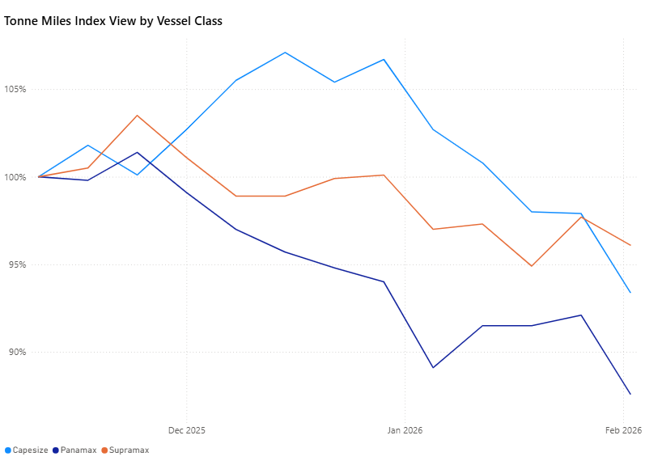

> **Figure 15: Capesize | Panamax | Supramax WoW Decreasing**  
> **Interactive Data & Source:** [Signal Ocean Platform](https://www.thesignalgroup.com/weekly-market-monitor/weekly-dry-market-monitor-week-07-2026) | [Local Asset](file:///C:/Users/Dell/Github/Shipping/corpus/07-signal/images/698da72a923fc4dec2ddd786_dfc9426a.png)

Upon reviewing the tonne-mile growth rate on a Base 100 Index View, deceleration persists across the Capesize, Panamax, and Supramax segments. Tonne-mile demand continues to weaken across the larger vessel classes. Capesize demand is now 7% below the base period, while Panamax is down more than 10%. Supramax shows relative strength, contracting by only 4%.

Metrics Description: [Index View](https://app.signalocean.com/dry/dynamic/timeseries\_dry)(Base 100) by total Tonne Miles over the selected period. This facilitates relative performance comparisons between segments of different sizes (e.g., comparing the growth rate of Supramax vs Capesize)

For the latest updates and insights, make sure to visit the [Signal Ocean Newsroom](https://www.thesignalgroup.com/newsroom) page & [subscribe to weekly reports](http://www.thesignalgroup.com/subscribe). Click [here to request a demo](https://www.thesignalgroup.com/request-demo?utm\_source=oceanhome&utm\_medium=website&utm\_campaign=demo). Click here to see the[previous dry bulk weekly](https://www.thesignalgroup.com/weekly-market-monitor/weekly-dry-market-monitor-week-06-2026) report.

For subscription to our FREE weekly market trends email, please contact us: research@thesignalgroup.com

-Republishing is allowed with an active link to the source
