# Weekly Dry Market Monitor: Week 36, 2026

**Date**: September 9, 2026 | **Category**: Dry bulk | **Section**: Monitors | **Source**: [https://www.thesignalgroup.com/weekly-market-monitor/weekly-dry-market-monitor-week-36-2026](https://www.thesignalgroup.com/weekly-market-monitor/weekly-dry-market-monitor-week-36-2026)

---

## SPOTLIGHT OF THE WEEK

## Capesize in Focus — C3 at a Multi-Year High as Ordering Accelerates

The Capesize market strengthened sharply over the week, led by sustained momentum in the Atlantic. The Baltic Capesize Index (BCI) rose by 950 points to 6,286, while average C5TC earnings increased by $8,612 to approximately $53,508 per day. The strongest movement was recorded on theC3 Tubarão–Qingdao route, where freight climbed by $3.19 week on week, or around 8%, to a multi-year high of $41.55/mt on 4 September. The benchmark is now trading approximately 70% above its September 2025 average of $24.50/mt, reflecting considerably firmer Atlantic conditions than during the corresponding period last year.

‍

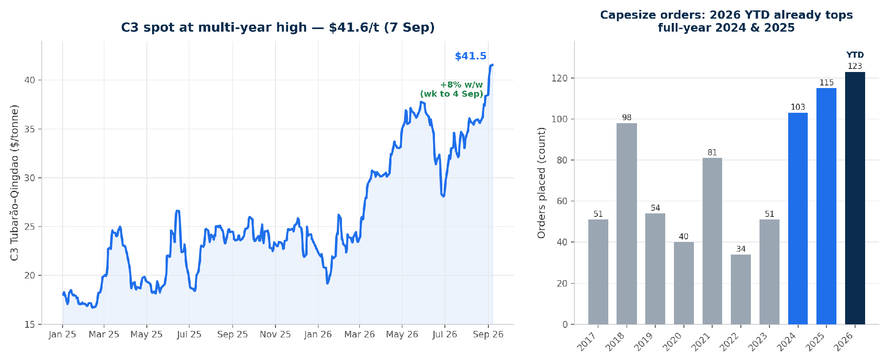
*Figure 1: C3 (Tubarao-Qingdao) spot at a multi-year high (left) alongside annual Capesize ordering — 2026 year-to-date contracting already exceeds full-year 2024 and 2025 (right) (Source: Signal).*

The southern (Tubarao) system has been getting busier:Tubarao–China sailings over January–August total 127, up from 110 in 2025 and 90 in 2024 (about +15% year-on-year), with the monthly cadence above 2024 in seven of the eight months, while northern Ponta da Madeira sailings eased (234 versus 256 in 2025). Longer-haul southern cargo keeps Capesizes employed for more tonne-days, tightening the Atlantic even without a headline volume surge.

Stronger earnings coincide with renewed contracting.Capesize newbuilding orders have reached 123 vessels so far in 2026, already exceeding the full-year totals of 103 in 2024 and 115 in 2025. Chinese yards account for approximately 117 of this year’s orders. The increase points to renewed owner confidence in the segment and will add to Capesize fleet capacity over the longer term. In the near term, however, shipyard delivery schedules mean that the additional supply will have limited bearing on current Atlantic availability.

## FREIGHT MARKET OVERVIEW | BDI & SEGMENT METRICS

*Signal Figure*

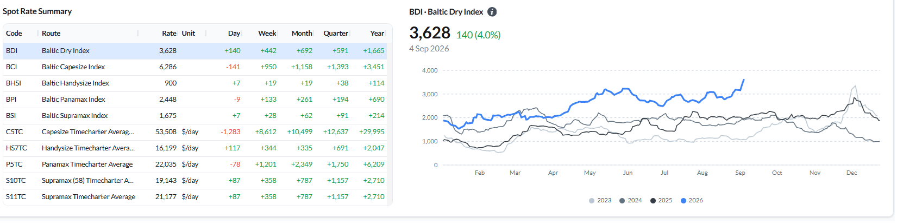
*Figure 2: Baltic Dry Index — spot rate summary across segments and BDI performance as of 4 Sep 2026 (Source: Signal).*

A broad, demand-driven market expansion.The BDI advanced to 3,628 points (+140 daily, +442 WoW), supported by positive momentum across all four vessel classes. TheCapesizesector recorded significant gains, with the BCI rising to 6,286 (+950 WoW) and mean C5TC earnings increasing to approximately $53,508 per day (+$8,612 WoW).Panamaxrates strengthened (BPI 2,448, +133 WoW), as did those forSupramax(BSI 1,675, +28 WoW) andHandysize(BHSI 900, +19 WoW) vessels. Notably, this rate appreciation occurred concurrently with an expansion in open tonnage across all segments (as detailed in the ballaster table below). The simultaneous growth in freight rates and available ballaster capacity indicates that market strength is attributable to expanding demand rather than constrained vessel supply.

## Ballasters — week-on-week by region

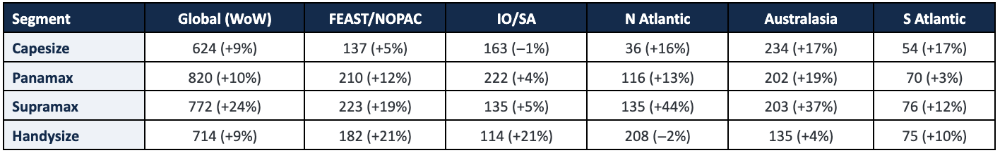
*Global ballaster fleet and regional counts, with change vs the previous week (Source: Signal).*

Open tonnage rose in every segment week-on-week — Supramax most of all (+24% to 772, led by the North Atlantic +44% and Australasia +37%), followed by Panamax (+10% to 820) and Capesize and Handysize (both +9%, to 624 and 714).

## CAPESIZE | ANALYSIS

Freight.The BCI surged to 6,286 (−141 day-on-day; +950 week-on-week) with average C5TC earnings up to $53,508/day (+$8,612 WoW). The Atlantic led: C3 (Tubarao–Qingdao) rose to $41.55/mt (+$3.19 WoW), and the Cont-Med and transatlantic rounds jumped (C9_182 +$12,722, C16_182 +$9,917, C8_182 +$8,887 WoW), while C5 (West Australia–Qingdao) added $2.03 WoW to $18.21/mt.

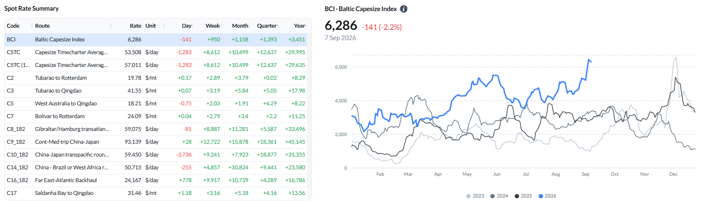
*Figure 3: Baltic Capesize Index (BCI) — spot rate summary and BCI performance (Source: Signal).*

Ballasters vs the previous week.The global Capesize ballaster count rose 9% WoW to 624, with builds in Australasia (+17% to 234), the South Atlantic (+17% to 54), and the North Atlantic (+16% to 36); the Indian Ocean/South Africa was flat (−1% to 163).

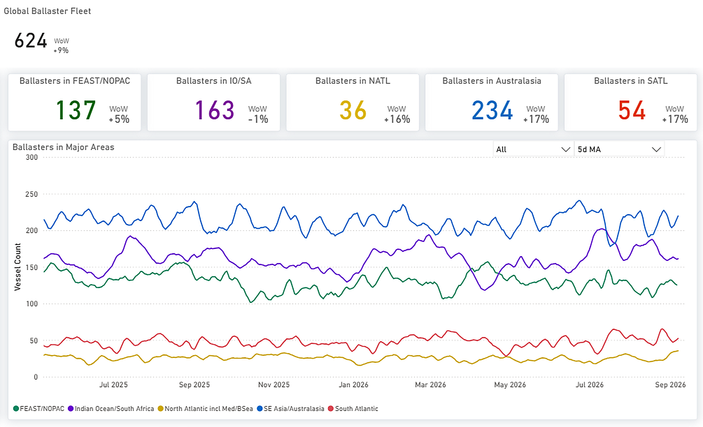
*Figure 4: Capesize — Global ballaster fleet and regional positioning (Source: Signal).*

Supply/demand by routeC3 (Tubarao–Qingdao) has tightened: cumulative supply now sits below expected demand across the whole forward window, where a week earlier it edged into a slight late surplus — a clear supportive shift behind the C3 rally. C5 (West Australia–Qingdao) is little changed, near balance early and building a supply surplus from around day 12.

*Signal Figure*

Figure 5: Capesize — C3 & C5 forward balance: cumulative Supply vs Expected Demand over days forward (Source: Signal).

Supply/demand — market-position indicator.Demand is running at 103.50 versus a year ago and supply at 98.36, so the demand-to-supply paceheld at 1.05, unchanged on the week. A reading above 1.00 means tonne-mile demand is growing faster year-on-year than available tonnage (adjusted for VLOC tonnage on long-term contract, 13.2% of the total; 1.05 vs 1.04 unadjusted). With six of seven loading days in and only one past revision to test against, the side of 1.00 may still shift as the week settles — this is a market-position indicator, not a freight forecast.

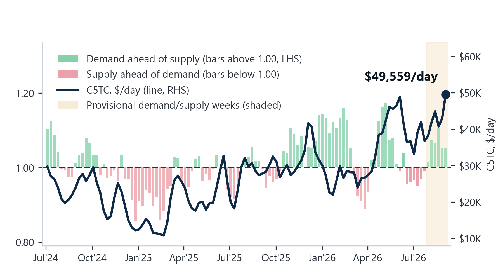
*Signal Figure*

Figure 6: Capesize — demand-to-supply ratio (LHS bars, four-week-average YoY growth; above 1.00 = tonne-mile demand growing faster than available tonnage) vs weekly TC earnings (RHS line). Shaded = latest provisional weeks. (Source: Baltic Exchange; Signal Ocean — Voyage API, Vessel Daily Status). (Source: Signal).

## PANAMAX | ANALYSIS

Freight.The BPI rose to 2,448 (−9 day-on-day; +133 week-on-week), and the P5TC average gained $1,201 WoW to $22,035/day. The rally was broad, led by the Pacific — P3A_82 +$2,294, P5_82 +$2,213 WoW — with P2A_82 +$1,054 and the grain routes firmer (P7 US Gulf–Qingdao $75.89/mt, +$2.04 WoW).

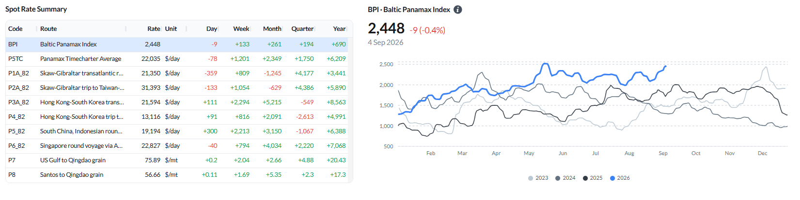
*Signal Figure*

Figure 7: Baltic Panamax Index (BPI) — spot rate summary and BPI performance (Source: Signal).

Ballasters vs the previous week.The global Panamax ballaster count rose 10% WoW to 820, with builds in Australasia (+19% to 202), the North Atlantic (+13% to 116) and FEAST/NOPAC (+12% to 210); the South Atlantic was steady (+3% to 70).

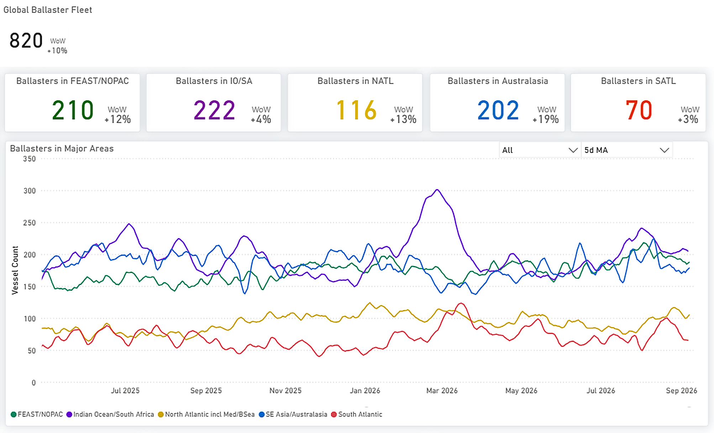
*Signal Figure*

Figure 8: Panamax — Global ballaster fleet and regional positioning (Source: Signal).

Supply/demand by routeP3 and P6 show the clearest tightening, with expected demand rising above cumulative supply over the forward horizon. P5 initially carries more supply than expected demand, but that advantage narrows and reverses toward the end of the period. P1/P2/P7 is the most balanced route group, with total supply and expected demand converging at the endpoint.

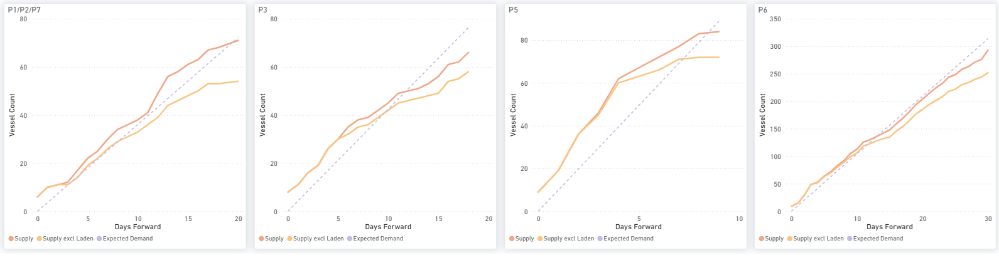
*Signal Figure*

Figure 9: Panamax — P1/P2/P7, P3, P5 & P6: cumulative Supply vs Expected Demand over days forward (Source: Signal).

Supply/demand — market-position indicator.Demand at 95.39 against supply at 102.18eased the ratio to 0.93from 0.94 a week earlier; the last fully settled week (13 August) stood at 0.85. The ratio sits below 1.00 by 0.07 — within the largest move a settled week has made on revision (0.07 across 26 revisions) — so the side may still change as the week settles.

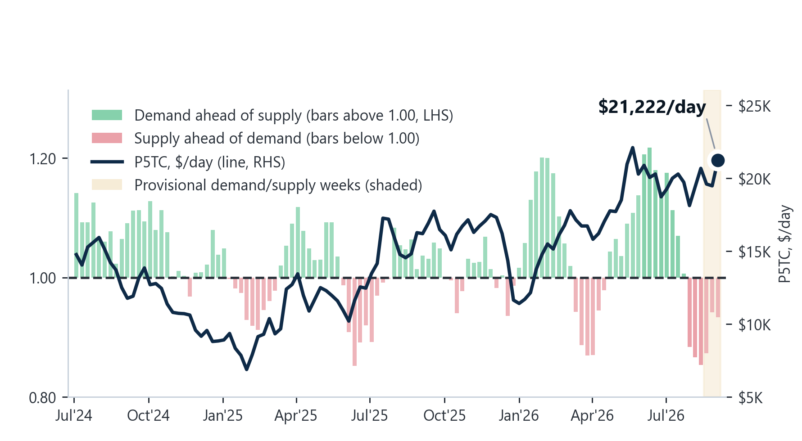
*Signal Figure*

Figure 10: Panamax — demand-to-supply ratio (LHS bars, four-week-average YoY growth; above 1.00 = tonne-mile demand growing faster than available tonnage) vs weekly TC earnings (RHS line). Shaded = latest provisional weeks. (Source: Baltic Exchange; Signal Ocean — Voyage API, Vessel Daily Status). (Source: Signal).

## SUPRAMAX | ANALYSIS

Freight.The BSI firmed to 1,675 (+7 day-on-day; +28 week-on-week), led by the US Gulf — S1C (US Gulf–China/Japan) +$2,025 and S4A (US Gulf–Skaw-Passero) +$1,512 WoW — with Asia routes also higher (S2 +$563, S8 +$532, S15 +$578); the S10TC average rose $358 WoW to $19,143/day, though the Continent backhaul S4B eased (−$397).

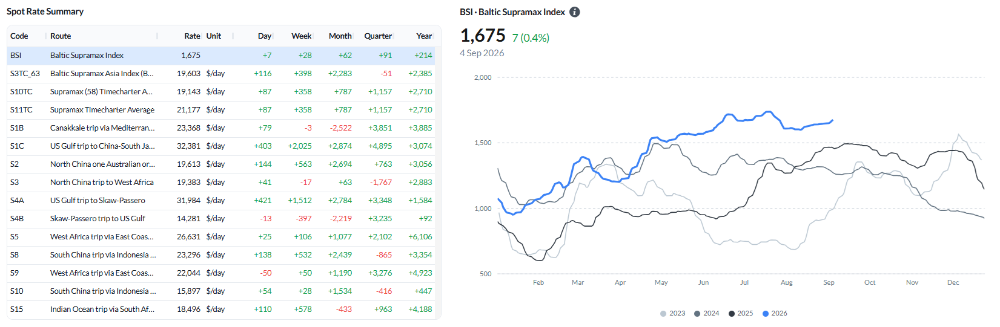
*Signal Figure*

Figure 11: Baltic Supramax Index (BSI) — spot rate summary and BSI performance (Source: Signal).

Ballasters vs the previous week.The global Supramax ballaster count jumped 24% WoW to 772 — the largest build of any segment — led by the North Atlantic (+44% to 135) and Australasia (+37% to 203), with FEAST/NOPAC +19% to 223.

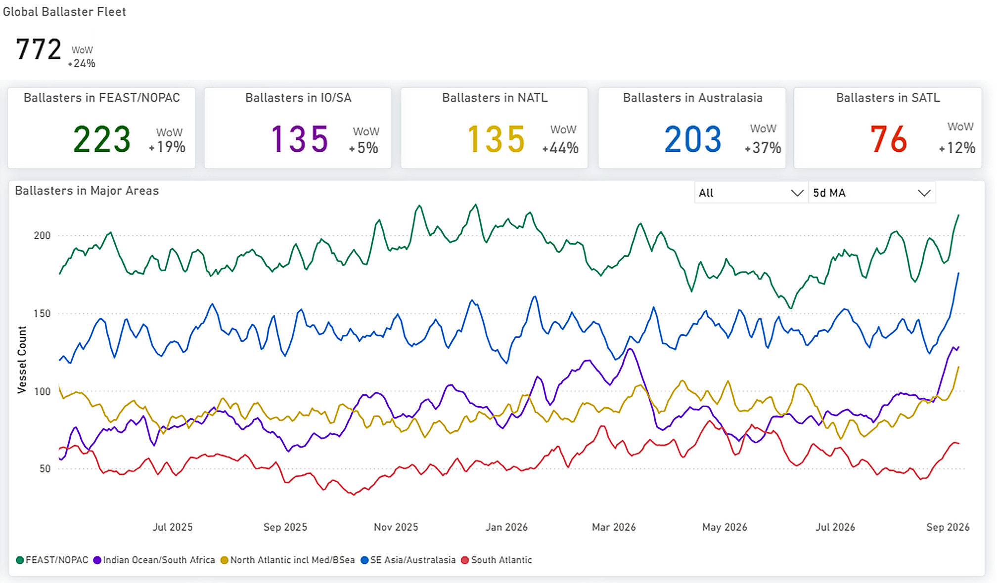
*Signal Figure*

Figure 12: Supramax — Global ballaster fleet and regional positioning (Source: Signal).

Supply/demand by routeLittle changed, and that is the point: S4A/S1C, S4B and S8/S10 all keep a clear cumulative supply surplus — notably on the very US Gulf routes whose spot rates spiked — while S5 shows only a mild late surplus. The rate strength is running ahead of a forward balance that remains long.

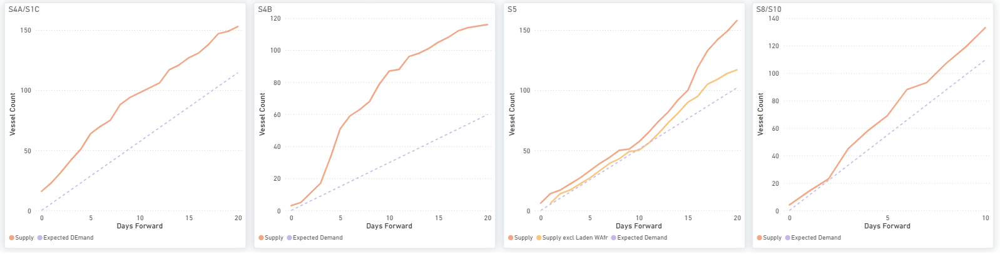
*Signal Figure*

Figure 13: Supramax — S4A/S1C, S4B, S5 & S8/S10: cumulative Supply vs Expected Demand over days forward (Source: Signal).

Supply/demand — market-position indicator.Demand at 85.95 against supply at 101.04eased the ratio to 0.85from 0.89 a week earlier (13 August: 0.88). It sits 0.15 below 1.00, further than the largest settled revision (0.12), though the revision size is not established enough to settle that side.

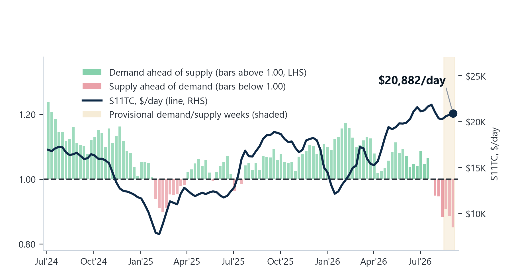
*Signal Figure*

Figure 14: Supramax — demand-to-supply ratio (LHS bars, four-week-average YoY growth; above 1.00 = tonne-mile demand growing faster than available tonnage) vs weekly TC earnings (RHS line). Shaded = latest provisional weeks. (Source: Baltic Exchange; Signal Ocean — Voyage API, Vessel Daily Status). (Source: Signal).

## HANDYSIZE | ANALYSIS

Freight.The BHSI rose to 900 (+7 day-on-day; +19 week-on-week), led by an Atlantic rebound — HS3_38 (Rio de Janeiro–Recalada) +$856, HS4_38 (US Gulf) +$850 and HS2_38 (Skaw-Passero–Boston) +$500 WoW — with the Pacific routes modestly higher; the HS7TC average gained $344 WoW to $16,199/day.

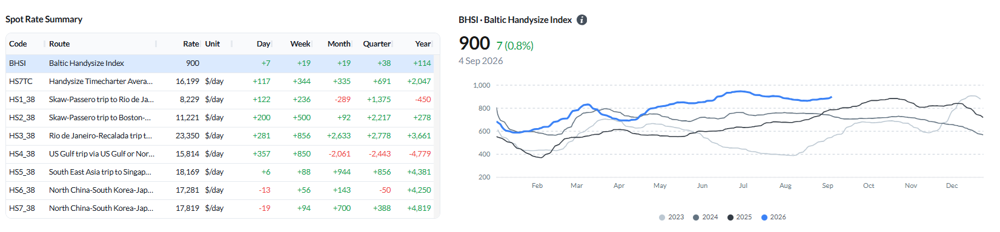
*Signal Figure*

Figure 15: Baltic Handysize Index (BHSI) — spot rate summary and BHSI performance (Source: Signal).

Ballasters vs the previous week.The global Handysize ballaster count rose 9% WoW to 714, with builds in FEAST/NOPAC (+21% to 182) and the Indian Ocean/South Africa (+21% to 114); the North Atlantic eased slightly (−2% to 208) but remained the largest pool.

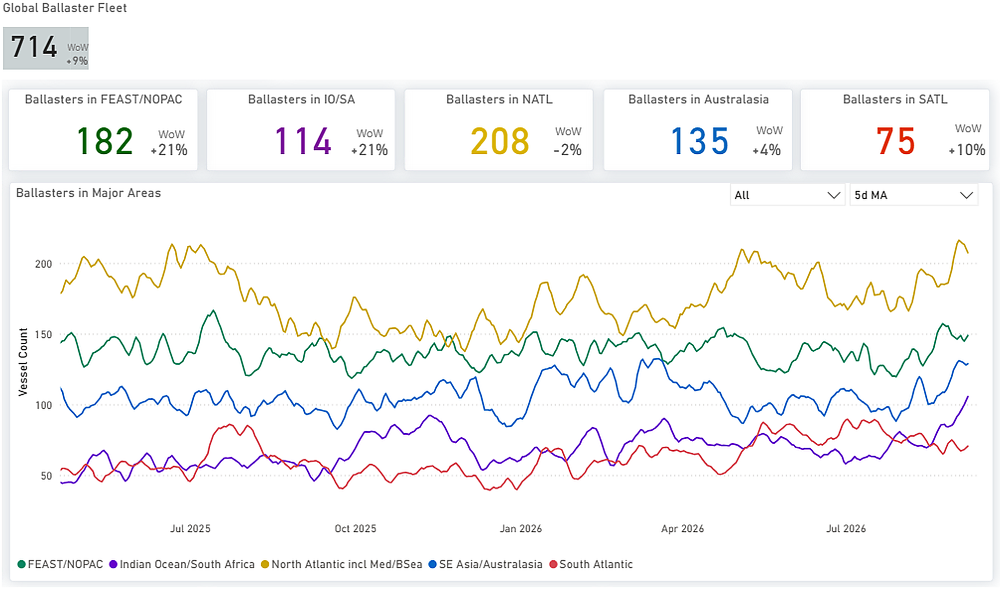
*Signal Figure*

Figure 16: Handysize — Global ballaster fleet and regional positioning (Source: Signal).

Supply/demand by routeThe segment stayed broadly oversupplied: HS1/HS2, HS5 and HS6 all carry cumulative supply surpluses, and HS7 (Far East) has loosened into a surplus after leading tight in recent weeks.

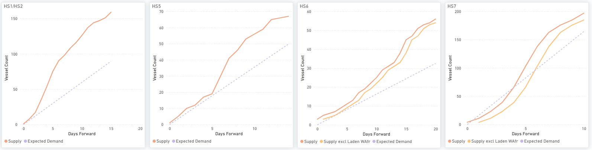
*Signal Figure*

Figure 17: Handysize — HS1/HS2, HS5, HS6 & HS7: cumulative Supply vs Expected Demand over days forward (Source: Signal).

Supply/demand — market-position indicator.Demand at 85.97 against supply at 94.78 put the ratio at0.91, down from 1.03 a week earlier. Handysize demand is built from Voyage API tonne-mile alone, a different basis from the Panamax and Supramax blended series, so the level is not comparable across segments. With six of seven loading days in and one past revision, the side of 1.00 may still shift.

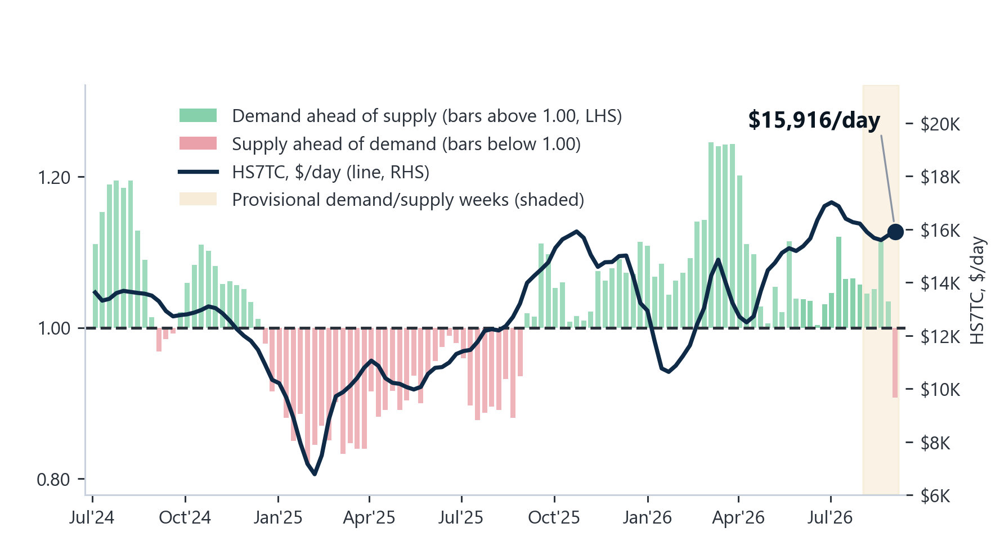
*Signal Figure*

Figure 168: Handysize — demand-to-supply ratio (LHS bars, four-week-average YoY growth; above 1.00 = tonne-mile demand growing faster than available tonnage) vs weekly TC earnings (RHS line). Shaded = latest provisional weeks. (Source: Baltic Exchange; Signal Ocean — Voyage API, Vessel Daily Status). (Source: Signal).

## OVERALL MARKET TREND | CONCLUSIONS

Key takeaway:The rally is stronger at the top end of the market. Capesize and Panamax rate gains are accompanied by forward supply deficits on C3 and several Panamax routes. Supramax and Handysize rates also moved higher, but most of their route balances continue to show surplus tonnage, while their demand-to-supply indicators remain below 1.00. The findings therefore point to a two-speed market, with the larger vessel segments showing stronger alignment between freight performance and forward fundamentals than the smaller sizes.

‍
