# Weekly Dry Market Monitor: Week 37, 2026

**Date**: September 17, 2026 | **Category**: Dry bulk | **Section**: Monitors | **Source**: [https://www.thesignalgroup.com/weekly-market-monitor/weekly-dry-market-monitor-week-37-2026](https://www.thesignalgroup.com/weekly-market-monitor/weekly-dry-market-monitor-week-37-2026)

---

## SPOTLIGHT OF THE WEEK

## Panamax in Focus - Pacific Routes Gain as the Index Eases and China-Bound Thermal Coal Flows Weaken

Panamax earnings ease but remain elevated; demand-to-supply ratio falls to 0.91.The BPI fell 41 points week-on-week to 2,407 on 11 September, while P5TC earnings declined by $373 to $21,662/day. Overall earnings held firm in the 96th percentile of weekly benchmarks over the past 52 weeks. On the demand-to-supply series,, tonne-mile demand was 6.9% lower year on year while available tonnage was 2.1% higher, taking the ratio to0.91from 0.94.

The Pacific routes rose while the Atlantic fell.P5_82, the South China/Indonesian round, rose $1,145 to $20,339 a day, and P3A_82, the Hong Kong–South Korea transpacific, rose $569 to $22,163 a day. In the Atlantic, P1A_82 fell $1,273 to $20,077 a day, and P2A_82 fell $690 to $30,703 a day. The Panamax ballaster count stood at 812 on 11 September, with 222 vessels in Australasia and 182 in FEAST/NOPAC.

Thermal coal flows to China fell in July–August, with Indonesian volumes declining faster than total flows.China-bound thermal coal flows decreased by 12.1% year on year in July and 17.1% in August 2026. Flows from Indonesia fell more sharply, by 18.2% and 35.7%, respectively. Indonesia accounted for 55.2% of total recorded thermal coal flows to China during the two months, down from 65.2% in the same period of 2025 — a decline of 10 percentage points.

![Figure 1: China-bound thermal coal flows. Left: monthly year-on-year changes for all origins and Indonesia, January–August 2026. Right: Indonesia’s share of recorded thermal coal flows to China in July–August 2025 and 2026 (Source: Signal). The coal figures are monthly volume readings from the platform export labelled Total Volume MA, compared as year-on-year changes. They are volumes on a scale consistent with tonnes, not tonne-miles and not voyage counts, and they are not segmented by vessel size, so they cover all vessel classes and do not on their own establish Panamax cargo demand.](../images/6aab9b29804676e613b06fdb_d98ac7b8.png)
*Figure 1: China-bound thermal coal flows. Left: monthly year-on-year changes for all origins and Indonesia, January–August 2026. Right: Indonesia’s share of recorded thermal coal flows to China in July–August 2025 and 2026 (Source: Signal). The coal figures are monthly volume readings from the platform export labelled Total Volume MA, compared as year-on-year changes. They are volumes on a scale consistent with tonnes, not tonne-miles and not voyage counts, and they are not segmented by vessel size, so they cover all vessel classes and do not on their own establish Panamax cargo demand.*

Coal demand is holding up more strongly than previously expected.The IEA’s September outlook forecasts global consumption rising 1.2% to a record 8.94 billion tonnes in 2026, with China’s demand increasing 1% to about 5 billion tonnes. Higher LNG prices have supported coal use in power generation, while higher oil prices have encouraged coal use in China’s chemical industry. El Niño is also expected to increase cooling needs and reduce hydropower availability in some Asian markets, particularly India and Vietnam. China’s latest monthly figures, however, show a mixed picture. NBS data released on 15 September show raw coal production falling 7.7% year on year in August, a narrower decline than in July, taking the January–August decline to 3.3%. Thermal power generation fell by 4.3% in August, a wider decline than in July, while hydropower increased 2.8%. Domestic coal supply remains below last year’s levels, but the power-generation figures do not yet show a sustained increase in thermal demand.

The IEA expects domestic mine output to recover during the remainder of the year and describes inventories at major ports and power plants as healthy. Its full-year forecast still puts China’s seaborne thermal coal imports at 310 million tonnes, down 4.6% from 2025, reflecting inventory use and increased supplies from Mongolia. For autumn and winter, stronger heating demand could support renewed seaborne buying if domestic supply and available stocks cannot cover the increase in consumption. The scale of any recovery will also depend on imported coal’s price advantage against domestic supplies. A seasonal increase in China-bound thermal coal flows therefore remains possible, although the evidence does not yet establish a return to year-on-year growth.

## FREIGHT MARKET OVERVIEW | BDI & SEGMENT METRICS

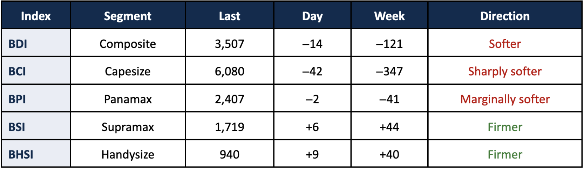
*Signal Figure*

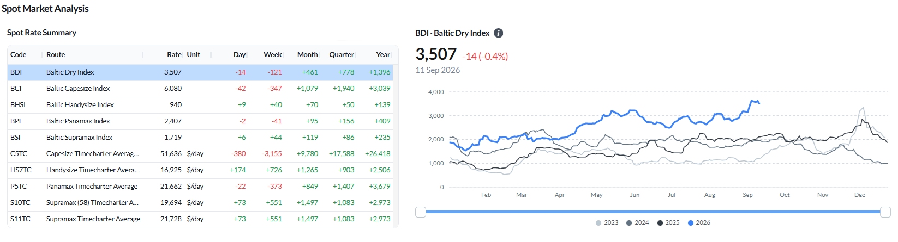
*Figure 2: Baltic Dry Index — spot rate summary across segments and BDI performance as of 11 Sep 2026 (Source: Signal).*

The larger sizes gave back part of their recent gains.The BDI eased to 3,507 points (−14 daily, −121 WoW).Capesizeled the decline, with the BCI falling to 6,080 (−347 WoW) and the C5TC average, on the 180,000 dwt basis, down to $51,636/day (−$3,155 WoW).Panamaxwas marginally lower (BPI 2,407, −41 WoW) with P5TC at $21,662/day (−$373 WoW). The geared sizes moved the other way:Supramaxfirmed (BSI 1,719, +44 WoW) with S11TC at $21,728/day (+$551 WoW) andHandysizerose (BHSI 940, +40 WoW) with HS7TC at $16,925/day (+$726 WoW).

## Ballasters - by region

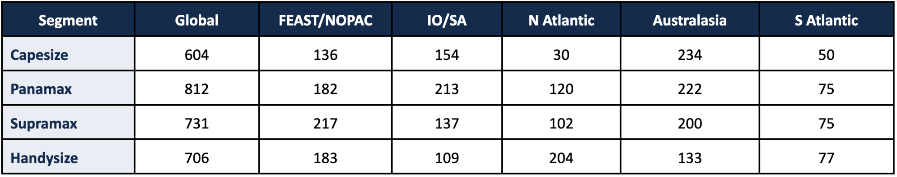
*Table 1: Global ballaster fleet and regional counts as of 11 September 2026 (Source: Signal).*

Supramax carried the largest open tonnage pool of the geared segments at 731 vessels, with 217 in FEAST/NOPAC and 200 in Australasia. Panamax stood at 812, its largest regional pools being Australasia at 222 and the Indian Ocean/South Africa at 213. Handysize totalled 706, with the North Atlantic including Med/Black Sea the largest single pool at 204. Capesize was the smallest fleet at 604, of which 234 were positioned in Australasia.

## CAPESIZE | ANALYSIS

Freight.The BCI eased to 6,080 (−42 day-on-day; −347 week-on-week), with the C5TC average, on the 180,000 dwt basis, at $51,636/day (−$3,155 WoW). The 182,000 dwt weighted average stands at $55,139/day, a differential of $3,503 that follows the Baltic Exchange methodology. The timecharter routes led the decline: C10_182 (China–Japan transpacific round) fell $5,807/day WoW to $57,379/day, C9_182 (Cont–Med trip China–Japan) fell $5,500 to $87,611/day, and C8_182 (Gibraltar/Hamburg transatlantic round) fell $2,843 to $56,313/day. The voyage routes were mixed: C3 (Tubarao–Qingdao) firmed $0.65 to $42.12/mt, C2 (Tubarao–Rotterdam) $0.08 to $19.69/mt and C17 (Saldanha Bay–Qingdao) $1.18 to $31.47/mt, while C5 (West Australia–Qingdao) eased $1.11 to $17.85/mt and C7 (Bolivar–Rotterdam) $0.58 to $23.46/mt.

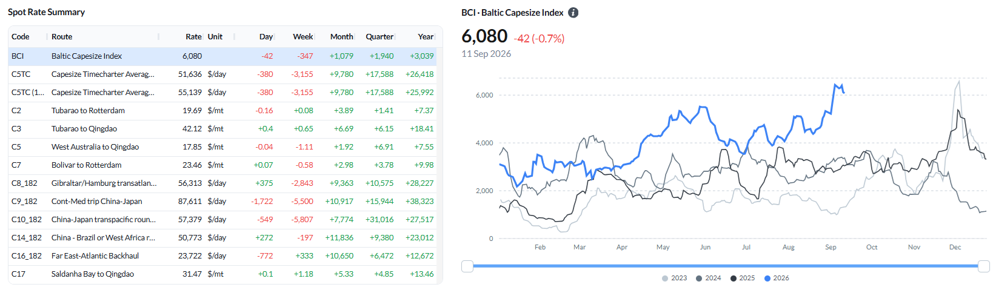
*Figure 3: Baltic Capesize Index (BCI) - spot rate summary and BCI performance (Source: Signal).*

Ballaster positioning.The global Capesize ballaster count stood at 604 on 11 September. Australasia held the largest regional pool at 234, ahead of the Indian Ocean/South Africa at 154 and FEAST/NOPAC at 136. The South Atlantic held 50 and the North Atlantic 30, the smallest pool in the segment.

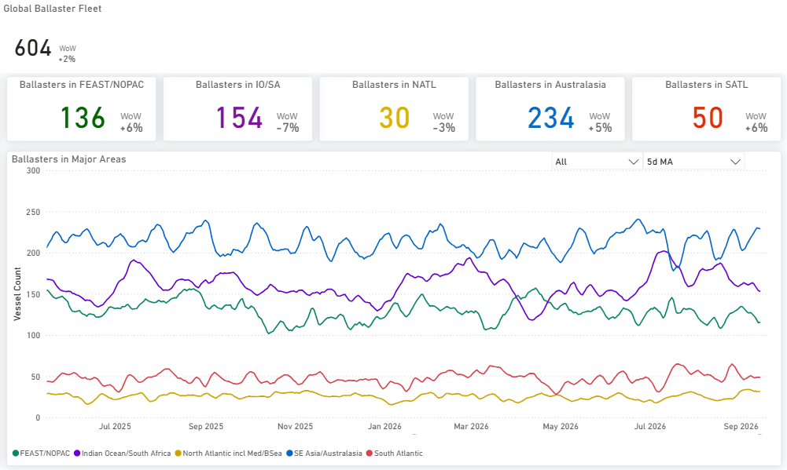
*Figure 4: Capesize - Global ballaster fleet and regional positioning (Source: Signal).*

Supply/demand by route.On C3 (Tubarao–Qingdao), the two lines coincide at the start of the window, after which cumulative supply runs below expected demand over the remainder, with the gap widening through roughly the first thirty days and holding to day 40. On C5 (West Australia–Qingdao), total supply is above expected demand from the start; from around day 11 the two supply measures separate, total supply rising steeply to about 235 vessels against expected demand near 197, while supply excluding laden tonnage flattens near 167 and falls below expected demand late in the window.

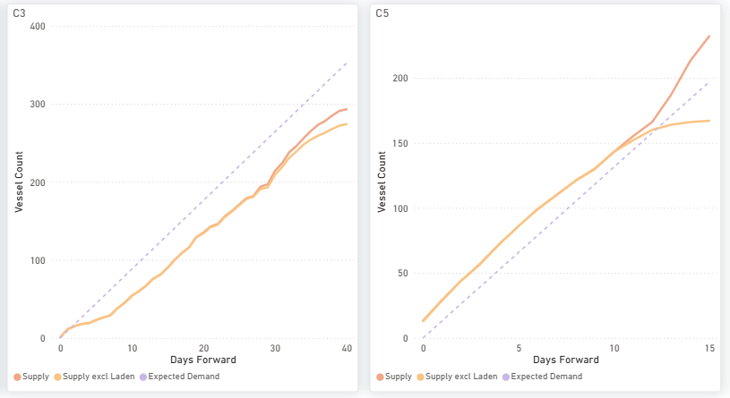
*Figure 5: Capesize - C3 & C5 forward balance: cumulative Supply vs Expected Demand over days forward (Source: Signal).*

Supply/demand - market-position indicator.On the 11 September assessment, C5TC stands at $51,636 a day (−$3,155 WoW), with earnings close to the top of their 52-week range. On the demand-to-supply series for the week ending 10 September, tonne-mile demand is 7.9% above its year-ago level while available tonnage is 1.8% lower, putting the ratio at1.10.

![Figure 6: Capesize - demand-to-supply ratio (LHS bars, four-week-average YoY growth; above 1.00 = tonne-mile demand growing faster than available tonnage) vs weekly C5TC earnings (RHS line). The reading is provisional, and the side of 1.00 may still shift on revision; the final loading day of the week is incomplete, and the Capesize demand leg carries no settlement nowcast.Available tonnage excludes VLOC tonnage on long-term contract. Shaded = latest six provisional weeks. The legend labels denote relative growth rates, not a physical cargo-to-vessel balance (Source: Baltic Exchange; Signal — Voyage API, Vessel Daily Status).](../images/6aab9b29804676e613b06fe4_995ecc83.png)
*Figure 6: Capesize - demand-to-supply ratio (LHS bars, four-week-average YoY growth; above 1.00 = tonne-mile demand growing faster than available tonnage) vs weekly C5TC earnings (RHS line). The reading is provisional, and the side of 1.00 may still shift on revision; the final loading day of the week is incomplete, and the Capesize demand leg carries no settlement nowcast.Available tonnage excludes VLOC tonnage on long-term contract. Shaded = latest six provisional weeks. The legend labels denote relative growth rates, not a physical cargo-to-vessel balance (Source: Baltic Exchange; Signal — Voyage API, Vessel Daily Status).*

## ‍PANAMAX | ANALYSIS

Freight.The BPI eased to 2,407 (−2 day-on-day; −41 week-on-week) and the P5TC average slipped $373 WoW to $21,662/day on the 11 September assessment. The basins diverged. The Atlantic softened: P1A_82 (Skaw–Gibraltar transatlantic round) fell $1,273 to $20,077/day, P2A_82 (Skaw–Gibraltar trip to Taiwan–Japan) fell $690 to $30,703/day, and P6_82 (Singapore round via Atlantic) fell $484 to $22,343/day. The Pacific firmed: P5_82 (South China/Indonesian round) rose $1,145 to $20,339/day, P3A_82 (Hong Kong–South Korea transpacific) rose $569 to $22,163/day, and P4_82 rose $172 to $13,288/day. The grain routes were little changed: P7 (US Gulf–Qingdao) at $76.29/mt and P8 (Santos–Qingdao) at $57.25/mt.

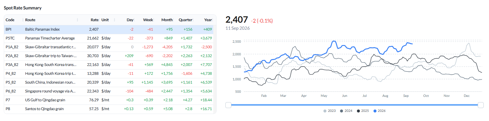
*Figure 7: Baltic Panamax Index (BPI) - spot rate summary and BPI performance (Source: Signal).*

Ballaster positioning.The global Panamax ballaster count stood at 812 on 11 September. Australasia held 222 and the Indian Ocean/South Africa 213, ahead of FEAST/NOPAC at 182 and the North Atlantic at 120. The South Atlantic held 75.

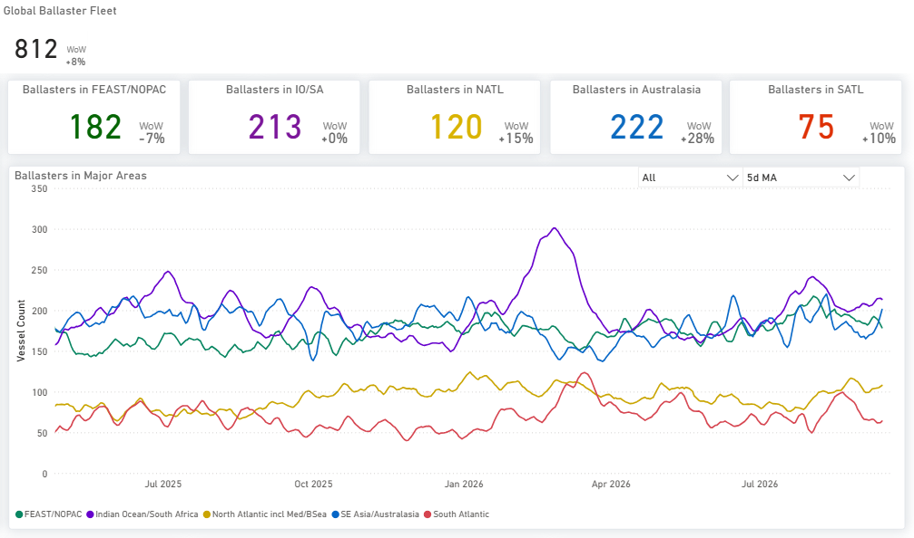
*Figure 8: Panamax - Global ballaster fleet and regional positioning (Source: Signal).*

Supply/demand by route.On P3, supply begins above expected demand and falls below it at around day four to five, with the shortfall widening to the end of the window — the tightest profile in the segment. P1/P2/P7 carry a supply surplus through the first fifteen days and converge with expected demand by day 20. On P5, the Indonesia round, total supply runs above expected demand throughout, while supply excluding laden tonnage flattens below it from around day seven. On P6, total supply tracks close to expected demand for much of the window, with a clearer shortfall emerging from around day 20.

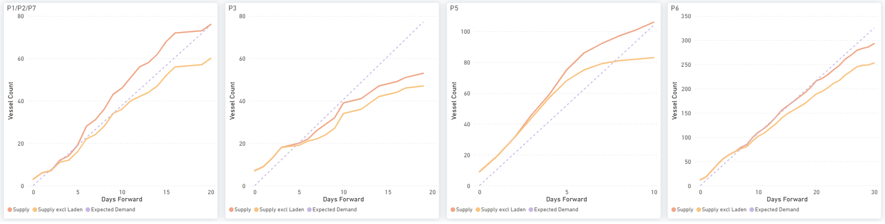
*Figure 9: Panamax - P1/P2/P7, P3, P5 & P6: cumulative Supply vs Expected Demand over days forward (Source: Signal).*

Supply/demand - market-position indicator.On the 11 September assessment, P5TC stands at $21,662 a day (−$373 WoW), with earnings in the 96th percentile of the past year’s weekly observations. On the demand-to-supply series for the week ending 10 September, tonne-mile demand is 6.9% below a year ago while available tonnage is 2.1% higher, lowering the ratio to0.91from 0.94. Rates remain firm while the growth in available tonnage continues to run ahead of the growth in tonne-mile demand; the ratio compares growth rates and does not measure a physical vessel surplus.

![Figure 10: Panamax - demand-to-supply ratio (LHS bars, four-week-average YoY growth; above 1.00 = tonne-mile demand growing faster than available tonnage) vs weekly P5TC earnings (RHS line). Shaded = latest three provisional weeks.  The reading is provisional, and the tonne-mile leg carries a settlement nowcast for the incomplete final loading day. The legend labels denote relative growth rates, not a physical cargo-to-vessel balance (Source: Baltic Exchange; Signal — Voyage API, Vessel Daily Status).](../images/6aab9b29804676e613b06fd8_ab9595bf.png)
*Figure 10: Panamax - demand-to-supply ratio (LHS bars, four-week-average YoY growth; above 1.00 = tonne-mile demand growing faster than available tonnage) vs weekly P5TC earnings (RHS line). Shaded = latest three provisional weeks.  The reading is provisional, and the tonne-mile leg carries a settlement nowcast for the incomplete final loading day. The legend labels denote relative growth rates, not a physical cargo-to-vessel balance (Source: Baltic Exchange; Signal — Voyage API, Vessel Daily Status).*

## SUPRAMAX | ANALYSIS

Freight.The BSI rose to 1,719 (+6 day-on-day; +44 week-on-week), with the S10TC average at $19,694/day and S11TC at $21,728/day, both up $551 WoW. The gains were broad. S1C (US Gulf to China–South Japan) rose $1,313 to $33,694/day, S1B (Canakkale trip via Mediterranean) rose $1,303 to $24,671/day, and S4A (US Gulf to Skaw-Passero) rose $1,116 to $33,100/day. In Asia and West Africa, S5 rose $682 to $27,313/day, S2 (North China one Australian round) rose $512 to $20,125/day, S9 rose $425 to $22,469/day, S3 rose $400 to $19,783/day, and S8 (South China via Indonesia) rose $343 to $23,639/day. S10 was the only route lower, easing from $34 to $15,863/day.

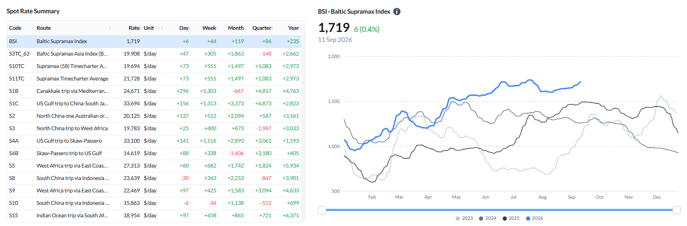
*Figure 11: Baltic Supramax Index (BSI) - spot rate summary and BSI performance (Source: Signal).*

Ballaster positioning.The global Supramax ballaster count stood at 731 on 11 September, the largest pool of the geared segments. FEAST/NOPAC held 217 and Australasia 200, ahead of the Indian Ocean/South Africa at 137 and the North Atlantic at 102. The South Atlantic held 75.

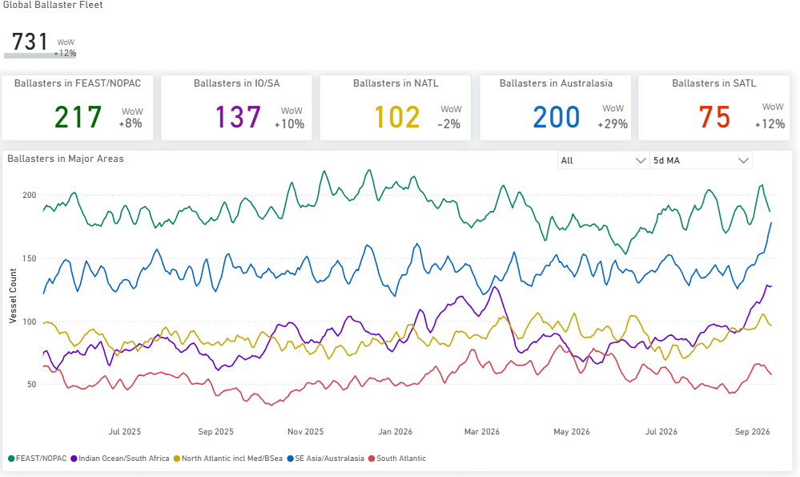
*Figure 12: Supramax - Global ballaster fleet and regional positioning (Source: Signal).*

Supply/demand by route.S4A/S1C and S4B both carry a clear cumulative supply surplus across the full window, widest on S4B, where supply reaches about 115 vessels against expected demand near 57 at day 20. S8/S10 also runs above expected demand throughout. S5 is the closest to balance over the first ten days only; thereafter, supply moves clearly ahead, reaching about 165 to 170 vessels by day 20 against expected demand near 100.

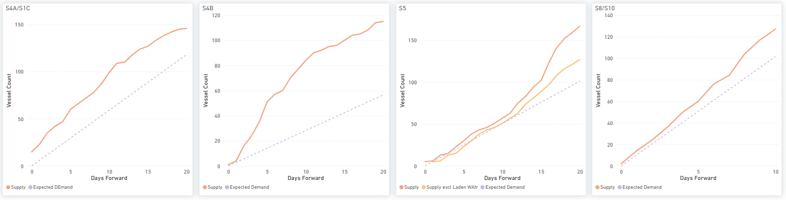
*Figure 13: Supramax - S4A/S1C, S4B, S5 & S8/S10: cumulative Supply vs Expected Demand over days forward (Source: Signal).*

Supply/demand — market-position indicator.On the 11 September assessment, S11TC stands at $21,728 a day (+$551 WoW), with earnings in the 92nd percentile of the past year’s weekly observations. On the demand-to-supply series for the week ending 10 September, tonne-mile demand is 16.7% below a year ago while available tonnage is 5.7% higher, taking the ratio down to0.79from 0.84. Rates have advanced while the gap between the two growth rates widened; the ratio compares growth rates and does not measure a physical vessel surplus.

![Figure 14: Supramax — demand-to-supply ratio (LHS bars, four-week-average YoY growth; above 1.00 = tonne-mile demand growing faster than available tonnage) vs weekly S11TC earnings (RHS line). Shaded = latest three provisional weeks. The reading is provisional, and the tonne-mile leg carries a settlement nowcast for the incomplete final loading day. The legend labels denote relative growth rates, not a physical cargo-to-vessel balance (Source: Baltic Exchange; Signal — Voyage API, Vessel Daily Status).](../images/6aab9b29804676e613b06ff7_abee54e6.png)
*Figure 14: Supramax — demand-to-supply ratio (LHS bars, four-week-average YoY growth; above 1.00 = tonne-mile demand growing faster than available tonnage) vs weekly S11TC earnings (RHS line). Shaded = latest three provisional weeks. The reading is provisional, and the tonne-mile leg carries a settlement nowcast for the incomplete final loading day. The legend labels denote relative growth rates, not a physical cargo-to-vessel balance (Source: Baltic Exchange; Signal — Voyage API, Vessel Daily Status).*

## HANDYSIZE | ANALYSIS

Freight.The BHSI rose to 940 (+9 day-on-day; +40 week-on-week), the largest weekly percentage gain of the four segments, with the HS7TC average up $726 WoW to $16,925/day. The Atlantic carried the move: HS4_38 (US Gulf) rose $2,965 to $18,779/day, HS2_38 (Skaw-Passero to Boston) $943 to $12,164/day, HS3_38 (Rio de Janeiro–Recalada) $872 to $24,222/day and HS1_38 (Skaw-Passero to Rio de Janeiro) $764 to $8,993/day. The Pacific was steadier, with HS7_38 up $187 to $18,006/day and HS5_38 up $81 to $18,250/day, while HS6_38 was effectively unchanged at $17,275/day (−$6).

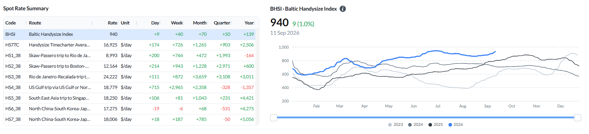
*Figure 15: Baltic Handysize Index (BHSI) — spot rate summary and BHSI performance (Source: Signal).*

Ballaster positioning.The global Handysize ballaster count stood at 706 on 11 September. The North Atlantic, including Med/Black Sea, held the largest pool at 204, ahead of FEAST/NOPAC at 183 and Australasia at 133. The Indian Ocean/South Africa held 109 and the South Atlantic 77.

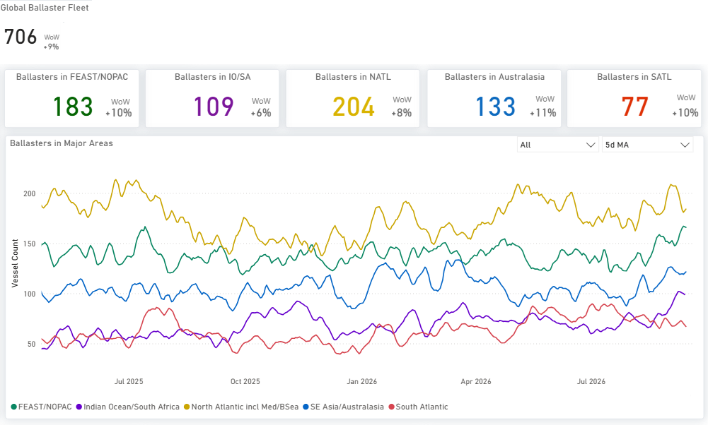
*Figure 16: Handysize — Global ballaster fleet and regional positioning (Source: Signal).*

Supply/demand by route.HS1/HS2, HS5 and HS6 all carry a cumulative supply surplus across their windows, widest on HS1/HS2, where supply reaches about 165 vessels by day 15 against expected demand near 115. HS7 (Far East) differs: total supply is below expected demand over roughly the first four days, then moves above it and stays above to day 10, while supply excluding laden tonnage remains below expected demand until about day six and converges with it at the end of the window.

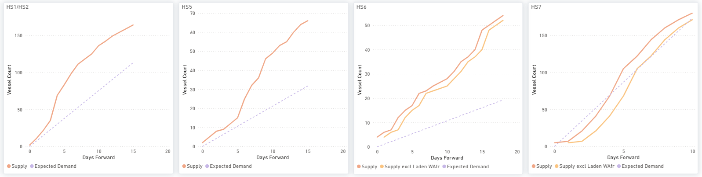
*Figure 17: Handysize — HS1/HS2, HS5, HS6 & HS7: cumulative Supply vs Expected Demand over days forward (Source: Signal).*

Supply/demand — market-position indicator.On the 11 September assessment, HS7TC stands at $16,925 a day (+$726 WoW), with earnings in the 90th percentile of the past year’s weekly observations. On the demand-to-supply series for the week ending 10 September, tonne-mile demand is 14.0% below a year ago and available tonnage is 4.1% lower, leaving the ratio at0.90. Demand contracted faster than available tonnage, which establishes the relative rates of change and not the size of any physical vessel surplus.

![Figure 18: Handysize — demand-to-supply ratio (LHS bars, four-week-average YoY growth; above 1.00 = tonne-mile demand growing faster than available tonnage) vs weekly HS7TC earnings (RHS line). Shaded = latest five provisional weeks. The legend labels denote relative growth rates, not a physical cargo-to-vessel balance (Source: Baltic Exchange; Signal — Voyage API, Vessel Daily Status). Handysize demand is built from Voyage API tonne-mile alone, a different basis from the Panamax and Supramax blended series, so the level is not comparable across segments. The reading is provisional, and the demand leg carries no settlement nowcast.](../images/6aab9b29804676e613b07009_358f7ab4.png)
*Figure 18: Handysize — demand-to-supply ratio (LHS bars, four-week-average YoY growth; above 1.00 = tonne-mile demand growing faster than available tonnage) vs weekly HS7TC earnings (RHS line). Shaded = latest five provisional weeks. The legend labels denote relative growth rates, not a physical cargo-to-vessel balance (Source: Baltic Exchange; Signal — Voyage API, Vessel Daily Status). Handysize demand is built from Voyage API tonne-mile alone, a different basis from the Panamax and Supramax blended series, so the level is not comparable across segments. The reading is provisional, and the demand leg carries no settlement nowcast.*

## OVERALL MARKET TREND | CONCLUSIONS

*Table 2: Index levels, route rates and time charter averages are the published assessments of 11 September 2026; ballaster counts are as of the same date. Demand-to-supply ratios are the weekly series for the week ending 10 September 2026 and are provisional (Source: Signal; Baltic Exchange).*

Weekly comparison:On the 11 September assessment, the two larger segments eased, and the two geared segments rose: the BCI fell 347 points to 6,080 and the BPI 41 points to 2,407, while the BSI rose 44 points to 1,719 and the BHSI 40 points to 940. The time charter averages moved the same way: C5TC down $3,155 to $51,636/day and P5TC down $373 to $21,662/day, against S11TC up $551 to $21,728/day and HS7TC up $726 to $16,925/day. Against the month-ago column, every index remains higher: the BCI by 1,079 points and the BDI by 461 points.

Key takeaway:Capesize is the only segment where the market-position indicator sits above 1.00, at1.10, with tonne-mile demand 7.9% above its year-ago level against available tonnage 1.8% lower. In the other three segments, the indicator stayed below 1.00 — Panamax at 0.91, Supramax at 0.79 and Handysize at 0.90 — meaning available tonnage grew faster than tonne-mile demand over the comparison rather than that a vessel surplus of that size exists. On the spotlight, the Panamax index eased in the week to 11 September while its Pacific routes gained and its Atlantic routes fell; China-bound thermal coal flows recorded through August were lower year on year, and the IEA projections published on 10 September point to a smaller seaborne thermal market in 2026.
