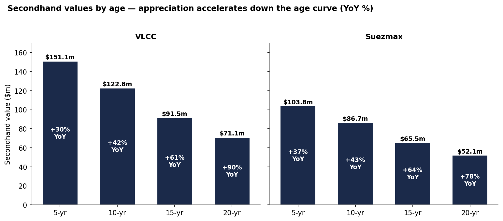
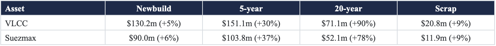
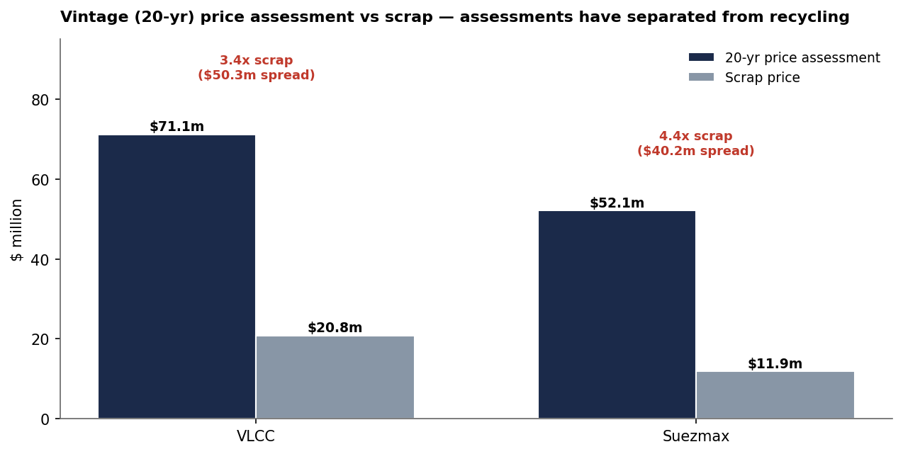
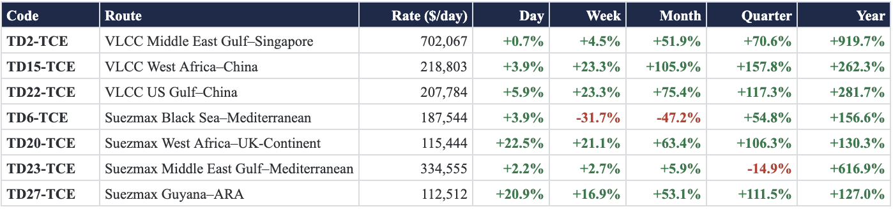
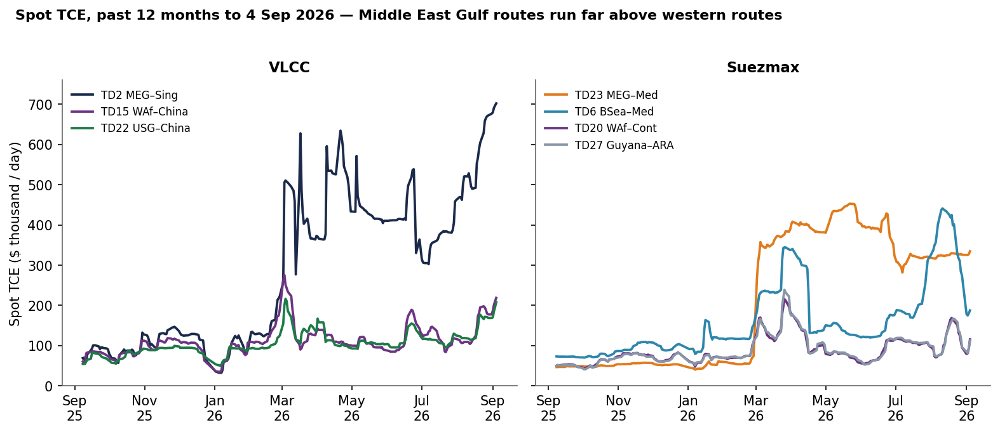
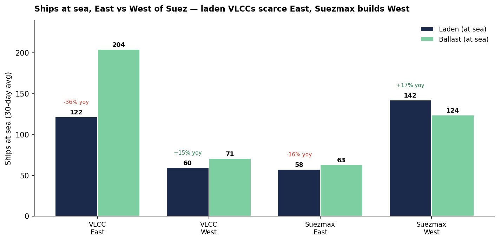

# Weekly Tanker Market Monitor: Week 35 2026

*Published on 07 September 2026*

## Spotlight of the Week

## Vintage Tonnage Captures the Freight Premium

The defining feature of the current asset market is not limited to five-year-old tonnage trading above newbuilding prices. Repricing spans the entire age curve and intensifies with vessel age. VLCC values are up 30% year-over-year at five years, 42% at ten years, 61% at fifteen years, and 90% at twenty years. The Suezmax curve shows the same progression, with gains of 37%, 43%, 64%, and 78%, respectively. A 20-year-old VLCC is now assessed at $71.1m, and an equivalent Suezmax at $52.1m, despite both being much closer to the end of their conventional trading lives.

> **Chart 1: Secondhand Values by Age, VLCC and Suezmax, with Year-on-Year Change.source: Signal; Benchmark Values Through End-August 2026.**  
> *Chart 1. Secondhand values by age, VLCC and Suezmax, with year-on-year change.Source: Signal; benchmark values through end-August 2026.*  
> **Interactive Data & Source:** [Signal Ocean Platform](https://www.thesignalgroup.com/weekly-market-monitor/weekly-tanker-market-monitor-week-35-2026) | [Local Asset](file:///C:/Users/Dell/Github/Shipping/corpus/07-signal/images/6a9e7b40665954dc632aa619_37e41995.png)

**MARKET SIGNAL:  Five-year-old VLCC and Suezmax values exceed newbuilding benchmarks, but appreciation increases with age and peaks at 90% and 78%, respectively, for 20-year-old tonnage.**

## Asset Repricing Extends to the End of the Age Curve

> **Figure 2: Asset Repricing Extends to the End of the Age Curve**  
> **Interactive Data & Source:** [Signal Ocean Platform](https://www.thesignalgroup.com/weekly-market-monitor/weekly-tanker-market-monitor-week-35-2026) | [Local Asset](file:///C:/Users/Dell/Github/Shipping/corpus/07-signal/images/6a9e7a87af6898adebfc2d3e_Screenshot 2026-09-07 at 09.48.55.png)

A 20-year-old VLCC is assessed at $71.1m against $20.8m for scrap, a $50.3m spread, 3.4 times recycling value; one year earlier the implied spread was near $18m. For Suezmaxes, $52.1m stands against $11.9m for scrap, a $40.2m spread and 4.4 times recycling value. This gap changes the disposal decision: special-survey cost, sanctions status, insurance and vetting can still force individual removals, but on economics alone a commercially employable vintage ship is worth substantially more in continued trading than at the yard.

> **Chart 2: Vintage (20-Year) Price Assessment vs Scrap, VLCC and Suezmax.source: Signal; Benchmark Values Through End-August 2026.**  
> *Chart 2. Vintage (20-year) price assessment vs scrap, VLCC and Suezmax.Source: Signal; benchmark values through end-August 2026.*  
> **Interactive Data & Source:** [Signal Ocean Platform](https://www.thesignalgroup.com/weekly-market-monitor/weekly-tanker-market-monitor-week-35-2026) | [Local Asset](file:///C:/Users/Dell/Github/Shipping/corpus/07-signal/images/6a9e7b40665954dc632aa61c_18b6d3e9.png)

## Hormuz Freight Watch - Military Escalation Replaces Diplomacy

**UPDATED POSITION:  The Iran–US relationship is not moving towards a managed reopening. The Strait has instead become a contest over who sets and enforces the conditions of passage, combining attacks on commercial vessels, military strikes, competing navigation rules, blacklisting and sanctions exposure. The latest exchange has moved the risk beyond disruption around the waterway: commercial tankers are now being used directly in the military contest between Washington and Tehran.**

31 August - Projectiles near Khasab struck the Saudi-flagged VLCC *Sidr* and Liberian-flagged VLCC *Senegal* *Prosperity*. Bahri subsequently confirmed that two Filipino seafarers aboard *Sidr* were killed. Saudi Arabia attributed the attack on *Sidr* to Iran. Public reporting has been less definitive on responsibility for the strike on *Senegal Prosperity*.

1 September - US forces struck around 100 Iranian targets, including IRGC air-defence sites, radar and communications facilities, maritime assets and mine-laying capabilities. The operation also included strikes on two Iranian government tankers, the first publicly reported US attacks on Iranian tankers in retaliation for attacks on commercial shipping. Iran subsequently launched attacks against US-linked positions and assets in the region.

2 September - Iran added 11 vessels to its non-compliance list, taking the total to 56. Tehran also warned that vessels cooperating with listed ships through ship-to-ship transfers or transshipment could themselves face restrictions, detention or confiscation.

**5–6 September -** The tanker confrontation escalated further. CENTCOM said US forces struck three Iranian crude tankers after the IRGC targeted two US warships. Iran then claimed attacks on three US-linked vessels using what it described as an unauthorised route through the Strait. Not all Iranian claims were independently confirmed. Tehran also announced plans for a new restricted or exclusion zone outside the Strait, extending the contest over navigation conditions deeper into the Gulf.

**STRAIT STATUS (late August, UKMTO):  The IMO traffic-separation arrangements remain suspended, and the recognised routing system has not returned to normal operation. The latest available UKMTO assessment continues to classify the Strait of Hormuz at severe risk, with substantial risk across the Gulf of Oman. By 6 September, UKMTO had recorded 27 projectile-strike incidents around the Strait since 6 July, causing damage to commercial vessels.**

CENTCOM continues to state that recognised lanes have been cleared of Iranian mines, but clearance has not produced a commercially normal passage regime. The physical mine threat is now only one part of the risk: vessels must also consider projectile attacks, Iranian routing restrictions, US naval operations, blacklist exposure and the possibility of becoming involved in retaliatory action.

War-risk cover has not reset alongside mine clearance. Recent market estimates place additional premiums at approximately 7.5–10% of hull value for higher-risk voyages, although quotations vary substantially by vessel profile, ownership, route and timing. This compares with approximately 0.25% before the conflict. TotalEnergies has estimated that sending a two-million-barrel VLCC through Hormuz and back costs around $20 million, equivalent to roughly $10 per barrel. For refined products carried on smaller vessels, the additional transport burden can approach $50 per barrel, potentially making the voyage commercially unviable.

Iran’s blacklist has moved from a regulatory threat to a practical chartering constraint. At least three Indian refiners and one major international energy company have indicated that they will avoid listed vessels, including in ship-to-ship operations. This narrows the commercially acceptable pool and increasingly separates sanctions-compliant tonnage from vessels exposed to Iranian detention, confiscation or restrictions.

## Freight - East-of-Suez Earnings Retain a Wide Premium

East of Suez, VLCC time-charter-equivalents out of the Middle East Gulf are running near $702,000/day on MEG–Singapore (TD2), more than 900% above a year earlier. West-of-Suez VLCC routes sit lower but have firmed, around $219,000/day on West Africa–China (TD15) and $208,000/day on US Gulf–China (TD22), both up more than 20% on the week. In the Suezmax market, MEG–Med (TD23) holds near $335,000/day against Black Sea–Med (TD6) at $188,000/day and West Africa–Continent (TD20) and Guyana–ARA (TD27) around $112–115,000/day. East-of-Suez earnings remain roughly three times their western equivalents.

## Spot Rate Summary - Dirty TCE, VLCC and Suezmax

> **Figure 4: Freight/tce: Signal · 4 September 2026**  
> *Freight/TCE: Signal · 4 September 2026. Day/Week/Month/Quarter/Year are percentage changes.*  
> **Interactive Data & Source:** [Signal Ocean Platform](https://www.thesignalgroup.com/weekly-market-monitor/weekly-tanker-market-monitor-week-35-2026) | [Local Asset](file:///C:/Users/Dell/Github/Shipping/corpus/07-signal/images/6a9e7ae1d5f65dba7b6ff173_Screenshot 2026-09-07 at 09.50.20.png)

> **Chart 3: VLCC and Suezmax Spot TCE, Past 12 Months - Middle East Gulf Routes Run Far Above Western Routes in Both Segments.freight/tce: Signal.**  
> *Chart 3. VLCC and Suezmax spot TCE, past 12 months - Middle East Gulf routes run far above western routes in both segments.Freight/TCE: Signal.*  
> **Interactive Data & Source:** [Signal Ocean Platform](https://www.thesignalgroup.com/weekly-market-monitor/weekly-tanker-market-monitor-week-35-2026) | [Local Asset](file:///C:/Users/Dell/Github/Shipping/corpus/07-signal/images/6a9e7b40665954dc632aa61f_99362554.png)

Laden VLCC availability at sea East of Suez has fallen 36% year on year to 122 vessels on a 30-day average, while ballast availability remains substantially higher at 204. West of Suez, laden VLCC availability increased 15% to 60 vessels, with 71 vessels in ballast. The Suezmax distribution points in the opposite direction: laden availability West of Suez rose 17% to 142 vessels, the highest level in the 2023–2026 range, while the corresponding East-of-Suez count fell 16% to 58. Ballast Suezmax availability stood at 124 vessels West of Suez and 63 East of Suez.

> **Chart 4: Ships at Sea (30-Day Average), East vs West of Suez, Laden and Ballast.ships-at-Sea Data: Signal**  
> *Chart 4. Ships at sea (30-day average), East vs West of Suez, laden and ballast.Ships-at-sea data: Signal. Laden labels show year-on-year change.*  
> **Interactive Data & Source:** [Signal Ocean Platform](https://www.thesignalgroup.com/weekly-market-monitor/weekly-tanker-market-monitor-week-35-2026) | [Local Asset](file:///C:/Users/Dell/Github/Shipping/corpus/07-signal/images/6a9e7b40665954dc632aa622_cffdabbd.png)

## Investment & Supply - Two Clocks Are Running

Freight market conditions have reshaped investment decisions. Buyers are paying a premium for vessels with immediate earning capacity, while stronger asset values are giving sellers more scope to crystallize gains. At the same time, the earnings outlook is supporting heavy contracting for future delivery.

Secondhand activity has strengthened across the age curve, with reported buying interest running well ahead of last year. The market is therefore serving both sides: sellers can monetize elevated values, while buyers accept higher acquisition costs to gain immediate exposure to earnings. Recycling remains the missing supply response. VLCC and Suezmax scrap benchmarks are up only 9% year over year, compared with gains of 78–90% in assessed values for 20-year-old vessels. With freight earnings and vintage-tonnage values elevated, recycling is likely to remain exceptionally limited. This will slow the removal of older vessels even as the [2026](https://www.thesignalgroup.com/weekly-market-monitor/weekly-tanker-market-monitor-week-28-2026) order count, 279 crude tankers, including 217 VLCCs, builds the future delivery pipeline.

## Takeaway

Under the current price trajectory, with secondhand values up across the age range, owners are well placed to realise gains, and selling interest is likely to remain elevated. Demand for newbuildings will persist in parallel, but only for as long as newbuilding prices stay below five-year-old secondhand values. A five-year-old VLCC is assessed at $151.1m against a $130.2m newbuild, and a five-year-old Suezmax at $103.8m against a $90.0m newbuild. The freight risk premium, meanwhile, has not faded. Goldman Sachs warns crude could rally to as much as $120 a barrel if attacks on Middle East shipping intensify and recommends natural gas and diesel as ways to capture the move.

Disclaimer: This report has been prepared by Signal Group for general information purposes only. It does not constitute, and should not be relied upon as, investment, financial, trading, legal or commercial advice, or as a recommendation to enter into any transaction. While reasonable efforts have been made to ensure that the information is accurate and reliable at the date of publication, no representation or warranty, express or implied, is given as to its accuracy, completeness or continued availability. Certain figures may be estimates or provisional and may subsequently be revised. Market conditions and other external factors may change without notice and may not be reflected in this report. Readers should conduct their own assessment and seek appropriate professional advice before making any decision. To the fullest extent permitted by law, Signal Group accepts no liability for any loss or damage arising from the use of, or reliance on, this report.

Copyright notice: © [2026] Signal Group. All rights reserved. Except where otherwise stated or permitted by law, this report may not be copied, reproduced, modified, published or redistributed, in whole or in part, without the prior written consent of Signal Group. Third-party data and content remain the property of their respective owners and are used subject to the applicable terms and licences.

For the latest updates and insights, make sure to visit the [Signal Ocean Newsroom](https://www.thesignalgroup.com/newsroom) page & [subscribe to weekly reports](http://www.thesignalgroup.com/subscribe).

For subscription to our FREE weekly market trends email, please contact us: research@thesignalgroup.com

-Republishing is allowed with an active link to the source
