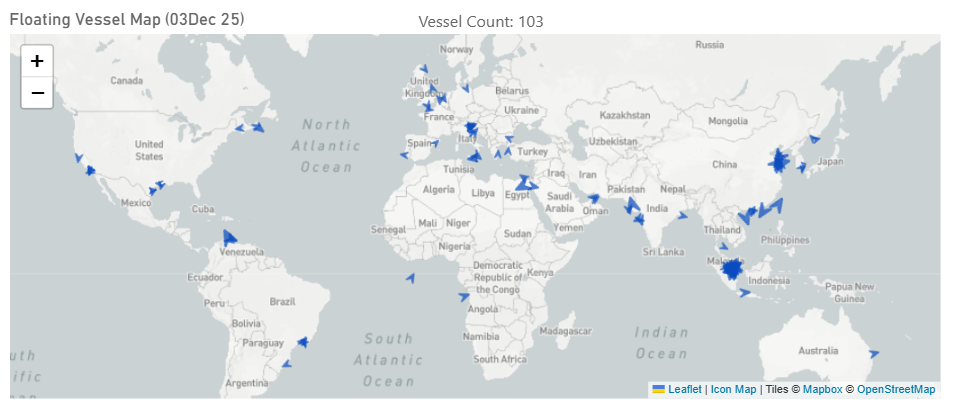
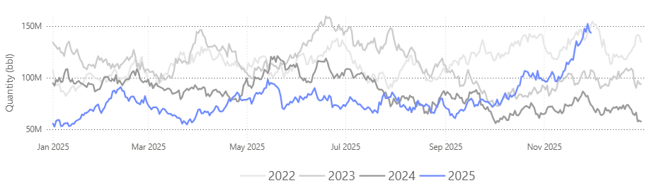
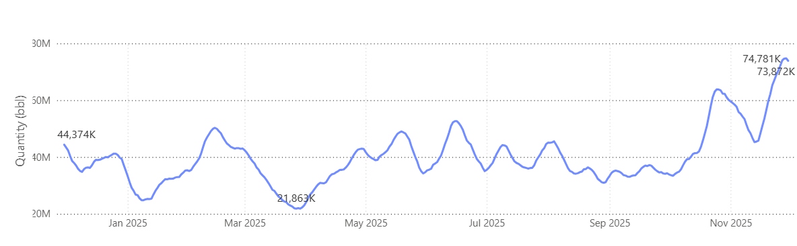
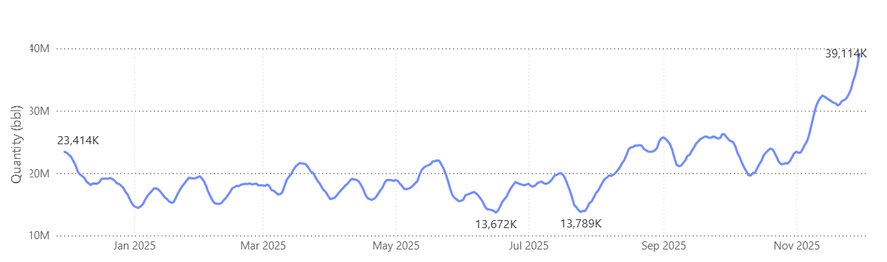
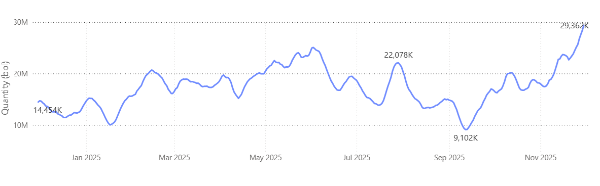
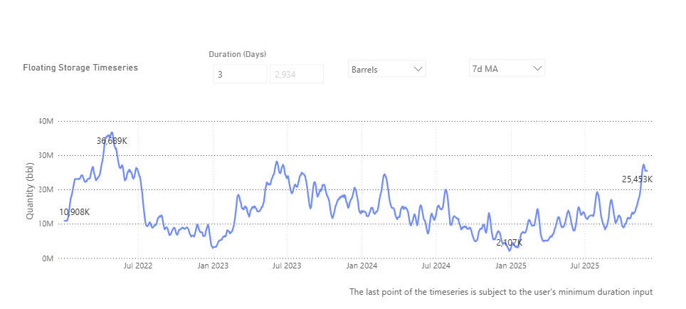
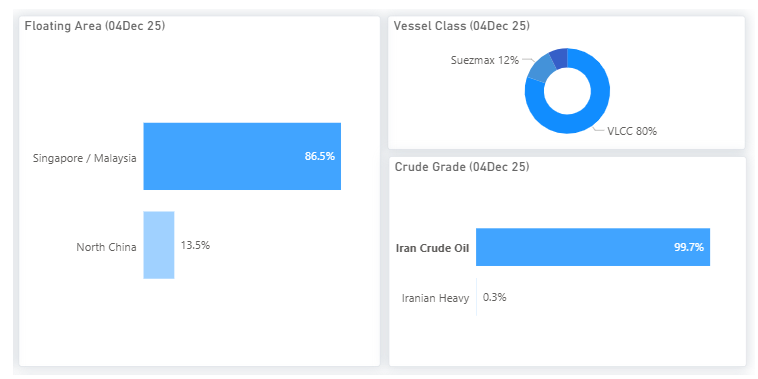

# Market Insights | Floating Storage Hits Three-Year High

*Published on 05 December 2025*

## Market Insights | Floating Storage Hits Three-Year High

## Offshore Volumes Rise Amid Growing Oversupply Signals

A data-driven review facilitated by the [**Floating Storage platform report**](https://app.signalocean.com/tanker/dynamic/floating\_storage)shows the seasonality of floating storage since 2022 across VLCC, Suezmax, and Aframax fleets, the surge in Iranian-linked storage off Malaysia, and future outlooks marked by persistent oversupply risks and declining oil price estimates.

> **Figure 1: Powered by Voyages API**  
> *Powered by Voyages API*  
> **Interactive Data & Source:** [Signal Ocean Platform](https://www.thesignalgroup.com/newsroom/market-insights-floating-storage-hits-three-year-high) | [Local Asset](file:///C:/Users/Dell/Github/Shipping/corpus/07-signal/images/6932e5f58e58320271a431d1_6ed7abf7.png)

- [Floating](https://app.signalocean.com/tanker/dynamic/floating\_storage) storage is rising sharply across the tanker segments, VLCC, Suezmax, and Aframax, signalling a market increasingly shaped by oversupply concerns. The latest readings point to a decisive break higher through late 2025, with floating barrels approaching the 150 million bbl threshold peak recorded back in November 2022.

> **Figure 2: Offshore Volumes Rise Amid Growing Oversupply Signals**  
> **Interactive Data & Source:** [Signal Ocean Platform](https://www.thesignalgroup.com/newsroom/market-insights-floating-storage-hits-three-year-high) | [Local Asset](file:///C:/Users/Dell/Github/Shipping/corpus/07-signal/images/6932e5f58e58320271a431dd_2ab5a4ca.png)

## Floatingstorage Trends | Per Vessel Size Segment

- As of 3 December, VLCCs dominate floating storage with a 48% share, while Suezmax and Aframax fleets contribute 28% and 24%, highlighting the heavier concentration of crude held on larger tonnage.

**VLCC |** 7D MA: > 70 Mbbl, compared with ~22 Mbbl in March (+230%)

> **Figure 3: Floating Storage Trends | Per Vessel Size Segment**  
> **Interactive Data & Source:** [Signal Ocean Platform](https://www.thesignalgroup.com/newsroom/market-insights-floating-storage-hits-three-year-high) | [Local Asset](file:///C:/Users/Dell/Github/Shipping/corpus/07-signal/images/6932e5f58e58320271a431d7_11f934b9.png)

**Suezmax |** 7D MA: ~40 Mbbl, compared with a mid-year low of ~13.7 Mbbl (+185%)

> **Figure 4: Floating Storage Trends | Per Vessel Size Segment**  
> **Interactive Data & Source:** [Signal Ocean Platform](https://www.thesignalgroup.com/newsroom/market-insights-floating-storage-hits-three-year-high) | [Local Asset](file:///C:/Users/Dell/Github/Shipping/corpus/07-signal/images/6932e5f58e58320271a431d4_d24f1ba2.png)

**Aframax |** 7D MA: ~29 Mbbl, up from an early-September low of ~9.1 Mbbl (+220%)

> **Figure 5: Floating Storage Trends | Per Vessel Size Segment**  
> **Interactive Data & Source:** [Signal Ocean Platform](https://www.thesignalgroup.com/newsroom/market-insights-floating-storage-hits-three-year-high) | [Local Asset](file:///C:/Users/Dell/Github/Shipping/corpus/07-signal/images/6932e5f58e58320271a431da_d80d63b8.png)

## Iranian Barrels Dominate Floating Storage

- Iranian crude represents the largest share of floating storage, with Malaysia acting as the main concentration point.

> **Figure 6: Iranian Barrels Dominate Floating Storage**  
> **Interactive Data & Source:** [Signal Ocean Platform](https://www.thesignalgroup.com/newsroom/market-insights-floating-storage-hits-three-year-high) | [Local Asset](file:///C:/Users/Dell/Github/Shipping/corpus/07-signal/images/6932e5f58e58320271a431e0_2d6fe162.png)

Compared with earlier months, the recent increase in floating crude volumes coincides with indications that China’s independent refiners had exhausted their import quotas and that teapot run rates had softened amid weak margins, both of which have historically influenced refiners’ willingness to take cargo from offshore. The time series shows a clear rise in floating barrels in early December, returning toward levels seen during previous spikes. However, the recent announcement of a new batch of crude import quotas for the remainder of the year will work in the direction of clearing those extra flows waiting on tankers.

> **Figure 7: Iranian Barrels Dominate Floating Storage**  
> **Interactive Data & Source:** [Signal Ocean Platform](https://www.thesignalgroup.com/newsroom/market-insights-floating-storage-hits-three-year-high) | [Local Asset](file:///C:/Users/Dell/Github/Shipping/corpus/07-signal/images/6932e5f58e58320271a431e3_d1ecfe4b.png)

At the same time, the distribution of stored volumes has shifted decisively toward offshore transfer hubs. As of 4 December, approximately 86% of floating barrels were concentrated in the Singapore/Malaysia area, which is commonly used for ship-to-ship transfers and the temporary holding of sanctioned or discounted crude, including Iranian grades. Vessel-level data further shows that the build-up is dominated by VLCCs (80%) carrying almost exclusively Iranian crude (≈99.7%), underscoring that the surge is not broad-based but tied to a specific supply stream facing slower onward absorption.

These refinery-side constraints, combined with refiners’ tactical choice to delay intake rather than accelerate discharge, help explain the longer waiting times, [rising floating storage](https://www.presstv.ir/Detail/2025/12/03/759975/China-oil-imports-Iran-increase-new-quotas), and slower clearance into China that are now visible across the market.

## Macro Elements Supportive of the High Floating Storage Trends Include Oversupply and Oil Price Projections

Macro conditions continue to align with the recent rise in floating storage. Several major outlooks point to a looser physical balance heading into 2026, with non-OPEC supply growth remaining a key feature. The latest forecasts still show incremental barrels led by U.S. shale, along with continued offshore growth from Brazil and Guyana.

Oil prices have softened in recent weeks as demand expectations are reassessed and broader risk sentiment cools. Forward spreads have also eased at times, creating periods where short-term storage economics become more viable, which can contribute to the build in offshore volumes when combined with already ample supply.

OPEC+ has signalled a cautious approach to supply management heading into early 2026, though analysts generally expect global balances to remain on the looser side. If oversupply persists and refinery maintenance intensifies into Q1, floating storage could remain elevated, tightening vessel availability and adding upward pressure to freight rates.

**Use Signal Ocean’s Voyage Details to spot emerging signals and stay ahead of shifts in the oil world. For more insights, please** [**contact our team**](https://www.thesignalgroup.com/request-demo?utm\_source=%20oceanhome&utm\_medium=website&utm\_campaign=demo) **. Stay ahead of the curve. Get access to the** [**Signal Ocean Platform**](https://www.thesignalgroup.com/signal-ocean/signal-ocean-platform) **.**
