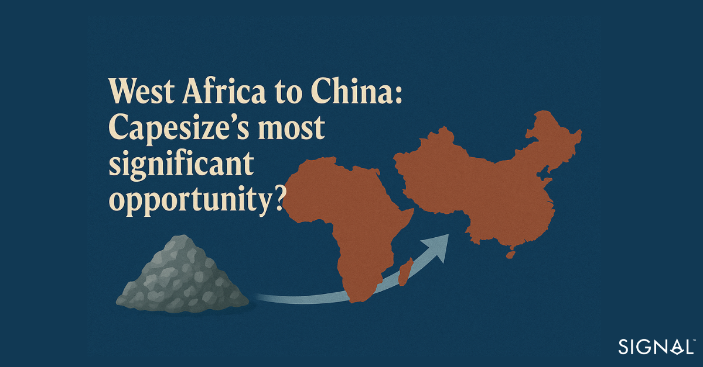
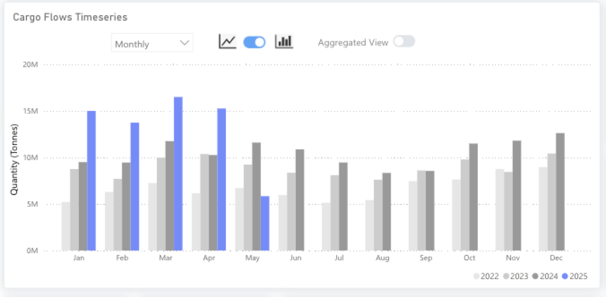
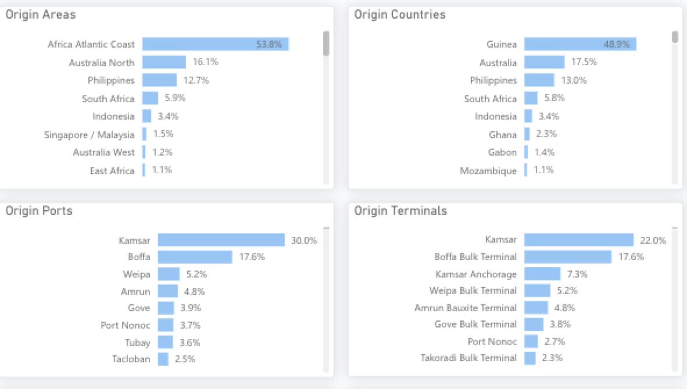
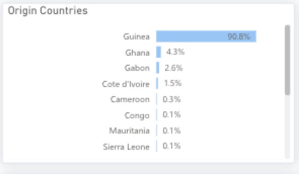
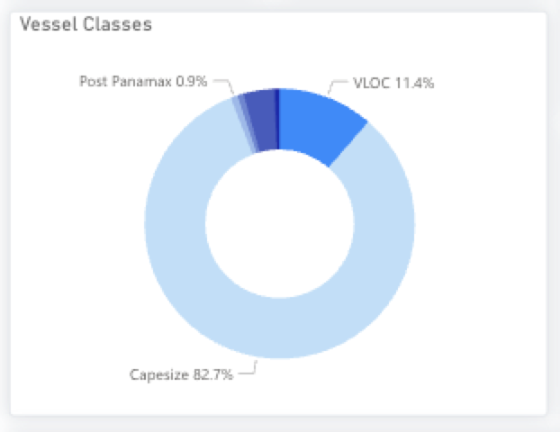

# West Africa to China - Capesize’s Most Significant Opportunity?

*Published on 28 April 2025*

## Through Our Dry Bulk Flow Tool, We Have Identified Changing Trends in the Trade of Bulk Raw Materials From the West Coast of Africa to China. in Particular, Bauxite Flows Have Surged, Driven by China’s Growing Aluminium Production, Leading to a Greater Need for Capesize Vessels. as Raw Material Sourcing Fluctuates, This Tool Enables Valuable Insight Into This Ever-Changing Landscape. in This Report, We Illustrate How Capesize Demand From Western Africa to China Is Set to Rocket and the Drivers Behind This.

> **Figure 1: 680f4bc25f885904e5ef8c39 Ad 4nxfdjinih Tx62bgadf8jypzonmhmnb5tqisbv1jaoq4halsdjtrh2me46eixsrovvbrylxwkgjy9lwindekuguignivadme0fzwgud8 Cfvdxlnzcgxnkmg5foaa5tiya1dppgeqq**  
> **Interactive Data & Source:** [Signal Ocean Platform](https://www.thesignalgroup.com/newsroom/west-africa-to-china-capesizes-most-significant-opportunity) | [Local Asset](file:///C:/Users/Dell/Github/Shipping/corpus/07-signal/images/680f4bc25f885904e5ef8c39_AD_4nXfdJINIh-tX62bGadF8JYPZOnmhmNB5TQiSbV1jAOQ4halsdjTrH2mE46eIxSRoVvBryLxwkgJy9lwINdEKUguIGnIvADME0fzWGUd8_CfvDXLNZcGxNKMg5fOaA5tIyA1DPpGeQQ.png)

## West Africa to China- Bauxite Offers a Growing Opportunity for Capesize Vessels

The Chinese appetite for raw materials is well known, and a shift of emphasis to building greener infrastructure in the country is seeing a surge in imports of bauxite, the raw material used to manufacture aluminium. So far, West African ports, labelled as Africa Atlantic Coast (AAC) on our platform, have been the primary beneficiary, with increased capesize traffic, particularly at ports in Guinea. Given aluminum's use in green technologies and high-end consumer goods, the need for bauxite will continue to grow, increasing the demand for capesize vessels loading in West Africa.

******

> **Figure 2: Bauxite Exports From Africa Atlantic Coast to China**  
> *Bauxite exports from Africa Atlantic Coast to China*  
> **Interactive Data & Source:** [Signal Ocean Platform](https://www.thesignalgroup.com/newsroom/west-africa-to-china-capesizes-most-significant-opportunity) | [Local Asset](file:///C:/Users/Dell/Github/Shipping/corpus/07-signal/images/680f4bc2cc697be8a8d45e90_AD_4nXd9qWfqMouQeI-1M0krDwoEjEhqCeZbCY_wJREGx5Y0tYgVhM2MeiJgnHb0iJa3F1-LgpLhCsQ3KOm8z3Wa7Y_YY-3kjVV9Hc0X-3S-nerKVxV_DPSdFexXgLi8qh_uwiyQWBBUVQ.png)

## Changing Bauxite Trade Patterns From West Africa to China

AAC ports have always been important loading areas for bauxite heading to China. Guinea is the second-largest bauxite producer globally, behind Australia, and China is the largest consumer of bauxite. From 2022 to the end of 2023, AAC was the origin for 43% of the total bauxite China imported by sea. Since the beginning of 2024, this share has increased to 54%.

> **Figure 3: Origins of Seabourne Bauxite Exports to China**  
> *Origins of Seabourne Bauxite exports to China*  
> **Interactive Data & Source:** [Signal Ocean Platform](https://www.thesignalgroup.com/newsroom/west-africa-to-china-capesizes-most-significant-opportunity) | [Local Asset](file:///C:/Users/Dell/Github/Shipping/corpus/07-signal/images/680f4bc24812642c4c39693a_AD_4nXfJvaIaAem8xT18SHoKOwWB2T1ypCvkrJbpf1i2xNWFVpe9c3F5u4Xi5mfIdtO1odJ6d4ex9LPM_MiR9FKzW5ELu3ZUdAQK_zNihSuJZKqeP1_TDbVgrRSZ0nqr1za9kbkS5MYdJw.png)

******

Of all the origin countries in the AAC, Guinea accounts for the largest country of origin, marginally rising from 90% to 91% in the same period as above. Ghana has overtaken Gabon as the second largest source of export of bauxite in the AAC, most likely a result of heavy investment in the bauxite industry by the Ghanaian Bauxite Company in recent years, which has boosted production.

> **Figure 4: Country of Origin of Bauxite Exports From Africa Atlantic Coast to China**  
> *Country of origin of bauxite exports from Africa Atlantic Coast to China*  
> **Interactive Data & Source:** [Signal Ocean Platform](https://www.thesignalgroup.com/newsroom/west-africa-to-china-capesizes-most-significant-opportunity) | [Local Asset](file:///C:/Users/Dell/Github/Shipping/corpus/07-signal/images/680f4bc2f56c9989d6c8761b_AD_4nXc5wXWBzG5hGrCW2swM8l1kH43nCD93w_shNp5NbJ4_bLYlPJtNH0WZX7e1FY-fn8daxrvAvCQKeawjpWMnNTvhElvDZ_CtlPOHlpQMRKVpAyxDqP1cfvUIX_H8xaqUk1vJpQYU.png)

******

In terms of vessel, Capesize is the most dominant class transporting this cargo. In the period from 2024 to now, 83% of the exported bauxite is carried on a Capesize vessel.

******

> **Figure 5: Vessel Classes Carrying Bauxite From Africa Atlantic Coast to China**  
> *Vessel classes carrying bauxite from Africa Atlantic Coast to China*  
> **Interactive Data & Source:** [Signal Ocean Platform](https://www.thesignalgroup.com/newsroom/west-africa-to-china-capesizes-most-significant-opportunity) | [Local Asset](file:///C:/Users/Dell/Github/Shipping/corpus/07-signal/images/680f4bc21a9fdb062961267a_AD_4nXcvSssWYA2cmfL-VPnj5jkud91upm8FVCWfgke8o6iKankZgE2RjZKxxnv3HcuY8DVbj9sVwFdOBUOD--aPX4nDTz3Z_xpAsulFV-VJOoqDEsQm_xfoZUeuHohWyN1Rq2F1Y0cuYA.png)

## China’s Position in the Bauxite and Aluminium Market

Despite being the third largest producer of bauxite, China relies on imports for around 70% of its bauxite needs and is by far the largest consumer of bauxite globally. The Chinese government invested heavily in aluminium smelting and refining in the early 2000s as the country’s rapid development caused a surge in demand and overtook the U.S. as the largest global producer in 2005. The country benefits from several factors that make it the largest producer, including low-cost power, electricity costs can account for up to 45% of total costs, lots of vertical integration, and strong government support in both the production and end-use sectors.

The Evergrande crisis that first began in August 2021, and the later slowing of the Chinese construction sector, has cooled the rate of growth in aluminium consumption in China. Yet, production growth remains robust as other sectors have seen demand continue to grow, particularly in the electrification of the economy.

## Outlook for Africa Atlantic Coast to China Trade Flows

The outlook for capesize demand for the AAC to China route will continue to be positive. China is set to progress with upgrades to its infrastructure to a more energy-efficient and electrified standard. This will require greater aluminium production and greater bauxite imports as a result. Running parallel to this, many nations in the Western African region are investing heavily in upgrading bauxite mining infrastructure to produce greater quantities of bauxite. This will result in the need for more vessels to deliver this cargo, and capesize vessels are the preferred choice.

******

Furthermore, the vast Simandou iron ore mines in Guinea are expected to come online by the end of this year. These mines are reported to be the largest untapped iron ore deposits in the world and have a production guidance of 120 million tonnes per year when at full capacity. The mine itself is majority Chinese- owned with the remaining 25% belonging to Rio Tinto. Analyst expectations are for these mines to account for 10% of China’s seaborne ore imports, shifting focus from Brazil and Australia to the West Coast of Africa.

## Key Takeaways

Capesize vessel demand is set to accelerate on the Africa Atlantic Coast to China route, with Guinean ports being the most common origin. Chinese demand for bauxite to feed domestic aluminium production continues to be the main driver, with West African countries investing heavily to ramp up production to accommodate.  This demand for vessels will likely accelerate further once the Simandou mines are operational. Given the expectation that Simandou will supply 10% of China’s seaborne iron ore imports, Capesize vessels are likely to see a surge in demand on the Guinea to China route.

*Stay updated with platform enhancements, insights, and market analysis. For demo inquiries,* [***reach out***](https://www.thesignalgroup.com/request-demo?utm\_source=%20oceanhome&utm\_medium=website&utm\_campaign=demo) *to us and visit the* [***Signal Ocean Newsroom***](https://www.thesignalgroup.com/newsroom) *for the latest updates on market trends and platform developments. To check out our previous newsroom article* [***click here.***](https://www.thesignalgroup.com/newsroom/indian-iron-ore-exports-face-downward-pressure)
