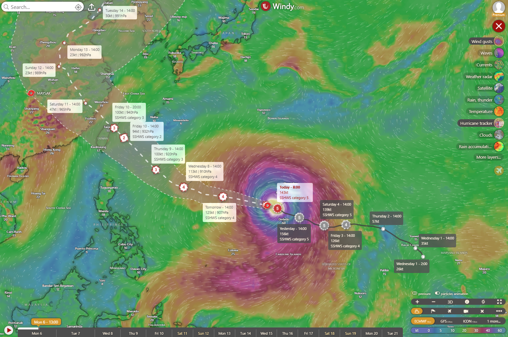
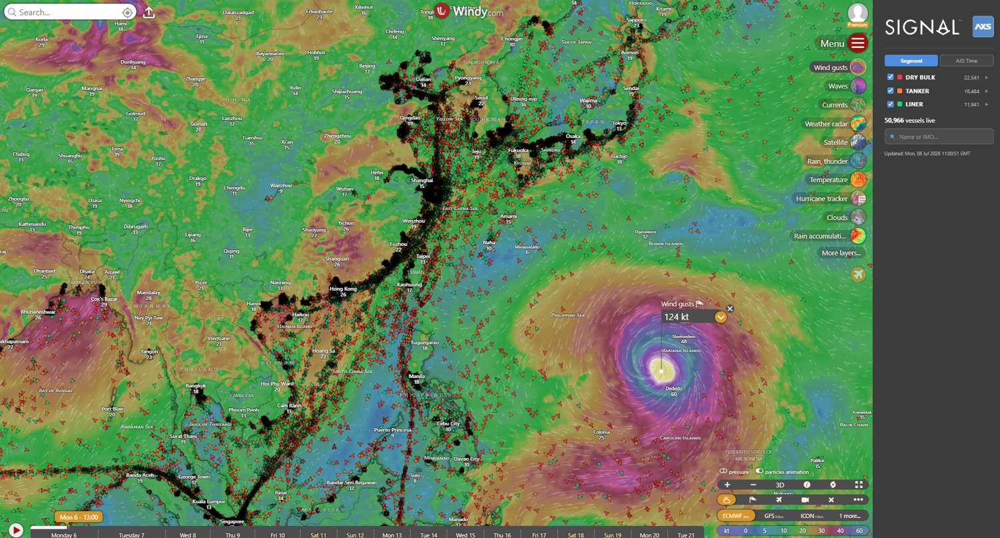
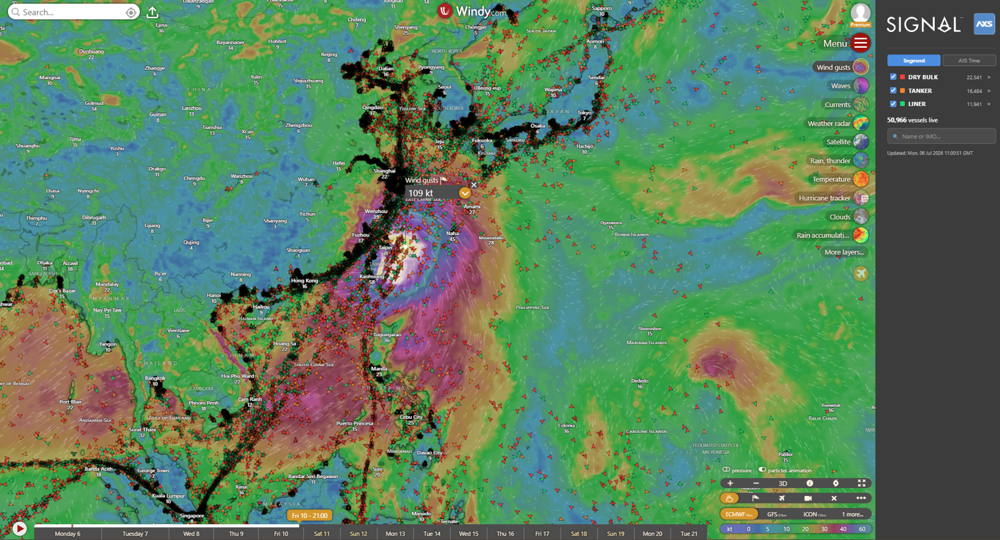
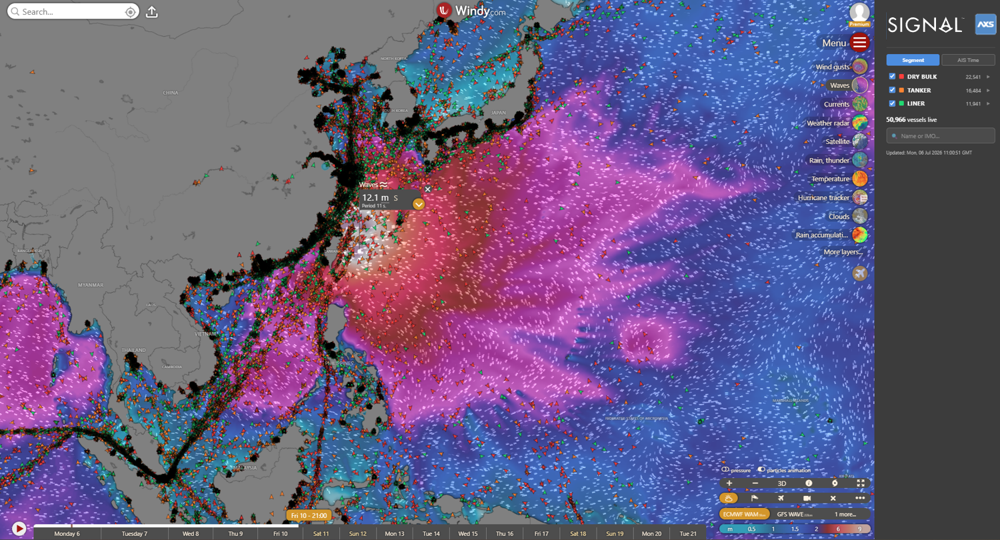
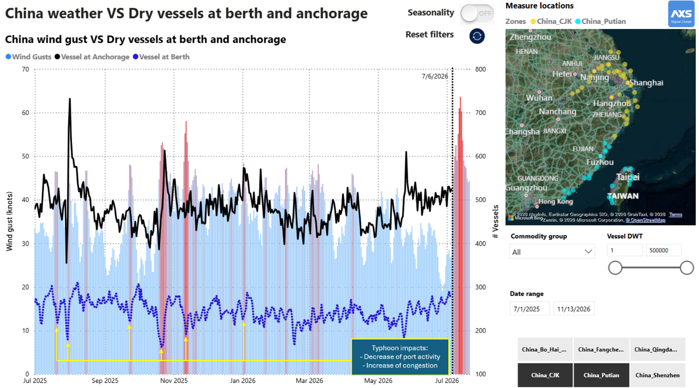
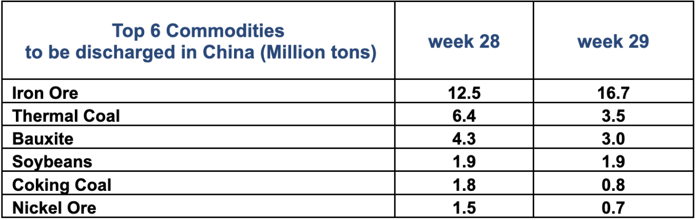
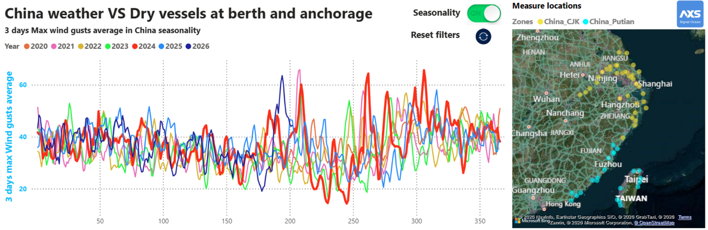

# Super Typhoon Bavi Heading to Taiwan & China Might Disrupt Commodity Supply Chain and Pacific Vessel Supply

*Published on 06 July 2026*

## Super Typhoon Bavi Heading to Taiwan & China Might Disrupt Commodity Supply Chain and Pacific Vessel Supply

Super Typhoon Bavi is currently rated Category 5 by [ECMWF](https://www.ecmwf.int/), and [Windy](https://www.windy.com/-Hurricane-tracker/hurricanes/bavi?gust,14.900,144.000,5) tracking shows it heading toward Taiwan and China. It is expected to reach the coast on Friday, 10th July, with wind gusts of up to 100 knots.

> **Figure 1: 6a4bc911b4336b9356ed5ccb E00515f5**  
> **Interactive Data & Source:** [Signal Ocean Platform](https://www.thesignalgroup.com/newsroom/super-typhoon-bavi-heading-to-taiwan-china-might-disrupt-commodity-supply-chain-and-pacific-vessel-supply) | [Local Asset](file:///C:/Users/Dell/Github/Shipping/corpus/07-signal/images/6a4bc911b4336b9356ed5ccb_e00515f5.png)

Vessels are already avoiding the typhoon's path, as confirmed by the Signal & AXSMarine Windy.com plugin.

> **Figure 2: 6a4bc911b4336b9356ed5cce 875cef20**  
> **Interactive Data & Source:** [Signal Ocean Platform](https://www.thesignalgroup.com/newsroom/super-typhoon-bavi-heading-to-taiwan-china-might-disrupt-commodity-supply-chain-and-pacific-vessel-supply) | [Local Asset](file:///C:/Users/Dell/Github/Shipping/corpus/07-signal/images/6a4bc911b4336b9356ed5cce_875cef20.png)

However, by Friday 10th July, Bavi could cross one of the busiest shipping lanes in the region, with gusts of 100 knots and waves of 12 meters at an 11-second period — conditions that threaten to disrupt both navigation and port operations.

> **Figure 3: 6a4bc911b4336b9356ed5cbf 1eb932a9**  
> **Interactive Data & Source:** [Signal Ocean Platform](https://www.thesignalgroup.com/newsroom/super-typhoon-bavi-heading-to-taiwan-china-might-disrupt-commodity-supply-chain-and-pacific-vessel-supply) | [Local Asset](file:///C:/Users/Dell/Github/Shipping/corpus/07-signal/images/6a4bc911b4336b9356ed5cbf_1eb932a9.png)

> **Figure 4: 6a4bc911b4336b9356ed5cc2 11359d23**  
> **Interactive Data & Source:** [Signal Ocean Platform](https://www.thesignalgroup.com/newsroom/super-typhoon-bavi-heading-to-taiwan-china-might-disrupt-commodity-supply-chain-and-pacific-vessel-supply) | [Local Asset](file:///C:/Users/Dell/Github/Shipping/corpus/07-signal/images/6a4bc911b4336b9356ed5cc2_11359d23.png)

As a result, all vessel segments - dry bulk, container, tanker, and gas - face potential disruption. Container services could see rising congestion as some Chinese ports close or scale back operations for safety reasons. Dry bulk terminals may also slow down, adding to congestion and tightening vessel supply across the Pacific.

> **Figure 5: 6a4bc911b4336b9356ed5cc5 0dc7b4ea**  
> **Interactive Data & Source:** [Signal Ocean Platform](https://www.thesignalgroup.com/newsroom/super-typhoon-bavi-heading-to-taiwan-china-might-disrupt-commodity-supply-chain-and-pacific-vessel-supply) | [Local Asset](file:///C:/Users/Dell/Github/Shipping/corpus/07-signal/images/6a4bc911b4336b9356ed5cc5_0dc7b4ea.png)

Iron ore, thermal and coking coal, bauxite, soybeans, and nickel ore are the commodities most exposed by volume should Bavi hit Chinese ports hard.

## Top 6 Commodities to Be Discharged in China (Million Tons)

> **Figure 6: Top 6 Commodities to Be Discharged in China (Million Tons)**  
> **Interactive Data & Source:** [Signal Ocean Platform](https://www.thesignalgroup.com/newsroom/super-typhoon-bavi-heading-to-taiwan-china-might-disrupt-commodity-supply-chain-and-pacific-vessel-supply) | [Local Asset](file:///C:/Users/Dell/Github/Shipping/corpus/07-signal/images/6a4bc8ece1fa5a655d7e7904_Screenshot 2026-07-06 at 16.11.39.png)

With typhoon season now underway, elevated wind gusts events are likely to persist through November, as shown in the seasonality data below — keeping supply chain risk on the radar for the coming months.

> **Figure 7: Top 6 Commodities to Be Discharged in China (Million Tons)**  
> **Interactive Data & Source:** [Signal Ocean Platform](https://www.thesignalgroup.com/newsroom/super-typhoon-bavi-heading-to-taiwan-china-might-disrupt-commodity-supply-chain-and-pacific-vessel-supply) | [Local Asset](file:///C:/Users/Dell/Github/Shipping/corpus/07-signal/images/6a4bc911b4336b9356ed5cc8_66777801.png)
