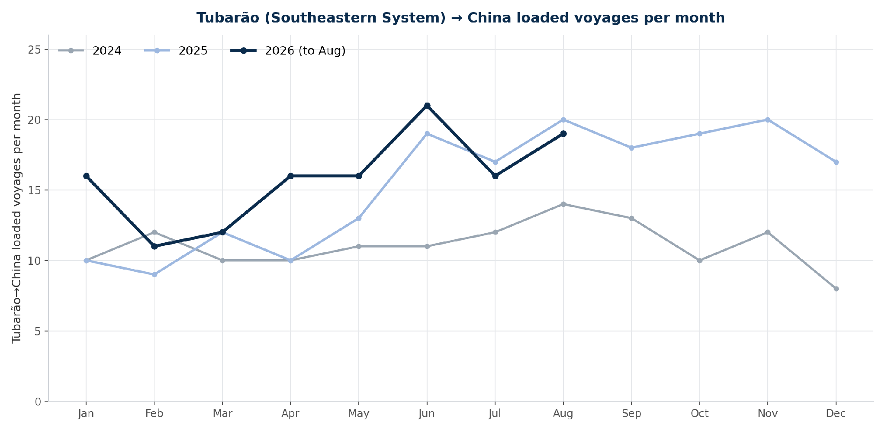
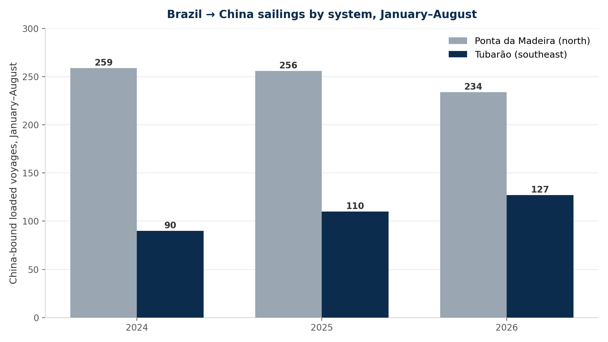
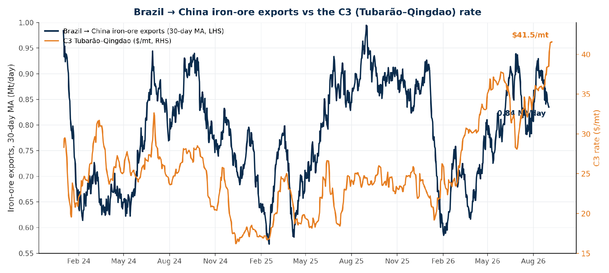
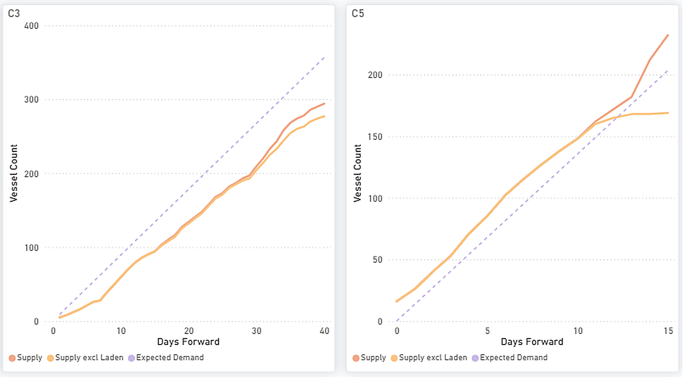
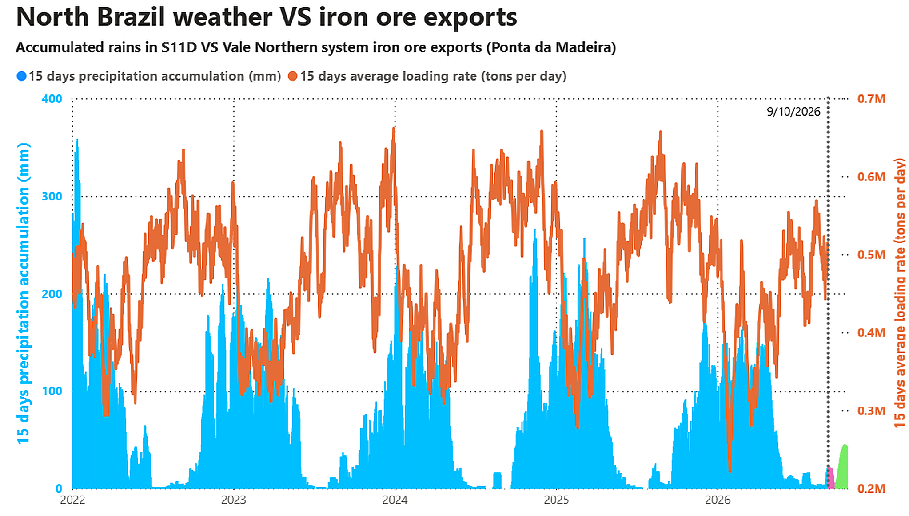
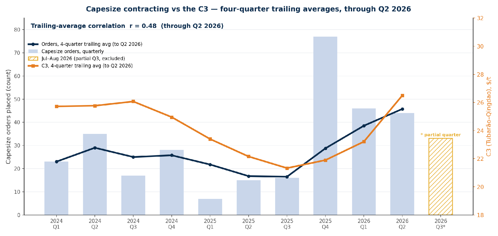
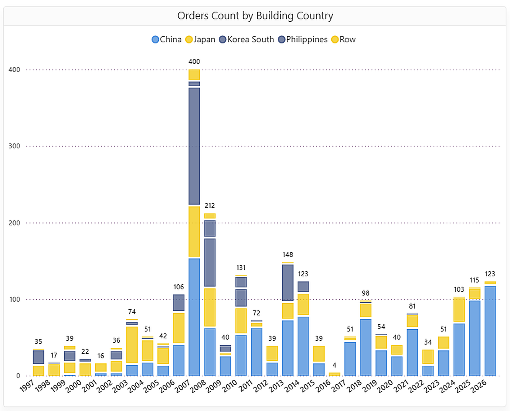

# MARKET INSIGHTS  |  Capesize Market Review: Brazil’s Ore Corridors, the El Niño Rainfall Divide, and Contracting Against the C3

**Date**: September 14, 2026 | **Category**: Market Insights | **Section**: Newsroom | **Source**: [https://www.thesignalgroup.com/newsroom/capesize-market-review-brazils-ore-corridors-the-el-nino-rainfall-divide-and-contracting-against-the-c3](https://www.thesignalgroup.com/newsroom/capesize-market-review-brazils-ore-corridors-the-el-nino-rainfall-divide-and-contracting-against-the-c3)

---

## C3 route performance into the third-quarter close

With the third quarter nearing its close, the focus remains onC3route performance, the spotlight of the Week 36 Dry Market Monitor. This review adds the developing north–south rainfall contrast across Brazil under a strengthening El Niño and the quarterly trend in Capesize contracting. It considers the potential implications of wetter conditions for the Minas Gerais–Tubarão corridor while separating weather-related cargo-volume risks from broader Atlantic tonnage dynamics.

## Brazilian cargo trends

The China-bound Brazilian cargo mix has shiftedsouth. Tubarão — Vale’s southeastern system in Espírito Santo — recorded 127 China-bound sailings over January–August, 15% above 2025 and 41% above 2024, while Ponta da Madeira–China sailings fell 9% year on year to 234. Total Brazil–China sailings fell 3% to 759 but remained 1% above 2024. Tubarão’s share rose to 17%, from 14% in 2025 and 12% in 2024, while Ponta da Madeira’s fell to 31%, from 33% and 34%.

*Figure 1: Tubarão (Southeastern System) → China loaded voyages per month, 2024–2026 (Source: Signal).*

*Figure 2: Brazil → China loaded voyages by system, January–August — Tubarão (southeast) rising while Ponta da Madeira (north) eases (Source: Signal).*

*Figure 3: Total Brazil→China flows (30-day moving average) against the C3 rate (Source: Signal).*

OnC3, supply and supply excluding laden remain below expected demand across the forward window. OnC5, total supply moves above expected demand from around day twelve, while supply excluding laden vessels is estimated to be below the demand line.

*Figure 4: Capesize forward balance - cumulative Supply vs Expected Demand on C3 (Brazil) and C5 (Australia) over days forward (Source: Signal).*

## ‍Australian supply disruptions factors

Two developments influenced Australia’s iron ore trade with China in 2026.Pricing:in September 2025, China Mineral Resources Group instructed steelmakers and traders to suspend purchases of BHP’s Jimblebar fines before extending the restriction to dollar-denominated seaborne cargoes. The dispute continued into 2026 until BHP and CMRG concluded negotiations in April, reopening purchases of previously restricted products, including Jimblebar fines.Labour:around 150 workers at BHP’s Port Hedland operations staged a two-day strike on 8–9 August, the first major industrial action at the site in about 25 years. The dispute covers approximately 450 operators and maintenance workers. BHP reported limited operational disruption, with vessel loading continuing during the stoppage. The significance lies in Port Hedland’s scale: it is the world’s largest iron ore loading port, and BHP ships approximately $80 million of ore through the facility each day. Negotiations on 8 September ended without an agreement, with further talks scheduled under Fair Work Commission facilitation.

## El Niño and the north–south rainfall divide across Brazil’s ore corridors

Against the backdrop of a strengthening El Niño, the September–November 2026 outlook places the strongest above-normal rainfall signal south and southwest of the Minas Gerais–Tubarão corridor. Conditions around Tubarão carry a weaker and less distinct signal, so the forecast does not indicate a clear increase in disruption risk at the port. The northern Carajás–Ponta da Madeira corridor is more clearly positioned within the area where below-normal rainfall is favoured. (Figure 5)

*Figure 5: CCSR/IRI seasonal precipitation-probability outlooks for September–November 2025 and 2026, issued in August of each year. The 2026 outlook shows below-normal rainfall favoured across northern Brazil and the strongest above-normal signal south and southwest of the Minas Gerais–Tubarão corridor. The colours indicate the most likely rainfall category, not forecast rainfall volumes. (Source: CCSR/IRI.)*

Within each year, northern loadings run inversely to rainfall, lower through the wetter first quarter and higher as the rains ease into mid-year. In 2026, the wet season was comparatively dry: peak fifteen-day rainfall reached about 167 mm, the lowest of 2022–26 (against 216–359 mm in prior years). On a like-for-like basis to early September, however, northern loadings were also the lowest of the five years, a mean of about 437 kt/day (versus 445–475 kt/day) and a peak near 569 kt/day (versus 620–657). A drier year did not lift loadings, so the softer 2026 northern activity is not explained by rainfall, consistent with the lower Ponta da Madeira voyage count.

The charts below compare precipitation and loading rates across the northern and southeastern/southern export corridors.

*Figure 6: Fifteen-day accumulated rainfall across the S11D/Carajás catchment compared with the 15-day average loading rate at Ponta da Madeira. The shaded area shows the seasonal rainfall projection. (Source: Signal.)*

*Figure 7: Fifteen-day accumulated rainfall in Minas Gerais, south of Belo Horizonte, compared with the 15-day average loading rate across Tubarão, Guaíba and Sepetiba. The shaded area shows the seasonal rainfall projection. Tubarão serves Vale’s Southeastern System, while Guaíba and Sepetiba are linked to the Southern System. (Source: Signal.)*

## ‍Capesize ordering against the C3: a quarterly-trend correlation

The correlation analysis runs through Q2 2026; July–August orders are shown separately as a partial Q3 observation and are excluded from the trailing-average correlation. Quarter to quarter, the order count is volatile — the largest quarter (2025 Q4, 77 orders) preceded the sharpest part of the C3 recovery, so the contemporaneous quarterly correlation is modest, about 0.36. On afour-quarter trailing average through Q2 2026, the two series move together: from a shared trough in mid-2025 (trailing orders near 16–17 per quarter against a C3 trailing average around $21–22/t), the trailing order count rose to about 46 per quarter as the trailing C3 reached about $26/t. The trailing-average correlation is about0.48.

*Figure 8: Capesize orders (quarterly bars) with four-quarter trailing averages of orders and the C3 rate, through Q2 2026; July–August 2026 shown separately as a partial Q3 and excluded from the correlation (about 0.48) (Source: Signal).*

Annual totals:103 Capesize orders in 2024, 115 in 2025 and 123 through the first eight months of 2026- the strongest run since 2018. The China-built share of new Capesize orders rose from about 66% in 2024 to 85% in 2025 and roughly 95% in 2026. (Figure 9)

*Figure 9: Capesize newbuilding orders by building country, annual (2026 is year-to-date) (Source: Signal).*

## ‍What matters into the fourth quarter

Vale’s Q2 performance provides a firm operational base for the second half: iron ore production reached 84.3 Mt, the strongest second-quarter result since 2018, while full-year guidance remained at 335–345 Mt.

- Southern cargo contribution: Whether Tubarão maintains its higher share of China-bound sailings and how the C3 forward balance develops as ballast tonnage returns to the South Atlantic.
- Australian developments: The outcome of further Port Hedland negotiations following the 8 September talks, and any renewed friction between CMRG and BHP over iron ore pricing or purchasing terms.
- El Niño and infrastructure: Where forecast rainfall overlaps mining, rail and port infrastructure, assessed alongside observed loadings rather than treated independently as a freight signal.
- Capesize ordering: Whether the quarterly pace of contracting is sustained at current C3 freight levels.
- Delivery profile: The concentration of around 95% of 2026 orders at Chinese yards and the additional capacity scheduled to enter the fleet from 2027.
- Vale production: The Q3 2026 production report, due in October, and any revision to the 335–345 Mt full-year guidance.

‍Sources:Signal (voyage count, S/D, orderbook, freight and rainfall series); Vale S.A. (Q2 2026 production and sales report, 21 July 2026); CCSR/IRI — International Research Institute for Climate and Society (seasonal rainfall outlooks).

Disclaimer:This report has been prepared by Signal Group for general information purposes only. It does not constitute, and should not be relied upon as, investment, financial, trading, legal or commercial advice, or as a recommendation to enter into any transaction. While reasonable efforts have been made to ensure that the information is accurate and reliable at the date of publication, no representation or warranty, express or implied, is given as to its accuracy, completeness or continued availability. Certain figures may be estimates or provisional and may subsequently be revised. Market conditions and other external factors may change without notice and may not be reflected in this report. Readers should conduct their own assessment and seek appropriate professional advice before making any decision. To the fullest extent permitted by law, Signal Group accepts no liability for any loss or damage arising from the use of, or reliance on, this report.
