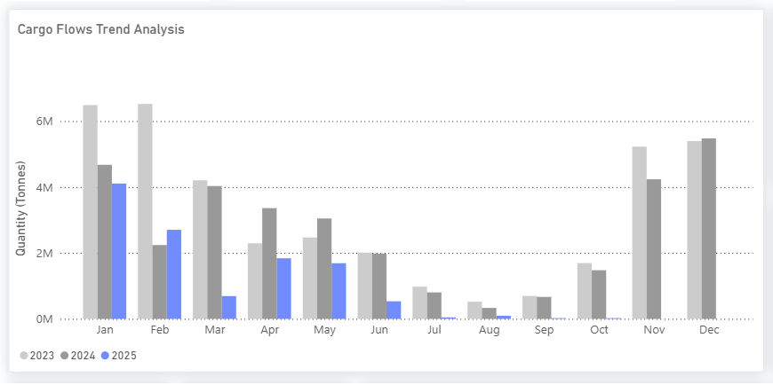
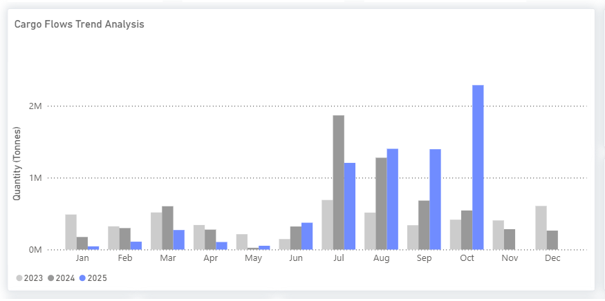
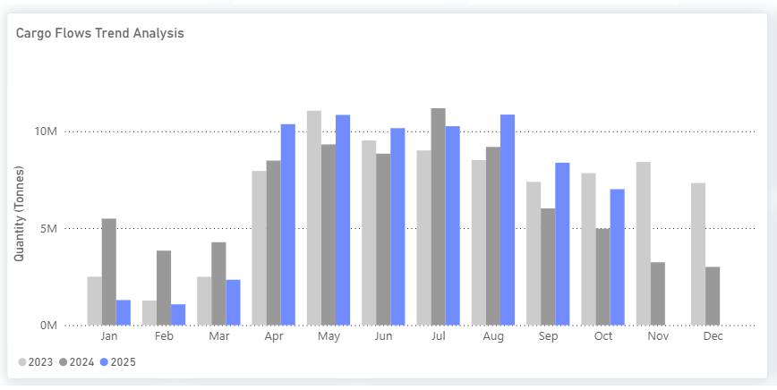

# China’s Soybean Imports Pivot South

*Published on 17 June 2025*

## China’s Soybean Imports Pivot South: U.s. Shipments Vanish in September as South America Fills the Gap

China’s soybean supply chain took a sharp turn south in September.

- No U.S.-origin soybeans were discharged at Chinese ports, the first zero month since 2018, as buyers leaned heavily on Brazil and Argentina.
- Signal Ocean cargo flow analytics confirm U.S. volumes collapsing while South American loadings surged, coinciding with a jump in CBOT soybean futures on renewed U.S.–China deal hopes.

## U.s. Cargo Flows to China - Collapse by September 2025

Shipments reached a peak of 4.1 Mt in January and decreased to 2.7 Mt in February, then fell to zero in September 2025; 2025 clearly differs from 2024, confirming customs reports of no U.S. soybean arrivals.

> **Figure 1: Https://app.signalocean.com/dry/dynamic/drybulkflows**  
> *https://app.signalocean.com/dry/dynamic/drybulkflows*  
> **Interactive Data & Source:** [Signal Ocean Platform](https://www.thesignalgroup.com/newsroom/chinas-soybean-imports-pivot-south) | [Local Asset](file:///C:/Users/Dell/Github/Shipping/corpus/07-signal/images/68f8b73f031a57384cfd7ad7_e8adeb0f.png)

## Argentina Steps Up - Export Incentives Spark Surge

From August to October 2025, shipments experienced a significant increase. September saw nearly 1.5 Mt, approximately double the 2024 figures, largely due to temporary export-tax relief and a weakened peso, which enhanced export competitiveness. October volumes climbed even higher to about 2.3 Mt, marking a 64% month-on-month rise and over 320% year-on-year growth.

> **Figure 2: Https://app.signalocean.com/dry/dynamic/drybulkflows**  
> *https://app.signalocean.com/dry/dynamic/drybulkflows*  
> **Interactive Data & Source:** [Signal Ocean Platform](https://www.thesignalgroup.com/newsroom/chinas-soybean-imports-pivot-south) | [Local Asset](file:///C:/Users/Dell/Github/Shipping/corpus/07-signal/images/68f8b73f031a57384cfd7ad4_40e85ff3.png)

## Brazil Maintains Dominance

Sustained high volumes from April to August (10–11 Mt/month) and elevated September shipments versus previous years highlight Brazil’s extended export window and robust port capacity, though the 22.8% MoM decline in September reflects Argentina’s seasonal return to the export market.

> **Figure 3: Https://app.signalocean.com/dry/dynamic/drybulkflows**  
> *https://app.signalocean.com/dry/dynamic/drybulkflows*  
> **Interactive Data & Source:** [Signal Ocean Platform](https://www.thesignalgroup.com/newsroom/chinas-soybean-imports-pivot-south) | [Local Asset](file:///C:/Users/Dell/Github/Shipping/corpus/07-signal/images/68f8b73f031a57384cfd7ada_8f7904ae.png)

## Market Reaction and Outlook

- CBOT soybean futures climbed to a one-month high amid speculation that China may resume U.S. purchases, following renewed signals in U.S.–China trade talks.
- South American ports nearing capacity increase the risk of congestion if Chinese Q4 buying persists.
- A U.S. comeback hinges on trade diplomacy and early‑2026 procurement cycles.

## Methodology

Data compiled from Signal Ocean Cargo Flow Analytics (Dry Bulk: Agricultural Products | Destination: China), comparing 2023–2025 monthly flows by origin (U.S., Argentina, Brazil), indicates declining U.S. shipments and stronger South American exports. This trend is confirmed by China Customs’ September 2025 import figures, showing zero U.S. arrivals and elevated contributions from Argentina and Brazil.

**Stay ahead of the curve. Get access to the** [**Signal Ocean Platform**](https://calendly.com/thesignalgroup/inbound-demo-session?utm\_source=market+insight&utm\_medium=newsroom&utm\_campaign=inbound) **.**
