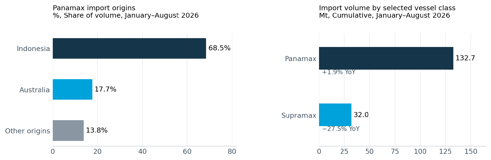
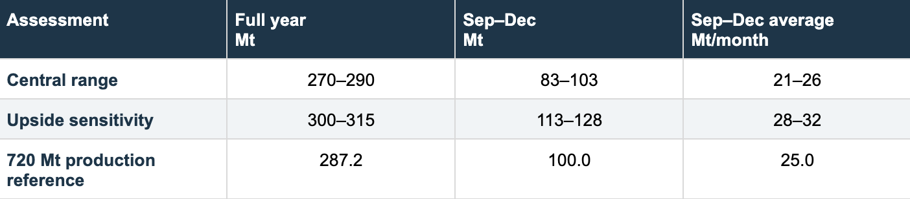

# MARKET INSIGHTS  |  China thermal coal import outlook and Indonesian supply assumptions

**Date**: September 21, 2026 | **Category**: Market Insights | **Section**: Newsroom | **Source**: [https://www.thesignalgroup.com/newsroom/market-insights-china-thermal-coal-import-outlook-and-indonesian-supply-assumptions](https://www.thesignalgroup.com/newsroom/market-insights-china-thermal-coal-import-outlook-and-indonesian-supply-assumptions)

---

## China thermal coal import outlook and Indonesian supply assumptions

China’s coal import outlook spans softer buying through broadly sustained recent arrivals, but the effect on shipping will depend on which vessels carry the coal and where it is loaded. Panamax has held up better than Supramax in the first eight months of 2026. Its dependence on Indonesian cargoes makes export availability there particularly important to the next round of Chinese buying.

Our central range for China’s full-year seaborne thermal coal imports is 270–290 Mt. With 187.2 Mt recorded in January–August, this implies September–December arrivals averaging about 21–26 Mt/month, compared with 25.3 Mt/month in July–August. The range encompasses the previous 274.5 Mt base and allows for buying broadly maintaining the recent pace. Stronger buying could lift imports towards 300–315 Mt; this is an upside sensitivity rather than the central expectation.

Weaker thermal generation and improving daily mine output favour the lower part of the range. Restocking, persistent domestic supply constraints and competitive overseas cargoes would support the upper part. The dashed line in Figure 1 is a conditional reference based on 720 Mt of Indonesian production, not our central forecast.

![Figure 1  China seaborne thermal coal importsSource: Signal Voyage API; Analyst Assumption. Solid lines show monthly arrivals in 2024–2026. Grey shading marks provisional July–August 2026 observations. The single dashed line shows the September–December reference under a 720 Mt Indonesian production scenario.The reference assumes domestic allocations of 259.5 Mt, no net inventory change, a fixed trade relationship and unchanged other-origin purchasing pace. Its monthly profile follows historical patterns. It illustrates supply availability, not a forecast of Chinese buying.](../images/6ab0eef507429862525ce536_5108a543.png)
*Figure 1  China seaborne thermal coal importsSource: Signal Voyage API; Analyst Assumption. Solid lines show monthly arrivals in 2024–2026. Grey shading marks provisional July–August 2026 observations. The single dashed line shows the September–December reference under a 720 Mt Indonesian production scenario.The reference assumes domestic allocations of 259.5 Mt, no net inventory change, a fixed trade relationship and unchanged other-origin purchasing pace. Its monthly profile follows historical patterns. It illustrates supply availability, not a forecast of Chinese buying.*

## Improving mine supply could curb replacement buying

China’s thermal power generation fell 4.3% year on year in August, following a 3.5% decline in July. Hydro, wind and solar generation all increased in August. These figures weaken the case for a sustained increase in coal imports driven by power generation alone. They do not directly measure coal consumption: the thermal category also includes gas and oil.

Mine output is recovering from July’s low. Average daily raw-coal production rose to 11.67 Mt in August from 11.07 Mt in July, while the year-on-year contraction narrowed to 7.7% from 10.1%. Domestic production remains below last year, so the recovery has not removed the potential need for imported replacement cargoes.

![Figure 2  Thermal generation weakened as daily mine output recoveredSource: NBS, July and August 2026 energy-production releases, published 17 August and 15 September. Generation changes are measured year on year for each source and should not be added together. Both series cover industrial enterprises above designated size; raw coal includes all coal types.For coastal buyers, the decisive issue is whether the recovery improves deliveries of the required coal grades at a competitive price. Better mine and rail supply would reduce replacement imports. Low utility stocks, constrained deliveries or cheaper imported cargoes could sustain purchasing even while thermal generation is weaker.These observations inform the outlook range rather than a precise import requirement. Utility inventories and delivered price comparisons are needed to judge the next buying round; neither is measured in the supply reference.](../images/6ab0eef507429862525ce533_e0c2c751.png)
*Figure 2  Thermal generation weakened as daily mine output recoveredSource: NBS, July and August 2026 energy-production releases, published 17 August and 15 September. Generation changes are measured year on year for each source and should not be added together. Both series cover industrial enterprises above designated size; raw coal includes all coal types.For coastal buyers, the decisive issue is whether the recovery improves deliveries of the required coal grades at a competitive price. Better mine and rail supply would reduce replacement imports. Low utility stocks, constrained deliveries or cheaper imported cargoes could sustain purchasing even while thermal generation is weaker.These observations inform the outlook range rather than a precise import requirement. Utility inventories and delivered price comparisons are needed to judge the next buying round; neither is measured in the supply reference.*

## Panamax resilience depends heavily on Indonesian cargoes

Indonesia supplied 115.1 Mt, or 61.5%, of China’s seaborne thermal coal import volume in January–August. Its share was higher in the Panamax trade at 68.5%, compared with Australia’s 17.7%. Indonesian loading programmes consequently matter more to this segment than the aggregate import total alone suggests.

Panamax carried 132.7 Mt over the eight months, up 1.9% year on year, while Supramax volume fell 27.5% to 32.0 Mt. This divergence shows that a softer overall import outlook need not affect vessel segments equally. It does not, by itself, establish that cargoes transferred directly from Supramax to Panamax.

*Figure 3  Indonesian origins dominate as vessel segments diverge.Source: Signal Voyage API. Chinese seaborne thermal coal imports. July–August shipments are provisional. Other origins are the remainder of the Panamax total.*

Panamax voyage records rose from 1,845 to 1,861, an increase of about 0.9%, below the 1.9% gain in tonnes. The difference is consistent with slightly larger average cargoes. Tonnage growth consequently overstates the increase in the number of recorded voyages, and those records should not be treated as a count of new fixtures.

A change in origin could still alter employment materially. Replacement cargoes from Australia or more distant suppliers may require longer voyages than Indonesian cargoes, depending on the ports involved. That could cushion the effect of fewer tonnes on vessel demand, but the scenarios do not quantify the distance or vessel days added.

## Indonesian supply permits a higher outcome but does not ensure it

We retain 720 Mt of Indonesian coal production in 2026 as a supply reference. Katadata reported on 10 September that ESDM’s Director General of Mineral and Coal, Tri Winarno, projected roughly that level from the monthly production pace. It is a reported official projection, rather than a confirmed RKAB production quota.

Assuming domestic allocations of 259.5 Mt and no annual net change in producer and export-chain stocks, that output would leave 164.5 Mt for exports in September–December after the 296.0 Mt already shipped in January–August. The domestic allocation is an estimate, not a verified 2026 consumption total. Production, export and Chinese import coverage also differ, so the balance is an indicative supply calculation.

Carrying forward the January–August relationship between Indonesian exports and Chinese thermal coal imports gives a conditional full-year reference of 287.2 Mt, with September–December arrivals averaging 25.0 Mt/month. This calculation sits within our 270–290 Mt central range. It is not a separate point forecast, and Indonesian export availability does not ensure equivalent Chinese buying.

Our 300–315 Mt upside sensitivity requires stronger purchasing and additional cargo availability. The IEA’s 310 Mt seaborne thermal forecast lies within that interval. Against our recorded January–August total, 310 Mt would require 30.7 Mt/month in September–December, about 21% above July–August. Our 2025 series totals 328.6 Mt versus the IEA’s 325 Mt, so the reference datasets are not identical. A severe Indonesian restriction to 600 Mt, with limited substitution, remains a separate stress outcome near 240 Mt.

## China seaborne thermal coal outlook and supply reference

*Source: Signal Voyage API;Analyst Assumption. Ranges are judgemental assessments, not statistical confidence intervals. The 720 Mt production reference is a conditional calculation. The supply-disruption stress is shown separately from the central range.*

## Cargo programmes will determine the freight response

For Panamax, the central range spans lower monthly cargo support through buying broadly sustaining July–August arrivals. Firm Chinese tenders and sustained Indonesian loadings would support the upper end. Additional cargoes from more distant origins could increase voyage demand even if total tonnes ease. Open vessel positions and competing grain and mineral cargoes remain necessary to assess freight rates.

## Sources and definitions

Trade data: Signal Voyage API, as of 10 September 2026. Thermal coal includes anthracite and excludes coking and unclassified coal. Chinese imports are arrival at discharge; Indonesian exports at loading. July–August shipments are provisional and may revise in either direction. Seaborne volumes exclude overland trade and differ from customs data in coverage, classification and timing.

NBS figures cover industrial enterprises above designated size. Raw-coal output includes all coal types; thermal generation includes gas and oil and does not directly measure coal consumption.

China supply and power:NBS July 2026andNBS August 2026.

Indonesian production reference:Katadata, 10 September 2026, reporting the ESDM official’s projection.

Indonesian domestic supply references:ESDM 2025 performance reportandESDM, June 2026. The 259.5 Mt domestic allocation remains a scenario assumption.

Previous outlook: the August article used a 21–23 Mt/month July–December range; the subsequent 274.5 Mt base used its upper end. The present 270–290 Mt central range retains that reference while allowing sustained recent buying. Upside assessment also considers the IEA Coal Mid-Year Update 2026, Trade chapter, published 10 September: https://www.iea.org/reports/coal-mid-year-update-2026/trade

Mt = million tonnes; Mt/day = million tonnes per day; Mt/month = million tonnes per month; YoY = year on year; F = forecast.
