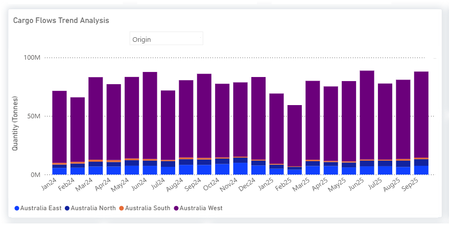
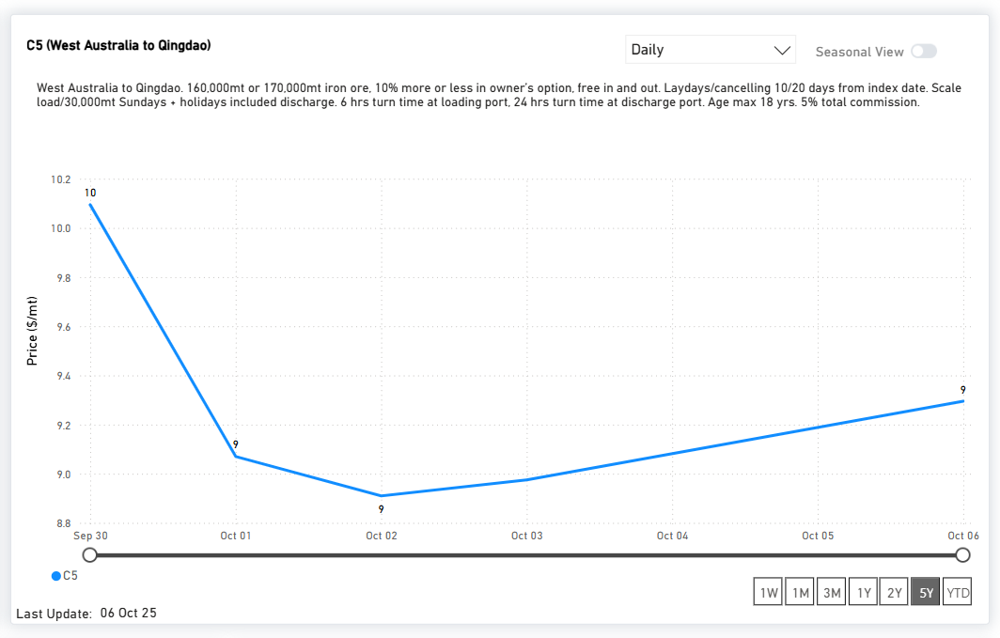

# Market Insights: Dry Bulk Flows | Iron Ore

*Published on 17 June 2025*

## Market Insights: Dry Bulk Flows | Iron Ore

## China Hits Bhp’s West Australian Flow - Rio Reinforces Pilbara Output

- China’s state-controlled buyer, **CMRG**, is reported to have instructed steelmakers and traders to **suspend new dollar-denominated BHP iron ore cargoes**, a sharp escalation in pricing negotiations that raises concerns about disruptions to BHP’s China supply.
- The freight market reacted swiftly: spot Capesize rates tumbled in the week following the standoff, as sentiment weakened on expectations of reduced Chinese liftings from the Pilbara
- Amid the tension, **Rio Tinto unveiled a US$733 million investment** in its West Angelas / Robe River joint venture (with Mitsui and Nippon Steel) designed to preserve Pilbara output and sustain supply relationships with Asian customers.

> **Figure 1: China Hits Bhp’s West Australian Flow - Rio Reinforces Pilbara Output**  
> **Interactive Data & Source:** [Signal Ocean Platform](https://www.thesignalgroup.com/newsroom/market-insights-dry-bulk-flows-iron-ore) | [Local Asset](file:///C:/Users/Dell/Github/Shipping/corpus/07-signal/images/68e647beb9aa18c6b96a1d5a_5fcde4b6.png)

> **Figure 2: China Hits Bhp’s West Australian Flow - Rio Reinforces Pilbara Output**  
> **Interactive Data & Source:** [Signal Ocean Platform](https://www.thesignalgroup.com/newsroom/market-insights-dry-bulk-flows-iron-ore) | [Local Asset](file:///C:/Users/Dell/Github/Shipping/corpus/07-signal/images/68e647beb9aa18c6b96a1d5d_ddefc66b.png)

**Stay ahead of the curve. Get access to the** [**Signal Ocean Platform**](https://calendly.com/thesignalgroup/inbound-demo-session?utm\_source=market+insight&utm\_medium=newsroom&utm\_campaign=inbound) **.**
