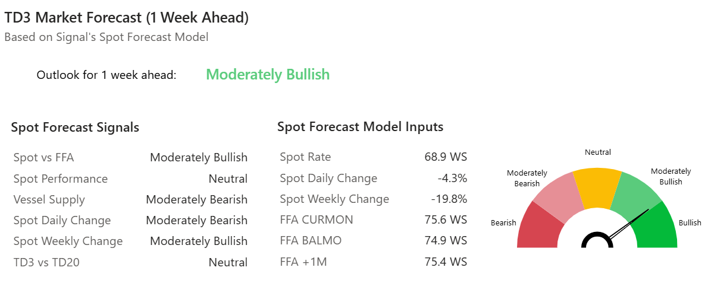

# Market Insights: VLCC Market Pulse

*Published on 17 June 2025*

## Market Insights: VLCC Market Pulse

## 1-Week Ahead Market Sentiment: TD3C Outlook Turnsmoderately Bullish

#### Arabian Gulf–china VLCC Rates (TD3C) Appear Set for a Modest Rebound as Vessel Supply Tightens and Chinese Port Congestion Rises.

- The **TD3C spot rate** has declined **19.8% WoW**. **Forward levels show clear premiums**, with the **current month FFA trading +6.7 WS**, the **balance of the month +6.0 WS**, and the **one-month forward contract +6.5 WS** above the spot rate.

##### Supply Dynamics – Arabian Gulf Focus

- Net supply: 93 VLCCs in the Arabian Gulf (–5% WoW)
- 12-month average: 109 — indicating a tighter tonnage list.

**Congestion Impact**

- China: 32 vessels (+28% WoW)
- Arabian Gulf: 31 vessels (–31% WoW)

> **Figure 1: 68e7b5cb94cc03687dd61452 4ad7c0ef**  
> **Interactive Data & Source:** [Signal Ocean Platform](https://www.thesignalgroup.com/newsroom/market-insights-vlcc-market-pulse) | [Local Asset](file:///C:/Users/Dell/Github/Shipping/corpus/07-signal/images/68e7b5cb94cc03687dd61452_4ad7c0ef.png)

**Stay ahead of the curve. Get access to the** [**Signal Ocean Platform**](https://calendly.com/thesignalgroup/inbound-demo-session?utm\_source=market+insight&utm\_medium=newsroom&utm\_campaign=inbound) **.**
