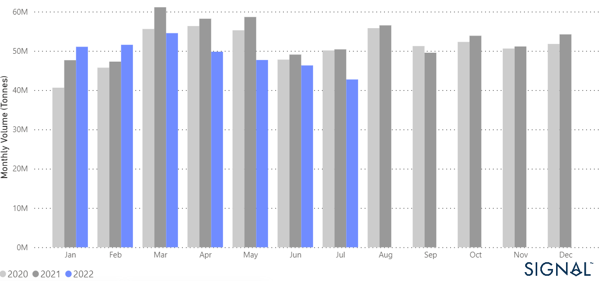
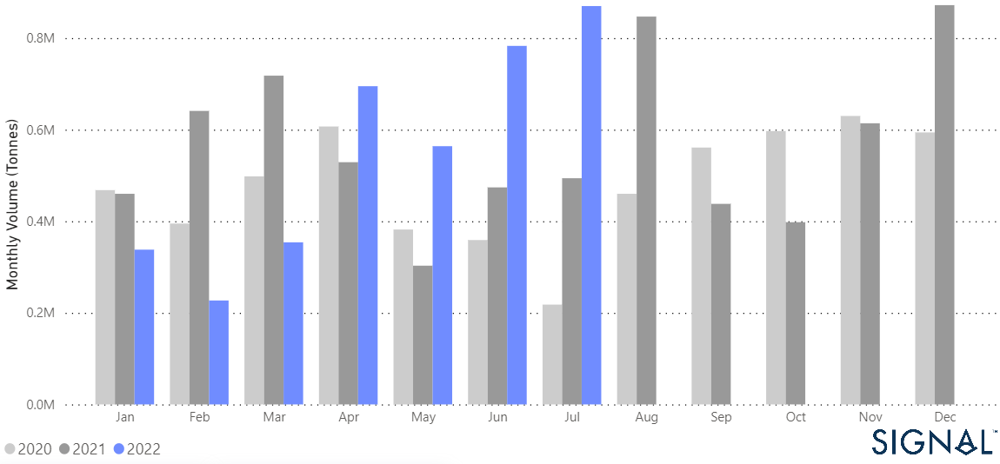
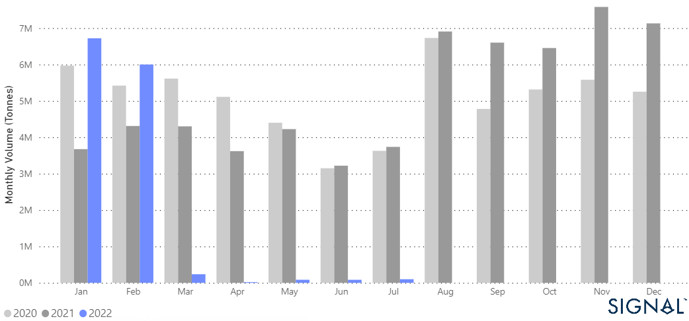
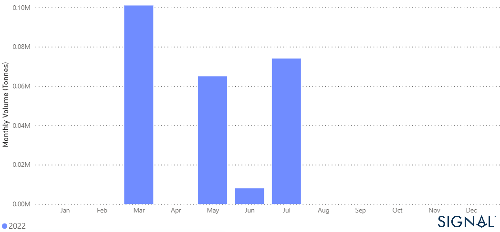

# New Grain Corridors From Ukraine and Dry Bulk Flows

*Published on 17 June 2025*

On [July 22](https://www.ifpri.org/blog/russia-ukraine-grain-agreement-what-stake), Ukraine and Russia agreed that exports of grain and other agricultural products from selected Ukrainian Black Sea ports could resume after months of Russian blockade. The agreement comes at a time when storage capacity is reaching its limits, as much of the 2022 wheat crop and some 20 million tons of 2021 grain and oilseeds cannot be shipped due to the blockade. The latest news is a relief for grain exports to developing countries already suffering from severe grain shortages and higher food prices. Delegations from Ukraine, Russia, and Turkey [met](https://kyivindependent.com/hot-topic/ukraine-russia-achieve-some-progress-in-grain-blockade-negotiations) for the first time with representatives from the UN in Istanbul on July 13 to discuss the safe export of grain.

The question is whether the resumption of grain exports from the Black Sea is a solution to[today's grain crisis](https://www.thesignalgroup.com/newsroom/russian-ukraine-crisis-thoughts-on-russian-ban-export). The recent progress is a first step toward resuming grain flows to developed and developing countries by releasing the first grain packages that had been blocked at major Ukrainian ports for several months. [Ukraine ships nearly 75% of its agricultural exports through Black Sea ports](https://www.foodsecurityportal.org/node/2023). About half of these exports pass through the ports of Odessa, Chornomorsk, and Pivdennyi (Yuzhne).

The agreement is expected to allow the export of [22 million tons](https://carnegieendowment.org/eurasiainsight/87576) of Ukrainian wheat, corn, and other grains that have accumulated in the ports of Odessa, Khornomorsk, and Yuzhne. UN Secretary-General António Guterres has welcomed the official launch of the operation in the Turkish city of Istanbul to help implement the agreement brokered by the UN to resume Ukrainian grain exports across the Black Sea amid the ongoing conflict and rising global food prices. [The Joint Coordination Centre](https://turkiye.un.org/en/192332-joint-coordination-centre-opens-istanbul-facilitate-safe-export-commercial-foodstuffs-and) (JCC) will enable the safe transportation of food and fertilisers from three major Ukrainian ports in the Black Sea by merchant vessels: Odessa, Chornomorsk, and Yuzhny.

In the freight market, the resumption of seaborne grain flows could lead to more substantial growth in dry bulk demand in tonne-days in the third quarter of this year and higher revenues for vessels. However, ship [insurers](https://www.reuters.com/markets/commodities/ship-insurers-seek-more-assurances-ukraine-grain-corridor-2022-07-20/) are only willing to insure ships passing through the proposed corridor for the removal of Ukrainian grain if arrangements are made for an international naval escort and a clear strategy for dealing with sea mines.

The main problem will be insurance coverage for port calls. Currently, there is no certainty on this issue, and the Joint War Committee's possible update of the list of war risk areas will most likely become the basis for many insurers. According to [ISM](https://metalexpert.com/en/services/dryfreight), even in the event of a positive decision by the largest insurers, the rate of the so-called additional war risk premium will be a maximum of 5%, which corresponds to a one-time payment of $0.3 million to $1 million, depending on the condition, age, size and equipment of the vessel.

The current situation of blocked Ukrainian grain exports has led to a decrease in monthly grain flows by sea, with the current level significantly lower than in the comparable period of the last two years. (Chart below 1).

## Seaborne Dry Bulk Flows, Grain, From All Countries to All Destinations, Monthly Volume (Tonnes)

> **Figure 1: Graph 1 Data Source: The Signal Ocean Platform, Years 2020-2022**  
> *Graph 1 Data Source: The Signal Ocean Platform, Years 2020-2022*  
> **Interactive Data & Source:** [Signal Ocean Platform](https://www.thesignalgroup.com/newsroom/new-grain-corridors-from-ukraine-and-dry-bulk-flows) | [Local Asset](file:///C:/Users/Dell/Github/Shipping/corpus/07-signal/images/62eb997f5de0597d340e36b7_Chart 1 Grain_Logo.PNG)

It is interesting to see that the share of Russian grain exports by sea to Turkey has increased in the last four months, with the monthly volumes in June and July being 65% to 75% higher than the volumes of the previous year. (Chart 2)

## Seaborne Dry Bulk Flows, Grain, From Russia to Turkey, Monthly Volume (Tonnes)

> **Figure 2: Graph 2 Data Source: The Signal Ocean Platform, Years 2020-2022**  
> *Graph 2 Data Source: The Signal Ocean Platform, Years 2020-2022*  
> **Interactive Data & Source:** [Signal Ocean Platform](https://www.thesignalgroup.com/newsroom/new-grain-corridors-from-ukraine-and-dry-bulk-flows) | [Local Asset](file:///C:/Users/Dell/Github/Shipping/corpus/07-signal/images/62eb9a4145517f540755d456_chart 2 from russia to turkey_Logo.png)

The impact of geopolitical tensions on Ukrainian grain exports is illustrated in the third chart, where monthly volumes by the sea in the fourth quarter of 2021 and the first two months of this year were significantly higher than in previous years.

## Seaborne Dry Bulk Flows, Grain, From Ukraine to All Countries, Monthly Volume (Tonnes)

> **Figure 3: Graph 3 Data Source: The Signal Ocean Platform, Years 2020-2022**  
> *Graph 3 Data Source: The Signal Ocean Platform, Years 2020-2022*  
> **Interactive Data & Source:** [Signal Ocean Platform](https://www.thesignalgroup.com/newsroom/new-grain-corridors-from-ukraine-and-dry-bulk-flows) | [Local Asset](file:///C:/Users/Dell/Github/Shipping/corpus/07-signal/images/62eb9ab2e8d1165bed4ea8ea_chart 3_logo.png)

Under the grain agreement between Russia and Ukraine, [the first ship carrying grain](https://www.washingtonpost.com/world/2022/08/01/ukraine-grain-deal-odessa-shipments-resume/) left a Ukrainian port, raising hopes that the agreement would alleviate the global food crisis and lower grain prices. The chart below (4) provides an overview of the volumes that came out of the main Ukrainian grain ports this year and shows how the recent agreement affects volumes in the last days of July. It remains to be seen whether the agreement will further smooth Ukrainian grain exports across the Black Sea and recoup the food security losses in recent months for both developed and developing countries.

## Seaborne Dry Bulk Flows, Grain, From Ukraine to All Countries, Monthly Volume (Tonnes)

##### Ports: Chormonsk, Odessa, Yuzhnyy

> **Figure 4: Graph 4 Data Source: The Signal Ocean Platform, Year 2022**  
> *Graph 4 Data Source: The Signal Ocean Platform, Year 2022*  
> **Interactive Data & Source:** [Signal Ocean Platform](https://www.thesignalgroup.com/newsroom/new-grain-corridors-from-ukraine-and-dry-bulk-flows) | [Local Asset](file:///C:/Users/Dell/Github/Shipping/corpus/07-signal/images/62eb9b49a67a0416f1d76dbc_chart 4_logo.png)

The next quarter will be crucial for grain flows from Ukraine, as the successful first shipment of grain from the Black Sea raises hopes that more will follow.

For the latest updates and insights, make sure to visit the [Signal Ocean Newsroom](https://www.thesignalgroup.com/newsroom) website page. Click [here to request a demo](https://www.thesignalgroup.com/request-demo?utm\_source=oceanhome&utm\_medium=website&utm\_campaign=demo).

-Republishing is allowed with an active link to the source
