# Market Insights | Syria's Tanker Trade: What the Data Shows

*Published on 17 June 2025*

AXSMarine TradeFlows, load and discharge sides · Wet cargo only · January–July 2025 against January–July 2026 · Extract dated 17 August 2026.Barrels, converted record by record at 7.3 bbl a tonne for crude, 7.9 for clean products, 6.353 for fuel oil and 11.6 for LPG

## The Short Answer

Both are up, for quite different reasons. Seaborne imports of oil, products and gas into the three ports went from **3.75m bbl** in the first seven months of 2025 to **17.03m bbl** this year, +354%, on 25 discharge records rising to 65. Exports are a different case. They barely existed in 2025: one cargo, 0.23m bbl. This year they are 15.42m bbl on 28 records. Syria has gone from importing something like 17 barrels for every one it shipped out to roughly 1.1:1.

Imports rose in every segment. On the export side, crude and fuel oil recorded nothing whatever in 2025 and now account for four fifths of everything that leaves. So one trade multiplied and the other started from scratch.

## Where the Movement Is

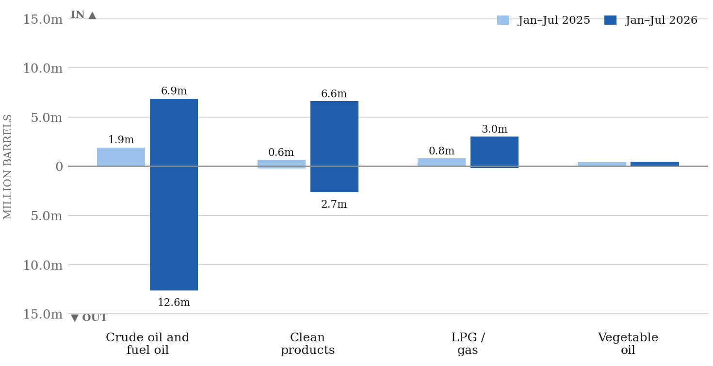

> **Figure 1: Where the Movement Is**  
> **Interactive Data & Source:** [Signal Ocean Platform](https://www.thesignalgroup.com/newsroom/syrias-tanker-trade-what-the-data-shows) | [Local Asset](file:///C:/Users/Dell/Github/Shipping/corpus/07-signal/images/6a8c42b9d152ba15d1816618_659c780d.png)

*Seaborne wet cargo at Banias, Tartous and Latakia, millions of barrels, January to July. Bars above the line are imports, below the line exports. Crude and fuel oil are shown as one line for the reason set out below. Untagged records are excluded from the chart and appear in the table.*

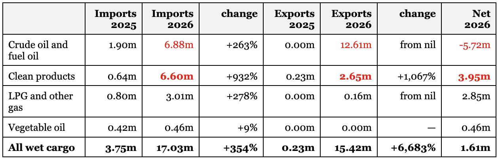

> **Figure 2: Barrels, January to July**  
> *Barrels, January to July. "Net 2026" is imports minus exports for the current year, so a positive number means the country took in more than it sent out.*  
> **Interactive Data & Source:** [Signal Ocean Platform](https://www.thesignalgroup.com/newsroom/syrias-tanker-trade-what-the-data-shows) | [Local Asset](file:///C:/Users/Dell/Github/Shipping/corpus/07-signal/images/6a8c4199dfad7c31124870ee_Screenshot 2026-08-24 at 14.05.16.png)

Most of the movement sits in two lines. Clean products are the largest inbound stream at 6.60m bbl. After the 2.65m bbl that left again, Syria was 3.95m barrels short over the seven months. Crude and fuel oil go the other way: 6.88m bbl in against 12.61m bbl out, a net outflow of 5.72m barrels. That single line is the whole of the export story.

Some context for the clean deficit. Syria’s energy minister has put domestic demand at 120,000 to 150,000 barrels a day. The same official gave production as 100,000 b/d in one statement and 40,000 in another, and the Syrian Petroleum Company put combined refinery capacity at about 130,000 b/d, with Banias running at 95,000: [Enab Baladi, 7 March 2026](https://english.enabbaladi.net/archives/2026/03/syrias-oil-sector-a-costly-bill-and-uncertain-investments/). Against those numbers a heavy clean import bill is roughly what you would expect.

## The Three Ports Do Different Jobs

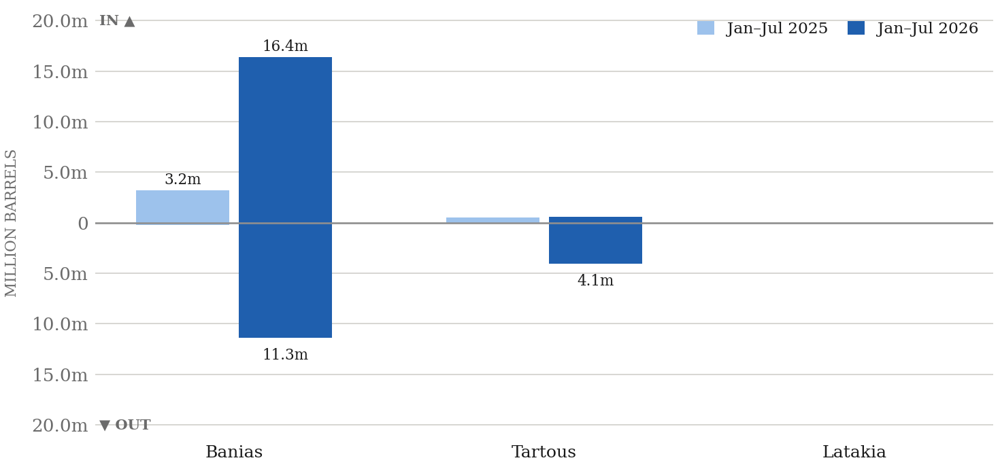

> **Figure 3: Wet Cargo by Port, Millions of Barrels, January to July.**  
> *Wet cargo by port, millions of barrels, January to July.*  
> **Interactive Data & Source:** [Signal Ocean Platform](https://www.thesignalgroup.com/newsroom/syrias-tanker-trade-what-the-data-shows) | [Local Asset](file:///C:/Users/Dell/Github/Shipping/corpus/07-signal/images/6a8c42b9d152ba15d181661b_b552e2bb.png)

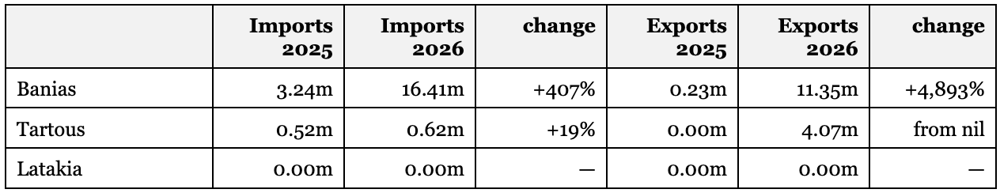

> **Figure 4: Barrels, January to July.**  
> *Barrels, January to July.*  
> **Interactive Data & Source:** [Signal Ocean Platform](https://www.thesignalgroup.com/newsroom/syrias-tanker-trade-what-the-data-shows) | [Local Asset](file:///C:/Users/Dell/Github/Shipping/corpus/07-signal/images/6a8c41c791e3881ca717cf72_Screenshot 2026-08-24 at 14.06.06.png)

Banias is the oil port, and very nearly the whole of it: **16.41m bbl in and 11.35m bbl out**, or 96% of wet imports and 74% of wet exports. Tartous runs a smaller crude and products business alongside its dry trade, 0.62m bbl in and 4.07m bbl out. Latakia records no tanker cargo at all, in either year or either direction.

## Voyages and Port Calls

Tonnage is only half of it, and the vessel count moves differently. Wet cargo records across the three ports went from 25 inbound and 1 outbound in January–July 2025 to 65 and 28 in 2026, so total 26 became 93, or +258%. **That is a smaller multiple than the tonnage rise**, which means average cargo size went up as well. Some of the extra volume came from more ships and some from bigger ones.

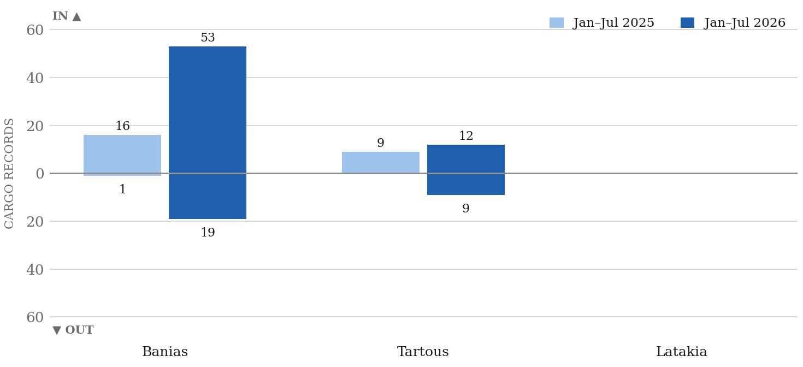

> **Figure 5: Wet Cargo Records by Port, January to July**  
> *Wet cargo records by port, January to July. Latakia records none in either year.*  
> **Interactive Data & Source:** [Signal Ocean Platform](https://www.thesignalgroup.com/newsroom/syrias-tanker-trade-what-the-data-shows) | [Local Asset](file:///C:/Users/Dell/Github/Shipping/corpus/07-signal/images/6a8c42b9d152ba15d181661e_b9fe45d1.png)

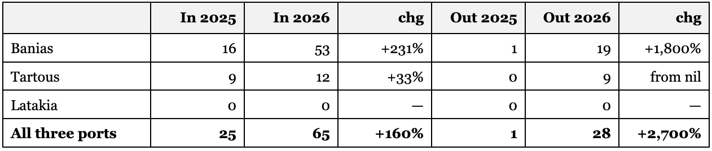

> **Figure 6: Cargo Records, January to July.**  
> *Cargo records, January to July.*  
> **Interactive Data & Source:** [Signal Ocean Platform](https://www.thesignalgroup.com/newsroom/syrias-tanker-trade-what-the-data-shows) | [Local Asset](file:///C:/Users/Dell/Github/Shipping/corpus/07-signal/images/6a8c41fad152ba15d18107cd_Screenshot 2026-08-24 at 14.06.52.png)

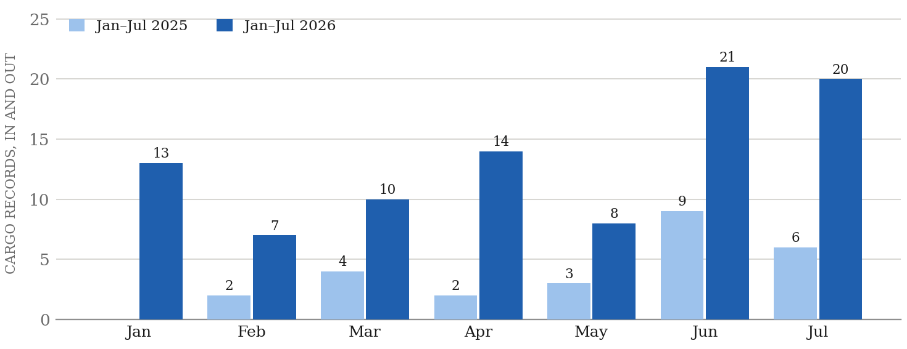

> **Figure 7: Wet Cargo Records per Month, Both Directions Combined, January to July.**  
> *Wet cargo records per month, both directions combined, January to July.*  
> **Interactive Data & Source:** [Signal Ocean Platform](https://www.thesignalgroup.com/newsroom/syrias-tanker-trade-what-the-data-shows) | [Local Asset](file:///C:/Users/Dell/Github/Shipping/corpus/07-signal/images/6a8c42b9d152ba15d1816621_1428a745.png)

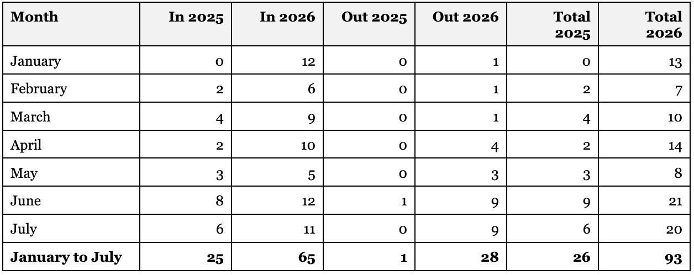

> **Figure 8: Cargo Records by Month of Discharge for Imports and Month of Loading for Exports.**  
> *Cargo records by month of discharge for imports and month of loading for exports.*  
> **Interactive Data & Source:** [Signal Ocean Platform](https://www.thesignalgroup.com/newsroom/syrias-tanker-trade-what-the-data-shows) | [Local Asset](file:///C:/Users/Dell/Github/Shipping/corpus/07-signal/images/6a8c42310434f05a3dfb6c5b_Screenshot 2026-08-24 at 14.07.37.png)

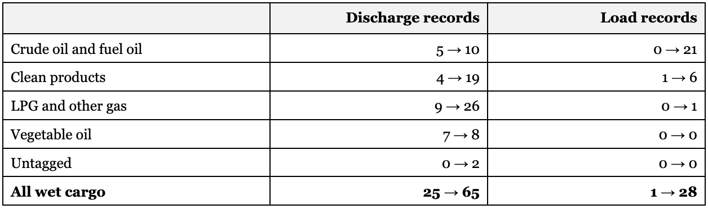

> **Figure 9: Cargo Records, 2025 → 2026, January to July.**  
> *Cargo records, 2025 → 2026, January to July.*  
> **Interactive Data & Source:** [Signal Ocean Platform](https://www.thesignalgroup.com/newsroom/syrias-tanker-trade-what-the-data-shows) | [Local Asset](file:///C:/Users/Dell/Github/Shipping/corpus/07-signal/images/6a8c4267d152ba15d1813eec_Screenshot 2026-08-24 at 14.08.45.png)

## Banias Month by Month

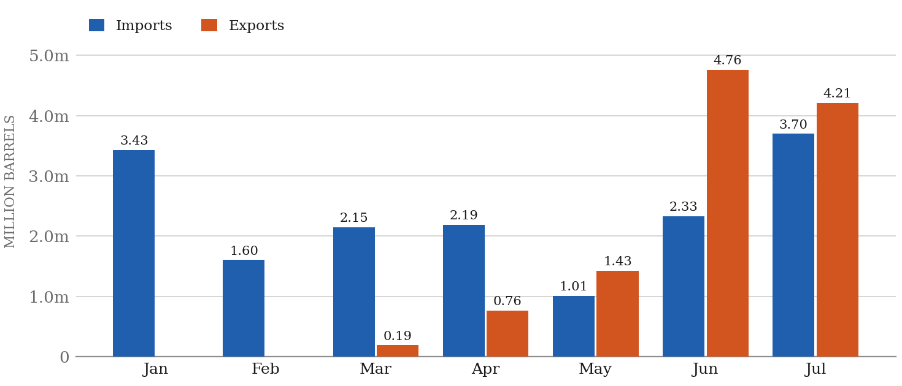

> **Figure 10: Banias Wet Cargo by Month, Millions of Barrels, 2026**  
> *Banias wet cargo by month, millions of barrels, 2026. Imports run through the whole period; exports do not appear until March.*  
> **Interactive Data & Source:** [Signal Ocean Platform](https://www.thesignalgroup.com/newsroom/syrias-tanker-trade-what-the-data-shows) | [Local Asset](file:///C:/Users/Dell/Github/Shipping/corpus/07-signal/images/6a8c42b9d152ba15d1816627_bcbb5aeb.png)

Banias imports in every month of the year. It ships nothing out in January or February, sends a first 0.19m barrels in March, then climbs sharply from May to a June peak of 4.76m barrels. The change is abrupt rather than gradual.

The timing is worth noting, carefully. The Al-Tanf–Al-Waleed crossing between Iraq and Syria reopened on 2 April 2026 after more than a decade shut, and Iraqi fuel tanker convoys "had begun crossing through the Tanf border towards the Banias refinery": [Qatar News Agency, 2 April 2026](https://qna.org.qa/en/News-Area/News/2026-4/2/syria-iraq-reopen-al-tanf-al-walid-border-crossing-after-nearly-11-years-of-closure). The export ramp in the extract sits either side of that date. **It is a coincidence of timing, not a causal link this data can prove**, and in any case the first cargo leaves in March, before the crossing opened.

## Where the Imported Oil Loads

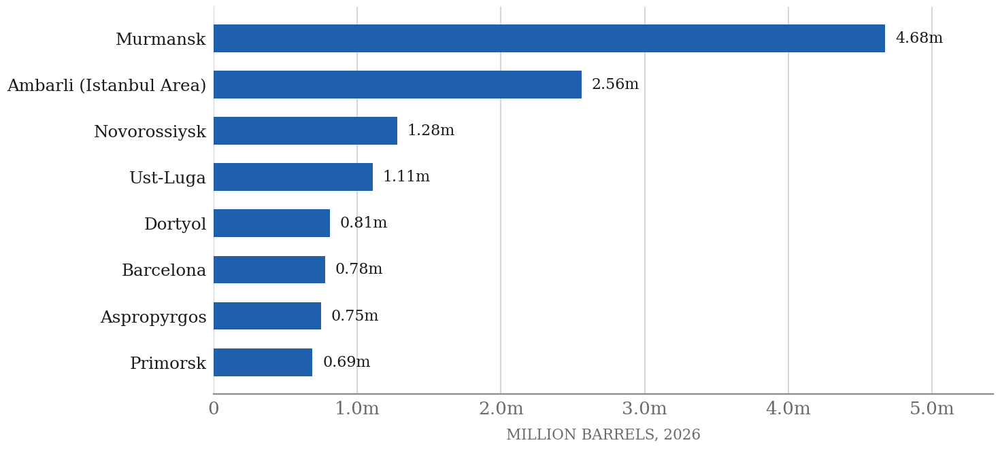

> **Figure 11: Top Eight Load Ports for 2026 Wet Arrivals, Millions of Barrels, January to July, From the Extract.**  
> *Top eight load ports for 2026 wet arrivals, millions of barrels, January to July, from the extract.*  
> **Interactive Data & Source:** [Signal Ocean Platform](https://www.thesignalgroup.com/newsroom/syrias-tanker-trade-what-the-data-shows) | [Local Asset](file:///C:/Users/Dell/Github/Shipping/corpus/07-signal/images/6a8c42b9d152ba15d1816624_fe89bbf9.png)

Murmansk on its own accounts for 4.68m bbl. Add Ust-Luga, Novorossiysk, Primorsk and Tuapse and the Russian load ports come to 8.00m barrels, 47% of 2026 wet arrivals.

## How Much of the Flow We Actually See

Worth knowing what all of the above is a share of. Where there is a published benchmark, this is how our numbers compare.

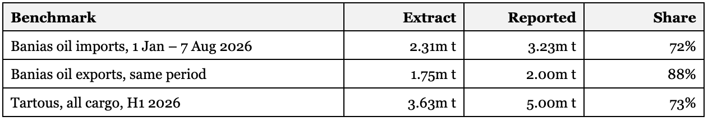

> **Figure 12: How Much of the Flow We Actually See**  
> **Interactive Data & Source:** [Signal Ocean Platform](https://www.thesignalgroup.com/newsroom/syrias-tanker-trade-what-the-data-shows) | [Local Asset](file:///C:/Users/Dell/Github/Shipping/corpus/07-signal/images/6a8c42a391e3881ca7186b2c_Screenshot 2026-08-24 at 14.09.43.png)

The reported figures come from the Syrian General Authority for Land and Sea Border Crossings, which describes Banias since the start of 2026 as "receiving 108 tankers carrying about 3.23 million tons of various petroleum products" and handling the outbound flow on "30 tankers carrying fuel oil and petroleum distillates" ([SANA, 7 August 2026](https://sana.sy/en/economic/2334795/), [Shafaq News, 7 August 2026](https://shafaq.com/en/Economy/Syria-exports-2M-tons-of-Iraqi-oil-via-Baniyas)), plus 551 vessels and about 5m tonnes at Tartous in the first half ([SANA, 6 August 2026](https://sana.sy/en/economic/2334608/)).
