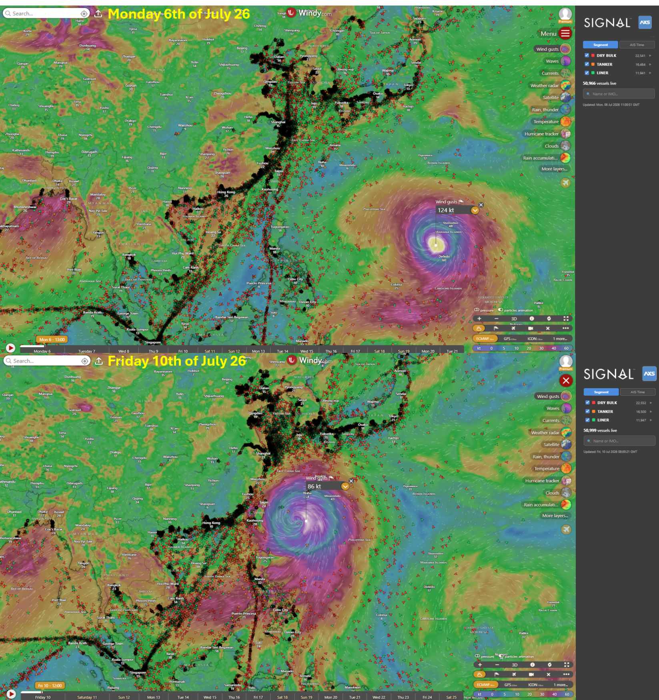
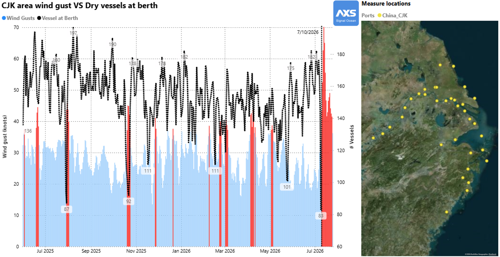

# Typhoon Bavi Hits Taiwan & China, Disrupting Pacific Vessel Supply (Update)

*Published on 17 June 2025*

## Typhoon Bavi Hits Taiwan & China, Disrupting Pacific Vessel Supply (Update)

As reported earlier this week on [Signal Newsroom](https://www.thesignalgroup.com/newsroom/super-typhoon-bavi-heading-to-taiwan-china-might-disrupt-commodity-supply-chain-and-pacific-vessel-supply), Typhoon Bavi is currently impacting navigation around Taiwan and Shanghai area despite Bavi has decreased its intensity. Now rates it as a Category 1 typhoon, according to [ECMWF](https://www.ecmwf.int/) as shown on [Windy](https://www.windy.com/-Hurricane-tracker/hurricanes/bavi?gust,21.836,126.810,5,p:cities) and with Signal & AXSMarine Windy.com plugin.

> **Figure 1: Typhoon Bavi Hits Taiwan & China, Disrupting Pacific Vessel Supply (Update)**  
> **Interactive Data & Source:** [Signal Ocean Platform](https://www.thesignalgroup.com/newsroom/typhoon-bavi-hits-taiwan-china-disrupting-pacific-vessel-supply-update) | [Local Asset](file:///C:/Users/Dell/Github/Shipping/corpus/07-signal/images/6a50d20b5cfa2f6a4aff7e21_69b0b413.png)

Several safety bulletins have been issued by [China Maritime Safety Administration](https://www.msa.gov.cn/msacncms\_wap/pages/content.jhtml?articleId=6a036566f23d4aebb41310cadc21cec2&channelId=5bf518aa3b6b46fd985e61de4155bcdc) to restrict navigation during the Typhoon.

The impact is already visible in the dry bulk segment: vessel activity around Shanghai has fallen by 50%, dropping from 180 vessels at berth earlier this week to 83 on Friday, 10th of July.

> **Figure 2: Typhoon Bavi Hits Taiwan & China, Disrupting Pacific Vessel Supply (Update)**  
> **Interactive Data & Source:** [Signal Ocean Platform](https://www.thesignalgroup.com/newsroom/typhoon-bavi-hits-taiwan-china-disrupting-pacific-vessel-supply-update) | [Local Asset](file:///C:/Users/Dell/Github/Shipping/corpus/07-signal/images/6a50d20b5cfa2f6a4aff7e24_2fcbb0c8.png)

Winds are expected to ease as Bavi makes landfall but will remain elevated until Monday/Tuesday next week, continuing to disrupt port operations from Shanghai to Qingdao.
