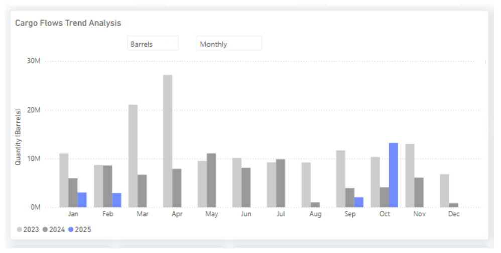

# Wti Returns to China

*Published on 17 June 2025*

## Market Insights: Oil Flowswti Returns to China

> **Figure 1: Signal Ocean Oil Flows**  
> *Signal Ocean Oil Flows*  
> **Interactive Data & Source:** [Signal Ocean Platform](https://www.thesignalgroup.com/newsroom/wti-returns-to-china) | [Local Asset](file:///C:/Users/Dell/Github/Shipping/corpus/07-signal/images/68e39111bb933e1d4e0dbc23_ac1d90d4.png)

- U.S. Gulf loadings to China have shown renewed activity in October after a seven-month lull between February and September. **Preliminary** [**Signal Ocean**](https://www.thesignalgroup.com/signal-ocean/signal-ocean-platform) **estimates** suggest around seven VLCC-equivalent cargoes, roughly 13 million barrels, have been shipped from the U.S. Gulf to China so far this month.

- The recent widening of the **Brent–Dubai Exchange of Futures for Swaps (EFS)** made WTI-linked grades more economical for long-haul trades, briefly reopening the arbitrage window for Chinese refiners to re-enter the U.S. Gulf market on a price-driven basis this October.

- Still, freight stands as the ultimate arbiter. A near 36% quarter-on-quarter rise in VLCC rates from the U.S. Gulf to China has sharply reduced netbacks, undermining arbitrage opportunities even when paper spreads suggest otherwise.

**Track in Real Time:**

Use *Signal Ocean Cargo Flow Trends* to filter by **Origin: U.S. Gulf** and **Destination: China, Japan, Korea, Taiwan, India**, switching between **aggregated** and **voyage-level** analytics.

**Stay ahead of the curve. Get access to the** [**Signal Ocean Platform**](https://calendly.com/thesignalgroup/inbound-demo-session?utm\_source=market+insight&utm\_medium=newsroom&utm\_campaign=inbound) **.**
