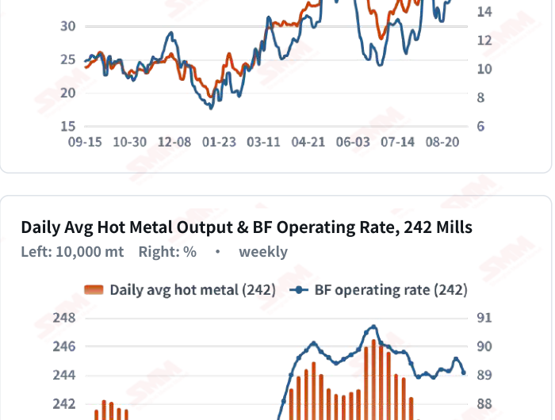
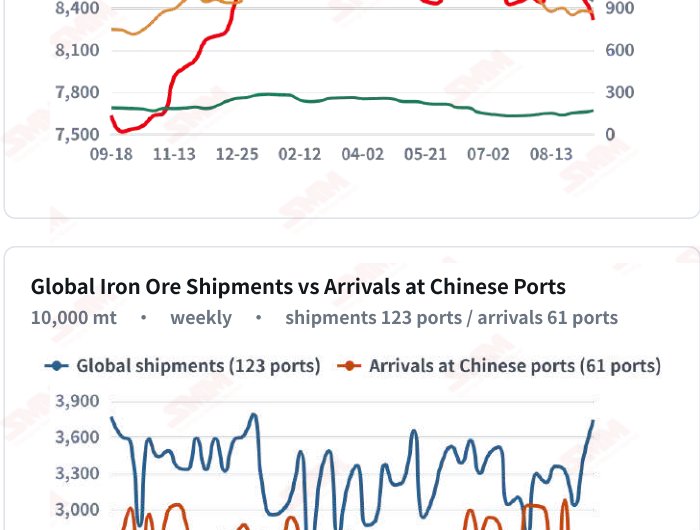
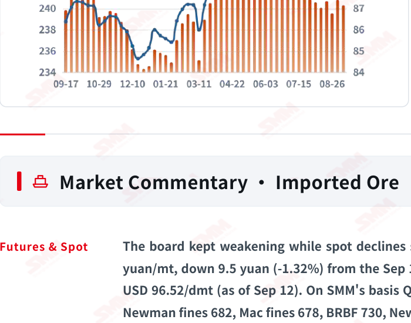
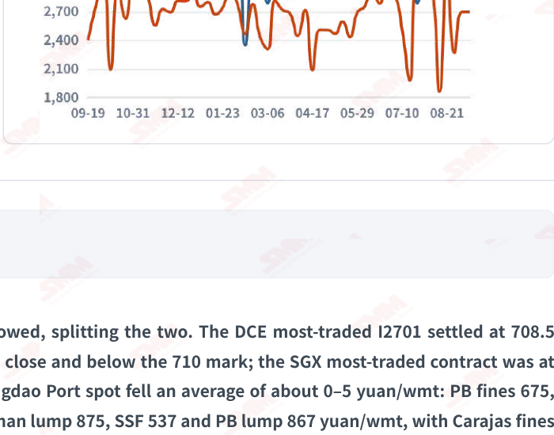

# SMM Iron Ore Daily — 2026-09-14 (Monday)

**Source:** SMM Data-pro · Shanghai Metals Market (SMM)

---

## Futures Contracts

| Exchange | Contract | Price | Unit | Daily Change | Daily Change % | MTD Avg |
|:---|:---|:---:|:---:|:---:|:---:|:---:|
| SGX | SGX Iron Ore Most-traded | 96.52 | USD/dmt | -1.67 | -1.70% | 99.07 |
| DCE | DCE Iron Ore Most-traded I2701 | 708.50 | yuan/mt | -9.5 | -1.32% | 726.80 |

## SMM Iron Ore Price Index (Physical & Benchmark Indices)

| Index Name | Market Type | Fe % | Price | Unit | Daily Change | Daily Change % | MTD Avg |
|:---|:---|:---:|:---:|:---:|:---:|:---:|:---:|
| MMi 61% Port Spot | port_spot | 61.0% | 689.00 | yuan/wmt | -3.0 | -0.43% | 702.00 |
| MMi 58% Port Spot | port_spot | 58.0% | 645.00 | yuan/wmt | -1.0 | -0.15% | 652.00 |
| MMi 65% Port Spot | port_spot | 65.0% | 828.00 | yuan/wmt | -2.0 | -0.24% | 840.00 |
| MMi 61% Seaborne Index | seaborne | 61.0% | 96.05 | USD/dmt | -0.5 | -0.52% | 97.45 |
| MMi 65% Seaborne Index | seaborne | 65.0% | 113.30 | USD/dmt | -1.05 | -0.92% | 116.23 |
| SMM Domestic Ore Composite Index | domestic_composite | 66.0% | 845.94 | yuan/mt | +5.64 | +0.67% | 839.58 |

## Key View

### Futures and spot have split: spot declines are slowing and Carajas fines held flat for a second day, yet the board broke below 710 — high coke prices are forcing maintenance, turning feared cuts into real ones

Today brought the first real divergence of this decline: spot is slowing while the board is accelerating. Declines narrowed across all five MMi indices — port spot from -1.00%/-0.84%/-0.62% the previous session to -0.43%/-0.24%/-0.15% and seaborne from -0.97%/-1.29% to -0.52%/-0.92% — and Carajas fines held flat at 834 yuan/wmt for a second day, yet the DCE most-traded contract still fell 9.5 yuan, breaking below 710 to 708.5 yuan/mt. Futures falling harder than spot means the board is pricing the demand gap ahead, not today's trading. That gap became concrete today. SMM's evening review notes that with coking coal and coke prices staying high, some mills have already entered maintenance on tight coke supply, weakening essential iron ore demand. Notably, SMM's own cost table that morning still said only isolated mills had cut plans with limited real impact — the read moved from “feared but not happening” to “partly in maintenance” within a single day. And the trigger is tight coke supply rather than losses alone, which means the pace of cuts will be set by coke availability and need not ease as ore prices fall. The next hot metal and operating rate prints are the key test. Supply shows no sign of relenting: global shipments reached 37.4058 million mt last week, a second consecutive increase with Australia above 20 million mt for the first time, while arrivals merely held steady — the extra tonnage is still stacked in transit. SMM sums up the port picture as high stocks, slow draws and slow builds, with the 35-port drawdown already markedly slower. On the cost side import losses widened to -9.15 yuan/mt, and domestic ore's relative strength is loosening too, with Shandong 64% alkaline concentrate down 4 yuan to 816. On balance prices look set to stay soft near term, though spot has begun to resist ahead of the board. Three things will decide direction: when coke supply eases, when the in-transit cargo lands, and the final outcome of the long-term contract talks.

## Today's Highlights

- Futures and spot have split: spot is slowing while the board keeps falling. The DCE most-traded I2701 settled at 708.5 yuan/mt (-9.5 yuan, -1.32%), breaking below 710. Declines across all five MMi indices, by contrast, narrowed — on port spot the 61% fell 3 yuan to 689 (-0.43%), the 65% to 828 (-0.24%) and the 58% to 645 (-0.15%), while the 61% seaborne index eased to 96.05 (-0.52%) and the 65% to 113.30 (-0.92%) — all well inside the prior session's -1.00%/-0.84%/-0.62% and -0.97%/-1.29%.
- Cuts have moved from feared to happening — but coke, not losses, is the trigger. SMM's daily review notes that with coking coal and coke prices staying high, some mills have already entered maintenance on tight coke supply, weakening essential iron ore demand. That differs from SMM's own cost table earlier the same day, which said only isolated mills had cut plans with limited real impact — the read moved within a single day.
- Signs of a floor are spreading through spot. On SMM's basis Qingdao Port spot fell an average of about 0–5 yuan/wmt: PB fines 675, Newman fines 682 and SSF 537, while Carajas fines held flat at 834 yuan/wmt for a second day. SMM reports moderate trader activity, mills buying only as needed and a strong wait-and-see mood, with spot trading thin — the slowdown is not buying strength.
- Supply stays ample; ports have settled into high stocks, slow draws, slow builds. SMM describes the current port picture as little changed. Global shipments reached 37.4058 million mt last week (+8.59%), a second consecutive increase, with Australia at 20.7583 million mt (+10.18%) above 20 million for the first time and Brazil at 7.8627 million mt (-7.62%); arrivals at Chinese ports held steady at 26.9105 million mt (-0.01%), so the extra cargo is still in transit.

## Qingdao Port Imported Ore Spot Prices (yuan/wet mt, tax incl.)

| Product | Fe % | Type | Price (yuan/wmt) | Daily Change | Daily Change % | MTD Avg |
|:---|:---:|:---:|:---:|:---:|:---:|:---:|
| PB Fines 60.8% | 60.8% | Fines | 675.0 | -5.0 | -0.74% | 694.0 |
| Newman Fines 61.2% | 61.2% | Fines | 682.0 | -5.0 | -0.73% | 701.0 |
| Mac Fines 60.8% | 60.8% | Fines | 678.0 | -5.0 | -0.73% | 698.0 |
| BRBF 62.5% | 62.5% | Fines | 730.0 | -5.0 | -0.68% | 750.0 |
| Newman Lump 63% | 63.0% | Lump | 875.0 | -5.0 | -0.57% | 894.0 |
| Super Special Fines (SSF) 56.5% | 56.5% | Fines | 537.0 | -5.0 | -0.92% | 556.0 |
| Carajas Fines (IOCJ) 65% | 65.0% | Fines | 834.0 | 0.0 | 0.00% | 846.0 |
| PB Lump 61.5% | 61.5% | Lump | 867.0 | -5.0 | -0.57% | 890.0 |

## Imported Ore USD Prices & MMi Indices (CFR Qingdao, USD/dry mt)

| Product | Fe % | Type | Price (USD/dmt) | Daily Change | Daily Change % | MTD Avg |
|:---|:---:|:---:|:---:|:---:|:---:|:---:|
| Carajas Fines (IOCJ) 65% | 65.0% | Fines | 114.52 | +0.07 | +0.06% | 115.99 |
| PB Lump 61.6% | 61.6% | Lump | 119.64 | -0.63 | -0.52% | 122.42 |
| BRBF 62.5% | 62.5% | Fines | 99.75 | -0.64 | -0.64% | 102.49 |
| Newman Fines 61.2% | 61.2% | Fines | 92.93 | -0.64 | -0.68% | 95.45 |
| Mac Fines 61% | 61.0% | Fines | 92.36 | -0.65 | -0.70% | 95.00 |
| Jimblebar Fines 60.5% | 60.5% | Fines | 89.09 | -0.65 | -0.72% | 91.05 |
| FMG Blend Fines 58.5% | 58.5% | Fines | 86.96 | -0.65 | -0.74% | 88.72 |
| Newman Lump 63% | 63.0% | Lump | 120.35 | -0.63 | -0.52% | 122.84 |
| Super Special Fines (SSF) 57% | 57.0% | Fines | 72.32 | -0.66 | -0.90% | 74.87 |
| Indian Fines 57% | 57.0% | Fines | 67.78 | -0.66 | -0.96% | 70.46 |

## SMM Iron Ore Price Index — Weekly / Monthly Statistics

| Index Name | Month-to-date Avg | MoM % | YTD % | Unit |
|:---|:---:|:---:|:---:|:---:|
| SMM MMi 61% Iron Ore Seaborne Index | 97.45 | +2.22% | -9.3% | USD/dmt |
| SMM MMi 65% Iron Ore Seaborne Index | 116.23 | +0.38% | -6.6% | USD/dmt |
| SMM MMi 61% Iron Ore Port Spot Index | 702.00 | +1.68% | -15.3% | yuan/wmt |
| SMM MMi 65% Iron Ore Port Spot Index | 840.00 | +0.88% | -7.9% | yuan/wmt |
| SMM MMi 58% Iron Ore Port Spot Index | 652.00 | +1.95% | -10.2% | yuan/wmt |
| SMM China Domestic Ore Composite Price Index | 839.58 | -0.17% | -4.6% | yuan/mt |

## Key Price Drivers (12-Month Charts & Operational Metrics)

### Charts: Freight & Port Inventory

### Charts: Hot Metal Output & Shipments vs Arrivals

### Operational Fundamentals Snapshot

| Fundamental Indicator | Value | Unit |
|:---|:---:|:---:|
| C3 Freight (Brazil to China) | 41.92 | USD/mt |
| C5 Freight (Australia to China) | 17.95 | USD/mt |
| Iron Ore Port Inventory (10 Major Ports) | 103.0184 | Million MT |
| Global Iron Ore Shipments (Weekly) | 37.4058 | Million MT |
| Chinese Port Arrivals (Weekly) | 26.9105 | Million MT |
| Domestic Mine Capacity Utilisation | 56.4 | % |

## Market Commentary · Imported Ore

### Futures & Spot

The board kept weakening while spot declines slowed, splitting the two. The DCE most-traded I2701 settled at 708.5 yuan/mt, down 9.5 yuan (-1.32%) from the Sep 11 close and below the 710 mark; the SGX most-traded contract was at USD 96.52/dmt (as of Sep 12). On SMM's basis Qingdao Port spot fell an average of about 0–5 yuan/wmt: PB fines 675, Newman fines 682, Mac fines 678, BRBF 730, Newman lump 875, SSF 537 and PB lump 867 yuan/wmt, with Carajas fines flat at 834 yuan/wmt for a second day. SMM reports moderate trader activity, mills buying as needed with a strong wait- and-see mood, and thin spot trading. Caliber note: SMM's daily review cites a 1.60% fall for the DCE contract, which is its “previous trading session” basis including the night session; this report uses closing prices (718.0 → 708.5, -1.32%).

### Driver

The driver has shifted from last week's contract-talk price expectations to the cost side. SMM notes that coking coal and coke prices remain high, that mill profitability narrowed further once the coke increase landed, and that some mills have already entered maintenance on tight coke supply, weakening essential iron ore demand. The macro backdrop is bearish too: tensions in the Middle East continue to escalate, with Houthi forces tightening control around the Bab el- Mandeb strait, lifting crude and trade risk together, while rising Fed tightening expectations keep commodities broadly under pressure.

### Demand

Cuts have moved from expectation to partial reality, and the read shifted within a single day — worth noting. SMM's morning cost table said that while most mills are loss-making, only isolated mills had cut plans and the actual impact on demand was limited; its evening daily review says some mills have already entered maintenance on tight coke supply, weakening essential demand. The direct trigger is tight coke supply rather than losses alone. Weekly indicators still stand as of Sep 9: the blast furnace operating rate across 242 mills at 89.08% (-0.48 ppt WoW) and daily average hot metal output at 2.4028 million mt (-5,200 mt); mill imported ore stocks at 74.24 million mt (-440,000 mt) and 19.3 days of consumption, still lean. The next hot metal print is the key test.

### Inventory & Supply

SMM sums up the current port picture as high stocks, slow draws and slow builds, little changed. Inventory at the 35 ports was 143.49 million mt (-420,000 mt WoW), with the pace of drawdown markedly slower than earlier; daily outbound volume was 3.235 million mt (+90,000 mt) and the 10-port total 103.0184 million mt (-1.8021 million mt). Supply is still expanding: global shipments reached 37.4058 million mt last week, up 2.9577 million mt (+8.59%), a second consecutive weekly increase with the year-to-date total flat YoY; Australia shipped 20.7583 million mt (+10.18%), above 20 million for the first time, non-mainstream countries also grew and Brazil slipped to 7.8627 million mt (-7.62%). Arrivals at Chinese ports held steady at 26.9105 million mt (-0.01%), +4.2% YTD — the increase in shipments has yet to become arrivals, and the cargo is still in transit.

### Cost & Margin

The average imported ore margin fell from -1.90 to -9.15 yuan/mt, a widening loss that SMM attributes to sharply lower spot prices and higher freight on some routes, with further widening likely near term. The two main routes keep diverging: C3 Brazil→China at USD 41.92/mt (+0.65%), another period high, and C5 Australia→China at USD 17.95/mt (-2.13%), easing again (both as of Sep 11).

## Market Commentary · Domestic Ore

### Prices

Regional domestic quotes have started to follow imports down. SMM's latest brief shows Shandong mines offering 64% alkaline concentrate at 816 yuan/mt ex-mine, dry basis, pre-tax, acceptance terms — down 4 yuan, with mills cutting their bids in step. The national SMM China Domestic Ore Composite Price Index still reads 845.94 yuan/mt (as of Sep 11, +0.67%) and does not yet reflect this leg down.

### Supply & Demand

Supply remains tight: despite occasional safety inspections most mines are running normally, but another concentrator in Linyi has halted, local operations are fairly determined to hold prices, and mines are running with no inventory. Demand is holding up reasonably: mills are buying actively in a slow build-up phase, smaller plants and traders are moving material well, and overall trading is acceptable. Separately, SMM's survey puts domestic mine capacity utilisation at 56.4% this week (-1.4 ppt WoW), concentrate output at 872,000 mt (-21,000 mt) and mine concentrate stocks down to 263,000 mt.

### Outlook

Given the recent weakness in iron ore futures, SMM expects Shandong regional prices to trade rangebound near term. With shrinking supply pulling one way and a falling board the other, domestic ore's relative strength may be hard to sustain.

## Market Factors

### Supportive Factors

- Declines narrowed across all five MMi indices (port -0.43%/-0.24%/-0.15%, seaborne -0.52%/-0.92%); Carajas flat for a second day.
- Ports have settled into high stocks with slow draws and slow builds, so there is no clear build pressure yet.
- Mills are buying actively in a slow build-up phase and domestic ore trading is acceptable.
- Domestic mine capacity utilisation fell to 56.4%, a Linyi concentrator halted, and mines hold no inventory.
- C3 Brazil→China freight hit another period high at USD 41.92/mt, lifting long-haul landed costs.
- Import losses widened to -9.15 yuan/mt, constraining further downside on the cost side.

### Bearish Factors

- High coke prices have pushed some mills into maintenance on tight supply, weakening essential ore demand.
- The DCE contract broke below 710 to 708.5 yuan/mt, falling harder than spot as expectations price lower.
- Global shipments rose 8.59% for a second week, Australia topped 20 million mt, and the cargo is still in transit.
- The pace of drawdown at the 35 ports has slowed markedly, so port-side support is weakening.
- Middle East tensions lifted crude and trade risk while Fed tightening bets rose, pressuring commodities broadly.
- Shandong 64% alkaline concentrate fell 4 yuan to 816, so regional domestic quotes are starting to follow down.

---
*(c) 2026 Shanghai Metals Market (SMM) · Iron Ore Value-Chain Data & Research*
