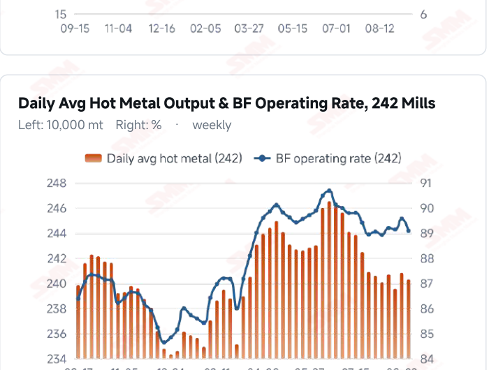
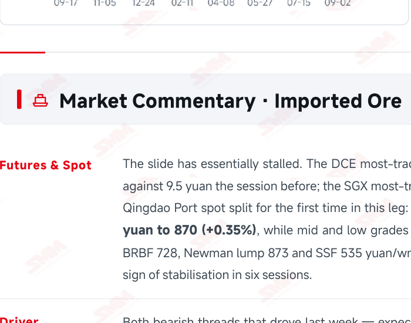
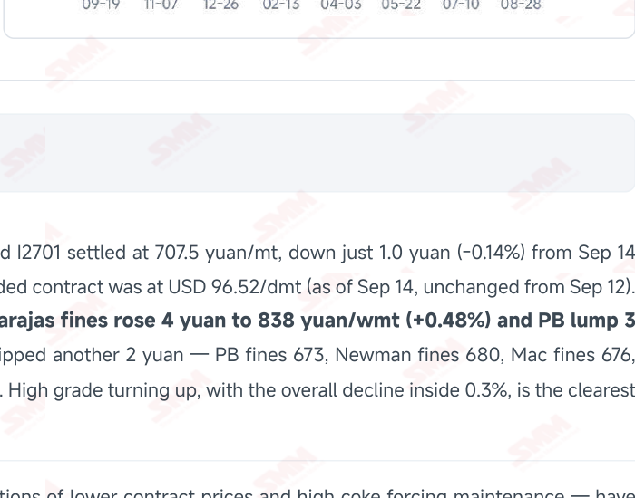

# SMM Iron Ore Daily — 2026-09-15 (Tuesday)

**Source:** SMM Data-pro · Shanghai Metals Market (SMM)

---

## Futures Contracts

| Exchange | Contract | Price | Unit | Daily Change | Daily Change % | MTD Avg |
|:---|:---|:---:|:---:|:---:|:---:|:---:|
| SGX | SGX Iron Ore Most-traded | 96.52 | USD/dmt | 0.0 | 0.00% | 98.85 |
| DCE | DCE Iron Ore Most-traded I2701 | 707.50 | yuan/mt | -1.0 | -0.14% | 725.00 |

## SMM Iron Ore Price Index (Physical & Benchmark Indices)

| Index Name | Market Type | Fe % | Price | Unit | Daily Change | Daily Change % | MTD Avg |
|:---|:---|:---:|:---:|:---:|:---:|:---:|:---:|
| MMi 61% Port Spot | port_spot | 61.0% | 684.00 | yuan/wmt | -5.0 | -0.73% | 700.00 |
| MMi 58% Port Spot | port_spot | 58.0% | 644.00 | yuan/wmt | -1.0 | -0.16% | 651.00 |
| MMi 65% Port Spot | port_spot | 65.0% | 828.00 | yuan/wmt | 0.0 | 0.00% | 839.00 |
| MMi 61% Seaborne Index | seaborne | 61.0% | 95.80 | USD/dmt | -0.25 | -0.26% | 97.30 |
| MMi 65% Seaborne Index | seaborne | 65.0% | 112.45 | USD/dmt | -0.85 | -0.75% | 115.89 |
| SMM Domestic Ore Composite Index | domestic_composite | 66.0% | 845.94 | yuan/mt | +5.64 | +0.67% | 839.58 |

## Key View

### After six sessions the slide has stalled and high grade turned up first; maintenance losses have fallen for a second week, undercutting the “demand keeps weakening” call

After six straight sessions lower, the market has given a clear stabilisation signal. The DCE most-traded contract fell just 1.0 yuan to 707.5 yuan/mt, against 9.5 the day before; more importantly, spot split for the first time in this leg — Carajas fines rose 4 yuan to 838 and PB lump 3 yuan to 870 yuan/wmt while mid and low grades slipped another 2. High grade turning up is not an isolated move: C3 Brazil→China freight climbed in step to USD 42.02/mt, another period high, and rising long-haul costs support high-grade prices directly. What really deserves a rethink is demand. For two days running SMM's cost table has stressed that some mills have entered maintenance on tight coke supply and that essential iron ore demand is weakening — yet SMM's own weekly maintenance survey points the other way: hot metal lost to blast furnace maintenance is 1.4157 million mt this week, down 57,600 mt WoW, and is projected 42,300 mt lower again next week at 1.3734 million mt, with long-product maintenance losses falling in step. Maintenance pressure is easing, not building — and that is the fundamental basis for prices stopping where they did. The longer-run contraction is nonetheless real: NBS puts August pig iron output at 67.65 million mt, -3.5% YoY, with Jan–Aug down 3.1%. Costs have not eased either, with the average imported ore margin falling from -9.15 to -10.61 yuan/mt, leaving sellers very little room to concede. On balance, prices look set to shift from a one-way decline into low-level consolidation, and the high-grade premium has already begun to recover — the 65% port spot index held flat, the 58% slipped just 1 yuan and the 61% fell 5, widening the high-low spread from 183 to 184 yuan/wmt. Two things to verify: whether the next 242-mill hot metal print rises as maintenance losses fall, and when last week's shipment surge (+8.59%) finally lands in port stocks — that remains the supply pressure hanging overhead.

## Today's Highlights

- Sixth session: the slide has stalled and high grade turned up first. The DCE most-traded I2701 settled at 707.5 yuan/mt (-1.0 yuan, -0.14%), a fall of just one yuan against 9.5 the previous session. Qingdao Port spot split for the first time in this leg: Carajas fines rose 4 yuan to 838 and PB lump 3 yuan to 870 yuan/wmt, the first gains of the decline, while mid and low grades slipped another 2 yuan — PB fines 673, Newman fines 680 and SSF 535 yuan/wmt. The indices confirm it: the 65% port spot index held flat at 828, its first unchanged print of this decline.
- Maintenance losses fell for a second week, undercutting the bearish demand call. SMM's weekly maintenance survey puts hot metal lost to blast furnace maintenance at 1.4157 million mt this week (Sep 12–18), down 57,600 mt WoW, and projects 1.3734 million mt next week (Sep 19–25), down a further 42,300 mt. That runs the opposite way to the “tight coke forcing maintenance, essential demand weakening” narrative — maintenance pressure is easing, not building.
- Import losses keep widening, squeezed from both ends. SMM puts the average imported ore margin at -10.61 yuan/mt, down from -9.15, driven by the continued fall in spot prices. Freight stays split: C3 Brazil→China rose to USD 42.02/mt (+0.24%), another high for the period, while C5 Australia→China eased to USD 17.77/mt (-1.00%), lower for a third straight session.
- August pig iron output fell 3.5% YoY — the demand contraction is already fact. NBS data show national pig iron output of 67.65 million mt in August, down 3.5% YoY, with Jan–Aug at 563.40 million mt, down 3.1% YoY. Domestic ore is under pressure too: Tangshan 66% concentrate eased to 935–940 yuan/mt delivered, dry basis and tax inclusive, with mills now moving into losses and pressing hard on concentrate prices.

## Qingdao Port Imported Ore Spot Prices (yuan/wet mt, tax incl.)

| Product | Fe % | Type | Price (yuan/wmt) | Daily Change | Daily Change % | MTD Avg |
|:---|:---:|:---:|:---:|:---:|:---:|:---:|
| PB Fines 60.8% | 60.8% | Fines | 673.0 | -2.0 | -0.30% | 692.0 |
| Newman Fines 61.2% | 61.2% | Fines | 680.0 | -2.0 | -0.29% | 699.0 |
| Mac Fines 60.8% | 60.8% | Fines | 676.0 | -2.0 | -0.29% | 696.0 |
| BRBF 62.5% | 62.5% | Fines | 728.0 | -2.0 | -0.27% | 748.0 |
| Newman Lump 63% | 63.0% | Lump | 873.0 | -2.0 | -0.23% | 892.0 |
| Super Special Fines (SSF) 56.5% | 56.5% | Fines | 535.0 | -2.0 | -0.37% | 554.0 |
| Carajas Fines (IOCJ) 65% | 65.0% | Fines | 838.0 | +4.0 | +0.48% | 845.0 |
| PB Lump 61.5% | 61.5% | Lump | 870.0 | +3.0 | +0.35% | 888.0 |

## Imported Ore USD Prices & MMi Indices (CFR Qingdao, USD/dry mt)

| Product | Fe % | Type | Price (USD/dmt) | Daily Change | Daily Change % | MTD Avg |
|:---|:---:|:---:|:---:|:---:|:---:|:---:|
| Carajas Fines (IOCJ) 65% | 65.0% | Fines | 115.14 | +0.62 | +0.54% | 115.91 |
| PB Lump 61.6% | 61.6% | Lump | 119.69 | +0.05 | +0.04% | 122.17 |
| BRBF 62.5% | 62.5% | Fines | 99.50 | -0.25 | -0.25% | 102.22 |
| Newman Fines 61.2% | 61.2% | Fines | 92.68 | -0.25 | -0.27% | 95.20 |
| Mac Fines 61% | 61.0% | Fines | 92.11 | -0.25 | -0.27% | 94.73 |
| Jimblebar Fines 60.5% | 60.5% | Fines | 89.55 | +0.46 | +0.52% | 90.92 |
| FMG Blend Fines 58.5% | 58.5% | Fines | 86.71 | -0.25 | -0.29% | 88.54 |
| Newman Lump 63% | 63.0% | Lump | 120.11 | -0.24 | -0.20% | 122.59 |
| Super Special Fines (SSF) 57% | 57.0% | Fines | 72.07 | -0.25 | -0.35% | 74.62 |
| Indian Fines 57% | 57.0% | Fines | 67.52 | -0.26 | -0.38% | 70.19 |

## SMM Iron Ore Price Index — Weekly / Monthly Statistics

| Index Name | Month-to-date Avg | MoM % | YTD % | Unit |
|:---|:---:|:---:|:---:|:---:|
| SMM MMi 61% Iron Ore Seaborne Index | 97.30 | +2.06% | -9.6% | USD/dmt |
| SMM MMi 65% Iron Ore Seaborne Index | 115.89 | +0.09% | -7.3% | USD/dmt |
| SMM MMi 61% Iron Ore Port Spot Index | 700.00 | +1.45% | -15.9% | yuan/wmt |
| SMM MMi 65% Iron Ore Port Spot Index | 839.00 | +0.74% | -7.9% | yuan/wmt |
| SMM MMi 58% Iron Ore Port Spot Index | 651.00 | +1.84% | -10.3% | yuan/wmt |
| SMM China Domestic Ore Composite Price Index | 839.58 | -0.17% | -4.6% | yuan/mt |

## Key Price Drivers (12-Month Charts & Operational Metrics)

### Charts: Freight & Port Inventory

### Charts: Hot Metal Output & Shipments vs Arrivals

### Operational Fundamentals Snapshot

| Fundamental Indicator | Value | Unit |
|:---|:---:|:---:|
| C3 Freight (Brazil to China) | 42.02 | USD/mt |
| C5 Freight (Australia to China) | 17.77 | USD/mt |
| Iron Ore Port Inventory (10 Major Ports) | 103.0184 | Million MT |
| Iron Ore Port Inventory (35 Major Ports) | 143.49 | Million MT |
| Daily Avg Port Outbound Volume | 3.235 | Million MT |
| Imported Ore Stocks (242 Steel Mills) | 74.24 | Million MT |
| Global Iron Ore Shipments (Weekly) | 37.4058 | Million MT |
| Chinese Port Arrivals (Weekly) | 26.9105 | Million MT |

## Market Commentary · Imported Ore

### Futures & Spot

The slide has essentially stalled. The DCE most-traded I2701 settled at 707.5 yuan/mt, down just 1.0 yuan (-0.14%) from Sep 14 against 9.5 yuan the session before; the SGX most-traded contract was at USD 96.52/dmt (as of Sep 14, unchanged from Sep 12). Qingdao Port spot split for the first time in this leg: Carajas fines rose 4 yuan to 838 yuan/wmt (+0.48%) and PB lump 3 yuan to 870 (+0.35%), while mid and low grades slipped another 2 yuan — PB fines 673, Newman fines 680, Mac fines 676, BRBF 728, Newman lump 873 and SSF 535 yuan/wmt. High grade turning up, with the overall decline inside 0.3%, is the clearest sign of stabilisation in six sessions.

### Driver

Both bearish threads that drove last week — expectations of lower contract prices and high coke forcing maintenance — have loosened. SMM's weekly maintenance survey shows maintenance losses falling for a second week, at odds with the view that essential demand keeps weakening; and after five straight sessions lower with import margins more than 10 yuan in the red, sellers have little room left to concede. SMM nonetheless keeps a soft call in its cost table, expecting prices to stay weak with

### Demand

The key data point this issue. SMM's weekly maintenance survey: hot metal lost to blast furnace maintenance is 1.4157 million mt this week (Sep 12–18), down 57,600 mt WoW, and is projected at 1.3734 million mt next week (Sep 19–25), down a further 42,300 mt. Long-product maintenance losses fell in step, to 1.0333 million mt this week (-23,600 mt) and 924,900 mt next week (-108,400 mt). Caliber note: SMM's cost table has said for two days running that some mills have entered maintenance on tight coke supply and that essential iron ore demand is weakening, yet its own weekly maintenance data show those losses declining. This report follows the data and reads maintenance pressure as easing, with hot metal likely to recover — though the next 242- mill print is the test (the current reading is still Sep 9: 2.4028 million mt and an 89.08% operating rate). The longer-run contraction is real, however: NBS puts August pig iron output at 67.65 million mt, -3.5% YoY, and Jan–Aug at 563.40 million mt, -3.1% YoY.

### Inventory & Supply

The supply picture is unchanged. SMM describes ports as holding high stocks with slow draws and slow builds, little changed: 35-port inventory at 143.49 million mt (-420,000 mt WoW), daily outbound volume 3.235 million mt (+90,000 mt) and the 10-port total 103.0184 million mt (-1.8021 million mt); imported ore stocks at 242 mills 74.24 million mt (-440,000 mt) with 19.3 days of consumption. Global shipments last week reached 37.4058 million mt (+2.9577 million mt, +8.59%), of which Australia 20.7583 million mt (+10.18%) and Brazil 7.8627 million mt (-7.62%); arrivals at Chinese ports held at 26.9105 million mt (-0.01%), +4.2% YTD. The extra cargo is still in transit.

### Cost & Margin

The average imported ore margin fell further from -9.15 to -10.61 yuan/mt on continued spot weakness, and SMM expects losses to hold around current levels. The two main routes keep diverging: C3 Brazil→China at USD 42.02/mt (+0.10, +0.24%), another period high, and C5 Australia→China at USD 17.77/mt (-0.18, -1.00%), easing for a third straight session (both as of Sep 14). Notably, high grade turned up exactly as C3 pushed higher — rising long-haul costs support high-grade prices directly.

## Market Commentary · Domestic Ore

### Prices

Tangshan prices edged lower, with 66% concentrate now quoted at 935–940 yuan/mt delivered, dry basis and tax inclusive. The national SMM China Domestic Ore Composite Price Index still reads 845.94 yuan/mt (as of Sep 11) and does not yet reflect this regional pullback.

### Supply & Demand

Buyers and sellers are clearly testing each other. Supply stays tight: concentrator run rates remain low, state-owned operations largely consume their own output and private concentrate supply is short. Demand is weakening: mills are now moving into losses and pressing hard on domestic concentrate prices.

### Outlook

Given the recent weakness in iron ore futures, SMM expects Tangshan concentrate to trade soft and rangebound near term. Domestic ore's earlier counter-trend strength is fading — after Shandong 64% alkaline concentrate fell 4 yuan last week, Tangshan concentrate has now edged lower too.

## Market Factors

### Supportive Factors

- High grade turned up first: Carajas fines +4 to 838 and PB lump +3 to 870 yuan/wmt, the first gains of the decline.
- The DCE contract fell just 1.0 yuan (-0.14%), against 9.5 yuan the previous session.
- Maintenance losses fell for a second week: 1.4157 million mt this week (-57,600), 1.3734 million next (-42,300).
- C3 Brazil→China freight hit another period high at USD 42.02/mt, lifting high-grade landed costs.
- Import losses widened to -10.61 yuan/mt, leaving sellers little room to concede further.
- Low concentrator run rates and short private concentrate supply keep domestic ore snug.

### Bearish Factors

- August pig iron output was 67.65 million mt, -3.5% YoY, with Jan–Aug -3.1% — the contraction is fact.
- SMM keeps a soft call: with demand contracting and supply holding, prices should stay weak near term.
- Ports hold high stocks with slow draws and slow builds, so the drawdown offers limited price support.
- Global shipments rose 8.59% last week with Australia above 20 million mt; that cargo has yet to land.
- Mills are moving into losses and pressing domestic concentrate prices; Tangshan has turned lower.
- Mills hold just 19.3 days of consumption, staying lean with pre-holiday restocking not truly underway.

---
*(c) 2026 Shanghai Metals Market (SMM) · Iron Ore Value-Chain Data & Research*
