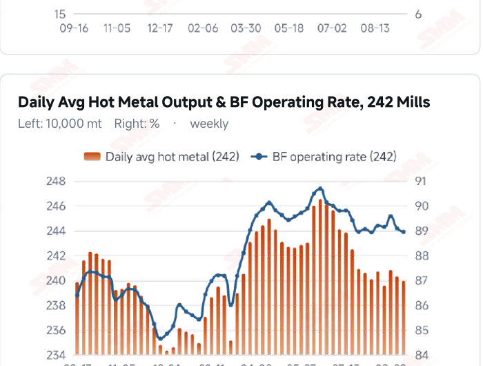
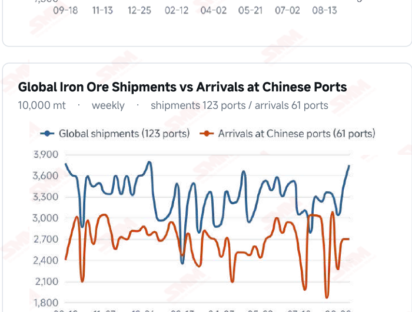
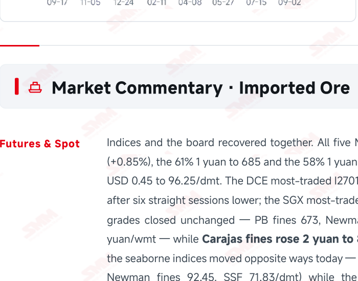
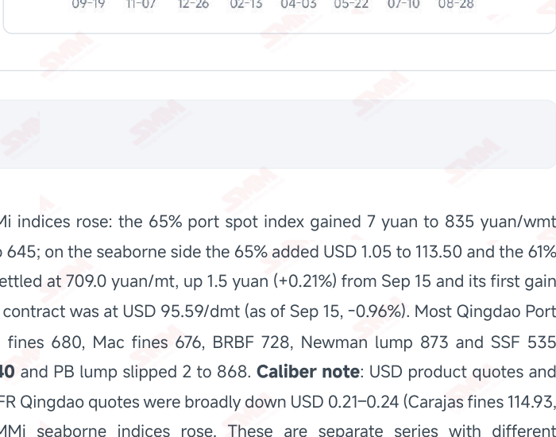

# SMM Iron Ore Daily — 2026-09-16 (Wednesday)

**Source:** SMM Data-pro · Shanghai Metals Market (SMM)

---

## Futures Contracts

| Exchange | Contract | Price | Unit | Daily Change | Daily Change % | MTD Avg |
|:---|:---|:---:|:---:|:---:|:---:|:---:|
| SGX | SGX Iron Ore Most-traded | 95.59 | USD/dmt | -0.93 | -0.96% | 98.60 |
| DCE | DCE Iron Ore Most-traded I2701 | 709.00 | yuan/mt | +1.5 | +0.21% | 723.70 |

## SMM Iron Ore Price Index (Physical & Benchmark Indices)

| Index Name | Market Type | Fe % | Price | Unit | Daily Change | Daily Change % | MTD Avg |
|:---|:---|:---:|:---:|:---:|:---:|:---:|:---:|
| MMi 61% Port Spot | port_spot | 61.0% | 685.00 | yuan/wmt | +1.0 | +0.15% | 699.00 |
| MMi 58% Port Spot | port_spot | 58.0% | 645.00 | yuan/wmt | +1.0 | +0.16% | 650.00 |
| MMi 65% Port Spot | port_spot | 65.0% | 835.00 | yuan/wmt | +7.0 | +0.85% | 839.00 |
| MMi 61% Seaborne Index | seaborne | 61.0% | 96.25 | USD/dmt | +0.45 | +0.47% | 97.21 |
| MMi 65% Seaborne Index | seaborne | 65.0% | 113.50 | USD/dmt | +1.05 | +0.93% | 115.69 |
| SMM Domestic Ore Composite Index | domestic_composite | 66.0% | 845.94 | yuan/mt | +5.64 | +0.67% | 839.58 |

## Key View

### Indices and futures turned up together and the high-low spread widened 6 yuan in a day — but hot metal is still falling and the rally lacks breadth

Both of today's developments point the same way: yesterday's encouraging signals were not solid. First, futures and spot swapped roles — the DCE most-traded contract rose 1.5 yuan to 709.0 yuan/mt, its first gain after six sessions lower, while spot fell another 2 yuan across the board and Carajas fines and PB lump, which led yesterday's turn, gave back 2 yuan each. High grade's solo run lasted a single session. The direct cause sits on the cost side: C5 Australia→China freight fell 3.66% in a day to USD 17.12/mt and C3 Brazil→China ended its run of gains, easing to 41.79 — the long-haul cost factor that had supported high grade is gone. Second, and more importantly: the previous issue argued from two weeks of falling maintenance losses that hot metal should recover, and today's data refuted it. SMM's survey puts daily average hot metal across 242 mills at 2.3991 million mt, down a further 3,700 mt, with the operating rate at 88.93%. SMM attributes this to the lagged effect of earlier maintenance — losses are falling, but output lost to earlier work is still feeding through. The decline did narrow (-5,200 to -3,700 mt) and one furnace is due to restart next week, though SMM warns that deepening mill losses could bring unplanned maintenance and leave output short of that. Note that CISA's series points the other way, with early-September pig iron at key enterprises up 1.7% per day; the samples and periods differ, and this report uses SMM's 242-mill basis throughout. Supply has a new variable: the union's negotiating proposal at Port Hedland was formally rejected. No strike has been reported, but this is Australia's largest iron ore export terminal and Australian shipments have just hit a record 20.7583 million mt, so industrial action would bite. On balance, prices should keep trading in a range with a soft centre — SMM's current view too. A genuine turn requires hot metal itself to rise, not merely maintenance losses to fall.

## Today's Highlights

- Indices and futures turned higher together, with high grade far in front. All five MMi indices rose: the 65% port spot index jumped 7 yuan to 835 (+0.85%) while the 61% and 58% each added 1 yuan, to 685 and 645; on the seaborne side the 65% gained USD 1.05 to 113.50 and the 61% USD 0.45 to 96.25/dmt. The DCE most-traded I2701 settled at 709.0 yuan/mt (+1.5 yuan), its first gain after six sessions lower.
- The high-low spread widened 6 yuan in a day as the premium recovery accelerates. The gap between the 65% and 58% port spot indices went from 184 to 190 yuan/wmt. Spot confirms it: most Qingdao Port grades closed unchanged — PB fines 673, Newman fines 680, Mac fines 676, BRBF 728, Newman lump 873 and SSF 535 yuan/wmt — while Carajas fines rose 2 yuan to 840 against the trend and PB lump slipped 2 to 868.
- Hot metal did not rebound; demand remains the weakest link. SMM's survey puts daily average hot metal output at 2.3991 million mt on Sep 16, down a further 3,700 mt, with the blast furnace operating rate at 88.93% (-0.15 ppt). Although maintenance losses have fallen for two straight weeks, output is still sliding on the lagged effect of earlier maintenance, though the decline narrowed from 5,200 mt. Two furnaces entered maintenance this period and three restarted.
- Freight eased, yet failed to cap high grade. C5 Australia→China fell 3.66% in a day to USD 17.12/mt and C3 Brazil→China eased for the first time, down 0.55% to USD 41.79/mt (both as of Sep 15). High grade strengthened even as cost support faded, which says this leg is no longer cost-driven but driven by product structure and demand. Also worth watching: SMM notes the union's negotiating proposal at Port Hedland was formally rejected, with no strike reported.

## Qingdao Port Imported Ore Spot Prices (yuan/wet mt, tax incl.)

| Product | Fe % | Type | Price (yuan/wmt) | Daily Change | Daily Change % | MTD Avg |
|:---|:---:|:---:|:---:|:---:|:---:|:---:|
| PB Fines 60.8% | 60.8% | Fines | 673.0 | 0.0 | 0.00% | 690.0 |
| Newman Fines 61.2% | 61.2% | Fines | 680.0 | 0.0 | 0.00% | 697.0 |
| Mac Fines 60.8% | 60.8% | Fines | 676.0 | 0.0 | 0.00% | 694.0 |
| BRBF 62.5% | 62.5% | Fines | 728.0 | 0.0 | 0.00% | 747.0 |
| Newman Lump 63% | 63.0% | Lump | 873.0 | 0.0 | 0.00% | 890.0 |
| Super Special Fines (SSF) 56.5% | 56.5% | Fines | 535.0 | 0.0 | 0.00% | 552.0 |
| Carajas Fines (IOCJ) 65% | 65.0% | Fines | 840.0 | +2.0 | +0.24% | 845.0 |
| PB Lump 61.5% | 61.5% | Lump | 868.0 | -2.0 | -0.23% | 886.0 |

## Imported Ore USD Prices & MMi Indices (CFR Qingdao, USD/dry mt)

| Product | Fe % | Type | Price (USD/dmt) | Daily Change | Daily Change % | MTD Avg |
|:---|:---:|:---:|:---:|:---:|:---:|:---:|
| Carajas Fines (IOCJ) 65% | 65.0% | Fines | 114.93 | -0.21 | -0.18% | 115.83 |
| PB Lump 61.6% | 61.6% | Lump | 119.48 | -0.21 | -0.18% | 121.94 |
| BRBF 62.5% | 62.5% | Fines | 99.28 | -0.22 | -0.22% | 101.98 |
| Newman Fines 61.2% | 61.2% | Fines | 92.45 | -0.23 | -0.25% | 94.97 |
| Mac Fines 61% | 61.0% | Fines | 91.88 | -0.23 | -0.25% | 94.50 |
| Jimblebar Fines 60.5% | 60.5% | Fines | 89.32 | -0.23 | -0.26% | 90.78 |
| FMG Blend Fines 58.5% | 58.5% | Fines | 86.48 | -0.23 | -0.27% | 88.37 |
| Newman Lump 63% | 63.0% | Lump | 119.90 | -0.21 | -0.17% | 122.37 |
| Super Special Fines (SSF) 57% | 57.0% | Fines | 71.83 | -0.24 | -0.33% | 74.39 |
| Indian Fines 57% | 57.0% | Fines | 67.29 | -0.23 | -0.34% | 69.95 |

## SMM Iron Ore Price Index — Weekly / Monthly Statistics

| Index Name | Month-to-date Avg | MoM % | YTD % | Unit |
|:---|:---:|:---:|:---:|:---:|
| SMM MMi 61% Iron Ore Seaborne Index | 97.21 | +1.97% | -9.2% | USD/dmt |
| SMM MMi 65% Iron Ore Seaborne Index | 115.69 | -0.08% | -6.5% | USD/dmt |
| SMM MMi 61% Iron Ore Port Spot Index | 699.00 | +1.27% | -15.7% | yuan/wmt |
| SMM MMi 65% Iron Ore Port Spot Index | 839.00 | +0.70% | -7.1% | yuan/wmt |
| SMM MMi 58% Iron Ore Port Spot Index | 650.00 | +1.77% | -10.2% | yuan/wmt |
| SMM China Domestic Ore Composite Price Index | 839.58 | -0.17% | -4.6% | yuan/mt |

## Key Price Drivers (12-Month Charts & Operational Metrics)

### Charts: Freight & Port Inventory

### Charts: Hot Metal Output & Shipments vs Arrivals

### Operational Fundamentals Snapshot

| Fundamental Indicator | Value | Unit |
|:---|:---:|:---:|
| Daily Avg Hot Metal Output (242 Mills) | 2.3991 | Million MT |
| Blast Furnace Operating Rate (242 Mills) | 88.93 | % |
| Blast Furnace Capacity Utilisation (242 Mills) | 88.55 | % |
| Iron Ore Port Inventory (10 Major Ports) | 103.0184 | Million MT |
| Iron Ore Port Inventory (35 Major Ports) | 143.49 | Million MT |
| Daily Avg Port Outbound Volume | 3.235 | Million MT |
| Imported Ore Stocks (242 Steel Mills) | 74.24 | Million MT |
| Global Iron Ore Shipments (Weekly) | 37.4058 | Million MT |
| Chinese Port Arrivals (Weekly) | 26.9105 | Million MT |

## Market Commentary · Imported Ore

### Futures & Spot

Indices and the board recovered together. All five MMi indices rose: the 65% port spot index gained 7 yuan to 835 yuan/wmt (+0.85%), the 61% 1 yuan to 685 and the 58% 1 yuan to 645; on the seaborne side the 65% added USD 1.05 to 113.50 and the 61% USD 0.45 to 96.25/dmt. The DCE most-traded I2701 settled at 709.0 yuan/mt, up 1.5 yuan (+0.21%) from Sep 15 and its first gain after six straight sessions lower; the SGX most-traded contract was at USD 95.59/dmt (as of Sep 15, -0.96%). Most Qingdao Port grades closed unchanged — PB fines 673, Newman fines 680, Mac fines 676, BRBF 728, Newman lump 873 and SSF 535 yuan/wmt — while Carajas fines rose 2 yuan to 840 and PB lump slipped 2 to 868. Caliber note: USD product quotes and the seaborne indices moved opposite ways today — CFR Qingdao quotes were broadly down USD 0.21–0.24 (Carajas fines 114.93, Newman fines 92.45, SSF 71.83/dmt) while the MMi seaborne indices rose. These are separate series with different methodologies and sampling times; this report presents each at its own value and does not reconcile them.

### Driver

SMM sees negative feedback persisting: more mills are signalling maintenance intentions and demand is soft; supply keeps its pattern of high stocks with slow builds and slow draws; and after the sharp pullback of recent days the market remains a tug of war with the bearish balance still dominant, so prices should keep trading in a range with a soft centre. Prices have nonetheless given stabilisation signals for two sessions running, and today's move was strikingly structural — gains concentrated in high grade with mid and low grades barely following, which points to product-specific demand rather than any improvement in aggregate demand.

### Demand

The previous issue's expectation did not materialise; corrected here. That issue argued, from maintenance losses falling for two straight weeks, that maintenance pressure was easing and hot metal should recover. Today's SMM survey: daily average hot metal across 242 mills was 2.3991 million mt, down a further 3,700 mt, with the operating rate at 88.93% (-0.15 ppt) and capacity utilisation at 88.55% (-0.14 ppt). SMM attributes this to the lagged effect of earlier blast furnace maintenance — losses are falling, but output lost to earlier work is still feeding through. The encouraging part is the narrowing decline (5,200 mt last week to 3,700 mt). Two furnaces entered maintenance this period (Henan, Anhui) and three restarted (Ningxia, Liaoning); SMM expects one furnace back to normal next week with hot metal possibly edging up, though deepening mill losses could bring unplanned maintenance and leave output short of that. Caliber note: CISA's series points the other way — key steel enterprises averaged 1.795 million mt/day of pig iron in early September, up 1.7% from late August's 1.765 million mt (itself -3.0%). The sample (key enterprises vs 242 mills) and the period (ten-day vs weekly) both differ; every chart and conclusion here uses SMM's 242-mill basis.

### Inventory & Supply

SMM keeps its description of high stocks with slow builds and slow draws, with the port picture little changed: 35-port inventory 143.49 million mt (-420,000 mt WoW), daily outbound volume 3.235 million mt (+90,000 mt) and the 10-port total 103.0184 million mt (-1.8021 million mt); imported ore stocks at 242 mills 74.24 million mt (-440,000 mt) with 19.3 days of consumption. Global shipments last week reached 37.4058 million mt (+8.59%), with Australia at 20.7583 million mt (+10.18%) and Brazil 7.8627 million mt (-7.62%); arrivals at Chinese ports held steady at 26.9105 million mt. New disruption risk: the union's negotiating proposal at Port Hedland was formally rejected with no strike reported — Australia's largest iron ore export terminal, worth tracking.

### Cost & Margin

Freight loosened noticeably. C5 Australia→China fell USD 0.65 in a day to 17.12/mt (-3.66%), the largest single-session drop of this cycle, and C3 Brazil→China ended its run of gains, easing USD 0.23 to 41.79/mt (-0.55%, both as of Sep 15). Notably, high grade strengthened even as cost support faded — over the past two sessions Carajas fines' resilience could be explained by C3 lifting long-haul costs, but today that factor reversed while the 65% index still rose 7 yuan and Carajas fines added 2. The driver has shifted to product structure itself. SMM puts the imported ore margin slightly lower and expects it to stay soft and choppy.

## Market Commentary · Domestic Ore

### Prices

The SMM China Domestic Ore Composite Price Index still reads 845.94 yuan/mt (as of Sep 11, +0.67%), with no new print this week. Regional quotes have turned lower over the past two sessions: Shandong 64% alkaline concentrate fell 4 yuan to 816 yuan/mt last week, and Tangshan 66% concentrate has eased to 935–940 yuan/mt delivered, dry basis and tax inclusive.

### Supply & Demand

Supply stays tight: concentrator run rates remain low, state-owned operations largely consume their own output and private concentrate supply is short. Demand keeps weakening: mill losses are deepening and buyers are pressing hard on domestic concentrate prices, leaving both sides clearly testing each other.

### Outlook

Domestic ore's counter-trend strength has largely faded. After the recent correction in imported ore and with mill losses widening, SMM expects regional concentrate prices to stay soft and rangebound near term — though today's sharp gain in imported high grade, if sustained, would offer relative-value support to domestic concentrate. The next print of the national composite index is worth watching.

## Market Factors

### Supportive Factors

- All five MMi indices turned higher, with the 65% port spot index up 7 yuan to 835 yuan/wmt (+0.85%).
- The high-low spread widened from 184 to 190 yuan/wmt in a day as the premium recovery accelerates.
- The DCE contract rose 1.5 yuan to 709.0 yuan/mt, its first gain in six sessions; Carajas fines added 2 yuan.
- The hot metal decline narrowed (-5,200 to -3,700 mt); SMM expects one furnace to restart next week.
- Port Hedland's union proposal was rejected; any industrial action would hit Australian shipments directly.
- On CISA's basis, key enterprises averaged 1.795 million mt/day of pig iron in early September, +1.7%.

### Bearish Factors

- SMM's 242-mill hot metal at 2.3991 million mt and the operating rate at 88.93% both kept sliding.
- C5 freight fell 3.66% in a day and C3 eased for the first time — cost support has loosened markedly.
- Mid and low grades rose only a token 1 yuan and most spot grades closed flat; the rally lacks breadth.
- Negative feedback persists, with more mills signalling maintenance intentions.
- SMM judges the bearish balance still dominant, with prices rangebound and the centre soft.
- Global shipments rose 8.59% last week with Australia above 20 million mt; that cargo has yet to land.

---
*(c) 2026 Shanghai Metals Market (SMM) · Iron Ore Value-Chain Data & Research*
