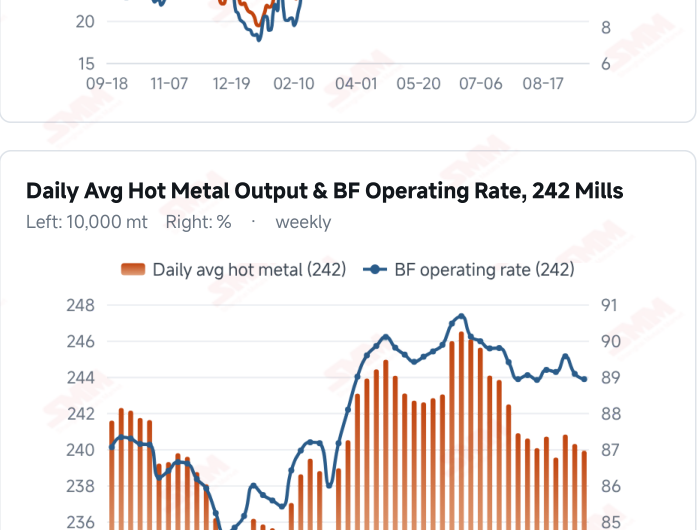
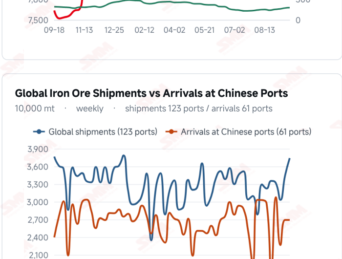
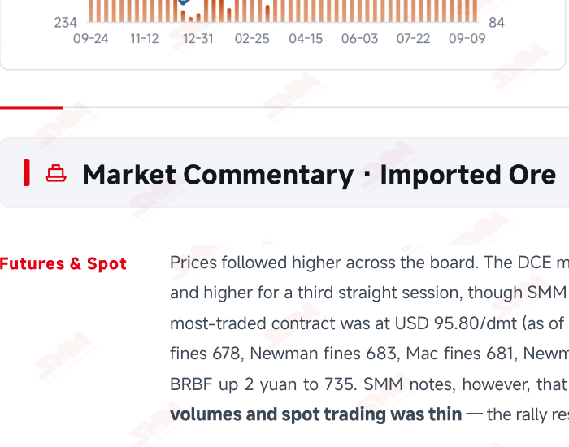
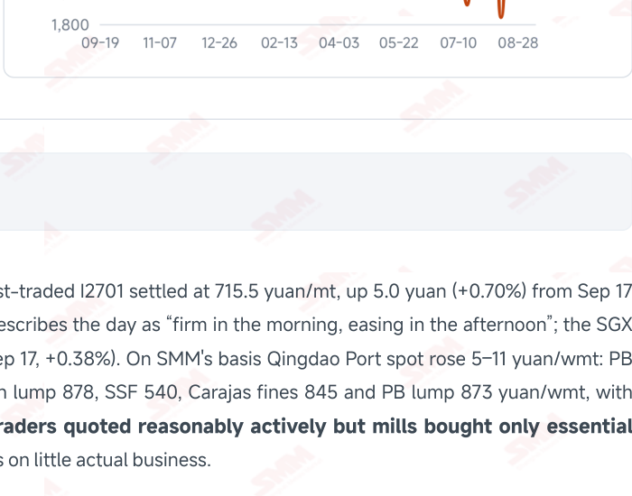

# SMM Iron Ore Daily — 2026-09-18 (Friday)

**Source:** SMM Data-pro · Shanghai Metals Market (SMM)

---

## Futures Contracts

| Exchange | Contract | Price | Unit | Daily Change | Daily Change % | MTD Avg |
|:---|:---|:---:|:---:|:---:|:---:|:---:|
| SGX | SGX Iron Ore Most-traded | 95.80 | USD/dmt | +0.36 | +0.38% | 98.20 |
| DCE | DCE Iron Ore Most-traded I2701 | 715.50 | yuan/mt | +5.0 | +0.70% | 722.20 |

## SMM Iron Ore Price Index (Physical & Benchmark Indices)

| Index Name | Market Type | Fe % | Price | Unit | Daily Change | Daily Change % | MTD Avg |
|:---|:---|:---:|:---:|:---:|:---:|:---:|:---:|
| MMi 61% Port Spot | port_spot | 61.0% | 689.00 | yuan/wmt | +4.0 | +0.58% | 697.00 |
| MMi 58% Port Spot | port_spot | 58.0% | 647.00 | yuan/wmt | +1.0 | +0.15% | 650.00 |
| MMi 65% Port Spot | port_spot | 65.0% | 843.00 | yuan/wmt | +5.0 | +0.60% | 839.00 |
| MMi 61% Seaborne Index | seaborne | 61.0% | 97.15 | USD/dmt | +0.45 | +0.47% | 97.17 |
| MMi 65% Seaborne Index | seaborne | 65.0% | 113.40 | USD/dmt | -0.55 | -0.48% | 115.40 |
| SMM Domestic Ore Composite Index | domestic_composite | 66.0% | 837.61 | yuan/mt | -8.33 | -0.98% | 841.26 |

## Key View

### Restocking landed and mill stocks jumped 4.37 million mt in a week — but ports turned back to building, and SMM says the restocking is near its end

There is one central fact this period: pre-holiday restocking has genuinely arrived, and at scale. Imported ore stocks at 242 mills rose 4.37 million mt in a week to 78.61 million (+5.89%), with days of consumption rebuilt from 19.3 to 20.5 — ending the two-week pattern of mills running lean and refusing to restock. Prices responded: Qingdao Port spot rose 5–11 yuan/wmt and the DCE contract gained 5.0 yuan to 715.5 yuan/mt, up for a third straight session. Two qualifications matter. First, SMM states plainly that “with restocking nearing its end, price support is weakening”, and reports mills buying only essential volumes with spot trading thin — this is passive pre-holiday cover, not a demand expansion. Second, and more important: ports have turned back to building. The 35 ports ended their run of draws and rose 840,000 mt to 144.33 million, with outflows down to 3.21 million mt. SMM's outlook for next week is blunter still: the lagged effect of earlier shipments will lift arrivals while demand fails to improve and outflows stay weak, so port stocks should build again with the pressure increasing. In other words, mills built this cover precisely as ports began to accumulate. Two further threads are worth noting. SMM's analysis concludes this decline was driven from outside China — the SGX contract fell 2.43% on the week, twice the DCE's 1.05%, while Chinese futures and spot fell almost identically, leaving the domestic pricing chain running smoothly; and the Fed's first rate hike in three years landed, within expectations but still a drag on upside. Today's indices reinforce it: all four domestic readings rose (the 65% port spot index +0.60% to 843, the 61% +0.58% to 689) while the 65% seaborne index fell 0.48% to USD 113.40/dmt; the high-low spread widened another 4 yuan to 196 yuan/wmt, a fifth straight session and 13 yuan up from 183 on Sep 14. On balance prices should keep trading in a narrow range with a soft centre, in line with SMM's view. Once the restocking support fades, port accumulation and the failure of hot metal to recover will drive pricing again.

## Today's Highlights

- Pre-holiday restocking landed: mill stocks jumped 4.37 million mt in a week. Imported ore stocks at 242 mills rose from 74.24 to 78.61 million mt (+4.37 million mt WoW, +5.89%), with days of consumption rebuilt from 19.3 to 20.5 days (+1.2). This is the direct confirmation of SMM's call a day earlier that some mills had begun restocking — and the scale exceeded expectations.
- But SMM says the restocking is near its end. Prices followed higher across the board — Qingdao Port spot rose 5–11 yuan/wmt (PB fines 678, Carajas fines 845, SSF 540, Newman lump 878) and the DCE most-traded I2701 settled at 715.5 yuan/mt (+5.0 yuan, +0.70%), up for a third straight session. Yet SMM reports mills buying only essential volumes and spot trading thin, and warns explicitly that “with restocking nearing its end, price support is weakening”.
- Ports have turned back to building, with outflows weakening. Inventory at the 35 ports rose from 143.49 to 144.33 million mt (+840,000 mt, +0.59%), ending the run of draws, while daily outbound volume fell to 3.21 million mt (-25,000 mt). SMM expects arrivals to keep rising next week and outflows to stay weak, so port stocks should build again with the pressure increasing.
- This decline was driven from outside China. SMM's analysis notes a sharp split this week: the SGX most-traded contract fell from 98.19 to USD 95.80/dmt (-2.43% on the week), twice the DCE's -1.05%, while Chinese futures and spot fell almost identically (both around 1%), showing the domestic pricing chain running smoothly. Also note the Fed's first rate hike in three years — within expectations, but still a drag on any upside. The same split showed up in today's indices: the 65% port spot index rose 0.60% to 843 while the 65% seaborne index fell 0.48% to USD 113.40/dmt.

## Qingdao Port Imported Ore Spot Prices (yuan/wet mt, tax incl.)

| Product | Fe % | Type | Price (yuan/wmt) | Daily Change | Daily Change % | MTD Avg |
|:---|:---:|:---:|:---:|:---:|:---:|:---:|
| PB Fines 60.8% | 60.8% | Fines | 678.0 | +5.0 | +0.74% | 688.0 |
| Newman Fines 61.2% | 61.2% | Fines | 683.0 | +5.0 | +0.74% | 695.0 |
| Mac Fines 60.8% | 60.8% | Fines | 681.0 | +5.0 | +0.74% | 692.0 |
| BRBF 62.5% | 62.5% | Fines | 735.0 | +2.0 | +0.27% | 745.0 |
| Newman Lump 63% | 63.0% | Lump | 878.0 | +5.0 | +0.57% | 888.0 |
| Super Special Fines (SSF) 56.5% | 56.5% | Fines | 540.0 | +5.0 | +0.93% | 550.0 |
| Carajas Fines (IOCJ) 65% | 65.0% | Fines | 845.0 | +5.0 | +0.60% | 844.0 |
| PB Lump 61.5% | 61.5% | Lump | 873.0 | +5.0 | +0.58% | 884.0 |

## Imported Ore USD Prices & MMi Indices (CFR Qingdao, USD/dry mt)

| Product | Fe % | Type | Price (USD/dmt) | Daily Change | Daily Change % | MTD Avg |
|:---|:---:|:---:|:---:|:---:|:---:|:---:|
| Carajas Fines (IOCJ) 65% | 65.0% | Fines | 116.25 | +0.67 | +0.58% | 115.84 |
| PB Lump 61.6% | 61.6% | Lump | 120.24 | +0.68 | +0.57% | 121.65 |
| BRBF 62.5% | 62.5% | Fines | 100.58 | +0.23 | +0.23% | 101.76 |
| Newman Fines 61.2% | 61.2% | Fines | 93.17 | +0.65 | +0.70% | 94.67 |
| Mac Fines 61% | 61.0% | Fines | 92.88 | +0.65 | +0.70% | 94.22 |
| Jimblebar Fines 60.5% | 60.5% | Fines | 91.03 | +0.79 | +0.88% | 90.76 |
| FMG Blend Fines 58.5% | 58.5% | Fines | 88.61 | +1.5 | +1.72% | 88.30 |
| Newman Lump 63% | 63.0% | Lump | 120.95 | +0.68 | +0.57% | 122.12 |
| Super Special Fines (SSF) 57% | 57.0% | Fines | 72.80 | +0.64 | +0.89% | 74.11 |
| Indian Fines 57% | 57.0% | Fines | 69.66 | +0.63 | +0.91% | 69.86 |

## SMM Iron Ore Price Index — Weekly / Monthly Statistics

| Index Name | Month-to-date Avg | MoM % | YTD % | Unit |
|:---|:---:|:---:|:---:|:---:|
| SMM MMi 61% Iron Ore Seaborne Index | 97.17 | +1.93% | -8.3% | USD/dmt |
| SMM MMi 65% Iron Ore Seaborne Index | 115.40 | -0.33% | -6.6% | USD/dmt |
| SMM MMi 61% Iron Ore Port Spot Index | 697.00 | +1.03% | -15.3% | yuan/wmt |
| SMM MMi 65% Iron Ore Port Spot Index | 839.00 | +0.73% | -6.2% | yuan/wmt |
| SMM MMi 58% Iron Ore Port Spot Index | 650.00 | +1.68% | -9.9% | yuan/wmt |
| SMM China Domestic Ore Composite Price Index | 841.26 | +0.03% | -5.5% | yuan/mt |

## Key Price Drivers (12-Month Charts & Operational Metrics)

### Charts: Freight & Port Inventory

### Charts: Hot Metal Output & Shipments vs Arrivals

### Operational Fundamentals Snapshot

| Fundamental Indicator | Value | Unit |
|:---|:---:|:---:|
| Daily Avg Hot Metal Output (242 Mills) | 2.3991 | Million MT |
| Iron Ore Port Inventory (10 Major Ports) | 101.9125 | Million MT |
| Global Iron Ore Shipments (Weekly) | 37.4058 | Million MT |
| Chinese Port Arrivals (Weekly) | 26.9105 | Million MT |

## Market Commentary · Imported Ore

### Futures & Spot

Prices followed higher across the board. The DCE most-traded I2701 settled at 715.5 yuan/mt, up 5.0 yuan (+0.70%) from Sep 17 and higher for a third straight session, though SMM describes the day as “firm in the morning, easing in the afternoon”; the SGX most-traded contract was at USD 95.80/dmt (as of Sep 17, +0.38%). On SMM's basis Qingdao Port spot rose 5–11 yuan/wmt: PB fines 678, Newman fines 683, Mac fines 681, Newman lump 878, SSF 540, Carajas fines 845 and PB lump 873 yuan/wmt, with BRBF up 2 yuan to 735. SMM notes, however, that traders quoted reasonably actively but mills bought only essential volumes and spot trading was thin — the rally rests on little actual business.

### Driver

The week traced a dip then a recovery: I2701 fell from 718 yuan/mt last Friday to a weekly low of 707.5 on Sep 15 before rising back, ending about 1.0% lower on the week. SMM lists the drags as: near-universal losses at long-process mills after the fifth round of coke increases, with maintenance and shutdowns widening; persistent rumours around long-term contract talks, raising fears of low-grade port stocks being released and more mid-grade tonnage becoming tradeable; the rebound in 35-port

### Demand

Restocking has landed, but it is essential buying rather than expansion. Imported ore stocks at 242 mills rose from 74.24 to 78.61 million mt (+4.37 million mt WoW, +5.89%) and days of consumption were rebuilt from 19.3 to 20.5 days (+1.2), ending the sustained lean-inventory pattern. Output has not improved, though: as of Sep 16 the blast furnace operating rate across 242 mills was 88.93% (-0.15 ppt) and daily average hot metal 2.3991 million mt (-3,700 mt), with no new print this period. SMM stresses that end-use demand remains weak, mill profitability is deteriorating and pig iron output has yet to recover, leaving iron ore without an upward driver, and sees no clear turning point in end-use demand.

### Inventory & Supply

The port picture has turned. Inventory at the 35 ports rose from 143.49 to 144.33 million mt (+840,000 mt, +0.59%), ending the run of draws, while daily outbound volume fell to 3.21 million mt (-25,000 mt, -0.77%). SMM's read: arrivals were broadly stable this week, but deepening mill losses pulled hot metal down and outflows with it, so port stocks turned to a build. Looking to next week, SMM expects the lagged effect of earlier shipments to lift arrivals further while demand fails to improve and outflows stay weak, so port stocks should build again with the pressure increasing. The 10-port total was 101.9125 million mt (as of Sep 17, -1.1059 million mt WoW), with lump building 1.0688 million mt against the trend. Global shipments last week were 37.4058 million mt (+8.59%) and arrivals at Chinese ports 26.9105 million mt (steady).

### Cost & Margin

The average imported ore loss narrowed from 3.97 to 2.87 yuan/mt, which SMM attributes to lower C5 freight and correspondingly cheaper landed costs for Australian cargo. The two routes keep diverging: C5 Australia→China fell another USD 0.29 to 16.08/mt (-1.77%), extending its slide from 17.77 on Sep 14, while C3 Brazil→China recovered USD 0.59 to 42.56/mt (+1.41%, both as of Sep 17). SMM expects import margins to stay in modest loss.

## Market Commentary · Domestic Ore

### Prices

The domestic composite index finally updated, and fell sharply. The SMM China Domestic Ore Composite Price Index reads 837.61 yuan/mt as of Sep 18, down 8.33 yuan (-0.98%) from Sep 17, catching up in one move with the past fortnight's regional pullback — Shandong 64% alkaline concentrate down to 816 yuan/mt and Tangshan 66% concentrate to 935–940 yuan/mt delivered, dry basis and tax inclusive.

### Supply & Demand

Supply stays tight: concentrator run rates remain low, state-owned operations largely consume their own output and private concentrate supply is short. On demand, deepening mill losses keep buyers pressing hard on domestic concentrate prices; pre- holiday restocking notwithstanding, purchasing remains essential-only and cannot offset the downward pressure on prices.

### Outlook

Domestic ore's earlier counter-trend strength has fully faded. With mill losses deepening and imported ore restocking near its end, domestic concentrate should stay soft near term; further strength in imported high grade would offer only limited relative- value support.

## Market Factors

### Supportive Factors

- Imported ore stocks at 242 mills jumped 4.37 million mt to 78.61 million, rebuilding cover to 20.5 days.
- Qingdao Port spot rose 5–11 yuan/wmt and the DCE contract gained 5.0 yuan to 715.5, up a third session.
- The average imported ore loss narrowed from 3.97 to 2.87 yuan/mt.
- C3 Brazil→China freight recovered 1.41% to USD 42.56/mt, still supporting Brazilian grades.
- Chinese futures and spot fell almost identically, with SMM noting the domestic pricing chain running smoothly.
- The high-low spread widened 4 yuan to 196 yuan/wmt, a fifth straight session and 13 yuan in total; high grade stays firm.

### Bearish Factors

- SMM states plainly that with restocking nearing its end, price support is weakening.
- The 35 ports turned to a build, +840,000 mt to 144.33 million, with outflows down to 3.21 million mt.
- SMM expects arrivals up and outflows weak next week, increasing the port build pressure.
- Mills bought only essential volumes and spot trading was thin; the rally lacks transacted support.
- Pig iron output has yet to recover, with hot metal at 2.3991 million mt and the operating rate at 88.93%.
- The Fed's first rate hike in three years landed, capping upside across commodities.

## Flash News Briefs

- [SMM Brief] With restocking nearing its end, price support for iron ore is weakening
- Ports turn back to building as outflows weaken; no demand turning point, ore stays soft [SMM Daily Iron Ore Review]
- Iron Ore Port Inventory and Outbound Volume, Sep 18, 2026 (35 ports 144.33 million mt, +840,000 mt WoW)
- SMM Imported Iron Ore Cost & Margin Table, Sep 18, 2026 (average loss 3.97→2.87 yuan/mt)
- [SMM Imported Ore Analysis] Supply pressure surfaces, offshore falls alone, ports return to building
- Ocean Freight and Dry Bulk Shipping Indices, Sep 17

---
*(c) 2026 Shanghai Metals Market (SMM) · Iron Ore Value-Chain Data & Research*
