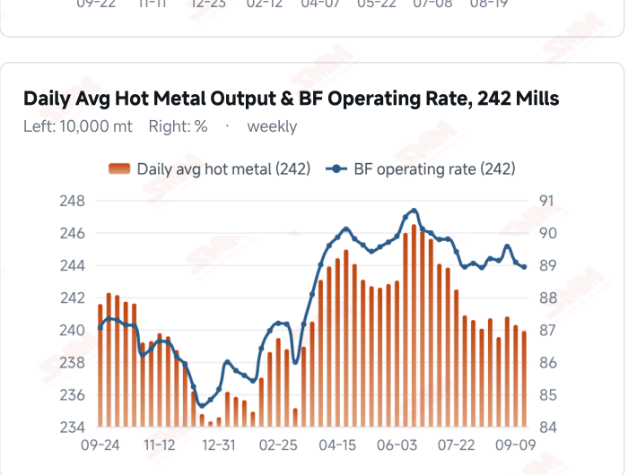
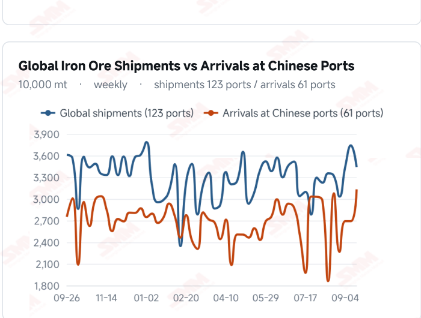
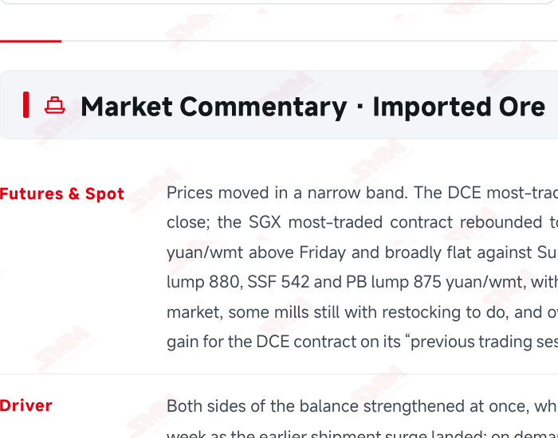
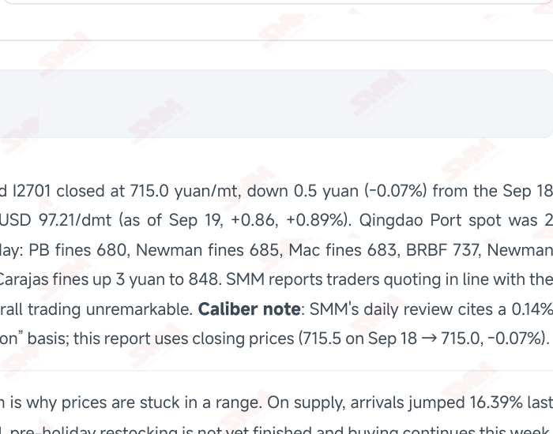

# SMM Iron Ore Daily — 2026-09-21 (Monday)

**Source:** SMM Data-pro · Shanghai Metals Market (SMM)

---

## Futures Contracts

| Exchange | Contract | Price | Unit | Daily Change | Daily Change % | MTD Avg |
|:---|:---|:---:|:---:|:---:|:---:|:---:|
| SGX | SGX Iron Ore Most-traded | 97.21 | USD/dmt | +0.86 | +0.89% | 98.04 |
| DCE | DCE Iron Ore Most-traded I2701 | 715.00 | yuan/mt | -0.5 | -0.07% | 721.70 |

## SMM Iron Ore Price Index (Physical & Benchmark Indices)

| Index Name | Market Type | Fe % | Price | Unit | Daily Change | Daily Change % | MTD Avg |
|:---|:---|:---:|:---:|:---:|:---:|:---:|:---:|
| MMi 61% Port Spot | port_spot | 61.0% | 688.00 | yuan/wmt | -1.0 | -0.15% | 696.00 |
| MMi 58% Port Spot | port_spot | 58.0% | 645.00 | yuan/wmt | -2.0 | -0.31% | 649.00 |
| MMi 65% Port Spot | port_spot | 65.0% | 842.00 | yuan/wmt | -1.0 | -0.12% | 839.00 |
| MMi 61% Seaborne Index | seaborne | 61.0% | 96.70 | USD/dmt | -0.45 | -0.46% | 97.14 |
| MMi 65% Seaborne Index | seaborne | 65.0% | 113.25 | USD/dmt | -0.15 | -0.13% | 115.26 |
| SMM Domestic Ore Composite Index | domestic_composite | 66.0% | 837.61 | yuan/mt | -8.33 | -0.98% | 841.26 |

## Key View

### Arrivals jumped 16% to 31.32 million mt as the lagged shock lands; import margins turned positive, but restocking is nearly done

What the previous issue flagged has happened: arrivals at Chinese ports jumped 4.41 million mt to 31.32 million last week (+16.39%), +4.8% YTD. This is the lagged delivery of the two weeks of heavy shipments that peaked at 37.4058 million mt, when Australia first cleared 20 million. Global shipments have themselves fallen back 8.02% to 34.4065 million mt with both Australia and Brazil easing — the shipment peak has passed, but the arrival peak has only just begun. Today the market showed a textbook case of both sides strengthening at once: arrivals surging on supply, pre-holiday restocking still running on demand. The two offset each other and prices stayed in a narrow band — the DCE contract slipped 0.5 yuan to 715.0 yuan/mt, spot was 2 yuan above Friday and flat against Sunday, and the port spot indices gave back 1–2 yuan. The durability of those two forces is very different, however. SMM has said plainly that restocking is nearing its end and mills are increasingly inclined to buy only on dips, and mill imported ore stocks were already rebuilt to 78.61 million mt with 20.5 days of cover last week, so there is limited room left. The arrivals, by contrast, will only show up in the next port inventory print — and the 35 ports had already turned to a build a week earlier. The cost side offers one positive: the average imported ore margin turned from -2.84 to +6.48 yuan/mt, the first profit of this decline, with C5 freight ending its slide and rebounding 1.87%. But domestic ore is loosening in step — mine capacity utilisation is back to 58.2%, concentrate output up 28,000 mt, and Hebei concentrate already down 10–20 yuan/mt. On balance prices should stay rangebound with a soft centre. What matters is the gap in timing between restocking ending and arrivals landing: once the buying stops while port stocks accelerate, the lower bound of the range will be tested again.

## Today's Highlights

- The arrival surge we flagged has landed. Arrivals at Chinese ports totalled 31.32 million mt last week, up 4.41 million mt (+16.39%) WoW and +4.8% YTD — the lagged delivery of the earlier shipment surge. Global shipments themselves fell back to 34.4065 million mt (-8.02%), with Australia at 19.4957 million mt (-6.08%) and Brazil 7.4155 million mt (-5.69%) both lower, while among non- mainstream origins Peru and India grew notably.
- Import margins turned positive. SMM puts the average imported ore margin at +6.48 yuan/mt, up from -2.84 and in profit for the first time in this decline, driven by higher spot prices. Freight rebounded too: C5 Australia→China recovered 1.87% to USD 16.38/mt, ending its run of declines, with C3 Brazil→China at 42.71 (+0.35%, both as of Sep 18).
- Restocking is nearing its end and buying has turned price-sensitive. SMM notes some mills have not finished pre-holiday restocking and still have buying to do this week, which offers some support; but with restocking close to done, mills are increasingly inclined to buy only on dips. Spot rose 2 yuan from Friday and was broadly flat against Sunday: PB fines 680, Carajas fines 848, Newman lump 880 and SSF 542 yuan/wmt; the DCE most-traded I2701 closed at 715.0 yuan/mt (-0.5 yuan).
- Domestic ore supply is recovering while prices keep sliding. SMM's survey puts domestic mine capacity utilisation at 58.2% this week (+1.8 ppt) with concentrate output at 900,000 mt (+28,000 mt), the increase concentrated in Shandong, and mine concentrate stocks down to 253,000 mt. Prices diverged lower — Hebei concentrate fell 10–20 yuan/mt and Tangshan 66% concentrate is steady- to-soft at 940–950 yuan/mt ex-works, dry basis and tax inclusive.

## Qingdao Port Imported Ore Spot Prices (yuan/wet mt, tax incl.)

| Product | Fe % | Type | Price (yuan/wmt) | Daily Change | Daily Change % | MTD Avg |
|:---|:---:|:---:|:---:|:---:|:---:|:---:|
| PB Fines 60.8% | 60.8% | Fines | 680.0 | +2.0 | +0.29% | 687.0 |
| Newman Fines 61.2% | 61.2% | Fines | 685.0 | +2.0 | +0.29% | 694.0 |
| Mac Fines 60.8% | 60.8% | Fines | 683.0 | +2.0 | +0.29% | 691.0 |
| BRBF 62.5% | 62.5% | Fines | 737.0 | +2.0 | +0.27% | 744.0 |
| Newman Lump 63% | 63.0% | Lump | 880.0 | +2.0 | +0.23% | 887.0 |
| Super Special Fines (SSF) 56.5% | 56.5% | Fines | 542.0 | +2.0 | +0.37% | 549.0 |
| Carajas Fines (IOCJ) 65% | 65.0% | Fines | 848.0 | +3.0 | +0.36% | 845.0 |
| PB Lump 61.5% | 61.5% | Lump | 875.0 | +2.0 | +0.23% | 883.0 |

## Imported Ore USD Prices & MMi Indices (CFR Qingdao, USD/dry mt)

| Product | Fe % | Type | Price (USD/dmt) | Daily Change | Daily Change % | MTD Avg |
|:---|:---:|:---:|:---:|:---:|:---:|:---:|
| Carajas Fines (IOCJ) 65% | 65.0% | Fines | 117.16 | +0.91 | +0.78% | 115.97 |
| PB Lump 61.6% | 61.6% | Lump | 121.01 | +0.77 | +0.64% | 121.55 |
| BRBF 62.5% | 62.5% | Fines | 101.34 | +0.76 | +0.76% | 101.69 |
| Newman Fines 61.2% | 61.2% | Fines | 93.93 | +0.76 | +0.82% | 94.55 |
| Mac Fines 61% | 61.0% | Fines | 93.64 | +0.76 | +0.82% | 94.13 |
| Jimblebar Fines 60.5% | 60.5% | Fines | 91.79 | +0.76 | +0.83% | 90.87 |
| FMG Blend Fines 58.5% | 58.5% | Fines | 89.37 | +0.76 | +0.86% | 88.41 |
| Newman Lump 63% | 63.0% | Lump | 121.72 | +0.77 | +0.64% | 122.05 |
| Super Special Fines (SSF) 57% | 57.0% | Fines | 73.55 | +0.75 | +1.03% | 74.02 |
| Indian Fines 57% | 57.0% | Fines | 68.99 | -0.67 | -0.96% | 69.73 |

## SMM Iron Ore Price Index — Weekly / Monthly Statistics

| Index Name | Month-to-date Avg | MoM % | YTD % | Unit |
|:---|:---:|:---:|:---:|:---:|
| SMM MMi 61% Iron Ore Seaborne Index | 97.14 | +1.89% | -8.7% | USD/dmt |
| SMM MMi 65% Iron Ore Seaborne Index | 115.26 | -0.46% | -6.7% | USD/dmt |
| SMM MMi 61% Iron Ore Port Spot Index | 696.00 | +0.94% | -15.4% | yuan/wmt |
| SMM MMi 65% Iron Ore Port Spot Index | 839.00 | +0.75% | -6.3% | yuan/wmt |
| SMM MMi 58% Iron Ore Port Spot Index | 649.00 | +1.63% | -10.2% | yuan/wmt |
| SMM China Domestic Ore Composite Price Index | 841.26 | +0.03% | -5.5% | yuan/mt |

## Key Price Drivers (12-Month Charts & Operational Metrics)

### Charts: Freight & Port Inventory

### Charts: Hot Metal Output & Shipments vs Arrivals

### Operational Fundamentals Snapshot

| Fundamental Indicator | Value | Unit |
|:---|:---:|:---:|
| C3 Freight (Brazil to China) | 42.71 | USD/mt |
| Daily Avg Hot Metal Output (242 Mills) | 2.3991 | Million MT |
| Blast Furnace Capacity Utilisation (242 Mills) | 58.2 | % |
| Iron Ore Port Inventory (10 Major Ports) | 101.9125 | Million MT |
| Steel Mill Imported Ore Inventory Cover | 20.5 | Days |
| Global Iron Ore Shipments (Weekly) | 34.4065 | Million MT |
| Chinese Port Arrivals (Weekly) | 4.41 | Million MT |
| Domestic Mine Capacity Utilisation | 58.2 | % |

## Market Commentary · Imported Ore

### Futures & Spot

Prices moved in a narrow band. The DCE most-traded I2701 closed at 715.0 yuan/mt, down 0.5 yuan (-0.07%) from the Sep 18 close; the SGX most-traded contract rebounded to USD 97.21/dmt (as of Sep 19, +0.86, +0.89%). Qingdao Port spot was 2 yuan/wmt above Friday and broadly flat against Sunday: PB fines 680, Newman fines 685, Mac fines 683, BRBF 737, Newman lump 880, SSF 542 and PB lump 875 yuan/wmt, with Carajas fines up 3 yuan to 848. SMM reports traders quoting in line with the market, some mills still with restocking to do, and overall trading unremarkable. Caliber note: SMM's daily review cites a 0.14% gain for the DCE contract on its “previous trading session” basis; this report uses closing prices (715.5 on Sep 18 → 715.0, -0.07%).

### Driver

Both sides of the balance strengthened at once, which is why prices are stuck in a range. On supply, arrivals jumped 16.39% last week as the earlier shipment surge landed; on demand, pre-holiday restocking is not yet finished and buying continues this week. SMM characterises the week as “both supply and demand strong” and expects rangebound trade. The two forces differ in durability, however — the arrivals are still coming while restocking is nearly done, which keeps the centre of that range tilted lower.

### Demand

Restocking has entered its second half. SMM states plainly that some mills have not finished pre-holiday restocking and still have buying to do this week, offering some price support, but with restocking close to done mills are increasingly inclined to buy only on dips. Output has not improved: as of Sep 16 the blast furnace operating rate across 242 mills was 88.93% (-0.15 ppt) and daily average hot metal 2.3991 million mt (-3,700 mt), with no new print this period, and SMM reiterates that end-use demand shows no clear turning point. Mill imported ore stocks had already risen to 78.61 million mt (+4.37 million) with 20.5 days of cover last week, so the room to keep building is narrowing.

### Inventory & Supply

The lagged supply shock is starting to land. Arrivals at Chinese ports totalled 31.32 million mt last week, up 4.41 million mt (+16.39%) WoW and +4.8% YTD, while global shipments fell back to 34.4065 million mt (-2.9993 million mt, -8.02%), with Australia at 19.4957 million mt (-6.08%) and Brazil 7.4155 million mt (-5.69%) both easing and Peru and India growing notably among non-mainstream origins. At the ports, the 35-port total turned to a build last week, rising to 144.33 million mt (+840,000 mt), with daily outbound volume down to 3.21 million mt; the 10-port total was 101.9125 million mt (as of Sep 17). This arrival increase is not yet in the port readings — the next inventory print is the key thing to watch.

### Cost & Margin

Import margins turned positive for the first time in this decline. SMM puts the average imported ore margin at +6.48 yuan/mt, up from -2.84 and back in profit, driven by higher spot prices. Freight ended its one-way slide: C5 Australia→China recovered USD 0.30 to 16.38/mt (+1.87%) and C3 Brazil→China stood at 42.71/mt (+0.15, +0.35%, both as of Sep 18). SMM expects margins to follow spot and stay choppy with a soft bias.

## Market Commentary · Domestic Ore

### Prices

Domestic prices diverged lower. Hebei concentrate fell 10–20 yuan/mt while Liaoning held relatively steady; Tangshan 66% concentrate is quoted at 940–950 yuan/mt ex-works, dry basis and tax inclusive, with producers working through mill orders and the low-grade market quiet on both sides — bargains are scarce but sellers are also struggling to move material. The SMM China Domestic Ore Composite Price Index reads 837.61 yuan/mt (as of Sep 18, -0.98%).

### Supply & Demand

Output is recovering. SMM's survey puts domestic mine capacity utilisation at 58.2% this week, up 1.8 ppt, with concentrate output at 900,000 mt, up 28,000 mt, the increase concentrated in Shandong where some concentrators are returning to normal operation. Mine concentrate stocks fell 10,000 mt to around 253,000 mt, indicating mills are buying more willingly than before.

### Outlook

SMM expects concentrators to run to plan this week with output broadly stable and a possible increase at one operation in western Liaoning. With mill losses deepening and buyers pressing hard, this is clearly a buyer's market, and domestic concentrate prices should stay soft and rangebound, with Tangshan steady-to-soft.

## Market Factors

### Supportive Factors

- The average imported ore margin turned positive at +6.48 yuan/mt, up from -2.84, the first profit of this decline.
- Some mills have not finished pre-holiday restocking and still have buying to do this week.
- Global shipments fell 8.02% to 34.4065 million mt last week, with both Australia and Brazil easing.
- C5 freight rebounded 1.87% to USD 16.38/mt, ending its slide and lifting landed costs.
- The SGX contract rebounded to USD 97.21/dmt (+0.89%), with offshore sentiment repairing.
- Mine concentrate stocks fell to 253,000 mt as mills buy more willingly than before.

### Bearish Factors

- Arrivals jumped 4.41 million mt (+16.39%) to 31.32 million last week as the lagged supply shock begins to land.
- SMM says restocking is nearing its end and mills are increasingly inclined to buy only on dips.
- The 35 ports have already turned to a build at 144.33 million mt, with outflows down to 3.21 million mt.
- Hot metal at 2.3991 million mt and the operating rate at 88.93% remain in a downtrend with no demand turning point.
- Domestic mine capacity utilisation rose to 58.2% and concentrate output 28,000 mt, loosening domestic supply.
- Hebei concentrate fell 10–20 yuan/mt as mills press hard; this is clearly a buyer's market.

## Flash News Briefs

- Restocking demand persists; iron ore prices move in a narrow band [SMM Daily Iron Ore Review]
- [SMM Iron Ore Shipping] Global shipments down 8% WoW last week; arrivals up 16%
- SMM Imported Iron Ore Cost & Margin Table, Sep 21, 2026 (margin -2.84→+6.48 yuan/mt, back in profit)
- [SMM Survey] Some concentrators return to normal operation; iron ore concentrate output edges up
- [SMM Domestic Iron Ore Brief] Tangshan iron ore prices set to hold steady-to-soft
- Ocean Freight and Dry Bulk Shipping Indices, Sep 18

---
*(c) 2026 Shanghai Metals Market (SMM) · Iron Ore Value-Chain Data & Research*
