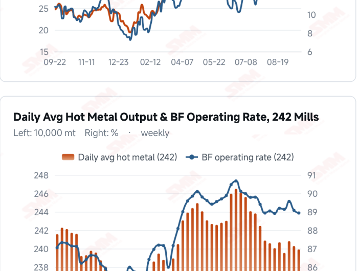
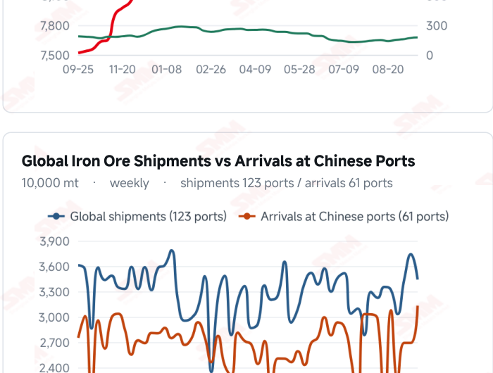
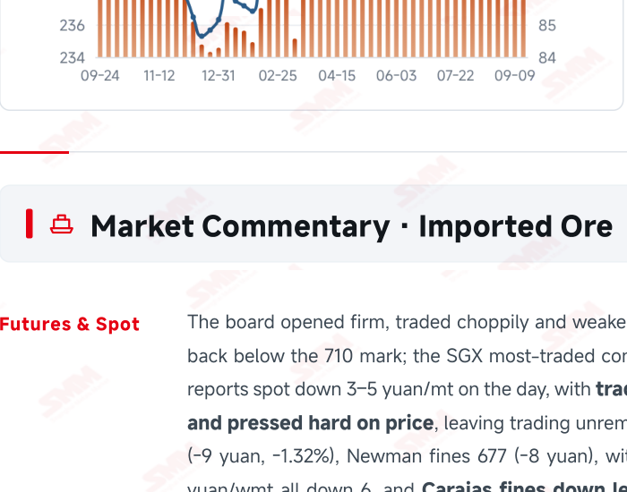
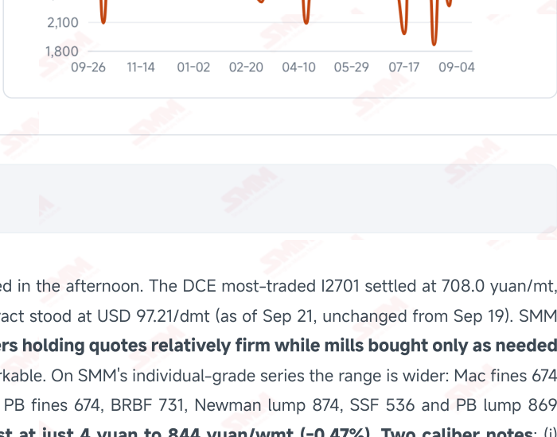

# SMM Iron Ore Daily — 2026-09-22 (Tuesday)

**Source:** SMM Data-pro · Shanghai Metals Market (SMM)

---

## Futures Contracts

| Exchange | Contract | Price | Unit | Daily Change | Daily Change % | MTD Avg |
|:---|:---|:---:|:---:|:---:|:---:|:---:|
| SGX | SGX Iron Ore Most-traded | 97.21 | USD/dmt | 0.0 | 0.00% | 97.99 |
| DCE | DCE Iron Ore Most-traded I2701 | 708.00 | yuan/mt | -7.0 | -0.98% | 720.80 |

## SMM Iron Ore Price Index (Physical & Benchmark Indices)

| Index Name | Market Type | Fe % | Price | Unit | Daily Change | Daily Change % | MTD Avg |
|:---|:---|:---:|:---:|:---:|:---:|:---:|:---:|
| MMi 61% Port Spot | port_spot | 61.0% | 687.00 | yuan/wmt | -1.0 | -0.15% | 696.00 |
| MMi 58% Port Spot | port_spot | 58.0% | 644.00 | yuan/wmt | -1.0 | -0.16% | 649.00 |
| MMi 65% Port Spot | port_spot | 65.0% | 841.00 | yuan/wmt | -1.0 | -0.12% | 839.00 |
| MMi 61% Seaborne Index | seaborne | 61.0% | 96.35 | USD/dmt | -0.35 | -0.36% | 97.09 |
| MMi 65% Seaborne Index | seaborne | 65.0% | 113.00 | USD/dmt | -0.25 | -0.22% | 115.12 |
| SMM Domestic Ore Composite Index | domestic_composite | 66.0% | 837.61 | yuan/mt | -8.33 | -0.98% | 841.26 |

## Key View

### Maintenance losses revised up with more to come, plus a low-grade release rumour — but with restocking unfinished, SMM sees a limited decline

Today brought two bearish threads and one clear floor beneath them. The first is fundamental: maintenance losses have been revised up again — on SMM's latest review basis, hot metal lost to blast furnace maintenance is 1.5267 million mt this week (Sep 19– 25), up 56,000 mt WoW, rising a further 46,600 mt to 1.5733 million next week (Sep 26–Oct 2), each figure 24,500 mt above the Sep 21 weekly summary. Set against the Sep 14 print (1.4157 million this week, falling to 1.3734 million next), the direction has completely reversed: sustained mill losses are translating into steadily wider output cuts, and SMM says explicitly that the support this gives ore prices is weakening. The second is news flow: talk of low-grade ore being released circulated again today, souring sentiment and dragging prices lower. If confirmed it would add directly to tradeable port supply, compounding last week's 4.41 million mt surge in arrivals. The floor comes from the one part of demand that has not weakened — pre-holiday restocking is not yet complete. On that basis SMM sees strong downward resistance and expects the decline to be limited, and spot bears it out: traders held quotes relatively firm, spot fell 3–5 yuan against the board's 1%, and Carajas fines gave up just 4 yuan. Costs have not deteriorated either — SMM's cost table this period calls import margins broadly stable, expecting them only to edge lower, rather than the clear squeeze that falling spot and rising freight would imply. Note that this report's reading from maintenance data and the arrival surge leans toward the lower bound being tested further, while SMM lands on a limited decline. These are not in conflict so much as on different time horizons: the restocking floor is short-lived and already depleting (mill stocks were rebuilt to 78.61 million mt with 20.5 days of cover last week), whereas wider maintenance and landing arrivals are persistent. What matters, then, is the timing gap: whether restocking ends before port stocks start building. The next port inventory print is the week's most important observation, and the low-grade release rumour is the second variable to watch closely.

## Today's Highlights

- Maintenance losses revised up again, with more to come next week. On SMM's latest review basis, hot metal lost to blast furnace maintenance is 1.5267 million mt this week (Sep 19–25), up 56,000 mt WoW, rising a further 46,600 mt to 1.5733 million mt next week (Sep 26–Oct 2) — each figure 24,500 mt above the Sep 21 weekly summary (1.5022 / 1.5488 million). SMM's read: sustained mill losses are driving more maintenance and further falls in hot metal, weakening the support for ore prices.
- A new bearish rumour: low-grade ore restrictions being lifted. SMM notes that talk of low-grade ore being released circulated again today, souring sentiment and dragging prices lower. The board opened firm, traded choppily and weakened in the afternoon, with the DCE most-traded I2701 settling at 708.0 yuan/mt (-7.0 yuan, -0.98% on a closing basis; SMM cites -1.05% including the night session).
- SMM nonetheless expects the decline to be limited, on the grounds that pre-holiday restocking is not yet complete, so downward resistance is strong. Spot bears this out — traders held quotes relatively firm while mills bought only as needed and pressed hard on price, leaving trading unremarkable. Qingdao Port spot fell 3–5 yuan/wmt on SMM's basis; individual grades fell more (4–9 yuan), with Carajas fines down least at just 4 yuan to 844 and Mac fines most at 9 yuan to 674.
- The indices fell far less than spot — a weighting difference. All five MMi readings dropped 1 yuan or USD 0.25–0.35, declines of just 0.12%–0.36% (61% port spot 687, 65% 841, 58% 644; 61% seaborne 96.35, 65% seaborne 113.00). The indices are basket-weighted and smooth moves in any single grade, so a short-term divergence is normal. The high-low spread held at 197 yuan/wmt, ending six straight sessions of widening.

## Qingdao Port Imported Ore Spot Prices (yuan/wet mt, tax incl.)

| Product | Fe % | Type | Price (yuan/wmt) | Daily Change | Daily Change % | MTD Avg |
|:---|:---:|:---:|:---:|:---:|:---:|:---:|
| PB Fines 60.8% | 60.8% | Fines | 674.0 | -6.0 | -0.88% | 686.0 |
| Newman Fines 61.2% | 61.2% | Fines | 677.0 | -8.0 | -1.17% | 693.0 |
| Mac Fines 60.8% | 60.8% | Fines | 674.0 | -9.0 | -1.32% | 690.0 |
| BRBF 62.5% | 62.5% | Fines | 731.0 | -6.0 | -0.81% | 743.0 |
| Newman Lump 63% | 63.0% | Lump | 874.0 | -6.0 | -0.68% | 886.0 |
| Super Special Fines (SSF) 56.5% | 56.5% | Fines | 536.0 | -6.0 | -1.11% | 548.0 |
| Carajas Fines (IOCJ) 65% | 65.0% | Fines | 844.0 | -4.0 | -0.47% | 845.0 |
| PB Lump 61.5% | 61.5% | Lump | 869.0 | -6.0 | -0.69% | 882.0 |

## Imported Ore USD Prices & MMi Indices (CFR Qingdao, USD/dry mt)

| Product | Fe % | Type | Price (USD/dmt) | Daily Change | Daily Change % | MTD Avg |
|:---|:---:|:---:|:---:|:---:|:---:|:---:|
| Carajas Fines (IOCJ) 65% | 65.0% | Fines | 116.93 | -0.23 | -0.20% | 116.03 |
| PB Lump 61.6% | 61.6% | Lump | 120.78 | -0.23 | -0.19% | 121.50 |
| BRBF 62.5% | 62.5% | Fines | 101.10 | -0.24 | -0.24% | 101.65 |
| Newman Fines 61.2% | 61.2% | Fines | 93.40 | -0.53 | -0.56% | 94.49 |
| Mac Fines 61% | 61.0% | Fines | 93.40 | -0.24 | -0.26% | 94.08 |
| Jimblebar Fines 60.5% | 60.5% | Fines | 91.26 | -0.53 | -0.58% | 90.89 |
| FMG Blend Fines 58.5% | 58.5% | Fines | 88.69 | -0.68 | -0.76% | 88.43 |
| Newman Lump 63% | 63.0% | Lump | 121.49 | -0.23 | -0.19% | 122.01 |
| Super Special Fines (SSF) 57% | 57.0% | Fines | 73.29 | -0.26 | -0.35% | 73.98 |
| Indian Fines 57% | 57.0% | Fines | 68.73 | -0.26 | -0.38% | 69.68 |

## SMM Iron Ore Price Index — Weekly / Monthly Statistics

| Index Name | Month-to-date Avg | MoM % | YTD % | Unit |
|:---|:---:|:---:|:---:|:---:|
| SMM MMi 61% Iron Ore Seaborne Index | 97.09 | +1.84% | -9.1% | USD/dmt |
| SMM MMi 65% Iron Ore Seaborne Index | 115.12 | -0.58% | -6.9% | USD/dmt |
| SMM MMi 61% Iron Ore Port Spot Index | 696.00 | +0.86% | -15.5% | yuan/wmt |
| SMM MMi 65% Iron Ore Port Spot Index | 839.00 | +0.76% | -6.5% | yuan/wmt |
| SMM MMi 58% Iron Ore Port Spot Index | 649.00 | +1.58% | -10.3% | yuan/wmt |
| SMM China Domestic Ore Composite Price Index | 841.26 | +0.03% | -5.5% | yuan/mt |

## Key Price Drivers (12-Month Charts & Operational Metrics)

### Charts: Freight & Port Inventory

### Charts: Hot Metal Output & Shipments vs Arrivals

### Operational Fundamentals Snapshot

| Fundamental Indicator | Value | Unit |
|:---|:---:|:---:|
| Blast Furnace Capacity Utilisation (242 Mills) | 58.2 | % |
| Iron Ore Port Inventory (10 Major Ports) | 101.9125 | Million MT |
| Iron Ore Port Inventory (35 Major Ports) | 144.33 | Million MT |
| Daily Avg Port Outbound Volume | 3.21 | Million MT |
| Imported Ore Stocks (242 Steel Mills) | 78.61 | Million MT |
| Steel Mill Imported Ore Inventory Cover | 20.5 | Days |
| Global Iron Ore Shipments (Weekly) | 34.4065 | Million MT |
| Chinese Port Arrivals (Weekly) | 31.32 | Million MT |

## Market Commentary · Imported Ore

### Futures & Spot

The board opened firm, traded choppily and weakened in the afternoon. The DCE most-traded I2701 settled at 708.0 yuan/mt, back below the 710 mark; the SGX most-traded contract stood at USD 97.21/dmt (as of Sep 21, unchanged from Sep 19). SMM reports spot down 3–5 yuan/mt on the day, with traders holding quotes relatively firm while mills bought only as needed and pressed hard on price, leaving trading unremarkable. On SMM's individual-grade series the range is wider: Mac fines 674 (-9 yuan, -1.32%), Newman fines 677 (-8 yuan), with PB fines 674, BRBF 731, Newman lump 874, SSF 536 and PB lump 869 yuan/wmt all down 6, and Carajas fines down least at just 4 yuan to 844 yuan/wmt (-0.47%). Two caliber notes: (i) SMM's review cites a 1.05% fall for the DCE contract on its “previous trading session” basis including the night session; this report uses closing prices (715.0 → 708.0, -0.98%). (ii) The review's “down 3–5 yuan” is a summary across mainstream grades and differs from the 4–9 yuan range in the individual quotes; the tables here show each grade at its own value.

### Driver

Two bearish threads combined this period. The first is fundamental: sustained mill losses are driving more blast furnace maintenance and further falls in hot metal, and SMM states plainly that the support this gives ore prices is weakening. The second is news flow: talk of low-grade ore being released circulated again today, souring sentiment and dragging prices lower. SMM does set a floor against both, however — with pre-holiday restocking not yet complete, it sees strong downward resistance and expects the decline to be limited. Note too that freight rebounded for a third straight session (C5 +1.59%, C3 +0.47%), which should have lifted landed costs, yet prices still fell: the driver has switched from supply back to

### Demand

The maintenance numbers were revised up, making the direction clearer. On SMM's latest review basis, hot metal lost to blast furnace maintenance is 1.5267 million mt this week (Sep 19–25), up 56,000 mt WoW, and is projected at 1.5733 million mt next week (Sep 26–Oct 2), a further 46,600 mt higher — each 24,500 mt above the Sep 21 weekly summary (1.5022 / 1.5488 million) and the exact opposite of the Sep 14 print (1.4157 million this week, falling to 1.3734 million next). Deepening mill losses are translating into steadily wider output cuts. The latest hot metal reading is still Sep 16's 2.3991 million mt with an 88.93% operating rate, and the next print is very likely lower again. The one positive on demand is that pre-holiday restocking is not yet complete: mill imported ore stocks were rebuilt to 78.61 million mt with 20.5 days of cover last week, leaving limited but not exhausted room — precisely the basis for SMM's “strong downward resistance” call.

### Inventory & Supply

Weekly balance data were not updated this period and still stand as of Sep 18: 35-port inventory 144.33 million mt (+840,000 mt WoW), daily outbound volume 3.21 million mt (-25,000 mt), imported ore stocks at 242 mills 78.61 million mt (+4.37 million mt) with 20.5 days of cover; the 10-port total was 101.9125 million mt (as of Sep 17). Global shipments last week were 34.4065 million mt (-8.02%) and arrivals at Chinese ports 31.32 million mt (+4.41 million mt, +16.39%). That arrival increase is still not in the port readings, and wider maintenance will depress outflows in step — the next port inventory print is the week's critical observation. The low-grade release rumour also needs tracking: if confirmed it would add directly to tradeable port supply.

### Cost & Margin

Freight rebounded for a third straight session: C5 Australia→China rose USD 0.26 to 16.64/mt (+1.59%) and C3 Brazil→China USD 0.20 to 42.91/mt (+0.47%, both as of Sep 21). Last issue the average imported ore margin had already turned from -2.84 to +6.48 yuan/mt. SMM's Sep 22 cost table describes margins as broadly stable and expects them to edge lower — but gives no figure this period, unlike its usual “from X to Y” disclosure, so no estimate is made here. Spot easing alongside higher freight would normally squeeze margins from both sides; SMM reading them as stable suggests moves in the exchange rate and the seaborne premium offset part of that.

## Market Commentary · Domestic Ore

### Prices

The SMM China Domestic Ore Composite Price Index reads 837.61 yuan/mt (as of Sep 18, -0.98%), with no new print this week. SMM's latest domestic brief points to western Liaoning concentrate trading steady-to-soft and rangebound. Previously published regional prices remain weak: Hebei concentrate down 10–20 yuan/mt and Tangshan 66% concentrate steady-to-soft at 940–950 yuan/mt ex-works, dry basis and tax inclusive.

### Supply & Demand

Domestic supply has loosened: SMM's survey put mine capacity utilisation at 58.2% last week (+1.8 ppt) with concentrate output at 900,000 mt (+28,000 mt), the increase concentrated in Shandong, and mine concentrate stocks down to around 253,000 mt. Concentrators are running to plan this week, with a possible increase at one operation in western Liaoning.

### Outlook

Today's fall in imported ore will feed through to domestic concentrate quotes on relative value, and with maintenance widening and buyers pressing harder, domestic concentrate prices should stay steady-to-soft near term. The next print of the national composite index is likely to fall further.

## Market Factors

### Supportive Factors

- SMM sees pre-holiday restocking incomplete, strong downward resistance and a limited decline.
- Traders held quotes relatively firm; spot fell 3–5 yuan on SMM's basis, less than the board.
- Carajas fines fell least, just 4 yuan (-0.47%); high grade stays relatively resilient.
- The five MMi indices fell only 0.12%–0.36% — the indices have yet to follow down.
- C5 freight rebounded for a third session to USD 16.64/mt (+1.59%), lifting landed costs.
- Global shipments fell 8.02% last week; the high-low spread held at 197 yuan/wmt.

### Bearish Factors

- This week's maintenance loss was revised up to 1.5267 million mt (+56,000), rising to 1.5733 million next week.
- SMM says sustained mill losses are driving more maintenance and weaker hot metal, eroding price support.
- Talk of low-grade ore being released circulated again, souring sentiment and dragging prices lower.
- The DCE contract broke below 710 to 708.0 yuan/mt; mills buy only as needed and press hard on price.
- Arrivals jumped 4.41 million mt to 31.32 million last week and have yet to reach port stocks.
- The 35 ports have turned to a build with outflows weakening; domestic supply is loosening at 58.2% utilisation.

## Flash News Briefs

- Restocking not yet complete; iron ore faces strong downward resistance [SMM Daily Iron Ore Review]
- [SMM Domestic Iron Ore Brief] Western Liaoning concentrate to trade steady-to-soft and rangebound
- SMM Weekly Maintenance Summary, Sep 21 (1.5022 million mt this week; revised up to 1.5267 million in the review)
- Ocean Freight and Dry Bulk Shipping Indices, Sep 21
- [SMM Iron Ore Shipping] Global shipments down 8% WoW last week; arrivals up 16%

---
*(c) 2026 Shanghai Metals Market (SMM) · Iron Ore Value-Chain Data & Research*
